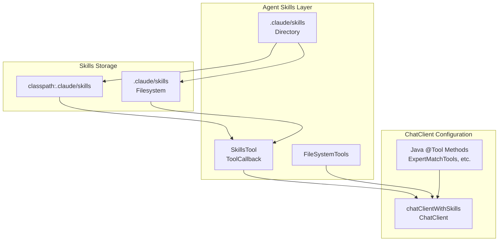

# Agent Skills Implementation Guide

**Last Updated:** 2026-01-16  
**Status:** Implemented and Tested

## Overview

Agent Skills provide modular knowledge management through Markdown-based skills that complement existing Java `@Tool`
methods. Skills are loaded from the classpath or filesystem and discovered on-demand during LLM interactions.

## Table of Contents

1. [Introduction](#introduction)
2. [Architecture](#architecture)
3. [Configuration](#configuration)
4. [Skills Directory Structure](#skills-directory-structure)
5. [Spring AI 1.1.0 Compatibility](#spring-ai-110-compatibility)
6. [Implementation Details](#implementation-details)
7. [Creating Skills](#creating-skills)
8. [Usage Examples](#usage-examples)
9. [Testing](#testing)
10. [Known Limitations](#known-limitations)

## Introduction

Agent Skills enable you to:

- **Separate Knowledge from Code**: Store domain knowledge in Markdown files instead of hardcoding in Java
- **Version Control Skills**: Track skill changes independently from code changes
- **Share Skills**: Reuse skills across projects and teams
- **Progressive Disclosure**: Load only relevant skills on-demand, reducing context window usage
- **LLM Portability**: Skills work with any Spring AI-supported LLM

## Architecture

### Components



### Module Organization

Agent Skills configuration is located in `core/config/` module:

- **AgentSkillsConfiguration**: Main configuration class
- **SkillsTool Bean**: Discovers and loads skills
- **FileSystemTools Bean**: Reads reference files
- **chatClientWithSkills Bean**: ChatClient with Agent Skills enabled

## Configuration

### Enabling Agent Skills

Agent Skills are **optional** and disabled by default. Enable them via configuration:

**application.yml**:

```yaml
expertmatch:
  skills:
    enabled: ${EXPERTMATCH_SKILLS_ENABLED:false}  # Enable Agent Skills
    directory: ${EXPERTMATCH_SKILLS_DIRECTORY:.claude/skills}  # Skills directory
```

**application-local.yml** (for local development):

```yaml
expertmatch:
  skills:
    enabled: true
```

### Environment Variables

```bash
export EXPERTMATCH_SKILLS_ENABLED=true
export EXPERTMATCH_SKILLS_DIRECTORY=.claude/skills
```

## Skills Directory Structure

Skills are organized in directories under `.claude/skills/`:

```
.claude/skills/
├── expert-matching-hybrid-retrieval/
│   └── SKILL.md
├── rag-answer-generation/
│   └── SKILL.md
├── person-name-matching/
│   └── SKILL.md
├── query-classification/
│   └── SKILL.md
├── rfp-response-generation/
│   └── SKILL.md
└── team-formation/
    └── SKILL.md
```

### Skills Location Priority

1. **Classpath** (`classpath:.claude/skills`): For packaged applications
2. **Filesystem** (`.claude/skills`): For local development (optional, if exists)

## Spring AI 1.1.0 Compatibility

### Important API Change

In Spring AI 1.1.0, `SkillsTool.Builder.build()` returns `ToolCallback`, not `SkillsTool`. This is a breaking change
from earlier versions.

### Implementation Pattern

```java

@Bean
@Qualifier("skillsTool")
public ToolCallback skillsTool() {
    SkillsTool.Builder builder = SkillsTool.builder();
    // Load from classpath
    builder.addSkillsResource(resourceLoader.getResource("classpath:.claude/skills"));
    // Optionally load from filesystem
    File skillsDir = new File(".claude/skills");
    if (skillsDir.exists() && skillsDir.isDirectory()) {
        builder.addSkillsDirectory(".claude/skills");
    }
    return builder.build();  // Returns ToolCallback, not SkillsTool
}
```

### ChatClient Registration

Agent Skills must be registered via `defaultToolCallbacks()`, not `defaultTools()`:

```java

@Bean("chatClientWithSkills")
public ChatClient chatClientWithSkills(
        ChatClient.Builder builder,
        @Qualifier("skillsTool") ToolCallback skillsTool,
        FileSystemTools fileSystemTools,
        ExpertMatchTools expertTools,
        ChatManagementTools chatTools,
        RetrievalTools retrievalTools
) {
    return builder
            .defaultToolCallbacks(skillsTool)  // Agent Skills (ToolCallback)
            .defaultTools(fileSystemTools)  // File reading tools
            .defaultTools(expertTools, chatTools, retrievalTools)  // Java @Tool methods
            .defaultAdvisors(new SimpleLoggerAdvisor())
            .build();
}
```

## Implementation Details

### Configuration Class

**File**: `src/main/java/com/berdachuk/expertmatch/core/config/AgentSkillsConfiguration.java`

```java

@Configuration
@ConditionalOnProperty(
        name = "expertmatch.skills.enabled",
        havingValue = "true",
        matchIfMissing = false
)
public class AgentSkillsConfiguration {

    @Bean
    @Qualifier("skillsTool")
    public ToolCallback skillsTool() {
        // Implementation details...
    }

    @Bean
    public FileSystemTools fileSystemTools() {
        return FileSystemTools.builder().build();
    }

    @Bean("chatClientWithSkills")
    public ChatClient chatClientWithSkills(...) {
        // ChatClient configuration...
    }
}
```

### Skills Loading

Skills are loaded:

1. **On Application Startup**: Skills directory is scanned
2. **On-Demand Discovery**: Skills are discovered when LLM needs them
3. **Lazy Loading**: Skills are not loaded into memory until needed

### Integration with Java Tools

Agent Skills work alongside Java `@Tool` methods:

- **Skills**: Provide knowledge and instructions (Markdown)
- **Java Tools**: Provide actions and business logic (Java methods)

Both are registered with `ChatClient` and available to the LLM.

## Creating Skills

### Step 1: Create Skill Directory

```bash
mkdir -p src/main/resources/.claude/skills/my-new-skill
```

### Step 2: Create SKILL.md File

**File**: `src/main/resources/.claude/skills/my-new-skill/SKILL.md`

```markdown
---
name: my-new-skill
description: Brief description of what this skill does
---

# My New Skill

## Purpose

Describe the purpose of this skill and when it should be used.

## How to Use

Provide instructions for the LLM on when and how to use this skill.

## Available Tools

List the Java @Tool methods that this skill references:

- `expertQuery`: Main tool for expert discovery
- `searchEmployees`: Search employees by criteria

## Examples

### Example 1: Basic Usage

User: "Find experts in Java and Spring Boot"

Response: Use `expertQuery` with skills=["Java", "Spring Boot"]

### Example 2: Advanced Usage

User: "Who worked on microservices projects?"

Response: Use `expertQuery` with project types including "microservices"
```

### Step 3: Skill Discovery

Skills are automatically discovered when:

- Application starts (if `expertmatch.skills.enabled=true`)
- Skills directory exists in classpath or filesystem
- `SKILL.md` file exists in skill directory

## Usage Examples

### Example 1: Expert Matching Skill

The `expert-matching-hybrid-retrieval` skill guides the LLM on how to use ExpertMatch's hybrid retrieval system:

```markdown
# Expert Matching Hybrid Retrieval

## When to Use This Skill

Use this skill when:

- User asks to find experts with specific skills
- User needs experts for a project or team
- User wants to discover experts by domain or technology

## Available Tools

- `expertQuery`: Main tool for expert discovery
```

### Example 2: RAG Answer Generation

The `rag-answer-generation` skill provides instructions for generating answers with citations:

```markdown
# RAG Answer Generation

## Purpose

Generate comprehensive answers using retrieved expert contexts with proper citations.

## Instructions

1. Use retrieved expert contexts to build the answer
2. Include citations for each expert mentioned
3. Format citations as [Expert Name - Project Name]
```

## Testing

### Unit Tests

Agent Skills configuration is tested in `AgentSkillsConfigurationIT`:

```java

@SpringBootTest
@TestPropertySource(properties = {"expertmatch.skills.enabled=true"})
class AgentSkillsConfigurationIT extends BaseIntegrationTest {

    @Autowired
    @Qualifier("skillsTool")
    private ToolCallback skillsTool;

    @Autowired
    private FileSystemTools fileSystemTools;

    @Autowired
    @Qualifier("chatClientWithSkills")
    private ChatClient chatClientWithSkills;

    @Test
    void testSkillsToolBeanExists() {
        assertThat(skillsTool).isNotNull();
    }

    @Test
    void testFileSystemToolsBeanExists() {
        assertThat(fileSystemTools).isNotNull();
    }

    @Test
    void testChatClientWithSkillsBeanExists() {
        assertThat(chatClientWithSkills).isNotNull();
    }

    @Test
    void testCoreSkillsExist() {
        // Verify that core skills are present
        String[] expectedSkills = {
                "expert-matching-hybrid-retrieval",
                "rag-answer-generation",
                "person-name-matching",
                "query-classification",
                "rfp-response-generation",
                "team-formation"
        };
        // Test implementation...
    }
}
```

### Integration Tests

Skills integration is tested in `ExpertMatchingSkillIT`:

```java

@SpringBootTest
@TestPropertySource(properties = {
        "expertmatch.skills.enabled=true",
        "expertmatch.tools.search.enabled=false"
})
class ExpertMatchingSkillIT extends BaseIntegrationTest {

    @Autowired
    @Qualifier("chatClientWithSkills")
    private ChatClient chatClientWithSkills;

    @Autowired
    @Qualifier("skillsTool")
    private ToolCallback skillsTool;

    @Test
    void testExpertMatchingSkillActivation() {
        assertThat(chatClientWithSkills).isNotNull();
        assertThat(skillsTool).isNotNull();
    }
}
```

## Known Limitations

### ToolSearchToolCallAdvisor Incompatibility

**Issue**: `ToolSearchToolCallAdvisor` from `spring-ai-agent-utils` 0.3.0 is incompatible with Spring AI 1.1.0 because
`ToolCallAdvisor` is final in Spring AI 1.1.0.

**Impact**: The Tool Search Tool feature cannot be used together with Agent Skills until `spring-ai-agent-utils` is
updated for Spring AI 1.1.0 compatibility.

**Workaround**: Use Agent Skills OR Tool Search Tool, but not both simultaneously.

**Status**: ⚠️ Known Limitation (requires library update)

### Skills Directory Requirements

- Skills directory must exist in classpath or filesystem
- Each skill must have a `SKILL.md` file
- Skills are loaded on application startup (if enabled)

## Dependencies

### Required Dependencies

- `spring-ai-agent-utils:0.3.0` - Provides `SkillsTool` and `FileSystemTools`
- `spring-ai:1.1.0` - Spring AI framework (required for `ToolCallback` interface)

### Maven Configuration

```xml

<dependency>
    <groupId>org.springaicommunity</groupId>
    <artifactId>spring-ai-agent-utils</artifactId>
    <version>0.3.0</version>
</dependency>
```

## Best Practices

1. **Keep Skills Focused**: Each skill should have a single, well-defined purpose
2. **Document Tools**: Clearly document which Java `@Tool` methods the skill uses
3. **Provide Examples**: Include usage examples in skill documentation
4. **Version Control**: Track skill changes in version control
5. **Test Skills**: Verify skills work correctly with your Java tools

## Related Documentation

- [Development Guide](DEVELOPMENT_GUIDE.md) - Agent Skills development section
- [AI Provider Configuration](AI_PROVIDER_CONFIGURATION.md) - Agent Skills configuration
- [Library Compatibility Report](library-compatibility-report.md) - Compatibility status
- [ExpertMatch PRD](ExpertMatch.md) - Complete product documentation

## Support

For questions or issues related to Agent Skills:

1. Check this documentation
2. Review `AgentSkillsConfiguration.java` implementation
3. Check test files for usage examples
4. Contact the ExpertMatch team

---

*Last updated: 2026-01-16*
