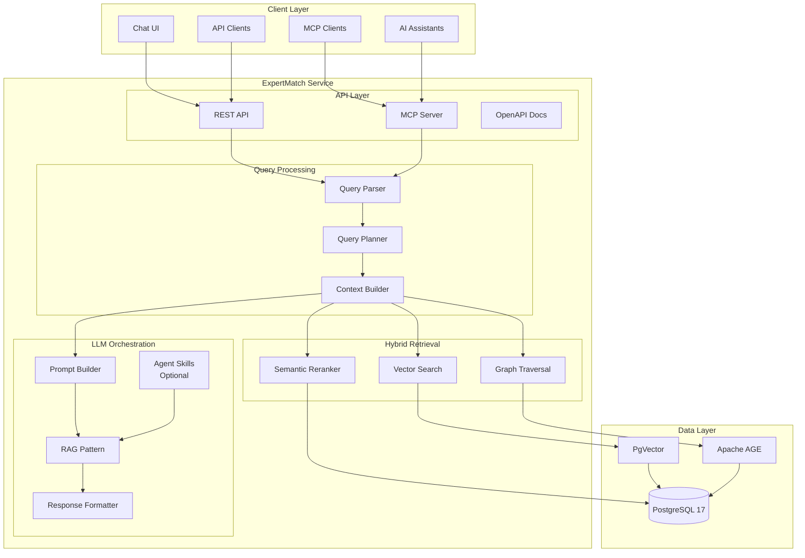
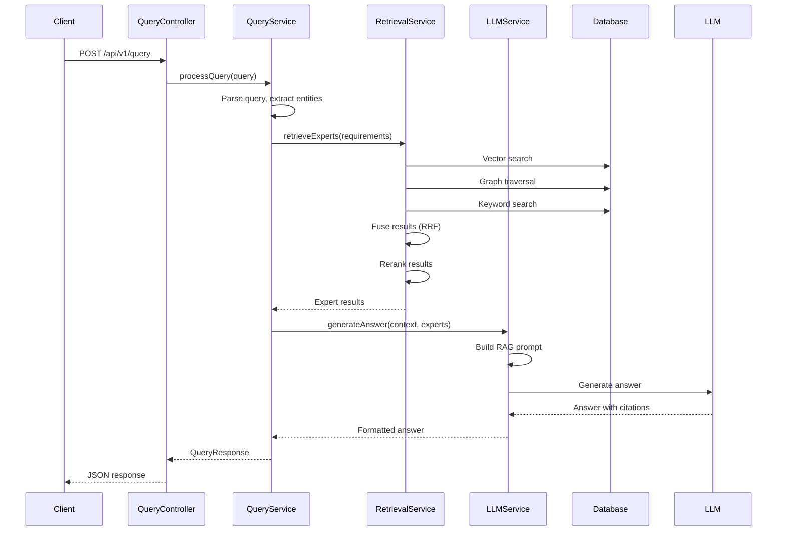
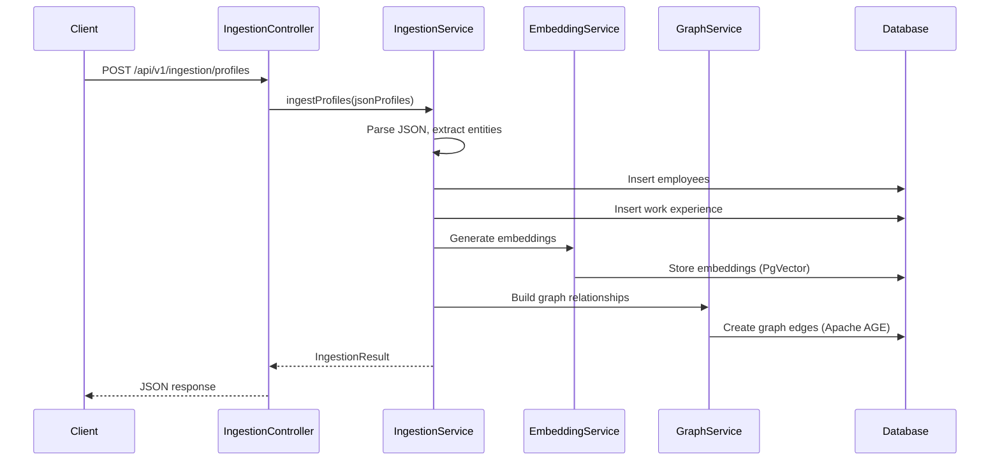
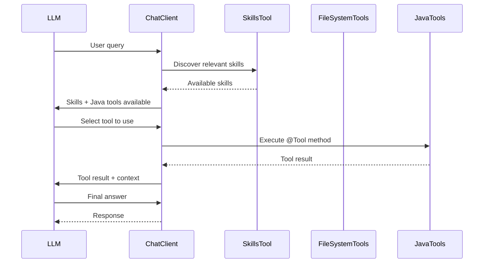
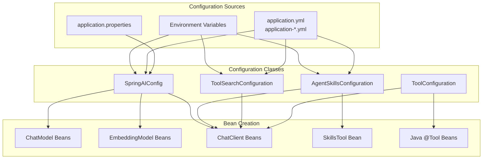
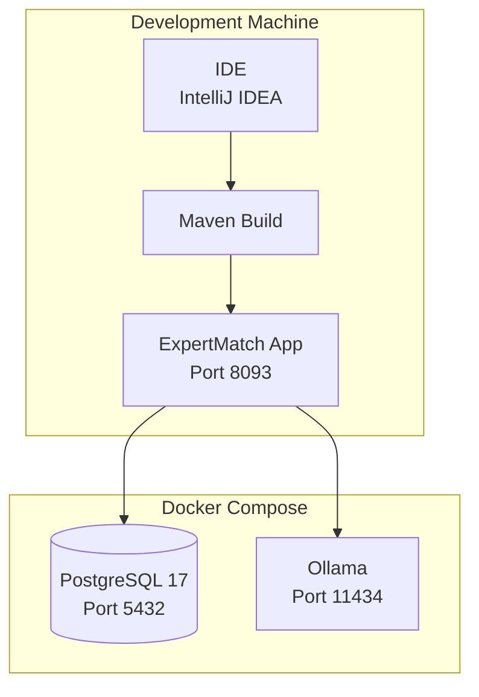
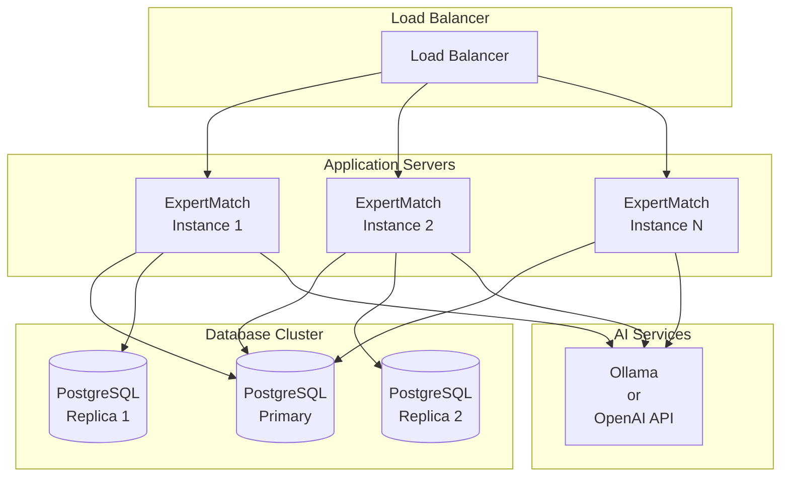
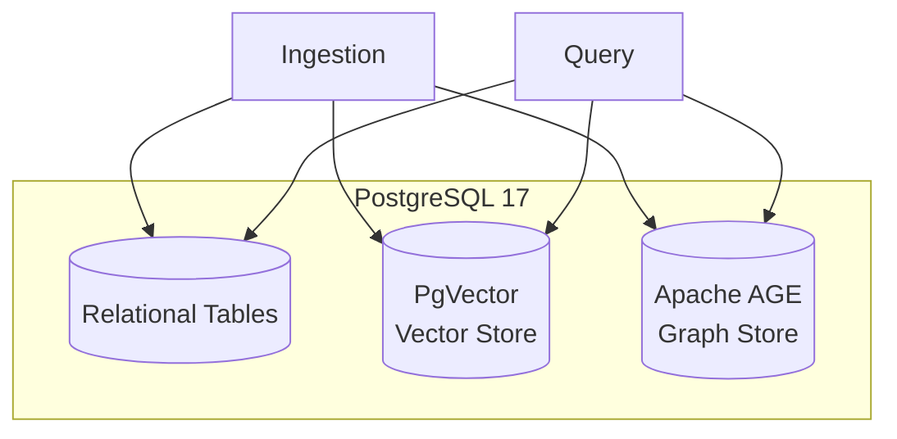

# ExpertMatch Architecture Documentation

**Last Updated:** 2026-01-16  
**Version:** 1.0

## Table of Contents

1. [Overview](#overview)
2. [System Architecture](#system-architecture)
3. [Module Structure](#module-structure)
4. [Module Dependencies](#module-dependencies)
5. [Data Flow](#data-flow)
6. [Configuration Architecture](#configuration-architecture)
7. [Deployment Architecture](#deployment-architecture)
8. [Technology Stack](#technology-stack)

## Overview

ExpertMatch is a modular monolith built with Spring Boot 3.5.9 and Spring Modulith, following domain-driven design
principles. The system uses a hybrid GraphRAG architecture combining vector search, graph traversal, and semantic
reranking for expert discovery.

### Key Architectural Principles

- **Modular Monolith**: Spring Modulith enforces module boundaries
- **Domain-Driven Design**: Each module represents a bounded context
- **Interface-Based Design**: Services and repositories use interfaces
- **Layered Architecture**: Clear separation between API, service, and repository layers
- **Hybrid GraphRAG**: Combines multiple retrieval strategies for optimal results

## System Architecture

### High-Level Architecture Diagram



## Module Structure

ExpertMatch consists of **13 domain modules** organized using Spring Modulith:

### Core Modules

1. **core** (OPEN module)
    - **Purpose**: Shared infrastructure and utilities
    - **Exposes**: Configuration, exception handling, security, API mapping utilities
    - **Dependencies**: None (foundation module)

2. **employee**
    - **Purpose**: Employee/expert data management
    - **Exposes**: EmployeeService, EmployeeRepository
    - **Dependencies**: core

3. **project**
    - **Purpose**: Project data management
    - **Exposes**: ProjectRepository
    - **Dependencies**: core

4. **technology**
    - **Purpose**: Technology/skill data management
    - **Exposes**: TechnologyRepository
    - **Dependencies**: core

5. **workexperience**
    - **Purpose**: Work experience data management
    - **Exposes**: WorkExperienceRepository
    - **Dependencies**: employee::API, project::SPI, technology::SPI, core

### Processing Modules

6. **query**
    - **Purpose**: Query parsing, requirements extraction, entity extraction, intent classification
    - **Exposes**: QueryService
    - **Dependencies**: retrieval::API, llm::API, employee::API, core

7. **retrieval**
    - **Purpose**: Hybrid GraphRAG retrieval (vector + graph + keyword + reranking)
    - **Exposes**: HybridRetrievalService, VectorSearchService, GraphSearchService, KeywordSearchService
    - **Dependencies**: employee::API, embedding::API, graph::API, core

8. **llm**
    - **Purpose**: LLM orchestration, RAG pattern, SGR patterns, structured output
    - **Exposes**: LLMService, SGR patterns
    - **Dependencies**: retrieval::API, core

9. **embedding**
    - **Purpose**: Vector embedding generation
    - **Exposes**: EmbeddingService
    - **Dependencies**: core

10. **graph**
    - **Purpose**: Graph relationship management using Apache AGE
    - **Exposes**: GraphService, GraphSearchService
    - **Dependencies**: core

### Integration Modules

11. **chat**
    - **Purpose**: Chat conversation management
    - **Exposes**: ChatService, ChatController
    - **Dependencies**: core

12. **ingestion**
    - **Purpose**: Data ingestion (test data generation, JSON profiles, future: Kafka, PostgreSQL, REST)
    - **Exposes**: IngestionService, TestDataGenerator, IngestionController
    - **Dependencies**: employee::API, embedding::API, graph::API, core

13. **mcp**
    - **Purpose**: Model Context Protocol server for AI assistant integration
    - **Exposes**: MCPService, MCPController
    - **Dependencies**: employee::API, retrieval::API, core

14. **system**
    - **Purpose**: System-level endpoints (health checks, system information)
    - **Exposes**: SystemController
    - **Dependencies**: core

### Module Dependency Graph

```mermaid
graph TD
    core[core<br/>OPEN]
    
    employee[employee]
    project[project]
    technology[technology]
    workexperience[workexperience]
    embedding[embedding]
    graph[graph]
    system[system]
    
    retrieval[retrieval]
    llm[llm]
    query[query]
    chat[chat]
    ingestion[ingestion]
    mcp[mcp]
    
    core --> employee
    core --> project
    core --> technology
    core --> workexperience
    core --> embedding
    core --> graph
    core --> system
    
    employee --> workexperience
    project --> workexperience
    technology --> workexperience
    
    employee --> retrieval
    embedding --> retrieval
    graph --> retrieval
    
    retrieval --> llm
    retrieval --> query
    llm --> query
    
    employee --> query
    employee --> ingestion
    employee --> mcp
    
    embedding --> ingestion
    graph --> ingestion
    
    retrieval --> mcp
    
    core --> chat
    core --> retrieval
    core --> llm
    core --> query
    core --> ingestion
    core --> mcp
```

## Module Dependencies

### Dependency Rules

Spring Modulith enforces module boundaries through `@ApplicationModule` annotations:

- **API**: Public interface exposed to other modules
- **SPI**: Service Provider Interface (internal implementation)
- **allowedDependencies**: Explicitly declared allowed dependencies

### Example: Query Module

```java
@ApplicationModule(
        id = "query",
        displayName = "Query Processing",
        allowedDependencies = {"retrieval::API", "llm::API", "employee::API", "core"}
)
```

This means:

- Query module can use `retrieval::API`, `llm::API`, `employee::API`, and `core`
- Query module **cannot** directly access `retrieval::SPI` or internal implementations
- Spring Modulith validates these boundaries at runtime

## Data Flow

### Query Processing Flow



### Ingestion Flow



### Agent Skills Integration Flow



## Configuration Architecture

### Configuration Modules

Configuration is organized in `core/config/`:

1. **SpringAIConfig**: LLM and embedding model configuration
2. **AgentSkillsConfiguration**: Agent Skills configuration (optional)
3. **ToolSearchConfiguration**: Tool Search Tool configuration (optional)
4. **ToolConfiguration**: Java @Tool methods configuration
5. **PromptTemplateConfig**: Prompt template management
6. **SecurityConfig**: Security configuration
7. **OpenApiConfig**: OpenAPI/Swagger configuration
8. **JacksonConfig**: JSON serialization configuration
9. **HttpClientConfig**: HTTP client configuration
10. **ApplicationProperties**: Application properties binding

### Configuration Flow



## Deployment Architecture

### Local Development



### Production Deployment



## Technology Stack

### Core Framework

| Component            | Version  | Purpose                  |
|----------------------|----------|--------------------------|
| **Java**             | 21 (LTS) | Programming language     |
| **Spring Boot**      | 3.5.9    | Application framework    |
| **Spring Framework** | 6.2.15   | Core Spring framework    |
| **Spring Modulith**  | 2.0.0    | Modular monolith support |
| **Spring AI**        | 1.1.0    | LLM orchestration        |

### Database Layer

| Component      | Version | Purpose                  |
|----------------|---------|--------------------------|
| **PostgreSQL** | 17      | Relational database      |
| **PgVector**   | 0.8.0   | Vector similarity search |
| **Apache AGE** | 1.6.0   | Graph database extension |
| **Flyway**     | 10.20.0 | Database migrations      |

### AI/ML Components

| Component                 | Version | Purpose              |
|---------------------------|---------|----------------------|
| **Spring AI**             | 1.1.0   | LLM orchestration    |
| **spring-ai-agent-utils** | 0.3.0   | Agent Skills support |
| **Ollama**                | Latest  | Local LLM provider   |
| **OpenAI API**            | Latest  | Cloud LLM provider   |

### Testing

| Component                   | Version | Purpose                 |
|-----------------------------|---------|-------------------------|
| **JUnit 5**                 | Latest  | Unit testing            |
| **Mockito**                 | Latest  | Mocking framework       |
| **Testcontainers**          | 2.0.3   | Integration testing     |
| **Spring Modulith Testing** | 2.0.0   | Module boundary testing |

### API Documentation

| Component             | Version | Purpose                  |
|-----------------------|---------|--------------------------|
| **SpringDoc OpenAPI** | 2.7.0   | API documentation        |
| **Swagger UI**        | Latest  | Interactive API explorer |

## Module Layer Structure

Each domain module follows a consistent layered structure:

```
[domain-module]/
├── domain/                    # Domain entities, DTOs, enums, filters, wrappers
│   ├── [Entity].java
│   ├── dto/
│   ├── filters/
│   └── wrappers/
├── repository/                # Data access layer interfaces
│   ├── [Entity]Repository.java
│   └── impl/                  # Repository implementations
│       ├── [Entity]RepositoryImpl.java
│       └── jdbc/               # JDBC-specific (RowMappers)
├── service/                   # Business logic layer interfaces
│   ├── [Entity]Service.java
│   └── impl/                  # Service implementations
│       └── [Entity]ServiceImpl.java
└── rest/                      # REST API controllers
    └── [Entity]Controller.java
```

## Data Storage Architecture

### Unified PostgreSQL Store

ExpertMatch uses a single PostgreSQL 17 instance with multiple extensions:

1. **Relational Tables**: Traditional SQL tables for structured data
    - `employee`, `work_experience`, `project`, `technology`, `chat`, `conversation_history`

2. **PgVector Extension**: Vector embeddings for semantic search
    - `employee_embedding` table with vector columns
    - HNSW indexing for fast similarity search

3. **Apache AGE Extension**: Graph relationships
    - Graph: `expertmatch`
    - Vertices: `Employee`, `Project`, `Technology`, `Customer`
    - Edges: `WORKED_ON`, `USED_TECHNOLOGY`, `WORKED_FOR`, `FOR_CUSTOMER`

### Data Flow in Database



## Related Documentation

- [ExpertMatch PRD](ExpertMatch.md) - Complete product requirements
- [Development Guide](DEVELOPMENT_GUIDE.md) - Development setup and workflow
- [Agent Skills Implementation](AGENT_SKILLS_IMPLEMENTATION.md) - Agent Skills documentation
- [Library Compatibility Report](library-compatibility-report.md) - Library versions and compatibility
- [Expert Search Flow](ExpertMatch-Expert-Search-Flow.md) - Detailed flow documentation

---

*Last updated: 2026-01-16*
