# Cypher Language and Apache AGE Graph Database Tutorial

## Table of Contents

1. [Introduction](#introduction)
2. [Apache AGE Overview](#apache-age-overview)
3. [Cypher Language Basics](#cypher-language-basics)
4. [Project Graph Model](#project-graph-model)
5. [Basic Operations](#basic-operations)
6. [Relationship Patterns](#relationship-patterns)
7. [Batch Operations](#batch-operations)
8. [Query Examples](#query-examples)
9. [Best Practices](#best-practices)
10. [Performance Optimization](#performance-optimization)
11. [Troubleshooting](#troubleshooting)
12. [Advanced Patterns](#advanced-patterns)

---

## Introduction

This tutorial provides a comprehensive guide to using **Cypher** query language with **Apache AGE** (Apache Graph
Extension) in the ExpertMatch project. Apache AGE is a PostgreSQL extension that adds graph database capabilities to
PostgreSQL, allowing you to store and query graph data using the Cypher query language.

### What You'll Learn

- How Apache AGE integrates with PostgreSQL
- Cypher query language fundamentals
- Creating and querying graph vertices and relationships
- Batch operations for performance
- Real-world examples from the ExpertMatch project
- Best practices and optimization techniques

---

## Apache AGE Overview

### What is Apache AGE?

Apache AGE (A Graph Extension) is a PostgreSQL extension that enables graph database functionality within PostgreSQL. It
allows you to:

- Store graph data (vertices and edges) alongside relational data
- Query graph data using Cypher query language
- Combine SQL and Cypher queries for hybrid operations
- Leverage PostgreSQL's ACID guarantees and ecosystem

### Key Features

- **Graph Storage**: Store vertices and edges as PostgreSQL tables in `ag_catalog` schema
- **Cypher Support**: Full openCypher query language support (compatible with Neo4j Cypher)
- **agtype Data Type**: JSONB-based data type for graph data (vertices, edges, paths, properties)
- **ACID Compliance**: Inherits PostgreSQL's transaction guarantees
- **SQL Integration**: Mix SQL and Cypher queries in the same transaction
- **Performance**: Leverages PostgreSQL's indexing (including GIN indexes on JSONB properties)
- **Multiple Graphs**: Support for querying multiple graphs simultaneously
- **Property Indexes**: Create indexes on vertex and edge properties for fast lookups

### Architecture in ExpertMatch

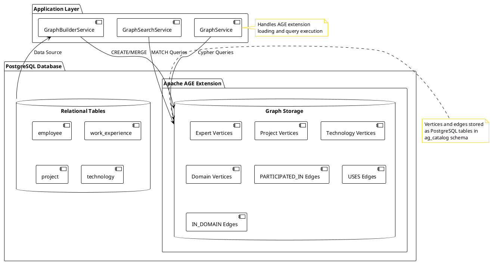

### Graph Structure

The ExpertMatch graph represents:

- **Experts** (employees) and their skills
- **Projects** they worked on
- **Technologies** used in projects
- **Domains** (industries) projects belong to
- **Relationships** connecting these entities

**Note:** Customer vertices and relationships are now implemented in the graph.
See [Graph Improvements Analysis](GRAPH_IMPROVEMENTS_ANALYSIS.md) for details.

### How Apache AGE Stores Graph Data

Apache AGE stores graph data as PostgreSQL tables:

- **Vertices**: Stored in tables like `ag_catalog.ag_<graphname>_<label>` (e.g., `ag_expertmatch_graph_Expert`)
- **Edges**: Stored in tables like `ag_catalog.ag_<graphname>_<label>` (e.g., `ag_expertmatch_graph_PARTICIPATED_IN`)
- **Properties**: Stored as JSONB in a `properties` column
- **Graph IDs**: Each vertex and edge has a unique `graphid` (internal identifier)

**Key Points:**

- Graph data is stored alongside relational data in the same PostgreSQL database
- Properties are stored as JSONB, allowing flexible schema
- AGE automatically creates tables when you create vertices/edges with new labels
- You can query graph tables directly with SQL, or use Cypher for graph-specific queries

### The agtype Data Type

Apache AGE uses `agtype` as its fundamental data type, which is JSONB-based but extended for graph data:

- **Scalar Types**: null, integer, float, boolean, string
- **Composite Types**: arrays, objects (maps)
- **Graph Types**: vertices, edges, paths
- **Compatibility**: agtype is JSONB-compatible, so valid JSON is valid agtype

All Cypher query results return `agtype`, which can be cast to PostgreSQL types or used directly.

---

## Cypher Language Basics

### What is Cypher?

Cypher is a declarative graph query language designed for querying graph databases. It uses ASCII art-like syntax to
represent graph patterns.

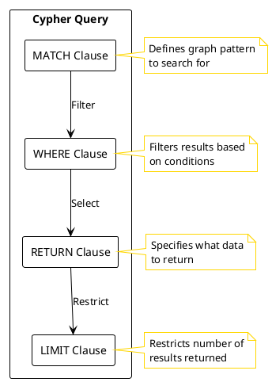

### Basic Syntax Elements

#### 1. Vertices (Nodes)

```cypher
// Create a vertex with label and properties
CREATE (e:Expert {id: '123', name: 'John Doe'})

// Match a vertex
MATCH (e:Expert {id: '123'})
RETURN e

// Match with WHERE clause
MATCH (e:Expert)
WHERE e.name = 'John Doe'
RETURN e
```

#### 2. Relationships (Edges)

```cypher
// Create a relationship
CREATE (e:Expert)-[:PARTICIPATED_IN]->(p:Project)

// Match a relationship
MATCH (e:Expert)-[:PARTICIPATED_IN]->(p:Project)
RETURN e, p

// Relationship with properties
CREATE (e:Expert)-[:PARTICIPATED_IN {role: 'Developer'}]->(p:Project)
```

#### 3. Patterns

```cypher
// Simple path
MATCH (e:Expert)-[:PARTICIPATED_IN]->(p:Project)

// Multi-hop path
MATCH (e:Expert)-[:PARTICIPATED_IN]->(p:Project)-[:USES]->(t:Technology)

// Undirected path
MATCH (e1:Expert)-[:PARTICIPATED_IN]-(p:Project)-[:PARTICIPATED_IN]-(e2:Expert)
```

### Common Clauses

| Clause   | Purpose                               | Example                            |
|----------|---------------------------------------|------------------------------------|
| `MATCH`  | Find patterns in the graph            | `MATCH (e:Expert)`                 |
| `CREATE` | Create new vertices/relationships     | `CREATE (e:Expert {id: '123'})`    |
| `MERGE`  | Create if not exists, match if exists | `MERGE (e:Expert {id: '123'})`     |
| `SET`    | Update properties                     | `SET e.name = 'New Name'`          |
| `DELETE` | Remove vertices/relationships         | `DELETE e`                         |
| `RETURN` | Return results                        | `RETURN e.name`                    |
| `WHERE`  | Filter results                        | `WHERE e.id = '123'`               |
| `WITH`   | Chain query parts                     | `WITH e, COUNT(p) as projectCount` |
| `UNWIND` | Unwind collections                    | `UNWIND $list AS item`             |

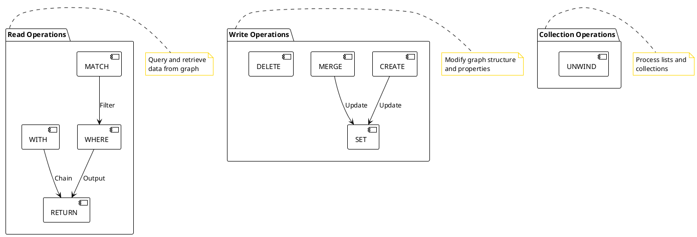

---

## Project Graph Model

### Vertex Labels

The ExpertMatch project currently uses five main vertex types:

#### 1. Expert

Represents employees/experts in the system.

```cypher
CREATE (e:Expert {
    id: '8760000000000420950',
    name: 'John Doe',
    email: 'john.doe@example.com',
    seniority: 'Senior'
})
```

**Properties:**

- `id`: Unique identifier (external system format)
- `name`: Expert's full name
- `email`: Email address
- `seniority`: Experience level (Junior, Middle, Senior, etc.)

#### 2. Project

Represents projects that experts worked on.

```cypher
CREATE (p:Project {
    id: '4060741400384209073',
    name: 'E-Commerce Platform',
    projectType: 'Web Application'
})
```

**Properties:**

- `id`: Unique project identifier
- `name`: Project name
- `projectType`: Type of project (Web Application, Mobile App, etc.)

#### 3. Technology

Represents technologies, frameworks, and tools.

```cypher
MERGE (t:Technology {name: 'Java'})
```

**Properties:**

- `name`: Technology name (unique identifier)

#### 4. Domain

Represents industry domains or business areas.

```cypher
MERGE (d:Domain {name: 'E-Commerce'})
```

**Properties:**

- `name`: Domain name (unique identifier)

#### 5. Customer

Represents customer organizations that experts worked for.

```cypher
MERGE (c:Customer {id: '8009377469709733890', name: 'Microsoft'})
```

**Properties:**

- `id`: Customer identifier (external system format or generated)
- `name`: Customer name

**Note:** Customer vertices are created from `work_experience.customer_id` and `work_experience.customer_name`. If
`customer_id` is null, an ID is generated.

### Relationship Types

#### 1. PARTICIPATED_IN

Connects experts to projects they worked on.

```cypher
MATCH (e:Expert {id: '123'})
MATCH (p:Project {id: '456'})
MERGE (e)-[r:PARTICIPATED_IN {role: 'Backend Developer'}]->(p)
```

**Properties:**

- `role`: Role of the expert in the project

#### 2. USES

Connects projects to technologies they use.

```cypher
MATCH (p:Project {id: '456'})
MERGE (t:Technology {name: 'Java'})
MERGE (p)-[:USES]->(t)
```

#### 3. IN_DOMAIN

Connects projects to their industry domains.

```cypher
MATCH (p:Project {id: '456'})
MERGE (d:Domain {name: 'E-Commerce'})
MERGE (p)-[:IN_DOMAIN]->(d)
```

#### 4. WORKED_FOR

Connects experts to customers they worked for.

```cypher
MATCH (e:Expert {id: '123'})
MATCH (c:Customer {id: '456'})
MERGE (e)-[:WORKED_FOR]->(c)
```

**Note:** This relationship is created from `work_experience` records where `customer_name` is not null.

#### 5. FOR_CUSTOMER

Connects projects to their customers.

```cypher
MATCH (p:Project {id: '456'})
MATCH (c:Customer {id: '789'})
MERGE (p)-[:FOR_CUSTOMER]->(c)
```

**Note:** This relationship enables multi-hop queries like Expert → Project → Customer.

### Graph Schema Visualization

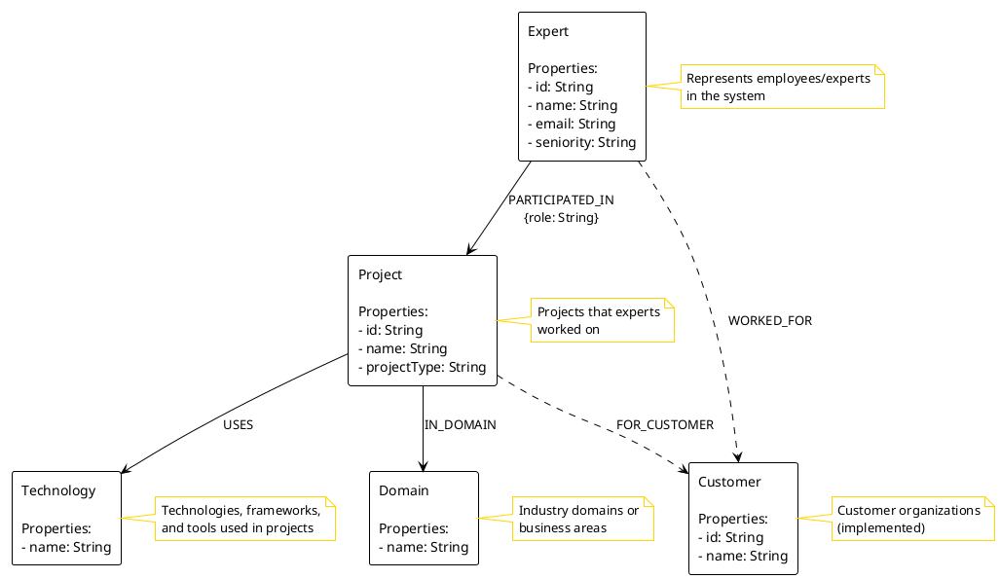

---

## Basic Operations

### Executing Cypher Queries

Apache AGE provides the `ag_catalog.cypher()` function to execute Cypher queries:

```sql
SELECT * FROM ag_catalog.cypher(
    'graph_name'::name,           -- Graph name (required)
    'MATCH (e:Expert) RETURN e'::cstring,  -- Cypher query string
    NULL::agtype                  -- Parameters (optional, defaults to NULL)
) AS t(result agtype);
```

**Function Signature:**

```sql
CREATE FUNCTION ag_catalog.cypher(
    graph_name name,
    query_string cstring,
    params agtype = NULL
) RETURNS SETOF record
```

**Key Points:**

- Graph name and query string are required parameters
- The third parameter (`params agtype`) is optional and defaults to NULL
- Use dollar-quoted strings with tags (e.g., `$tag$...$tag$`) for Cypher queries to avoid escaping issues
- Results are returned as `agtype` which can be cast to other types
- The function returns a set of records, so you must specify column names in the `AS` clause

**Example with Dollar-Quoted Strings (ExpertMatch Implementation):**

The ExpertMatch project uses dollar-quoted strings with a tag (`cypher_q`) to safely embed Cypher queries:

```sql
SELECT * FROM ag_catalog.cypher(
    'expertmatch_graph'::name, 
    $cypher_q$MATCH (e:Expert {id: '123'}) RETURN e.name, e.email$cypher_q$::cstring
) AS t(result ag_catalog.agtype);
```

**Note on Parameters:**

- Apache AGE's `cypher()` function accepts parameters via the third argument (`params agtype`)
- However, the ExpertMatch project embeds parameters directly in the query string using `$paramName` syntax
- This approach is simpler and more compatible with various AGE versions
- Parameters are embedded using string replacement with proper escaping for safety
- The `GraphService.embedParameters()` method handles parameter embedding and escaping

### Graph Creation

Before creating vertices, you need to create a graph:

```sql
SELECT * FROM ag_catalog.create_graph('expertmatch_graph');
```

**Important:**

- Graph names must be valid PostgreSQL identifiers
- Each graph is isolated - vertices/edges in one graph are separate from another
- Graph metadata is stored in `ag_catalog.ag_graph` table
- You can query multiple graphs in the same database

**Check if Graph Exists:**

```sql
SELECT name FROM ag_catalog.ag_graph WHERE name = 'expertmatch_graph';
```

### Creating Vertices

#### Single Vertex Creation

```cypher
CREATE (e:Expert {
    id: $expertId,
    name: $name,
    email: $email,
    seniority: $seniority
})
```

**Java Implementation (from GraphBuilderService):**

```java
public void createExpertVertex(String expertId, String name, String email, String seniority) {
    String cypher = """
            CREATE (e:Expert {
                id: $expertId,
                name: $name,
                email: $email,
                seniority: $seniority
            })
            """;

    Map<String, Object> params = new HashMap<>();
    params.put("expertId", expertId);
    params.put("name", name);
    params.put("email", email);
    params.put("seniority", seniority);

    graphService.executeCypher(cypher, params);
}
```

**Note:** This matches the actual implementation in `GraphBuilderService.createExpertVertex()`.

#### Using MERGE for Idempotent Creation

```cypher
MERGE (t:Technology {name: $technologyName})
```

MERGE creates the vertex if it doesn't exist, or matches it if it does. This is useful for avoiding duplicates.

### Querying Vertices

#### Find by Property

```cypher
MATCH (e:Expert {id: $expertId})
RETURN e
```

#### Find with WHERE Clause

```cypher
MATCH (e:Expert)
WHERE e.seniority = 'Senior'
RETURN e
```

#### Find Multiple Vertices

```cypher
MATCH (e:Expert)
WHERE e.id IN $expertIds
RETURN e
```

### Creating Relationships

#### Simple Relationship

```cypher
MATCH (e:Expert {id: $expertId})
MATCH (p:Project {id: $projectId})
MERGE (e)-[:PARTICIPATED_IN]->(p)
```

#### Relationship with Properties

```cypher
MATCH (e:Expert {id: $expertId})
MATCH (p:Project {id: $projectId})
MERGE (e)-[r:PARTICIPATED_IN]->(p)
SET r.role = $role
RETURN r
```

**Note:** Apache AGE supports `SET` on `MERGE` for relationship properties, which is used in the project for setting
roles. The actual implementation in `GraphBuilderService.createParticipationRelationship()` includes `RETURN r` at the
end.

### Querying Relationships

#### Find Connected Vertices

```cypher
MATCH (e:Expert {id: $expertId})-[:PARTICIPATED_IN]->(p:Project)
RETURN p
```

#### Find Multi-hop Paths

```cypher
MATCH (e:Expert)-[:PARTICIPATED_IN]->(p:Project)-[:USES]->(t:Technology)
WHERE e.id = $expertId
RETURN DISTINCT t.name
```

---

## Relationship Patterns

### Directed Relationships

Relationships in Cypher are directed by default:

```cypher
// Expert participates in Project
(e:Expert)-[:PARTICIPATED_IN]->(p:Project)

// Project uses Technology
(p:Project)-[:USES]->(t:Technology)
```

### Undirected Relationships

Use `-` instead of `->` or `<-` for undirected matching:

```cypher
// Find experts who worked on the same project (either direction)
MATCH (e1:Expert)-[:PARTICIPATED_IN]-(p:Project)-[:PARTICIPATED_IN]-(e2:Expert)
WHERE e1.id <> e2.id
RETURN e1, e2
```

### Relationship Patterns in ExpertMatch

#### Expert → Project → Technology

Find experts who worked with specific technologies:

```cypher
MATCH (e:Expert)-[:PARTICIPATED_IN]->(p:Project)-[:USES]->(t:Technology)
WHERE t.name = $technology
RETURN DISTINCT e.id as expertId
```

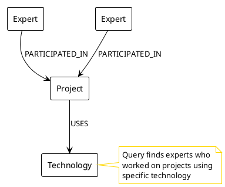

#### Expert → Project → Domain

Find experts by industry domain:

```cypher
MATCH (e:Expert)-[:PARTICIPATED_IN]->(p:Project)-[:IN_DOMAIN]->(d:Domain)
WHERE d.name = $domain
RETURN DISTINCT e.id as expertId
```

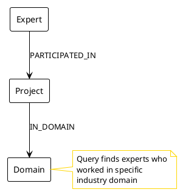

#### Expert Collaboration

Find experts who worked together:

```cypher
MATCH (e1:Expert)-[:PARTICIPATED_IN]->(p:Project)<-[:PARTICIPATED_IN]-(e2:Expert)
WHERE e1.id = $expertId AND e1.id <> e2.id
RETURN DISTINCT e2.id as expertId
```

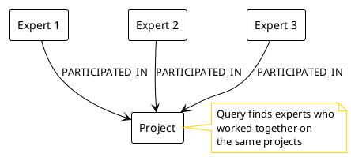

---

## Batch Operations

### Why Batch Operations?

Creating relationships one-by-one is slow and inefficient. Batch operations using `UNWIND` allow you to create multiple
relationships in a single query, significantly improving performance.

### UNWIND Pattern

The `UNWIND` clause converts a list into individual rows, allowing you to process multiple items in a single query. This
is essential for batch operations in Apache AGE.

#### Basic UNWIND Example

```cypher
UNWIND [
    {expertId: '123', projectId: '456', role: 'Developer'},
    {expertId: '789', projectId: '456', role: 'Architect'}
] AS rel
MATCH (e:Expert {id: rel.expertId})
MATCH (p:Project {id: rel.projectId})
MERGE (e)-[r:PARTICIPATED_IN]->(p)
SET r.role = rel.role
```

#### Advanced UNWIND Patterns

**UNWIND with Arrays:**

```cypher
UNWIND [1, 2, 3] AS i
RETURN i
```

**UNWIND with Nested Arrays:**

```cypher
WITH [[1, 2], [3, 4], 5] AS nested
UNWIND nested AS x
UNWIND x AS y
RETURN y
```

**UNWIND with Path Elements:**

```cypher
MATCH p=(n)-[:KNOWS]->(m)
UNWIND nodes(p) AS node
RETURN node.name
```

**UNWIND with Relationships:**

```cypher
MATCH p=(n)-[:KNOWS]->(m)
UNWIND relationships(p) AS relation
RETURN type(relation)
```

These patterns are particularly useful for processing graph paths and collections in batch operations.

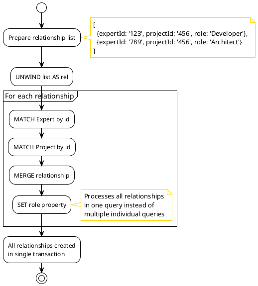

### Batch Relationship Creation in ExpertMatch

#### Participation Relationships Batch

```java
public void createParticipationRelationshipsBatch(List<ParticipationRelationship> relationships) {
    // Format relationships as Cypher list literal
    StringBuilder relationshipsList = new StringBuilder("[");
    boolean first = true;
    for (ParticipationRelationship rel : relationships) {
        if (!first) {
            relationshipsList.append(", ");
        }
        first = false;
        String expertId = escapeCypherString(rel.expertId);
        String projectId = escapeCypherString(rel.projectId);
        String role = escapeCypherString(rel.role != null ? rel.role : "Developer");
        relationshipsList.append("{expertId: '").append(expertId)
                .append("', projectId: '").append(projectId)
                .append("', role: '").append(role).append("'}");
    }
    relationshipsList.append("]");

    String cypher = String.format("""
            UNWIND %s AS rel
            MATCH (e:Expert {id: rel.expertId})
            MATCH (p:Project {id: rel.projectId})
            MERGE (e)-[r:PARTICIPATED_IN]->(p)
            SET r.role = rel.role
            """, relationshipsList);

    graphService.executeCypher(cypher, new HashMap<>());
}
```

#### Project-Technology Relationships Batch

```java
public void createUsesRelationshipsBatch(List<ProjectTechnologyRelationship> relationships) {
    StringBuilder relationshipsList = new StringBuilder("[");
    boolean first = true;
    for (ProjectTechnologyRelationship rel : relationships) {
        if (!first) {
            relationshipsList.append(", ");
        }
        first = false;
        String projectId = escapeCypherString(rel.projectId);
        String technologyName = escapeCypherString(rel.technologyName);
        relationshipsList.append("{projectId: '").append(projectId)
                .append("', technologyName: '").append(technologyName).append("'}");
    }
    relationshipsList.append("]");

    String cypher = String.format("""
            UNWIND %s AS rel
            MATCH (p:Project {id: rel.projectId})
            MERGE (t:Technology {name: rel.technologyName})
            MERGE (p)-[:USES]->(t)
            """, relationshipsList);

    graphService.executeCypher(cypher, new HashMap<>());
}
```

### Performance Benefits

- **Single Query**: One database round-trip instead of N
- **Transaction Efficiency**: All operations in one transaction
- **Reduced Overhead**: Less connection management overhead
- **Better Throughput**: Can process thousands of relationships per second

### Chunking Large Batches

For very large datasets, process in chunks:

```java
private static final int BATCH_SIZE = 1000;

public void createRelationshipsInChunks(List<Relationship> allRelationships) {
    for (int i = 0; i < allRelationships.size(); i += BATCH_SIZE) {
        int end = Math.min(i + BATCH_SIZE, allRelationships.size());
        List<Relationship> chunk = allRelationships.subList(i, end);
        createRelationshipsBatch(chunk);
    }
}
```

---

## Query Examples

### Finding Experts by Technology

Find all experts who worked on projects using a specific technology:

```cypher
MATCH (e:Expert)-[:PARTICIPATED_IN]->(p:Project)-[:USES]->(t:Technology)
WHERE t.name = $technology
RETURN DISTINCT e.id as expertId
LIMIT 100
```

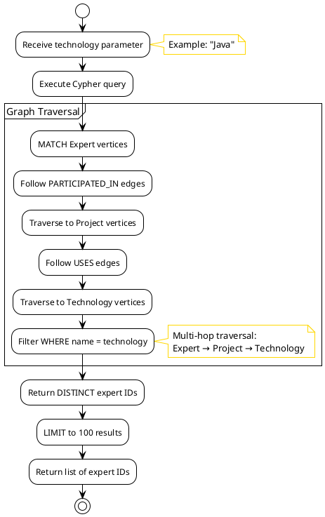

**Java Implementation (from GraphSearchService):**

```java
public List<String> findExpertsByTechnology(String technology) {
    if (!graphService.graphExists()) {
        return List.of();
    }

    String cypher = """
            MATCH (e:Expert)-[:PARTICIPATED_IN]->(p:Project)-[:USES]->(t:Technology)
            WHERE t.name = $technology
            RETURN DISTINCT e.id as expertId
            LIMIT 100
            """;

    Map<String, Object> params = new HashMap<>();
    params.put("technology", technology);

    try {
        return graphService.executeCypherAndExtract(cypher, params, "expertId");
    } catch (Exception e) {
        // Graceful degradation - return empty list on error
        log.warn("Graph search failed for technology: {} - returning empty results", technology);
        return List.of();
    }
}
```

**Note:** This matches the actual implementation in `GraphSearchService.findExpertsByTechnology()` which includes error
handling for graceful degradation.

### Finding Experts by Multiple Technologies (AND)

Find experts who worked with ALL specified technologies:

```cypher
MATCH (e:Expert)-[:PARTICIPATED_IN]->(p:Project)-[:USES]->(t:Technology)
WHERE t.name IN $technologies
WITH e, COUNT(DISTINCT t.name) as techCount
WHERE techCount = $techCount
RETURN DISTINCT e.id as expertId
LIMIT 100
```

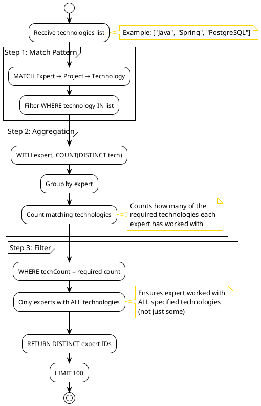

**Explanation:**

1. Match experts who worked with any of the technologies
2. Group by expert and count distinct technologies
3. Filter to only experts who worked with ALL technologies (techCount = total count)

### Finding Collaborating Experts

Find experts who worked on the same projects:

```cypher
MATCH (e1:Expert)-[:PARTICIPATED_IN]->(p:Project)<-[:PARTICIPATED_IN]-(e2:Expert)
WHERE e1.id = $expertId AND e1.id <> e2.id
RETURN DISTINCT e2.id as expertId
LIMIT 50
```

### Finding Experts by Domain

Find experts who worked in a specific industry domain:

```cypher
MATCH (e:Expert)-[:PARTICIPATED_IN]->(p:Project)-[:IN_DOMAIN]->(d:Domain)
WHERE d.name = $domain
RETURN DISTINCT e.id as expertId
LIMIT 100
```

### Finding Experts by Project Type

Find experts who worked on specific types of projects:

```cypher
MATCH (e:Expert)-[:PARTICIPATED_IN]->(p:Project)
WHERE p.projectType = $projectType
RETURN DISTINCT e.id as expertId
LIMIT 100
```

### Complex Multi-Pattern Query

Find experts with specific technology AND domain experience:

```cypher
MATCH (e:Expert)-[:PARTICIPATED_IN]->(p:Project)-[:USES]->(t:Technology)
MATCH (p)-[:IN_DOMAIN]->(d:Domain)
WHERE t.name = $technology AND d.name = $domain
RETURN DISTINCT e.id as expertId
LIMIT 100
```

---

## Best Practices

### 1. Use MERGE for Idempotent Operations

Always use `MERGE` when you want to create if not exists:

```cypher
// Good: Idempotent
MERGE (t:Technology {name: 'Java'})

// Bad: Creates duplicates
CREATE (t:Technology {name: 'Java'})
```

### 2. Use MATCH Before MERGE for Relationships

When creating relationships, match both vertices first:

```cypher
// Good: Explicit matching
MATCH (e:Expert {id: $expertId})
MATCH (p:Project {id: $projectId})
MERGE (e)-[:PARTICIPATED_IN]->(p)

// Bad: May create vertices if they don't exist
MERGE (e:Expert {id: $expertId})-[:PARTICIPATED_IN]->(p:Project {id: $projectId})
```

### 3. Use DISTINCT for Unique Results

When traversing relationships, use `DISTINCT` to avoid duplicates:

```cypher
// Good: Returns unique experts
MATCH (e:Expert)-[:PARTICIPATED_IN]->(p:Project)
RETURN DISTINCT e.id

// Bad: May return duplicates
MATCH (e:Expert)-[:PARTICIPATED_IN]->(p:Project)
RETURN e.id
```

### 4. Limit Result Sets

Always use `LIMIT` for queries that might return large result sets:

```cypher
MATCH (e:Expert)
RETURN e
LIMIT 100
```

### 5. Use Indexes on Frequently Queried Properties

Create indexes on properties used in WHERE clauses:

```sql
-- Create GIN index on JSONB properties
CREATE INDEX idx_expertmatch_expert_props_id 
ON ag_catalog.ag_expertmatch_graph_Expert 
USING gin ((properties jsonb_path_ops));
```

### 6. Escape String Parameters

Always escape user input to prevent injection:

```java
private String escapeCypherString(String value) {
    if (value == null) {
        return "";
    }
    return value.replace("\\", "\\\\")
            .replace("'", "\\'")
            .replace("\n", "\\n")
            .replace("\r", "\\r")
            .replace("\t", "\\t");
}
```

### 7. Use Batch Operations

For bulk operations, use `UNWIND` for batch processing:

```cypher
UNWIND $relationships AS rel
MATCH (e:Expert {id: rel.expertId})
MATCH (p:Project {id: rel.projectId})
MERGE (e)-[r:PARTICIPATED_IN]->(p)
SET r.role = rel.role
```

### 8. Parameterize Queries

Always use parameters instead of string concatenation:

```java
// Good: Parameterized
String cypher = "MATCH (e:Expert {id: $expertId}) RETURN e";
Map<String, Object> params = new HashMap<>();
params.

put("expertId",expertId);

// Bad: String concatenation (vulnerable to injection)
String cypher = "MATCH (e:Expert {id: '" + expertId + "'}) RETURN e";
```

---

## Performance Optimization

### 1. Graph Indexes

Create indexes on frequently queried properties:

```java
// Create GIN indexes on JSONB properties for efficient lookups
String expertIndexSql = String.format("""
                CREATE INDEX IF NOT EXISTS idx_%s_expert_props_id 
                ON ag_catalog.ag_%s_Expert USING gin ((properties jsonb_path_ops))
                """, graphName, graphName);
```

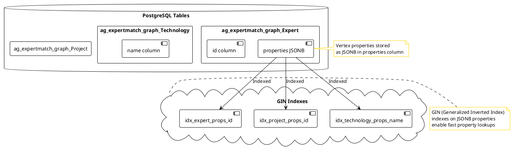

**When to Create Indexes:**

- Properties used in WHERE clauses
- Properties used for MATCH patterns
- Frequently queried vertex properties

### 2. Batch Operations

Use batch operations for bulk inserts:

```cypher
UNWIND $relationships AS rel
MATCH (e:Expert {id: rel.expertId})
MATCH (p:Project {id: rel.projectId})
MERGE (e)-[r:PARTICIPATED_IN]->(p)
```

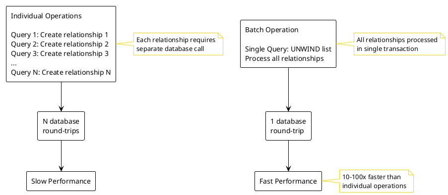

**Performance Impact:**

- 10-100x faster than individual operations
- Reduces transaction overhead
- Better connection pool utilization

### 3. Connection Pool Optimization

Optimize AGE extension loading:

```java
private void loadAgeExtension(Connection connection) {
    try {
        // Try to load AGE extension
        try (Statement stmt = connection.createStatement()) {
            stmt.execute("LOAD 'age';");
        }
    } catch (Exception e) {
        // AGE might already be loaded via shared_preload_libraries
        log.debug("Could not LOAD 'age' (might already be loaded): {}", e.getMessage());
    }
}
```

### 4. Query Optimization

#### Use Specific Labels

```cypher
// Good: Specific label
MATCH (e:Expert {id: $expertId})

// Bad: No label (scans all vertices)
MATCH (e {id: $expertId})
```

#### Use Property Filters Early

```cypher
// Good: Filter early
MATCH (e:Expert {id: $expertId})-[:PARTICIPATED_IN]->(p:Project)

// Bad: Filter late
MATCH (e:Expert)-[:PARTICIPATED_IN]->(p:Project)
WHERE e.id = $expertId
```

#### Limit Result Sets

```cypher
MATCH (e:Expert)
RETURN e
LIMIT 100
```

### 5. Chunking Large Operations

Process large datasets in chunks:

```java
private static final int BATCH_SIZE = 1000;

for(
int i = 0; i <allRelationships.

size();

i +=BATCH_SIZE){
int end = Math.min(i + BATCH_SIZE, allRelationships.size());
List<Relationship> chunk = allRelationships.subList(i, end);

createRelationshipsBatch(chunk);
}
```

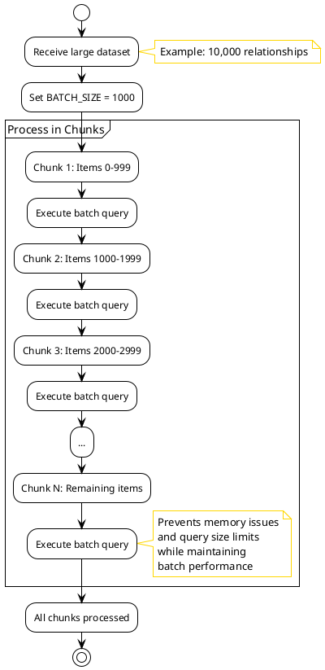

---

## Troubleshooting

### Common Issues and Solutions

#### 1. "unhandled cypher(cstring) function call"

**Error:**

```
ERROR: unhandled cypher(cstring) function call
Detail: expertmatch_graph
```

**Cause:** Apache AGE extension is not loaded for the current session.

**Solution:**

```java
// Load AGE extension before executing Cypher queries
try(Statement stmt = connection.createStatement()){
        stmt.

execute("LOAD 'age';");
}
```

**Understanding LOAD 'age':**

- `LOAD 'age'` loads the AGE extension for the current session
- If AGE is loaded via `shared_preload_libraries` in PostgreSQL config, this may not be needed
- The ExpertMatch project attempts to load it per-connection for reliability
- If LOAD fails (AGE already loaded), the error is caught and ignored
- Always execute `LOAD 'age'` on the same connection that executes Cypher queries

#### 2. Graph Does Not Exist

**Error:**

```
ERROR: graph "expertmatch_graph" does not exist
```

**Solution:**

```sql
-- Create the graph
SELECT * FROM ag_catalog.create_graph('expertmatch_graph');
```

#### 3. Relationship Properties Not Set

**Issue:** Relationship properties are null after SET operation.

**Solution:** Use `MERGE` with `SET` for relationship properties:

```cypher
MATCH (e:Expert {id: $expertId})
MATCH (p:Project {id: $projectId})
MERGE (e)-[r:PARTICIPATED_IN]->(p)
SET r.role = $role
```

#### 4. Duplicate Vertices

**Issue:** Creating duplicate vertices with same properties.

**Solution:** Use `MERGE` instead of `CREATE`:

```cypher
// Good: Prevents duplicates
MERGE (t:Technology {name: 'Java'})

// Bad: Creates duplicates
CREATE (t:Technology {name: 'Java'})
```

#### 5. Query Performance Issues

**Issue:** Slow query execution.

**Solutions:**

- Create indexes on frequently queried properties
- Use specific labels in MATCH clauses
- Add LIMIT to result sets
- Use batch operations for bulk inserts

#### 6. String Escaping Issues

**Issue:** Special characters in strings cause query errors.

**Solution:** Always escape strings:

```java
private String escapeCypherString(String value) {
    if (value == null) {
        return "";
    }
    return value.replace("\\", "\\\\")
            .replace("'", "\\'")
            .replace("\n", "\\n")
            .replace("\r", "\\r")
            .replace("\t", "\\t");
}
```

### Debugging Tips

#### 1. Enable Query Logging

```java
log.debug("Executing Cypher query: {}",cypherQuery);
log.

debug("With parameters: {}",parameters);
```

#### 2. Test Queries in psql

Test Cypher queries directly in PostgreSQL:

```sql
-- Load AGE extension
LOAD 'age';

-- Set search_path to include ag_catalog
SET search_path = ag_catalog, "$user", public, expertmatch;

-- Execute Cypher query
SELECT * FROM ag_catalog.cypher('expertmatch_graph', $$
    MATCH (e:Expert)
    RETURN e
    LIMIT 10
$$) AS t(result agtype);
```

**Important Notes:**

- `search_path` must include `ag_catalog` to find AGE functions
- Use dollar-quoted strings (`$$`) to avoid escaping issues in Cypher queries
- The `AS` clause must specify column names matching the RETURN clause
- Results are returned as `agtype` which can be cast to other types

**Alternative: Using age_prepare_cypher (for drivers):**

```sql
-- Prepare Cypher query (used by AGE drivers)
SELECT * FROM age_prepare_cypher('expertmatch_graph', 'MATCH (e:Expert) RETURN e');
```

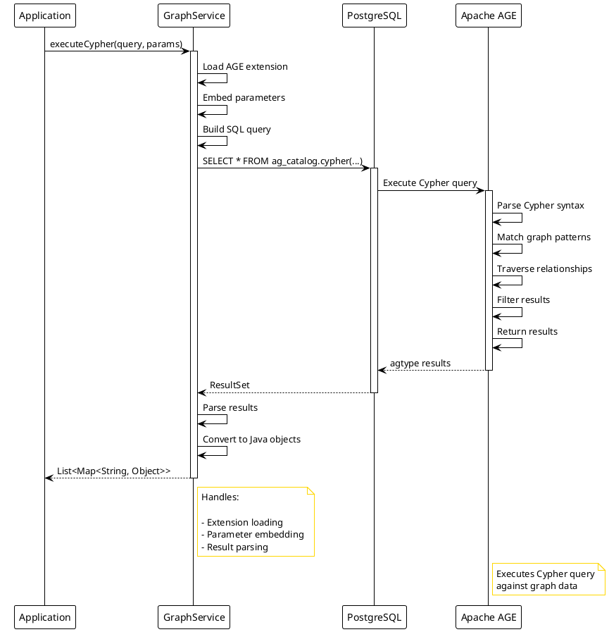

#### 3. Verify Graph Structure

Check if graph exists:

```sql
SELECT name FROM ag_catalog.ag_graph WHERE name = 'expertmatch_graph';
```

Check vertex counts:

```cypher
MATCH (e:Expert)
RETURN COUNT(e) as expertCount
```

---

## Advanced Patterns

### 1. Aggregation with WITH

Use `WITH` to chain query parts and perform aggregations:

```cypher
MATCH (e:Expert)-[:PARTICIPATED_IN]->(p:Project)
WITH e, COUNT(p) as projectCount
WHERE projectCount > 5
RETURN e.id, projectCount
ORDER BY projectCount DESC
```

### 2. Path Finding

Find paths between vertices:

```cypher
MATCH path = (e1:Expert)-[:PARTICIPATED_IN*..3]-(e2:Expert)
WHERE e1.id = $expertId1 AND e2.id = $expertId2
RETURN path
LIMIT 10
```

### 3. Optional Relationships

Use `OPTIONAL MATCH` for optional relationships:

```cypher
MATCH (e:Expert)
OPTIONAL MATCH (e)-[:PARTICIPATED_IN]->(p:Project)
RETURN e, collect(p) as projects
```

### 4. Conditional Logic

Use `CASE` for conditional logic:

```cypher
MATCH (e:Expert)
RETURN e.id,
       CASE e.seniority
           WHEN 'Senior' THEN 'High'
           WHEN 'Middle' THEN 'Medium'
           ELSE 'Low'
       END as experienceLevel
```

### 5. List Operations

Work with lists in Cypher:

```cypher
MATCH (e:Expert)-[:PARTICIPATED_IN]->(p:Project)-[:USES]->(t:Technology)
WITH e, collect(DISTINCT t.name) as technologies
WHERE size(technologies) > 5
RETURN e.id, technologies
```

### 6. Pattern Comprehension

Use pattern comprehension for subqueries:

```cypher
MATCH (e:Expert)
RETURN e.id,
       [(e)-[:PARTICIPATED_IN]->(p:Project) | p.name] as projectNames
```

---

## Integration with Java/Spring

### GraphService

The `GraphService` class provides a clean interface for executing Cypher queries:

```java
@Slf4j
@Service
public class GraphService {
    private static final String GRAPH_NAME = "expertmatch_graph";
    
    @Transactional
    public List<Map<String, Object>> executeCypher(String cypherQuery, Map<String, Object> parameters) {
        // 1. Embed parameters directly in Cypher query string
        String finalQuery = embedParameters(cypherQuery, parameters);
        
        // 2. Build SQL with dollar-quoted string
        String dollarTag = "cypher_q";
        String sql = String.format(
            "SELECT * FROM ag_catalog.cypher('%s'::name, $%s$%s$%s$::cstring) AS t(result ag_catalog.agtype)",
            GRAPH_NAME, dollarTag, finalQuery, dollarTag
        );
        
        // 3. Execute on connection with AGE extension loaded
        return jdbcTemplate.execute((ConnectionCallback<List<Map<String, Object>>>) connection -> {
            loadAgeExtension(connection);
            try (Statement stmt = connection.createStatement()) {
                stmt.execute("SET LOCAL search_path = ag_catalog, \"$user\", public, expertmatch;");
            }
            // Execute query and parse results...
        });
    }

    public List<String> executeCypherAndExtract(String cypherQuery, Map<String, Object> parameters, String resultField) {
        List<Map<String, Object>> results = executeCypher(cypherQuery, parameters);
        return results.stream()
            .map(result -> result.get(resultField))
            .filter(value -> value != null)
            .map(Object::toString)
            .distinct()
            .toList();
    }
}
```

**Implementation Details:**

1. **AGE Extension Loading**: Executes `LOAD 'age'` on the connection before query execution (handles case where AGE is
   already loaded)
2. **Search Path**: Sets `SET LOCAL search_path = ag_catalog, "$user", public, expertmatch;` for function resolution
3. **Parameter Embedding**: Embeds parameters directly in Cypher query string using `$paramName` placeholders
4. **Dollar-Quoted Strings**: Uses dollar-quoted strings with tag `cypher_q` (`$cypher_q$...$cypher_q$`) to safely embed
   Cypher queries in SQL
5. **Result Parsing**: Parses `agtype` results from PostgreSQL ResultSet into Java `Map<String, Object>`
6. **Graph Name**: Uses constant `GRAPH_NAME = "expertmatch_graph"` for all queries

**Why Parameter Embedding?**

- Apache AGE's `cypher()` function accepts parameters via the third argument (`params agtype`)
- However, embedding parameters in the query string is simpler and more compatible with various AGE versions
- The ExpertMatch project uses `embedParameters()` method with proper escaping for safety
- Parameters are replaced using string replacement: `$paramName` → escaped value

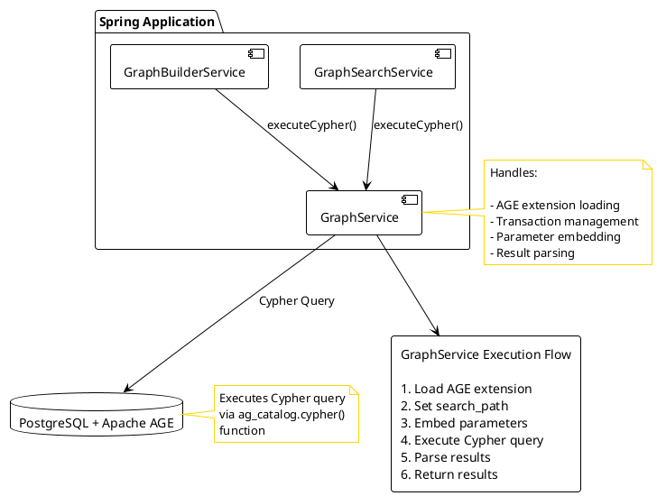

### Usage Example

```java

@Autowired
private GraphService graphService;

public List<String> findExpertsByTechnology(String technology) {
    String cypher = """
            MATCH (e:Expert)-[:PARTICIPATED_IN]->(p:Project)-[:USES]->(t:Technology)
            WHERE t.name = $technology
            RETURN DISTINCT e.id as expertId
            LIMIT 100
            """;

    Map<String, Object> params = new HashMap<>();
    params.put("technology", technology);

    return graphService.executeCypherAndExtract(cypher, params, "expertId");
}
```

### Transaction Management

Cypher queries are executed within Spring transactions:

```java

@Transactional
public void createExpertVertex(String expertId, String name) {
    // This operation is transactional
    graphService.executeCypher(cypher, params);
}
```

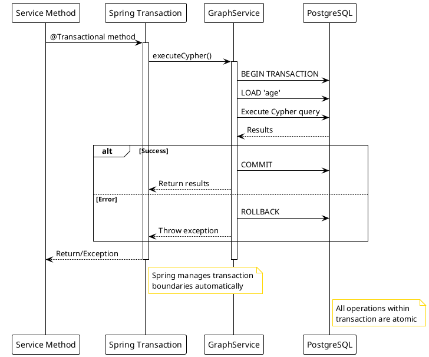

---

## Summary

### Key Takeaways

1. **Apache AGE** extends PostgreSQL with graph database capabilities
2. **Cypher** is a powerful declarative query language for graphs
3. **MERGE** is essential for idempotent operations
4. **Batch operations** with `UNWIND` provide significant performance benefits
5. **Indexes** are crucial for query performance
6. **Parameterization** prevents injection and improves performance
7. **Transaction management** ensures data consistency

### Next Steps

- Explore more complex graph patterns
- Experiment with path finding algorithms
- Optimize queries based on your use case
- Monitor query performance and adjust indexes
- Consider hybrid SQL/Cypher queries for complex operations

### Resources

- [Apache AGE Documentation](https://age.apache.org/)
- [Apache AGE Manual](https://age.apache.org/age-manual/master/index.html)
- [Apache AGE GitHub Repository](https://github.com/apache/age)
- [Cypher Query Language Reference](https://neo4j.com/docs/cypher-manual/) (openCypher compatible)
- [PostgreSQL Documentation](https://www.postgresql.org/docs/)
- ExpertMatch Project Codebase
- Apache AGE Source Code: Apache AGE repository

### Apache AGE Version Information

- **Current Version**: 1.6.0 (based on PostgreSQL 17)
- **Cypher Compatibility**: openCypher (compatible with Neo4j Cypher)
- **PostgreSQL Support**: PostgreSQL 12+ (ExpertMatch uses PostgreSQL 17)
- **License**: Apache License 2.0

---

## Appendix: Complete Code Examples

### GraphBuilderService Methods

See `src/main/java/com/berdachuk/expertmatch/graph/GraphBuilderService.java` for complete implementation examples.

### GraphSearchService Methods

See `src/main/java/com/berdachuk/expertmatch/retrieval/GraphSearchService.java` for query examples.

### Test Examples

See `src/test/java/com/berdachuk/expertmatch/graph/` for integration test examples.

---

## Future Enhancements

### Customer Relationships - ✅ IMPLEMENTED

**Status:** ✅ **Fully Implemented**

Customer vertices and relationships are now fully implemented in the graph.

**Implementation:**

- ✅ Customer vertices created from `work_experience` table (`GraphBuilderService.createCustomerVertices()`)
- ✅ `WORKED_FOR` relationships (Expert → Customer) implemented (
  `GraphBuilderService.createExpertCustomerRelationships()`)
- ✅ `FOR_CUSTOMER` relationships (Project → Customer) implemented (
  `GraphBuilderService.createProjectCustomerRelationships()`)
- ✅ Graph search methods: `GraphSearchService.findExpertsByCustomer()`, `findExpertsByCustomerAndTechnology()`
- ✅ Graph indexes for Customer properties (GIN index on JSONB)

**Query Examples:**

The actual implementation uses `WITH` clause to work around Apache AGE limitations with property matching:

```cypher
// Find experts who worked for a specific customer
MATCH (e:Expert)-[:WORKED_FOR]->(c:Customer)
WITH e, c
WHERE c.name = $customerName
RETURN DISTINCT e.id as expertId
LIMIT 100
```

**Note:** The `WITH` clause pattern is used to avoid agtype operator issues when filtering Customer by name. This
matches the implementation in `GraphSearchService.findExpertsByCustomer()`.

```cypher
// Find experts by customer and technology
MATCH (e:Expert)-[:WORKED_FOR]->(c:Customer)
WITH e, c
WHERE c.name = $customerName
MATCH (e)-[:PARTICIPATED_IN]->(p:Project)-[:USES]->(t:Technology)
WHERE t.name = $technology
RETURN DISTINCT e.id as expertId
LIMIT 100
```

**Note:** This matches the implementation in `GraphSearchService.findExpertsByCustomerAndTechnology()`. The queries
include graceful error handling that returns empty lists on failure to allow graceful degradation.

**See:** [Graph Improvements Analysis](GRAPH_IMPROVEMENTS_ANALYSIS.md) for implementation details and test coverage.

---

## Key Concepts from Apache AGE Source Code

This section provides insights based on reviewing the Apache AGE source code.

### agtype: The Fundamental Data Type

Apache AGE uses `agtype` as its core data type, which is JSONB-based but extended for graph-specific structures:

**agtype Structure:**

- **Base**: Built on PostgreSQL's JSONB type (`LIKE = jsonb`)
- **Scalar Types**: null, integer, float, boolean, string
- **Composite Types**: arrays, objects (maps/dictionaries)
- **Graph Types**: vertices, edges, paths (VLE - Variable Length Edges)

**Storage Format:**

- Vertices and edges are stored as `agtype` in the `properties` column
- Graph IDs (`graphid`) are separate PostgreSQL types
- Properties are stored as JSONB, allowing flexible schemas

**Compatibility:**

- Valid JSON is valid agtype
- Can be cast to/from PostgreSQL types
- Supports JSONB operators and functions

### cypher() Function Details

From `age/sql/age_query.sql`, the function signature is:

```sql
CREATE FUNCTION ag_catalog.cypher(
    graph_name name = NULL,
    query_string cstring = NULL,
    params agtype = NULL
) RETURNS SETOF record
```

**Key Points:**

- All parameters are optional (default to NULL)
- `graph_name` is a PostgreSQL `name` type (identifier)
- `query_string` is `cstring` (C-style string, null-terminated)
- `params` is `agtype` (for parameterized queries, rarely used)
- Returns `SETOF record` (must specify column structure in AS clause)

### Dollar-Quoted Strings

Apache AGE extensively uses dollar-quoted strings (`$$`) in its test files:

**Why Dollar-Quoted Strings?**

- Avoid escaping issues with single quotes in Cypher queries
- Allows embedding Cypher syntax directly in SQL
- More readable than escaped strings
- Standard PostgreSQL feature

**Example from AGE Source:**

```sql
SELECT * FROM cypher('graph_name', $$
    MATCH (n {name: 'Node'})
    RETURN n
$$) AS (n agtype);
```

### age_prepare_cypher Function

Found in `age/sql/agtype_typecast.sql`:

```sql
CREATE FUNCTION ag_catalog.age_prepare_cypher(cstring, cstring)
    RETURNS boolean
```

**Purpose:**

- Used by AGE drivers (Python, Go, JDBC) to prepare queries
- Sets up session information for graph context
- Called before executing `cypher()` with NULL graph name
- Not typically used in direct SQL queries

**Driver Usage Pattern:**

1. Call `age_prepare_cypher(graph_name, cypher_query)`
2. Call `cypher(NULL, NULL)` to execute prepared query

### Graph Storage Internals

**Table Naming Convention:**

- Vertices: `ag_catalog.ag_<graphname>_<label>`
- Edges: `ag_catalog.ag_<graphname>_<label>`
- Example: `ag_expertmatch_graph_Expert`, `ag_expertmatch_graph_PARTICIPATED_IN`

**Table Structure:**

- `id` column: `graphid` type (internal graph identifier)
- `properties` column: `agtype` (JSONB-based, stores vertex/edge properties)
- Automatically created when first vertex/edge with a label is created

**Graph Metadata:**

- Stored in `ag_catalog.ag_graph` table
- Contains graph name and metadata
- Used for graph existence checks

### MERGE/SET Behavior

From `age/regress/sql/cypher_merge.sql`, confirmed that:

- `MERGE` with `SET` is fully supported for both vertices and edges
- `SET` can be used immediately after `MERGE` in the same clause
- Multiple `SET` operations are supported: `SET n.age = 23, n.gender = 'Female'`
- Works for both existing and newly created nodes/relationships

**Example from AGE Tests:**

```cypher
MERGE (n:node {name: 'Jason'}) 
SET n.name = 'Lisa', n.age = 23, n.gender = 'Female' 
RETURN n
```

### UNWIND Advanced Patterns

From `age/regress/sql/cypher_unwind.sql`, advanced UNWIND patterns:

- **Nested Arrays**: `UNWIND [[1, 2], [3, 4]] AS x UNWIND x AS y`
- **Path Elements**: `UNWIND nodes(p) AS node`, `UNWIND relationships(p) AS rel`
- **Variable Length Paths**: Works with VLE (Variable Length Edge) patterns

### Performance Considerations

**From AGE Source Code Analysis:**

1. **GIN Indexes**: Recommended for JSONB property lookups (confirmed in ExpertMatch implementation)
2. **Batch Operations**: UNWIND is the recommended pattern for bulk operations
3. **Connection Management**: `LOAD 'age'` should be per-connection, not per-query
4. **Search Path**: Must include `ag_catalog` for function resolution

---

*Last Updated: 2025-01-21*
*Project: ExpertMatch*
*Version: 1.0.0*
*Apache AGE Version: 1.6.0 (PostgreSQL 17)*

