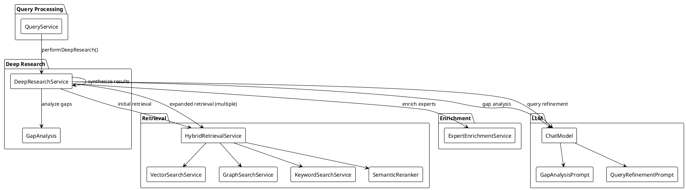
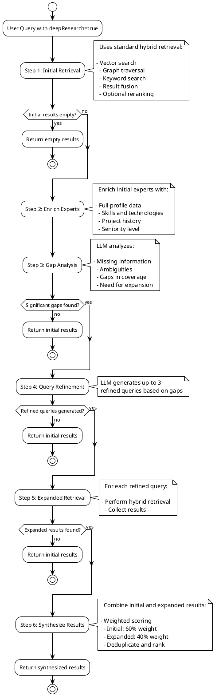
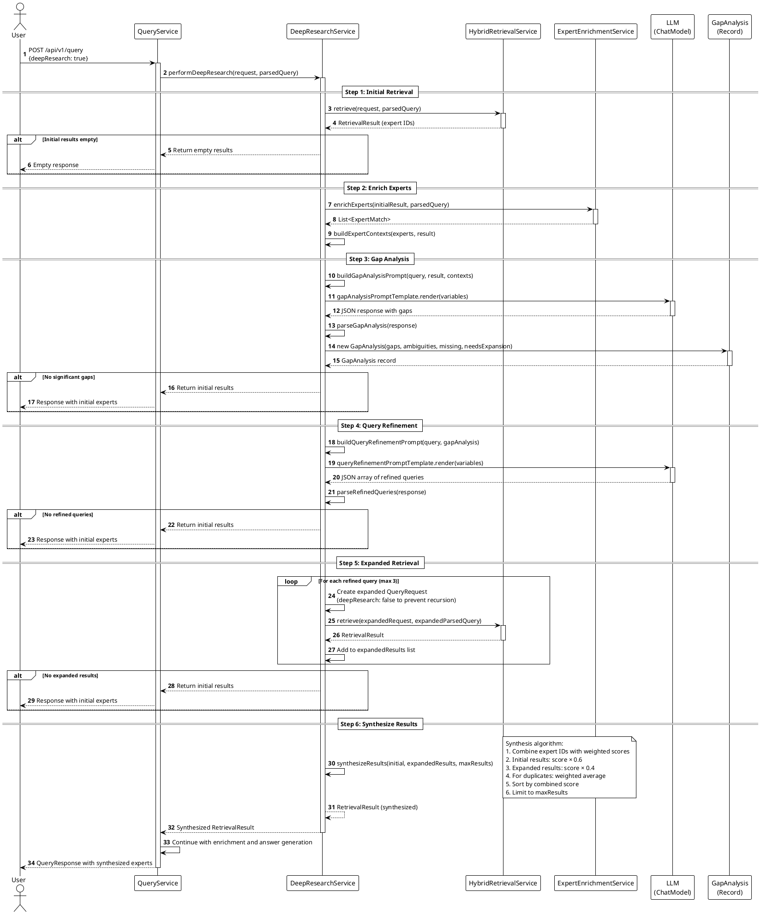
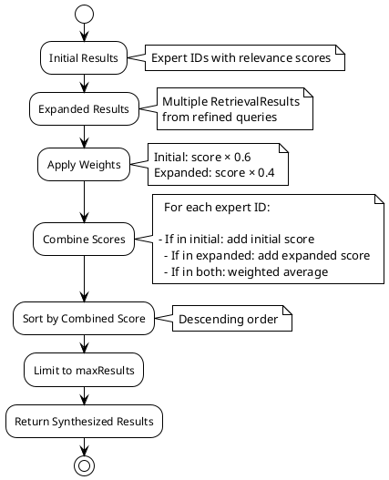

# Deep Research Architecture

## Overview

Deep Research is an advanced expert discovery feature that implements the **Self-Grounded Retrieval (SGR)** pattern. It
performs multi-step iterative retrieval to find experts by analyzing gaps in initial results, refining queries, and
synthesizing comprehensive results.

## Table of Contents

1. [Introduction](#introduction)
2. [Architecture Overview](#architecture-overview)
3. [Deep Research Flow](#deep-research-flow)
4. [Components](#components)
5. [Configuration](#configuration)
6. [Usage](#usage)
7. [Logging and Monitoring](#logging-and-monitoring)

## Introduction

Deep Research enhances the standard hybrid retrieval by:

- **Analyzing gaps** in initial retrieval results using LLM
- **Refining queries** based on identified gaps and ambiguities
- **Expanding search** with multiple refined queries
- **Synthesizing results** from initial and expanded retrievals

This approach is particularly effective for complex queries where initial results may miss important aspects or when the
query needs clarification.

## Architecture Overview



## Deep Research Flow

### High-Level Flow Diagram



### Detailed Sequence Diagram



## Components

### DeepResearchService

The main service orchestrating the deep research process.

**Key Methods:**

- `performDeepResearch(QueryRequest, ParsedQuery, ExecutionTracer)` - Main entry point
- `analyzeGaps(String, RetrievalResult, List<ExpertContext>, ExecutionTracer)` - Performs gap analysis using LLM
- `generateRefinedQueries(String, GapAnalysis, ExecutionTracer)` - Generates refined queries based on gaps
- `synthesizeResults(RetrievalResult, List<RetrievalResult>, int)` - Combines and synthesizes results

**Dependencies:**

- `HybridRetrievalService` - For initial and expanded retrievals
- `ExpertEnrichmentService` - For enriching expert data
- `ChatModel` - For LLM-based gap analysis and query refinement
- `PromptTemplate` (gapAnalysisPromptTemplate) - Template for gap analysis prompts
- `PromptTemplate` (queryRefinementPromptTemplate) - Template for query refinement prompts

### GapAnalysis

A record class representing the results of gap analysis.

```java
public record GapAnalysis(
    List<String> identifiedGaps,      // Missing information
    List<String> ambiguities,          // Query ambiguities
    List<String> missingInformation,   // Missing context
    boolean needsExpansion             // Whether to expand search
)
```

**Key Methods:**

- `hasSignificantGaps()` - Checks if gaps warrant expansion
- `noExpansionNeeded()` - Creates empty gap analysis

### Synthesis Algorithm

The synthesis process combines initial and expanded results using weighted scoring:



**Configuration Constants:**

- `MAX_REFINED_QUERIES = 3` - Maximum number of refined queries to generate
- `SYNTHESIS_WEIGHT_INITIAL = 0.6` - Weight for initial results (60%)
- `SYNTHESIS_WEIGHT_EXPANDED = 0.4` - Weight for expanded results (40%)

## Configuration

### API Request

Enable deep research by setting `deepResearch: true` in the query options:

```json
{
  "query": "Looking for Java Spring Boot experts",
  "chatId": "6950e6c4c647d3dce28a52cc",
  "options": {
    "deepResearch": true,
    "maxResults": 10,
    "rerank": true
  }
}
```

### Prompt Templates

Deep research uses two prompt templates:

1. **Gap Analysis Prompt** (`gapAnalysisPromptTemplate`)
    - Location: `src/main/resources/prompts/gap-analysis.st`
    - Purpose: Analyzes gaps in initial retrieval results
    - Input: Query, expert count, expert summaries
    - Output: JSON with gaps, ambiguities, missing information, needsExpansion flag

2. **Query Refinement Prompt** (`queryRefinementPromptTemplate`)
    - Location: `src/main/resources/prompts/query-refinement.st`
    - Purpose: Generates refined queries based on gap analysis
    - Input: Original query, identified gaps, ambiguities, missing information
    - Output: JSON array of refined query strings

### Service Configuration

Deep research is configured in `PromptTemplateConfig`:

```java
@Bean
@Qualifier("gapAnalysisPromptTemplate")
public PromptTemplate gapAnalysisPromptTemplate(StTemplateRenderer stTemplateRenderer) {
    return PromptTemplate.builder()
            .renderer(stTemplateRenderer)
            .templateResource(new ClassPathResource("/prompts/gap-analysis.st"))
            .build();
}

@Bean
@Qualifier("queryRefinementPromptTemplate")
public PromptTemplate queryRefinementPromptTemplate(StTemplateRenderer stTemplateRenderer) {
    return PromptTemplate.builder()
            .renderer(stTemplateRenderer)
            .templateResource(new ClassPathResource("/prompts/query-refinement.st"))
            .build();
}
```

## Usage

### Enabling Deep Research

Deep research is enabled per-query via the API:

```bash
curl -X POST http://localhost:8093/api/v1/query \
  -H "Content-Type: application/json" \
  -H "X-User-Id: user-123" \
  -d '{
    "query": "Looking for senior Java developers with microservices experience",
    "chatId": "6950e6c4c647d3dce28a52cc",
    "options": {
      "deepResearch": true,
      "maxResults": 10,
      "rerank": true
    }
  }'
```

### When to Use Deep Research

Deep research is beneficial for:

- **Complex queries** with multiple requirements
- **Ambiguous queries** that need clarification
- **Comprehensive searches** where initial results may miss important aspects
- **Domain-specific queries** requiring deeper understanding

### Performance Considerations

Deep research involves:

- **Multiple LLM calls**: Gap analysis + Query refinement (2 calls)
- **Multiple retrievals**: Initial + Expanded (up to 4 total retrievals)
- **Additional processing**: Enrichment, synthesis

**Typical execution time:** 30-90 seconds (depending on query complexity and LLM response time)

## Logging and Monitoring

### Progress Logging

Deep research provides detailed progress logs at each step:

```
Starting deep research for query: '...'
Deep Research Step 1/6: Performing initial retrieval...
Initial retrieval completed: X experts found
Deep Research Step 2/6: Enriching experts for gap analysis...
Expert enrichment completed: X experts enriched
Deep Research Step 3/6: Analyzing gaps in initial results...
Gap analysis completed: needsExpansion=true, gaps identified=X
Deep Research Step 4/6: Generating refined queries based on gaps...
Query refinement completed: X refined queries generated
Deep Research Step 5/6: Performing expanded retrieval for X refined queries...
  Expanded retrieval 1/X: '...' completed: X experts found
  Expanded retrieval 2/X: '...' completed: X experts found
  Expanded retrieval 3/X: '...' completed: X experts found
Deep Research Step 6/6: Synthesizing results (initial: X, expanded: X)...
Deep research completed: X experts in final synthesized result
```

### Monitoring Deep Research

Watch deep research logs in real-time:

```bash
tail -f logs/expert-match-debug.log | grep -E 'Deep Research Step|deep research|Expanded retrieval'
```

### Execution Tracing

When `includeExecutionTrace: true` is set, the response includes detailed execution trace:

```json
{
  "executionTrace": {
    "steps": [
      {
        "name": "Deep Research",
        "service": "DeepResearchService",
        "method": "performDeepResearch",
        "subSteps": [
          {
            "name": "Initial Retrieval",
            "service": "HybridRetrievalService",
            "method": "retrieve"
          },
          {
            "name": "Gap Analysis",
            "service": "DeepResearchService",
            "method": "analyzeGaps",
            "llmCall": {
              "model": "...",
              "tokens": {...}
            }
          },
          {
            "name": "Query Refinement",
            "service": "DeepResearchService",
            "method": "generateRefinedQueries",
            "llmCall": {
              "model": "...",
              "tokens": {...}
            }
          },
          {
            "name": "Expanded Retrieval 1",
            "service": "HybridRetrievalService",
            "method": "retrieve"
          },
          {
            "name": "Synthesize Results",
            "service": "DeepResearchService",
            "method": "synthesizeResults"
          }
        ]
      }
    ]
  }
}
```

## Error Handling

Deep research implements graceful degradation:

1. **Empty initial results**: Returns immediately without expansion
2. **No significant gaps**: Returns initial results
3. **Failed gap analysis**: Throws exception (query fails)
4. **No refined queries**: Returns initial results
5. **Failed expanded retrieval**: Continues with other queries, logs error
6. **No expanded results**: Returns initial results

## Best Practices

1. **Use for complex queries**: Deep research adds overhead, use when initial results may be insufficient
2. **Monitor performance**: Track execution time and LLM token usage
3. **Review gaps**: Check gap analysis results to understand query improvements
4. **Adjust maxResults**: Consider increasing maxResults when using deep research
5. **Combine with reranking**: Deep research works well with semantic reranking

## Related Documentation

- [Query Processing Flow](./QUERY_PROCESSING_FLOW_DETAILED.md)
- [SGR Pattern Benefits](./ExpertMatch-SGR-Benefits.md)
- [API Endpoints](./API_ENDPOINTS.md)
- [Swagger UI Testing Guide](./SWAGGER_UI_TESTING_GUIDE.md)

