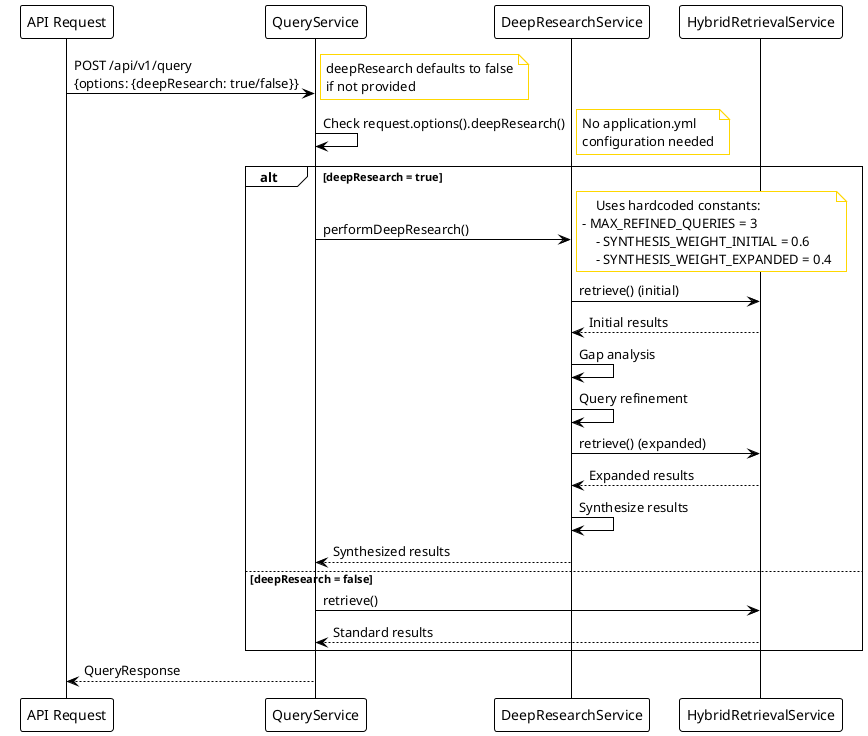

# Deep Research Configuration Review

This document provides a comprehensive review of how `deepResearch` is configured in ExpertMatch.

---

## Overview

The `deepResearch` feature implements the SGR (Schema-Guided Reasoning) Deep Research Pattern, which performs multi-step
iterative retrieval with gap analysis, query refinement, and result synthesis.

---

## Configuration Levels

### 1. API-Level Configuration (`QueryRequest.java`)

**Note**: As of 2025-12-09, `deepResearch` is **API-only**. All configuration has been removed from `application.yml`
and is now controlled exclusively via the API request parameter.

**Location**: `src/main/java/com/berdachuk/expertmatch/query/QueryRequest.java`

**API Field**:

```java
@Schema(description = "Enable deep research SGR pattern", example = "false")
@JsonProperty("deepResearch")
Boolean deepResearch,
```

**Default Behavior**:

- Defaults to `false` if not provided (line 81 in QueryRequest.java)
- Can be enabled per-request via API
- **This is the only way to enable deep research** - no application.yml configuration

**Usage in QueryService**:

```java
if(request.options().

deepResearch() !=null&&request.

options().

deepResearch()){
retrievalResult =deepResearchService.

performDeepResearch(request, parsedQuery);
}else{
retrievalResult =retrievalService.

retrieve(request, parsedQuery);
}
```

---

### 2. Service-Level Configuration (`DeepResearchService.java`)

**Location**: `src/main/java/com/berdachuk/expertmatch/retrieval/DeepResearchService.java`

**Configuration Constants** (hardcoded in service):

```java
// Deep research configuration constants
// Note: deepResearch is controlled via API parameter (QueryOptions.deepResearch)
private static final int MAX_REFINED_QUERIES = 3;  // Maximum number of refined queries to generate
private static final double SYNTHESIS_WEIGHT_INITIAL = 0.6;  // Weight for initial results in synthesis
private static final double SYNTHESIS_WEIGHT_EXPANDED = 0.4;  // Weight for expanded results in synthesis
```

**Current Implementation**:

- `SYNTHESIS_WEIGHT_INITIAL` (0.6) and `SYNTHESIS_WEIGHT_EXPANDED` (0.4) are used in `synthesizeResults()` method
- `MAX_REFINED_QUERIES` (3) limits the number of refined queries generated
- All configuration is now hardcoded as constants (no external configuration needed)

---

## Configuration Flow



---

## Current Implementation Details

### 1. Gap Analysis

**Current Logic**:

- Uses `GapAnalysis.hasSignificantGaps()` which returns boolean
- Checks if `needsExpansion` is true and gaps exist
- No threshold configuration - uses boolean logic

**Code**:

```java
if(!gapAnalysis.hasSignificantGaps()){
        logger.

info("No significant gaps identified, returning initial results");
    return initialResult;
}
```

### 2. Query Refinement

**Current Logic**:

- Generates up to 3 refined queries (hardcoded constant)
- Uses `MAX_REFINED_QUERIES = 3` constant
- Limits queries in `parseRefinedQueries()` method

**Code**:

```java
return queries.stream()
    .

filter(q ->q !=null&&!q.

trim().

isEmpty())
        .

limit(MAX_REFINED_QUERIES) // Uses constant: 3
    .

collect(Collectors.toList());
```

### 3. Result Synthesis

**Current Logic**:

- Uses `SYNTHESIS_WEIGHT_INITIAL` (0.6) for initial results
- Uses `SYNTHESIS_WEIGHT_EXPANDED` (0.4) for expanded results
- Combines scores with weighted average

**Code**:

```java
// Add initial results with initial weight
for(String expertId :initial.

expertIds()){
double score = initial.relevanceScores().getOrDefault(expertId, 0.0);
    combinedScores.

put(expertId, score *SYNTHESIS_WEIGHT_INITIAL);
}

// Add expanded results with expanded weight
        for(
HybridRetrievalService.RetrievalResult expanded :expandedResults){
        for(
String expertId :expanded.

expertIds()){
double expandedScore = expanded.relevanceScores().getOrDefault(expertId, 0.0);
double weightedScore = expandedScore * SYNTHESIS_WEIGHT_EXPANDED;
// ...
    }
            }
```

---

## Current Configuration Status

###  Configuration Simplification (Completed 2025-12-09)

**Changes Made**:

1.  Removed `deep-research` section from `application.yml`
2.  Removed `@Value` annotations from `DeepResearchService`
3.  Replaced configuration with hardcoded constants:
- `MAX_REFINED_QUERIES = 3`
    - `SYNTHESIS_WEIGHT_INITIAL = 0.6`
    - `SYNTHESIS_WEIGHT_EXPANDED = 0.4`
4.  `deepResearch` is now **API-only** - controlled via `QueryOptions.deepResearch` parameter

**Rationale**:

- Simplifies configuration - no need for application.yml settings
- API-level control provides flexibility per-request
- Constants are sufficient for current use cases
- Reduces configuration complexity and potential errors

**Future Considerations**:
If configurability is needed in the future, consider:

- Adding configuration back to `application.yml` for synthesis weights
- Making constants configurable via environment variables
- Adding validation for configuration values

---

## Summary

### Current State (As of 2025-12-09)

 **Working**:

- API-level `deepResearch` flag works correctly
- Result synthesis uses hardcoded weight constants (0.6 and 0.4)
- Service integration is functional
- Configuration simplified - API-only approach

 **Configuration**:

- `deepResearch` is controlled exclusively via API parameter
- No `application.yml` configuration needed
- Internal constants: `MAX_REFINED_QUERIES = 3`, `SYNTHESIS_WEIGHT_INITIAL = 0.6`, `SYNTHESIS_WEIGHT_EXPANDED = 0.4`

### Benefits of Current Approach

1. **Simplicity**: No external configuration to manage
2. **Flexibility**: Per-request control via API
3. **Clarity**: Constants are clearly defined in code
4. **Reduced Errors**: No risk of misconfiguration

### API Usage

```json
{
  "query": "Find Java experts with Spring Boot",
  "options": {
    "deepResearch": true  // Enable deep research for this request
  }
}
```

**Default**: If `deepResearch` is not provided, it defaults to `false`.

---

**Last Updated**: 2025-12-21

