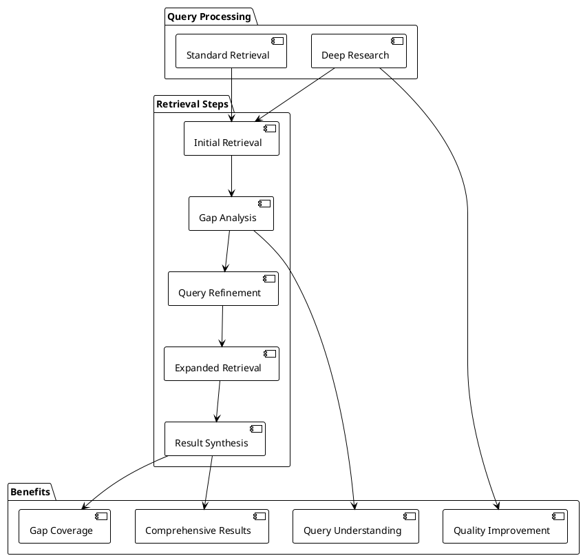

# Deep Research Benefits in ExpertMatch

This document outlines the specific benefits that **Deep Research** provides to the ExpertMatch solution, including
technical, user experience, and business value advantages.

---

## Overview

**Deep Research** is an advanced expert discovery feature that implements the **Self-Grounded Retrieval (SGR)** pattern.
It performs multi-step iterative retrieval with gap analysis, query refinement, and result synthesis to deliver
comprehensive expert matches for complex queries.

### Deep Research in ExpertMatch Architecture



**Key Features**:

- **Multi-step iterative retrieval** - Performs multiple retrieval passes to gather comprehensive information
- **LLM-powered gap analysis** - Identifies missing information, ambiguities, and coverage gaps
- **Query refinement** - Generates up to 3 refined queries based on gap analysis
- **Result synthesis** - Combines initial and expanded results with weighted scoring
- **API-controlled** - Enabled per-request via `deepResearch` option (default: `false`)

---

## 1. Technical Benefits

### 1.1 Comprehensive Coverage

**Problem Solved**: Standard retrieval may miss relevant experts when queries are complex, ambiguous, or require
multiple perspectives.

**Deep Research Solution**:

- Analyzes initial results to identify gaps and missing information
- Generates refined queries to address identified gaps
- Performs expanded retrieval with multiple query variations
- Synthesizes results from all retrieval passes

**Technical Advantage**:

- **Weighted synthesis**: Initial results weighted at 60%, expanded results at 40%
- **Deduplication**: Automatically handles duplicate experts across retrieval passes
- **Quality preservation**: Maintains relevance while expanding coverage

### 1.2 Intelligent Query Understanding

**Problem Solved**: User queries may be ambiguous or incomplete, leading to suboptimal results.

**Deep Research Solution**:

- Uses LLM to analyze query intent and context
- Identifies ambiguities and missing information
- Generates refined queries that clarify intent
- Expands search to cover multiple interpretations

**Technical Advantage**:

- **Gap analysis**: Structured analysis of missing information, ambiguities, and coverage needs
- **Query refinement**: Up to 3 refined queries generated based on gap analysis
- **Context awareness**: Considers expert profiles and initial results when refining queries

### 1.3 Adaptive Retrieval Strategy

**Problem Solved**: One-size-fits-all retrieval may not be optimal for all query types.

**Deep Research Solution**:

- Starts with standard hybrid retrieval
- Analyzes results to determine if expansion is needed
- Only performs expanded retrieval when significant gaps are identified
- Falls back to initial results if no gaps are found

**Technical Advantage**:

- **Conditional execution**: Only expands when necessary, avoiding unnecessary overhead
- **Early termination**: Returns initial results if they are sufficient
- **Resource efficiency**: Balances quality with performance

### 1.4 Result Quality Enhancement

**Problem Solved**: Standard retrieval may return experts that partially match requirements.

**Deep Research Solution**:

- Enriches initial experts with full profile data before gap analysis
- Uses enriched context to identify what's missing
- Expands search to find experts that fill identified gaps
- Synthesizes results with weighted scoring

**Technical Advantage**:

- **Expert enrichment**: Full profile data used for gap analysis
- **Weighted scoring**: Initial results (60%) + expanded results (40%)
- **Ranking optimization**: Better expert ranking through comprehensive analysis

---

## 2. User Experience Benefits

### 2.1 Better Expert Matches

**User Benefit**: Users receive more relevant and comprehensive expert recommendations.

**How Deep Research Helps**:

- Finds experts that standard retrieval might miss
- Covers multiple aspects of complex queries
- Provides diverse expert profiles when needed
- Reduces false negatives (missing relevant experts)

**Example Use Case**:

```
Query: "Find Java experts with Spring Boot experience for microservices architecture"

Standard Retrieval: May find experts with Java + Spring Boot, but miss microservices-specific experience

Deep Research:

- Initial: Finds Java + Spring Boot experts
- Gap Analysis: Identifies missing microservices architecture focus
- Refined Query: "Java Spring Boot microservices architecture patterns"
- Expanded: Finds additional experts with microservices experience
- Synthesis: Combines both sets with weighted scoring
```

### 2.2 Handles Complex Queries

**User Benefit**: Users can submit complex, multi-faceted queries and get comprehensive results.

**How Deep Research Helps**:

- Breaks down complex queries into multiple aspects
- Searches for each aspect separately
- Combines results intelligently
- Handles ambiguous or incomplete queries

**Example Use Case**:

```
Query: "Find experts who worked on cloud migration projects using AWS"

Deep Research Process:
1. Initial: Finds experts with cloud migration or AWS experience
2. Gap Analysis: Identifies need for both cloud migration AND AWS together
3. Refined Queries:

   - "AWS cloud migration projects"
   - "Cloud migration AWS services"
   - "AWS migration architecture"
4. Expanded: Finds experts matching refined queries
5. Synthesis: Combines all results, prioritizing experts with both skills
```

### 2.3 Reduced Search Iterations

**User Benefit**: Users don't need to refine queries manually or perform multiple searches.

**How Deep Research Helps**:

- Automatically refines queries based on gap analysis
- Performs multiple searches internally
- Synthesizes results into a single response
- Reduces need for follow-up queries

**User Experience**:

- **Before**: User submits query → Gets partial results → Refines query → Submits again → Gets better results
- **After**: User submits query with `deepResearch: true` → Gets comprehensive results in one response

### 2.4 Confidence in Results

**User Benefit**: Users can trust that comprehensive search has been performed.

**How Deep Research Helps**:

- Transparent gap analysis identifies what was searched
- Multiple retrieval passes ensure coverage
- Weighted synthesis provides balanced results
- Early termination when initial results are sufficient

---

## 3. Business Value

### 3.1 Improved RFP Success Rate

**Business Benefit**: Better expert matches lead to more successful RFPs and proposals.

**How Deep Research Contributes**:

- Finds experts that might have been missed
- Ensures comprehensive coverage of requirements
- Reduces risk of missing critical expertise
- Improves proposal quality

**ROI**:

- **Higher win rate**: Better expert matches → Better proposals → More wins
- **Reduced time**: Less manual searching and refinement
- **Better resource utilization**: Finds all relevant experts, not just obvious matches

### 3.2 Competitive Advantage

**Business Benefit**: Deep Research provides a competitive edge in expert discovery.

**How Deep Research Contributes**:

- Advanced AI-powered search capabilities
- Multi-step iterative retrieval pattern
- LLM-powered gap analysis and query refinement
- Sophisticated result synthesis

**Market Differentiation**:

- **Innovation**: Implements cutting-edge SGR patterns
- **Quality**: Superior expert matching for complex queries
- **Efficiency**: Automated query refinement and expansion

### 3.3 Scalability and Efficiency

**Business Benefit**: Deep Research scales efficiently while maintaining quality.

**How Deep Research Contributes**:

- Conditional execution (only expands when needed)
- Early termination for simple queries
- Efficient synthesis algorithm
- API-controlled (enabled per-request)

**Operational Benefits**:

- **Resource efficiency**: Only uses additional resources when necessary
- **Performance**: Falls back to standard retrieval when sufficient
- **Cost control**: Per-request control allows selective use
- **Scalability**: Handles complex queries without manual intervention

---

## 4. Use Cases

### 4.1 Complex Multi-Requirement Queries

**Scenario**: RFP requires experts with multiple specific skills or experiences.

**Example**:

```json
{
  "query": "Find experts with Java, Spring Boot, microservices, AWS, and Kubernetes experience",
  "options": {
    "deepResearch": true
  }
}
```

**Deep Research Benefit**:

- Identifies if initial results cover all requirements
- Generates refined queries for missing combinations
- Ensures comprehensive coverage of all requirements

### 4.2 Ambiguous or Incomplete Queries

**Scenario**: User query is vague or missing context.

**Example**:

```json
{
  "query": "Find cloud experts",
  "options": {
    "deepResearch": true
  }
}
```

**Deep Research Benefit**:

- Analyzes what "cloud experts" might mean
- Generates refined queries for different cloud aspects (AWS, Azure, GCP, architecture, migration, etc.)
- Provides diverse results covering multiple interpretations

### 4.3 Domain-Specific Expertise

**Scenario**: Need experts with specific domain knowledge that may not be explicitly stated.

**Example**:

```json
{
  "query": "Find experts for fintech project",
  "options": {
    "deepResearch": true
  }
}
```

**Deep Research Benefit**:

- Identifies domain-specific requirements (security, compliance, regulations, etc.)
- Generates refined queries for domain-specific aspects
- Finds experts with relevant domain experience

### 4.4 High-Stakes Projects

**Scenario**: Critical project where missing the right expert has significant consequences.

**Example**:

```json
{
  "query": "Find senior architects for enterprise transformation project",
  "options": {
    "deepResearch": true
  }
}
```

**Deep Research Benefit**:

- Ensures comprehensive search is performed
- Reduces risk of missing critical expertise
- Provides confidence in result completeness

---

## 5. Comparison: Standard vs. Deep Research

### 5.1 Retrieval Process

| Aspect               | Standard Retrieval    | Deep Research                |
|----------------------|-----------------------|------------------------------|
| **Steps**            | Single retrieval pass | Multi-step iterative process |
| **Gap Analysis**     | None                  | LLM-powered gap analysis     |
| **Query Refinement** | None                  | Up to 3 refined queries      |
| **Result Synthesis** | Direct results        | Weighted synthesis (60/40)   |
| **Coverage**         | Single perspective    | Multiple perspectives        |

### 5.2 Performance Characteristics

| Aspect                    | Standard Retrieval  | Deep Research            |
|---------------------------|---------------------|--------------------------|
| **Latency**               | Lower (single pass) | Higher (multiple passes) |
| **Resource Usage**        | Lower               | Higher (when expanded)   |
| **Early Termination**     | N/A                 | Yes (if no gaps found)   |
| **Conditional Execution** | Always executes     | Only expands when needed |

### 5.3 Result Quality

| Aspect                  | Standard Retrieval           | Deep Research                   |
|-------------------------|------------------------------|---------------------------------|
| **Coverage**            | Single retrieval perspective | Multiple retrieval perspectives |
| **Gap Handling**        | May miss relevant experts    | Identifies and fills gaps       |
| **Query Understanding** | Direct query matching        | Enhanced with gap analysis      |
| **Result Diversity**    | Limited to initial query     | Expanded with refined queries   |

### 5.4 When to Use

**Use Standard Retrieval When**:

- Query is simple and specific
- Performance is critical
- Initial results are likely sufficient
- Resource usage needs to be minimized

**Use Deep Research When**:

- Query is complex or multi-faceted
- Comprehensive coverage is important
- Query may be ambiguous or incomplete
- Missing experts has significant impact
- Quality is more important than speed

---

## 6. Technical Implementation Benefits

### 6.1 SGR Pattern Compliance

**Benefit**: Implements industry-standard Self-Grounded Retrieval pattern.

**Advantages**:

- **Predictability**: Structured, repeatable process
- **Reliability**: Consistent behavior across queries
- **Auditability**: Clear steps and decision points
- **Maintainability**: Well-defined architecture

### 6.2 Integration with Existing Services

**Benefit**: Seamlessly integrates with existing ExpertMatch services.

**Advantages**:

- **Reuses HybridRetrievalService**: Leverages existing retrieval infrastructure
- **Uses ExpertEnrichmentService**: Enriches experts before gap analysis
- **Integrates with QueryService**: Simple API flag to enable
- **Compatible with all search strategies**: Vector, Graph, Keyword, Reranking

### 6.3 Configuration and Control

**Benefit**: API-controlled with sensible defaults.

**Advantages**:

- **Per-request control**: Enable/disable per query
- **Default behavior**: Standard retrieval by default (no overhead)
- **Internal constants**: Hardcoded synthesis weights (0.6/0.4)
- **No external configuration**: Simplifies deployment

---

## 7. Summary

### Key Benefits

1. **Comprehensive Coverage**: Multi-step retrieval ensures all relevant experts are found
2. **Intelligent Analysis**: LLM-powered gap analysis identifies missing information
3. **Query Refinement**: Automatic query refinement based on gap analysis
4. **Result Synthesis**: Weighted combination of initial and expanded results
5. **Conditional Execution**: Only expands when necessary, optimizing resource usage
6. **Better Matches**: More relevant and comprehensive expert recommendations
7. **Handles Complexity**: Effectively processes complex, ambiguous, or multi-faceted queries
8. **Business Value**: Improves RFP success rate and provides competitive advantage

### When to Enable

Enable Deep Research (`deepResearch: true`) when:

- ✅ Query is complex or multi-faceted
- ✅ Comprehensive coverage is critical
- ✅ Query may be ambiguous or incomplete
- ✅ Quality is more important than speed
- ✅ Missing experts has significant consequences

Use Standard Retrieval (default) when:

- ✅ Query is simple and specific
- ✅ Performance is critical
- ✅ Initial results are likely sufficient
- ✅ Resource usage needs to be minimized

---

**Last Updated**: 2025-01-21

