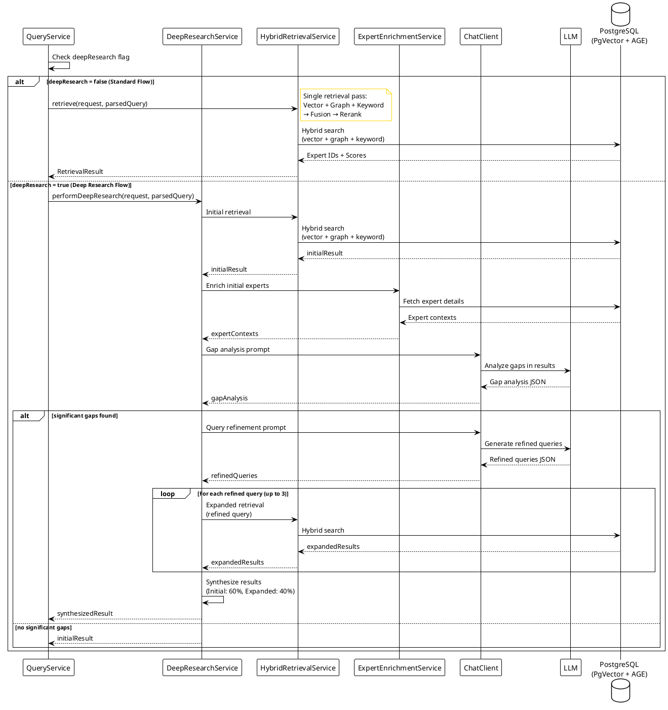
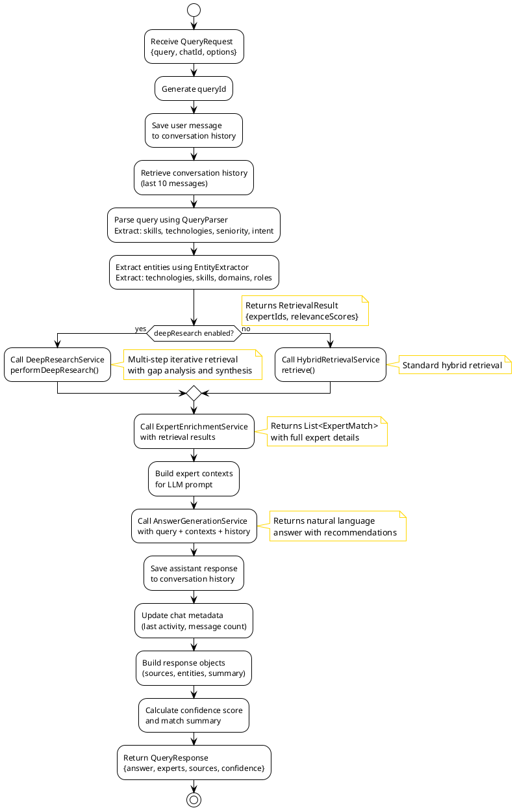
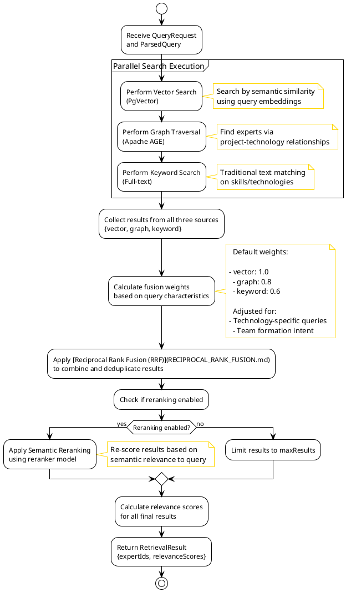
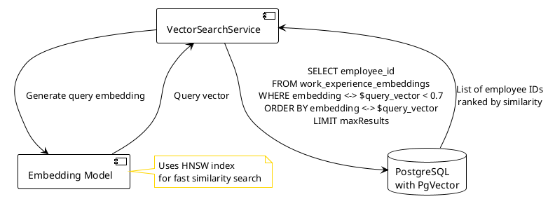
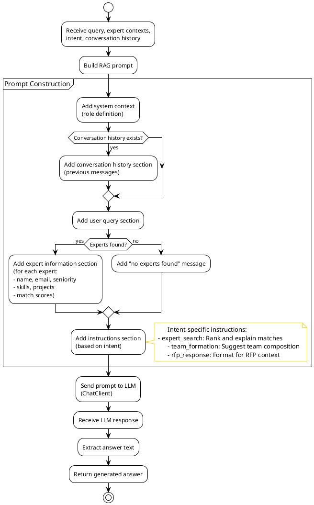
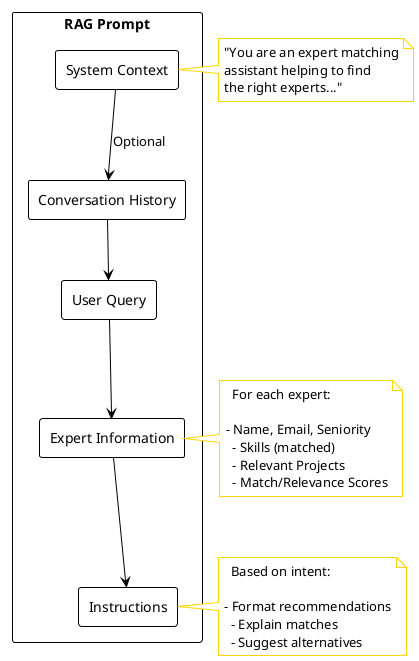
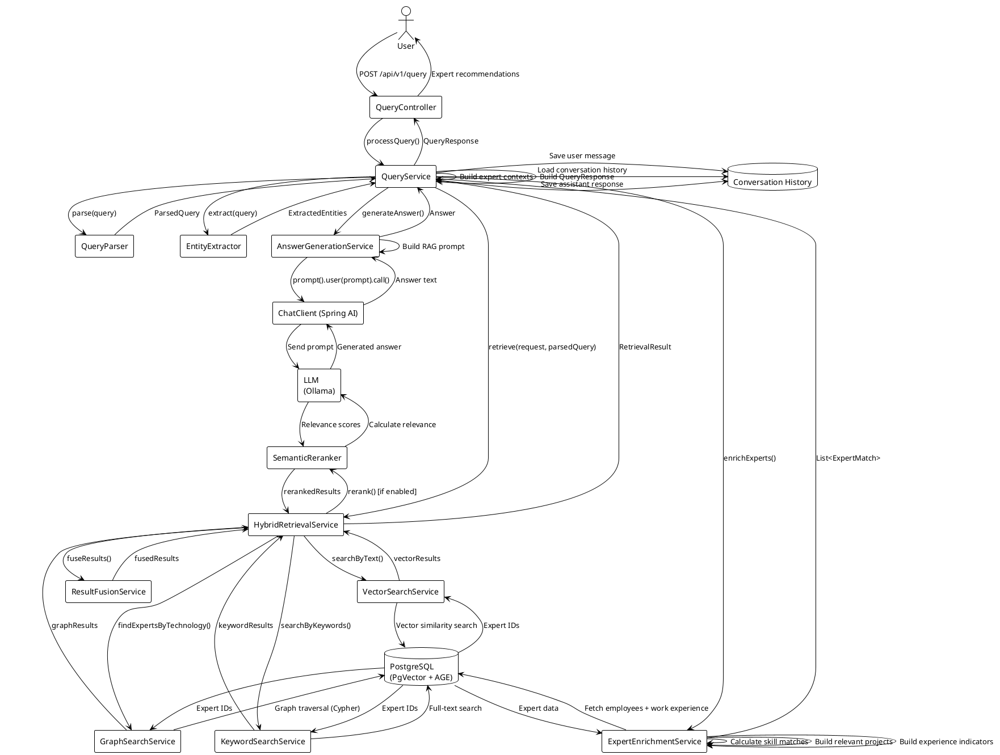
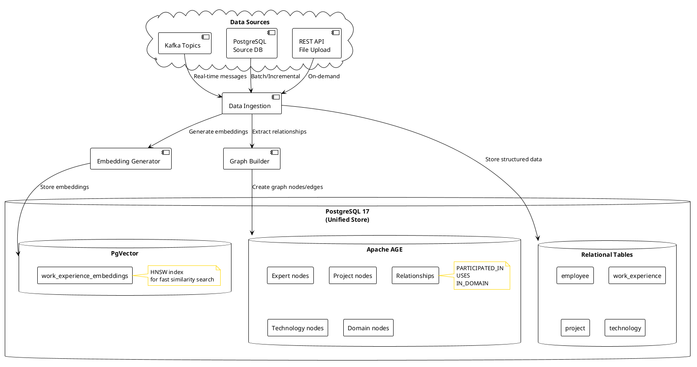

# ExpertMatch: Expert Search Flow Documentation

This document describes the complete expert search flow in the ExpertMatch solution, from user query to expert
recommendations, with detailed PlantUML diagrams.

---

## Table of Contents

1. [Overview](#overview)
2. [High-Level Flow](#high-level-flow)
3. [Query Processing Flow](#query-processing-flow)
4. [Hybrid Retrieval Flow](#hybrid-retrieval-flow)
5. [Deep Research Flow (SGR Pattern)](#deep-research-flow-sgr-pattern)
6. [Expert Enrichment Flow](#expert-enrichment-flow)
7. [Answer Generation Flow](#answer-generation-flow)
8. [Complete End-to-End Flow](#complete-end-to-end-flow)
9. [Data Sources and Storage](#data-sources-and-storage)

---

## Overview

ExpertMatch uses a **Hybrid GraphRAG architecture** to find and match experts based on project requirements. The system
combines:

- **Vector Similarity Search** (PgVector) - Semantic matching based on project experiences
- **Graph Traversal** (Apache AGE) - Relationship-based discovery
- **Keyword Search** - Traditional text matching
- **Semantic Reranking** - Precision optimization
- **LLM Orchestration** - Natural language answer generation
- **Smart Tool Selection** - Tool Search Tool pattern with 34-64% token savings through dynamic tool discovery

The flow processes natural language queries, retrieves relevant experts through multiple search strategies, enriches
results with detailed context, and generates actionable recommendations.

---

## High-Level Flow

```uml
@startuml
!theme plain
skinparam backgroundColor #FFFFFF
skinparam note {
  BackgroundColor #FFFFFF
  BorderColor #FFD700
}

actor User
participant "REST API\n(QueryController)" as API
participant "Query Service" as QueryService
participant "Hybrid Retrieval Service" as Retrieval
participant "Expert Enrichment Service" as Enrichment
participant "Answer Generation Service" as AnswerGen
database "PostgreSQL\n(PgVector + AGE)" as DB
participant "LLM\n(Ollama)" as LLM

User -> API: POST /api/v1/query
note right
  query, chatId, options
end note
API -> QueryService: processQuery()

QueryService -> QueryService: Save message & load history
QueryService -> QueryService: Parse query & extract entities
alt deepResearch enabled
  QueryService -> Retrieval: DeepResearchService\n(iterative retrieval)
  note right
    Gap analysis → Query refinement
    → Expanded retrieval → Synthesis
  end note
else standard retrieval
  QueryService -> Retrieval: HybridRetrievalService\n(standard retrieval)
end
Retrieval -> DB: Vector + Graph + Keyword search
DB --> Retrieval: Expert IDs + Scores
Retrieval --> QueryService: RetrievalResult

QueryService -> Enrichment: Enrich experts
Enrichment -> DB: Fetch employee data
note right
  + work experience
end note
DB --> Enrichment: Expert details
Enrichment --> QueryService: ExpertMatch list

QueryService -> AnswerGen: Generate answer
AnswerGen -> LLM: RAG prompt
note right
  with expert contexts
end note
LLM --> AnswerGen: Generated answer
AnswerGen --> QueryService: Answer text

QueryService -> QueryService: Save response & build result
QueryService --> API: QueryResponse
API --> User: Expert recommendations

@enduml
```

### High-Level Flow Description

This diagram provides a high-level overview of the ExpertMatch expert search flow, showing the main components and their
interactions from user query to expert recommendations.

#### **System Architecture Overview**

The ExpertMatch system consists of several key components:

- **REST API (QueryController)**: Entry point for HTTP requests, handles request validation and response formatting
- **Query Service**: Main orchestration service that coordinates the entire expert search process
- **Hybrid Retrieval Service**: Combines multiple search strategies (vector, graph, keyword) for comprehensive expert
  discovery
- **Expert Enrichment Service**: Enhances expert IDs with detailed information from the database
- **Answer Generation Service**: Uses LLM to generate natural language responses with expert recommendations
- **PostgreSQL Database**: Unified data store with PgVector (vector search) and Apache AGE (graph database)
- **LLM (Ollama)**: Large Language Model for semantic reranking and answer generation

#### **Flow Stages**

**1. Request Reception (User → API → QueryService)**

- User sends a natural language query via REST API
- Query includes: query text, optional chatId for conversation context, and query options
- QueryController validates and forwards the request to QueryService

**2. Conversation Management (QueryService)**

- Saves the user message to conversation history for context
- Loads previous conversation messages (up to 10) to maintain context across interactions

**3. Query Analysis (QueryService)**

- Parses the natural language query to extract:
- Required skills and technologies
    - Seniority levels
    - Query intent (expert search, team formation, RFP response)
- Extracts entities (technologies, domains, roles) for enhanced matching

**4. Hybrid Retrieval (QueryService → Retrieval → Database)**

- **If `deepResearch` is disabled**: `HybridRetrievalService` executes standard retrieval:
- **Vector Search**: Semantic similarity matching using PgVector embeddings
    - **Graph Traversal**: Relationship-based discovery using Apache AGE
    - **Keyword Search**: Traditional full-text matching

- **If `deepResearch` is enabled**: `DeepResearchService` performs multi-step iterative retrieval:
- Initial hybrid retrieval (vector + graph + keyword)
    - Gap analysis using LLM to identify missing information
    - Query refinement to generate additional search queries
    - Expanded retrieval with refined queries
    - Result synthesis with weighted scoring

---

## Deep Research Flow (SGR Pattern)



**How Deep Research Improves Results**:

- **Comprehensive Coverage**: Identifies and fills gaps in initial results, ensuring no relevant experts are missed. The
  LLM-powered gap analysis detects missing information, ambiguities, and coverage gaps that standard retrieval might
  overlook.
- **Better Query Understanding**: Handles complex, ambiguous, or multi-faceted queries by analyzing query intent and
  generating up to 3 refined queries that address different aspects or interpretations of the original query.
- **Enhanced Result Quality**: Synthesizes initial and expanded results using weighted scoring (60% initial, 40%
  expanded), providing a balanced combination that preserves relevance while expanding coverage. Experts found in both
  initial and expanded searches receive higher combined scores.
- **Adaptive Strategy**: Only performs expanded retrieval when significant gaps are identified, falling back to initial
  results if they are sufficient. This ensures optimal resource usage while maximizing result quality when needed.
- **Reduced False Negatives**: By performing multiple retrieval passes with refined queries, deep research significantly
  reduces the risk of missing relevant experts, especially for complex requirements or when initial queries don't
  capture all necessary aspects.

**5. Expert Enrichment (QueryService → Enrichment → Database)**

- **Expert Enrichment Service** fetches detailed information for each expert:
- Employee records (name, email, seniority, language proficiency)
    - Work experience history
    - Project participation details
- Calculates skill matches, identifies relevant projects, and builds experience indicators
- Returns enriched `ExpertMatch` objects with comprehensive expert profiles

**6. Answer Generation (QueryService → AnswerGen → LLM)**

- **Answer Generation Service** builds a RAG (Retrieval-Augmented Generation) prompt:
- Includes conversation history for context
    - Incorporates user query and extracted requirements
    - Adds detailed expert information from enrichment phase
    - Provides intent-specific instructions
- Sends prompt to LLM (Ollama) for natural language generation
- LLM generates a comprehensive answer with expert recommendations
- Returns formatted answer text to QueryService

**7. Response Finalization (QueryService → API → User)**

- QueryService saves the assistant response to conversation history
- Builds the final `QueryResponse` object containing:
- Generated answer with expert recommendations
    - List of matched experts with details
    - Sources and citations
    - Confidence scores and match summaries
- QueryController formats and returns the HTTP response
- User receives actionable expert recommendations

#### **Key Design Principles**

- **Hybrid Approach**: Combines multiple search strategies for comprehensive coverage
- **Context-Aware**: Maintains conversation history for better understanding
- **Enrichment**: Adds detailed context to raw expert IDs
- **Natural Language**: Uses LLM to generate human-readable responses
- **Unified Database**: Single PostgreSQL instance with multiple extensions (PgVector, Apache AGE)

#### **Data Flow Summary**

1. **Input**: Natural language query from user
2. **Processing**: Query analysis → Multi-strategy retrieval → Expert enrichment → Answer generation
3. **Storage**: Conversation history, expert data, work experience in PostgreSQL
4. **Output**: Natural language answer with ranked expert recommendations

This high-level flow demonstrates how ExpertMatch transforms a simple natural language query into comprehensive,
context-aware expert recommendations through intelligent orchestration of multiple AI and database technologies.

---

## Query Processing Flow

The query processing flow handles user input, conversation context, and orchestrates the entire search process.



---

## Hybrid Retrieval Flow

The hybrid retrieval combines three search strategies: vector similarity, graph traversal, and keyword search, then
fuses and reranks the results.



### Vector Search Details



### Graph Traversal Details

```uml
@startuml
!theme plain
skinparam backgroundColor #FFFFFF
skinparam note {
  BackgroundColor #FFFFFF
  BorderColor #FFD700
}


start

:Extract technologies from query;

if (Single technology?) then (yes)
  :Execute Cypher query;
  note right
    MATCH (e:Expert)-[:PARTICIPATED_IN]->(p:Project)-[:USES]->(t:Technology)
    WHERE t.name = $technology
    RETURN DISTINCT e.id
  end note
else (multiple)
  :Find experts with ALL technologies;
  note right
    AND search
  end note
endif

:Receive Expert IDs from Apache AGE;

:Extract domains from query;

if (Domains found?) then (yes)
  :Execute domain query;
  note right
    MATCH (e:Expert)-[:PARTICIPATED_IN]->(p:Project)-[:IN_DOMAIN]->(d:Domain)
    WHERE d.name = $domain
    RETURN DISTINCT e.id
  end note
  :Receive additional Expert IDs;
endif

:Combine and deduplicate results;

stop

@enduml
```

### Result Fusion

```uml
@startuml
!theme plain
skinparam backgroundColor #FFFFFF
skinparam note {
  BackgroundColor #FFFFFF
  BorderColor #FFD700
}


start

:Receive results from vector, graph, keyword searches;

:Apply [Reciprocal Rank Fusion (RRF)](RECIPROCAL_RANK_FUSION.md);
note right
  RRF Formula:
  score = Σ(weight_i / (rank_i + k))
  
  Where:
- rank_i = position in result set i
  - weight_i = weight for result set i
  - k = constant (typically 60)
end note

:Combine scores from all result sets;

:Sort by combined score (descending);

:Deduplicate expert IDs;
note right: Keep highest score

:Return fused ranked list;

stop

@enduml
```

---

## Expert Enrichment Flow

After retrieval, expert IDs are enriched with detailed information from the database.

```uml
@startuml
!theme plain
skinparam backgroundColor #FFFFFF
skinparam note {
  BackgroundColor #FFFFFF
  BorderColor #FFD700
}


start

:Receive RetrievalResult;
note right: expertIds, relevanceScores

partition "Data Fetching" {
    :Fetch employee data by IDs;
    :Fetch work experience for all expert IDs;
}

:Build employee map for quick lookup;

:For each expert ID;

partition "Expert Match Building" {
    :Get employee record;
    
    if (Employee found?) then (no)
        :Skip expert;
    else (yes)
        :Get work experience list;
        
        :Calculate skill match;
        note right: must-have, nice-to-have
        
        :Build matched skills list;
        note right: which skills match
        
        :Build relevant projects;
        note right: filtered and sorted by recency
        
        :Build experience indicators;
        note right: ETL, high-performance, architecture, etc.
        
        :Extract language proficiency from employee record;
        
        :Get relevance score from retrieval result;
        
        :Create ExpertMatch object;
        note right: id, name, email, seniority, skills, projects, experience, score
    endif
}

:Return List<ExpertMatch>;

stop

@enduml
```

### Skill Matching Details

```uml
@startuml
!theme plain
skinparam backgroundColor #FFFFFF
skinparam note {
  BackgroundColor #FFFFFF
  BorderColor #FFD700
}


start

:Extract required skills from ParsedQuery;
note right: skills + technologies

:Extract expert technologies from work experience;

:Match skills using case-insensitive contains matching;
note right
  Matching logic:

- skill.toLowerCase().contains(tech.toLowerCase())
  OR
  - tech.toLowerCase().contains(skill.toLowerCase())
end note

:Count must-have matches;

:Calculate match score;
note right: matched / total

:Build MatchedSkills object;
note right: mustHave: [...], niceToHave: [...]

stop

@enduml
```

### Relevant Projects Selection

```uml
@startuml
!theme plain
skinparam backgroundColor #FFFFFF
skinparam note {
  BackgroundColor #FFFFFF
  BorderColor #FFD700
}


start

:Get all work experiences for expert;

:Filter by relevance;
note right: technologies match query

:Sort by recency;
note right: most recent first

:Limit to top 5 projects;

:Calculate project duration;
note right: start date to end date

:Build RelevantProject objects;
note right: name, technologies, role, duration

stop

@enduml
```

---

## Answer Generation Flow

The answer generation service uses LLM orchestration with RAG pattern to generate natural language responses.



### RAG Prompt Structure



---

## Complete End-to-End Flow

This diagram shows the complete flow from user query to final response, including all components and data flows.



### Complete End-to-End Flow Description

This diagram illustrates the complete expert search flow from initial user query to final expert recommendations,
showing all components, services, and data flows involved in the process.

#### **Phase 1: Request Reception and Initial Processing**

1. **User Request**: The user sends a POST request to `/api/v1/query` endpoint with:
- Natural language query describing expert requirements
    - Optional `chatId` for conversation context
    - Query options (maxResults, minConfidence, rerank flag)

2. **QueryController**: Receives the HTTP request, validates it, and delegates to `QueryService`

3. **Conversation Management**:
- Saves the user message to conversation history
    - Loads previous conversation context (last 10 messages) for continuity

#### **Phase 2: Query Analysis and Entity Extraction**

4. **QueryParser**: Analyzes the natural language query and extracts:
- **Skills**: Technical skills mentioned (e.g., "Java", "Spring Boot")
    - **Technologies**: Technologies required (e.g., "AWS", "MongoDB")
    - **Seniority Levels**: Experience levels (e.g., "A3", "A4")
    - **Intent**: Query purpose (expert_search, team_formation, rfp_response)

5. **EntityExtractor**: Performs additional entity extraction:
- **Domains**: Industry or business domains
    - **Roles**: Job roles or responsibilities
    - **Technologies**: Additional technology mentions
    - Returns structured `ExtractedEntities` object

#### **Phase 3: Hybrid GraphRAG Retrieval**

6. **HybridRetrievalService**: Orchestrates three parallel search strategies:

   **a. Vector Search (VectorSearchService)**:
- Converts query to embedding vector
    - Performs semantic similarity search using PgVector
    - Finds experts with similar project experiences
    - Returns ranked list of expert IDs

   **b. Graph Traversal (GraphSearchService)**:
- Executes Cypher queries on Apache AGE graph
    - Traverses relationships: Expert → Project → Technology
    - Finds experts connected to required technologies
    - Supports AND/OR logic for multiple technologies

   **c. Keyword Search (KeywordSearchService)**:
- Performs traditional full-text search
    - Matches exact technology names and skills
    - Fast lookup for specific terms

7. **Result Fusion (ResultFusionService)**:
- Combines results from all three search strategies
   - Applies [Reciprocal Rank Fusion (RRF) algorithm](RECIPROCAL_RANK_FUSION.md)
    - Weights results based on query characteristics
    - Deduplicates expert IDs while preserving scores

8. **Semantic Reranking (SemanticReranker)** [Optional]:
- If reranking is enabled, uses LLM to re-score results
    - Calculates semantic relevance scores
    - Improves precision of top results
    - Returns final ranked list with relevance scores

#### **Phase 4: Expert Enrichment**

9. **ExpertEnrichmentService**: Enriches expert IDs with detailed information:

   **a. Data Fetching**:
- Fetches employee records from database
    - Retrieves work experience for all expert IDs
    - Builds employee map for efficient lookup

   **b. For Each Expert**:
- **Skill Matching**: Calculates match score for must-have and nice-to-have skills
    - **Matched Skills**: Identifies which specific skills match
    - **Relevant Projects**: Filters and sorts projects by relevance and recency
    - **Experience Indicators**: Extracts indicators (ETL, architecture, monitoring, etc.)
    - **Language Proficiency**: Extracts language skills
    - **Relevance Score**: Gets score from retrieval phase
    - **ExpertMatch Object**: Creates comprehensive expert match with all details

#### **Phase 5: Answer Generation**

10. **Context Building**:
- Builds expert contexts from enriched expert data
    - Prepares structured data for LLM prompt

11. **AnswerGenerationService**: Generates natural language response:
- **RAG Prompt Construction**: Builds comprehensive prompt with:
- System context and role definition
        - Conversation history (if available)
        - User query
        - Expert information with all details
        - Intent-specific instructions
    - **LLM Orchestration**: Uses Spring AI ChatClient to:
- Send prompt to LLM (Ollama or other provider)
        - Receive generated answer
        - Format response text

#### **Phase 6: Response Finalization**

12. **Response Building**:
- Saves assistant response to conversation history
    - Updates chat metadata (last activity, message count)
    - Builds `QueryResponse` object with:
- Generated answer text
        - List of expert matches
        - Sources and citations
        - Extracted entities
        - Confidence score
        - Match summary

13. **Response Delivery**:
- QueryController formats and returns HTTP response
    - User receives expert recommendations with:
- Natural language explanation
        - Ranked list of experts
        - Detailed expert profiles
        - Match scores and justifications

#### **Key Data Flows**

- **Database Interactions**:
- Vector similarity searches via PgVector
    - Graph traversals via Apache AGE
    - Relational queries for employee and work experience data
    - Conversation history storage and retrieval

- **LLM Interactions**:
- Semantic reranking (optional)
    - Answer generation with RAG pattern

- **Internal Service Communication**:
- Synchronous service calls within QueryService
    - Data transformation between layers
    - Result aggregation and enrichment

#### **Performance Characteristics**

- **Total Processing Time**: ~2-6 seconds per query
    - Query Parsing: < 100ms
    - Hybrid Retrieval: 200-500ms
    - Expert Enrichment: 100-300ms
    - Answer Generation: 1-5 seconds (LLM processing)

- **Scalability**:
- Parallel search execution (vector, graph, keyword)
    - Efficient database queries with indexes
    - Caching of conversation history
    - Optimized for enterprise-scale data volumes

This end-to-end flow demonstrates how ExpertMatch combines multiple AI and database technologies to deliver precise,
context-aware expert recommendations in a matter of seconds.

---

## Data Sources and Storage

This diagram shows how data flows into and is stored in the system.



---

## Key Components Summary

### Query Processing Components

| Component           | Responsibility                                                         |
|---------------------|------------------------------------------------------------------------|
| **QueryController** | REST API endpoint, request validation, response formatting             |
| **QueryService**    | Main orchestration, conversation management, response building         |
| **QueryParser**     | Natural language parsing, extract skills/technologies/seniority/intent |
| **EntityExtractor** | Extract entities (technologies, skills, domains, roles) from query     |

### Retrieval Components

| Component                  | Responsibility                                           |
|----------------------------|----------------------------------------------------------|
| **HybridRetrievalService** | Orchestrates all retrieval strategies, fusion, reranking |
| **VectorSearchService**    | Semantic similarity search using PgVector embeddings     |
| **GraphSearchService**     | Graph traversal using Apache AGE Cypher queries          |
| **KeywordSearchService**   | Traditional full-text keyword matching                   |
| **ResultFusionService**    | Combines results using Reciprocal Rank Fusion (RRF)      |
| **SemanticReranker**       | Re-ranks results using semantic relevance scoring        |

### Enrichment Components

| Component                    | Responsibility                                             |
|------------------------------|------------------------------------------------------------|
| **ExpertEnrichmentService**  | Enriches expert IDs with detailed data, calculates matches |
| **EmployeeRepository**       | Fetches employee data from database                        |
| **WorkExperienceRepository** | Fetches work experience data from database                 |

### Answer Generation Components

| Component                   | Responsibility                             |
|-----------------------------|--------------------------------------------|
| **AnswerGenerationService** | Builds RAG prompts, orchestrates LLM calls |
| **ChatClient**              | Spring AI chat client for LLM interaction  |
| **LLM (Ollama)**            | Large Language Model for answer generation |

---

## Performance Characteristics

### Search Strategies

- **Vector Search**: Fast semantic matching, good for conceptual queries
- **Graph Traversal**: Relationship-based discovery, excellent for technology combinations
- **Keyword Search**: Fast exact matching, good for specific technology names
- **Fusion**: Combines strengths of all three approaches
- **Reranking**: Improves precision but adds latency

### Typical Query Processing Time

- **Query Parsing**: < 100ms
- **Hybrid Retrieval**: 200-500ms (depending on data size)
- **Expert Enrichment**: 100-300ms (database queries)
- **Answer Generation**: 1-5 seconds (LLM processing)
- **Total**: ~2-6 seconds per query

---

## Future Enhancements

The current MVP flow supports the core functionality. Future enhancements may include:

- **Real-time Data Ingestion**: Kafka consumer for live updates
- **Advanced Quality Evaluation**: LLM-as-a-Judge for recommendation refinement
- **Memory Copilot**: Self-tuning agent with long-term memory
- **External System Integration**: Jira, databases, file uploads
- **Cloud Deployment**: Scalable cloud infrastructure

---

## References

- [ExpertMatch PRD](./ExpertMatch.md) - Complete product requirements document
- [SGR Usage](./ExpertMatch-SGR-Usage.md) - Schema-Guided Reasoning patterns and deep research implementation
- [SGR Benefits](./ExpertMatch-SGR-Benefits.md) - Benefits and value proposition of SGR patterns
- [Smart Tool Selection](./SMART_TOOL_SELECTION.md) - Tool Search Tool pattern, 34-64% token savings, dynamic tool
  discovery
- [Conversation History Management](./CONVERSATION_HISTORY_MANAGEMENT.md) - Token counting and summarization
- [Apache AGE Benefits](./ExpertMatch-Apache-AGE-Benefits.md) - Benefits of graph database capabilities in ExpertMatch

---

*Document generated: 2025-01-27*  
*Last updated: 2025-12-28 (Added Smart Tool Selection and Conversation History Management references)*

