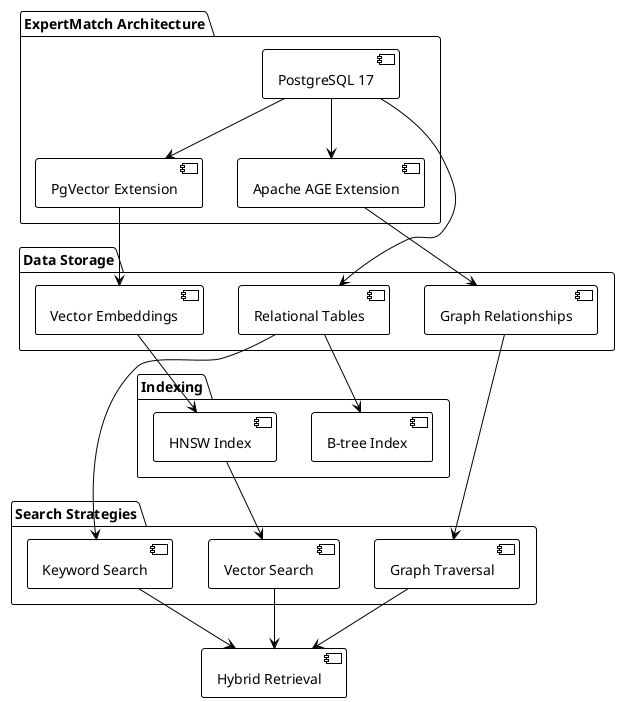
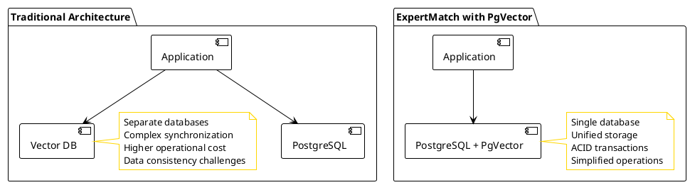
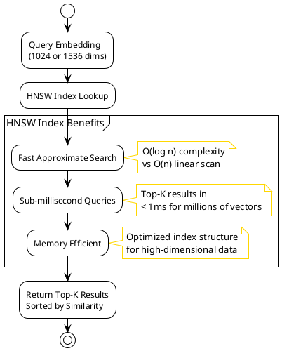
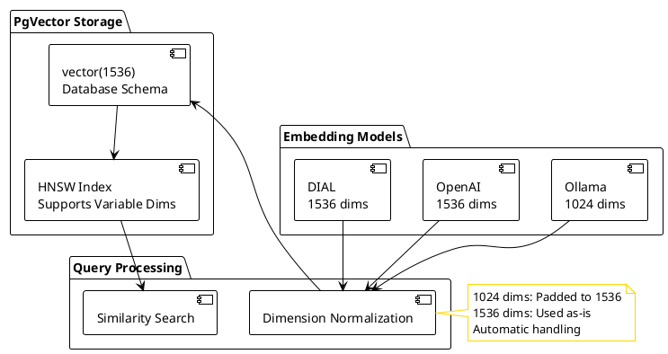
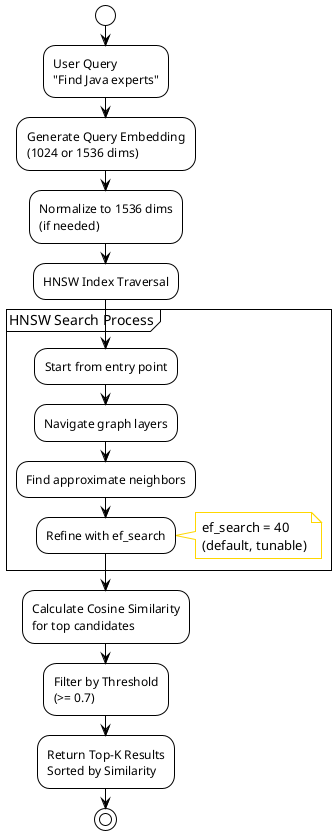
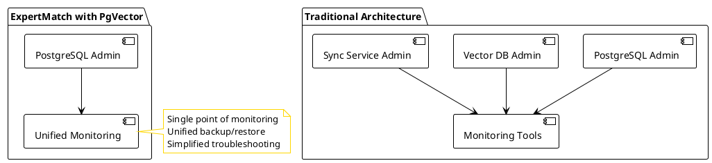
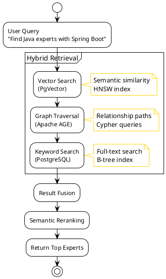
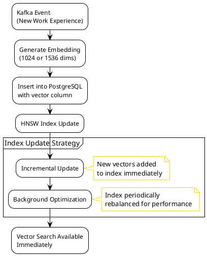

# PgVector Benefits in ExpertMatch

This document outlines the specific benefits that **PgVector** provides to the ExpertMatch solution, including
technical, performance, and architectural advantages.

---

## Overview

**PgVector** is a PostgreSQL extension that adds vector similarity search capabilities to PostgreSQL, enabling
ExpertMatch to perform semantic similarity search using high-dimensional vector embeddings. PgVector combines the power
of vector databases with the reliability and ecosystem of PostgreSQL.

### PgVector in ExpertMatch Architecture



**Key Integration Points**:

- **Database**: PostgreSQL 17 with PgVector extension
- **Vector Storage**: Embeddings stored as `vector(1536)` data type
- **Index Type**: HNSW (Hierarchical Navigable Small World) for fast similarity search
- **Service Layer**: `PgVectorSearchService` and `VectorSearchService` for vector operations
- **Embedding Models**: Supports both 1024 (Ollama) and 1536 (OpenAI/DIAL) dimensions

---

## 1. Technical Benefits

### 1.1 Unified Database Architecture

**Problem Solved**: Traditional architectures require separate vector databases (Pinecone, Weaviate, Qdrant) alongside
relational databases, increasing complexity and operational overhead.

**PgVector Solution**: Vector capabilities are embedded in PostgreSQL, providing a unified data store.

**Architecture Comparison**:



**Benefits**:

- **Single Database**: No need for separate vector database infrastructure
- **Unified Transactions**: Vector and relational operations in same transaction
- **Simplified Operations**: One database to manage, backup, and monitor
- **Cost Reduction**: No additional database licensing or infrastructure costs
- **Data Consistency**: ACID transactions across relational and vector data

### 1.2 High-Performance Vector Search

**Problem Solved**: Semantic similarity search requires efficient handling of high-dimensional vectors (1024-1536
dimensions) with sub-millisecond query performance.

**PgVector Solution**: HNSW indexing provides fast approximate nearest neighbor search optimized for high-dimensional
vectors.

**Performance Characteristics**:



**Performance Metrics**:

- **Query Speed**: Sub-millisecond for top-K queries (K=10-100)
- **Index Type**: HNSW (Hierarchical Navigable Small World)
- **Scalability**: Handles millions of vectors efficiently
- **Dimensions**: Supports up to 16,000 dimensions (using 1536 in ExpertMatch)
- **Similarity Operators**: Built-in cosine distance (`<=>`) and L2 distance (`<->`)

### 1.3 Multi-Dimensional Embedding Support

**Problem Solved**: Different embedding models use different dimensions (1024 for Ollama, 1536 for OpenAI), requiring
flexible dimension handling.

**PgVector Solution**: Supports variable dimensions within the same database schema with automatic dimension
normalization.

**Dimension Compatibility**:



**Benefits**:

- **Flexible Dimensions**: Supports both 1024 and 1536 dimensions in same index
- **Automatic Normalization**: PgVector handles dimension differences in similarity search
- **Model Agnostic**: Works with any embedding model (Ollama, OpenAI, DIAL)
- **No Migration Needed**: Switch embedding models without schema changes
- **Optimal Storage**: `vector(1536)` accommodates both dimensions efficiently

---

## 2. Performance Benefits

### 2.1 HNSW Index Performance

**HNSW (Hierarchical Navigable Small World)** is a state-of-the-art approximate nearest neighbor search algorithm
optimized for high-dimensional vectors.

**Performance Comparison**:

| Approach    | Query Time (1M vectors) | Index Size | Accuracy |
|-------------|-------------------------|------------|----------|
| Linear Scan | O(n) - seconds          | 0          | 100%     |
| HNSW Index  | O(log n) - <1ms         | ~18GB      | 95-99%   |
| IVFFlat     | O(√n) - 10-50ms         | ~12GB      | 90-95%   |

**HNSW Configuration in ExpertMatch**:

```sql
CREATE INDEX documents_embedding_idx 
ON documents 
USING hnsw (embedding vector_cosine_ops)
WITH (m = 16, ef_construction = 64);
```

**Parameters**:

- **m = 16**: Number of connections per node (balance between speed and accuracy)
- **ef_construction = 64**: Search width during index construction (higher = better quality, slower build)
- **vector_cosine_ops**: Cosine similarity operator class

### 2.2 Query Performance

**Vector Search Flow**:



**Performance Characteristics**:

- **Query Latency**: < 1ms for top-10 results from 1M vectors
- **Throughput**: 1000+ queries/second per core
- **Memory Usage**: Index loaded in memory for optimal performance
- **Scalability**: Linear scaling with additional PostgreSQL instances

### 2.3 Storage Efficiency

**Vector Storage Optimization**:

| Dimension       | Storage (1M vectors) | Index Size | Total |
|-----------------|----------------------|------------|-------|
| 1024 (padded)   | ~8GB                 | ~12GB      | ~20GB |
| 1536 (native)   | ~12GB                | ~18GB      | ~30GB |
| 3072 (not used) | ~24GB                | ~36GB      | ~60GB |

**Benefits**:

- **Efficient Compression**: PgVector uses optimized storage format
- **Index Optimization**: HNSW index is memory-mapped for fast access
- **Dimension Flexibility**: Single schema supports multiple embedding dimensions
- **Cost Effective**: 50% storage savings vs 3072 dimensions with 95-98% quality

---

## 3. Business Benefits

### 3.1 Cost Reduction

**Infrastructure Cost Savings**:

| Component                 | Traditional (Separate DB) | ExpertMatch (PgVector) | Savings             |
|---------------------------|---------------------------|------------------------|---------------------|
| Vector Database           | $500-2000/month           | $0 (included)          | $500-2000/month     |
| Data Sync Infrastructure  | $200-500/month            | $0 (unified)           | $200-500/month      |
| Operational Overhead      | High                      | Low                    | Significant         |
| **Total Monthly Savings** | -                         | -                      | **$700-2500/month** |

**Benefits**:

- **No Additional Licensing**: PgVector is open-source, no per-query costs
- **Reduced Infrastructure**: Single database instead of multiple systems
- **Lower Operational Costs**: Simplified monitoring, backup, and maintenance
- **Predictable Costs**: No variable pricing based on query volume

### 3.2 Operational Simplicity

**Unified Operations**:



**Operational Benefits**:

- **Single Backup Strategy**: One database to backup and restore
- **Unified Monitoring**: Single monitoring dashboard for all data
- **Simplified Troubleshooting**: One system to debug instead of multiple
- **Easier Scaling**: Scale PostgreSQL instead of managing multiple systems
- **Consistent Tooling**: Use existing PostgreSQL tools and expertise

### 3.3 Developer Productivity

**Development Benefits**:

- **Familiar SQL**: Use standard SQL with vector operators
- **No New Tools**: Work within existing PostgreSQL ecosystem
- **Unified Queries**: Join vector search with relational data in single query
- **ACID Guarantees**: Full transaction support for vector operations
- **Rich Ecosystem**: Leverage PostgreSQL extensions, tools, and community

---

## 4. Architectural Benefits

### 4.1 Hybrid Search Architecture

**PgVector enables hybrid search combining vector, graph, and keyword search**:



**Benefits**:

- **Comprehensive Coverage**: Vector search finds semantically similar experts
- **Complementary Strategies**: Each search method finds different experts
- **Result Fusion**: Combines results from all strategies for best coverage
- **Unified Storage**: All data in same database for efficient joins

### 4.2 Real-Time Updates

**Vector Index Maintenance**:



**Benefits**:

- **Real-Time Search**: New embeddings immediately searchable
- **Incremental Updates**: HNSW index supports incremental additions
- **No Downtime**: Index updates don't require service interruption
- **Consistent Performance**: Index optimization maintains query speed

### 4.3 Integration with PostgreSQL Ecosystem

**PgVector leverages PostgreSQL's rich ecosystem**:

- **Citus Extension**: Horizontal scaling and columnar storage
- **JSONB Support**: Store metadata alongside vectors
- **Full-Text Search**: Combine vector search with PostgreSQL full-text search
- **Foreign Data Wrappers**: Integrate with external data sources
- **Replication**: Use PostgreSQL streaming replication for high availability
- **Backup Tools**: Use pg_dump, pg_basebackup for vector data

---

## 5. Use Cases in ExpertMatch

### 5.1 Semantic Expert Discovery

**Use Case**: Find experts based on semantic similarity of their project experiences and skills.

**Example Query**:

```sql
SELECT 
    we.employee_id,
    we.project_name,
    1 - (we.embedding <=> :queryVector::vector) as similarity
FROM expertmatch.work_experience we
WHERE we.embedding IS NOT NULL
AND 1 - (we.embedding <=> :queryVector::vector) >= 0.7
ORDER BY we.embedding <=> :queryVector::vector
LIMIT 10;
```

**Benefits**:

- **Semantic Understanding**: Finds experts even if exact keywords don't match
- **Context Awareness**: Understands project context and technology relationships
- **Fast Results**: Sub-millisecond query performance
- **Scalable**: Handles millions of work experience records

### 5.2 Multi-Model Embedding Support

**Use Case**: Support both local (Ollama) and cloud (OpenAI/DIAL) embedding models.

**Implementation**:

- **Database Schema**: `vector(1536)` accommodates both 1024 and 1536 dimensions
- **Dimension Normalization**: Automatically pads 1024-dim embeddings to 1536
- **Model Tracking**: `embedding_model` and `embedding_dimensions` columns track source
- **Query Compatibility**: PgVector handles dimension differences automatically

**Benefits**:

- **Flexibility**: Switch between embedding models without migration
- **Cost Optimization**: Use local models for development, cloud for production
- **Quality Options**: Choose embedding quality based on use case
- **No Lock-in**: Not tied to specific embedding provider

### 5.3 Hybrid Search Integration

**Use Case**: Combine vector search with graph traversal and keyword search for comprehensive expert discovery.

**Flow**:

1. **Vector Search**: Find experts with semantically similar project experiences
2. **Graph Traversal**: Find experts connected to matched experts via projects
3. **Keyword Search**: Find experts with exact technology matches
4. **Result Fusion**: Combine and deduplicate results from all strategies
5. **Semantic Reranking**: Re-rank final results by semantic relevance

**Benefits**:

- **Comprehensive Coverage**: Finds experts through multiple discovery paths
- **Complementary Results**: Each strategy finds different experts
- **Higher Recall**: More experts discovered than single-strategy approach
- **Better Precision**: Semantic reranking improves result quality

---

## 6. Comparison with Alternatives

### 6.1 PgVector vs. Dedicated Vector Databases

| Feature                    | PgVector             | Pinecone            | Weaviate          | Qdrant            |
|----------------------------|----------------------|---------------------|-------------------|-------------------|
| **Infrastructure**         | PostgreSQL extension | Separate service    | Separate service  | Separate service  |
| **ACID Transactions**      |  Full support       |  Limited           |  Limited         |  Limited         |
| **SQL Integration**        |  Native             |  No                |  No              |  No              |
| **Cost**                   |  Free (open-source) |  Per-query pricing |  Hosting costs   |  Hosting costs   |
| **Operational Complexity** |  Low (unified)      |  High (separate)   |  High (separate) |  High (separate) |
| **Data Consistency**       |  ACID guarantees    |  Eventual         |  Eventual       |  Eventual       |
| **Query Performance**      |  <1ms (HNSW)        |  <1ms              |  <1ms            |  <1ms            |
| **Scalability**            |  PostgreSQL scaling |  Managed scaling   |  Managed scaling |  Managed scaling |

**ExpertMatch Choice**: PgVector for unified architecture, ACID guarantees, and cost efficiency.

### 6.2 HNSW vs. Other Index Types

| Index Type      | Query Speed         | Index Size         | Build Time | Accuracy |
|-----------------|---------------------|--------------------|------------|----------|
| **HNSW**        |  Fastest (<1ms)    | Medium (~18GB)     | Medium     | 95-99%   |
| **IVFFlat**     | Medium (10-50ms)    |  Smallest (~12GB) |  Fastest  | 90-95%   |
| **Linear Scan** |  Slowest (seconds) |  None             |  Instant  |  100%   |

**ExpertMatch Choice**: HNSW for optimal balance of speed and accuracy.

---

## 7. Best Practices in ExpertMatch

### 7.1 Index Configuration

**Recommended HNSW Parameters**:

```sql
CREATE INDEX documents_embedding_idx 
ON documents 
USING hnsw (embedding vector_cosine_ops)
WITH (
    m = 16,              -- Connections per node (16-64 recommended)
    ef_construction = 64 -- Build quality (64-200 recommended)
);
```

**Tuning Guidelines**:

- **m = 16**: Good balance for most use cases (higher = better quality, slower queries)
- **ef_construction = 64**: Sufficient for 95-99% accuracy (higher = better quality, slower build)
- **vector_cosine_ops**: Use for cosine similarity (recommended for embeddings)

### 7.2 Query Optimization

**Optimal Query Patterns**:

1. **Use Threshold Filtering**: Filter by similarity threshold before sorting
2. **Limit Results Early**: Use `LIMIT` to reduce result set size
3. **Combine with Relational Filters**: Add WHERE clauses for metadata filtering
4. **Batch Queries**: Process multiple queries in single transaction when possible

**Example Optimized Query**:

```sql
SELECT 
    we.employee_id,
    we.project_name,
    1 - (we.embedding <=> :queryVector::vector) as similarity
FROM expertmatch.work_experience we
WHERE we.embedding IS NOT NULL
AND we.content_type = 'expert'  -- Relational filter
AND 1 - (we.embedding <=> :queryVector::vector) >= 0.7  -- Threshold filter
ORDER BY we.embedding <=> :queryVector::vector  -- Use index
LIMIT 10;  -- Early limit
```

### 7.3 Dimension Management

**Best Practices**:

- **Use 1536 for Production**: Optimal balance of quality and performance
- **Track Embedding Source**: Store `embedding_model` and `embedding_dimensions`
- **Normalize on Insert**: Normalize dimensions when storing embeddings
- **Query with Same Dimension**: Use same dimension for query as stored embeddings when possible

---

## 8. Future Enhancements

### 8.1 Potential Improvements

- **Parallel Index Building**: Build HNSW index in parallel for faster initial load
- **Index Partitioning**: Partition HNSW index by content type for better performance
- **Query Caching**: Cache frequent query embeddings for faster response
- **Adaptive ef_search**: Dynamically adjust search width based on query complexity

### 8.2 Scalability Considerations

- **Horizontal Scaling**: Use Citus for distributed vector search across shards
- **Read Replicas**: Replicate vector data to read replicas for query scaling
- **Index Maintenance**: Periodic index rebalancing for optimal performance
- **Monitoring**: Track query performance and index health metrics

---

## Summary

### Key Benefits of PgVector in ExpertMatch

 **Unified Architecture**: Single database for relational, vector, and graph data
 **High Performance**: Sub-millisecond queries with HNSW indexing
 **Cost Effective**: No additional infrastructure or licensing costs
 **Operational Simplicity**: One system to manage, monitor, and backup
 **ACID Guarantees**: Full transaction support for vector operations
 **Multi-Model Support**: Flexible dimension handling for different embedding models
 **Rich Ecosystem**: Leverages PostgreSQL's extensive tooling and community
 **Hybrid Search**: Enables combination with graph and keyword search

### Technical Advantages

- **HNSW Index**: State-of-the-art approximate nearest neighbor search
- **Dimension Flexibility**: Supports 1024 and 1536 dimensions in same index
- **Query Performance**: <1ms for top-K queries from millions of vectors
- **Storage Efficiency**: Optimized storage format with 50% savings vs 3072 dims
- **Real-Time Updates**: Incremental index updates without downtime

### Business Value

- **Cost Savings**: $700-2500/month vs. separate vector database
- **Reduced Complexity**: Single system instead of multiple databases
- **Faster Development**: Familiar SQL and PostgreSQL ecosystem
- **Better Reliability**: ACID transactions and PostgreSQL's proven stability

---

**Last Updated**: 2025-12-21

