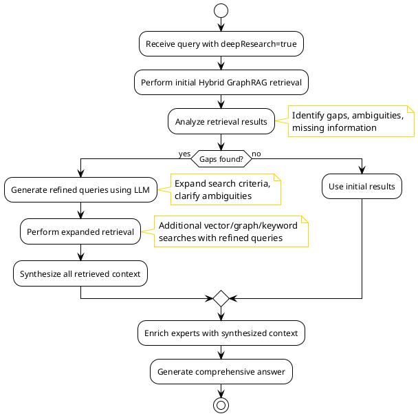

# SGR Usage in ExpertMatch Solution

This document explains how **SGR (Schema-Guided Reasoning)** patterns are used and planned to be used in the ExpertMatch
solution.

---

## Overview

In ExpertMatch, **SGR** refers to two related but distinct concepts:

1. **SGR Deep Research Pattern** (also called "Semantic Graph Retrieval")
2. **Schema-Guided Reasoning (SGR) Patterns** (Cascade, Routing, Cycle)

---

## Current Implementation Status

### SGR Deep Research Pattern: **Implemented** 

The **SGR Deep Research Pattern** has been implemented and is available in the MVP. It can be enabled via the
`deepResearch` option in the query request.

**Implementation Details:**

- `DeepResearchService` - Main service orchestrating the deep research flow
- `GapAnalysis` - Data model for gap analysis results
- Integration in `QueryService` - Checks `deepResearch` flag and routes to deep research flow
- LLM-based gap analysis and query refinement
- Result synthesis with weighted scoring
- Configuration properties in `application.yml`

**Evidence:**

- `deepResearch` option exists in `QueryOptions` API (defaults to `false`)
- `DeepResearchService` implementation found in `com.berdachuk.expertmatch.retrieval`
- Integrated into `QueryService.processQuery()` method
- Configuration: API-only via `QueryOptions.deepResearch` parameter (defaults to `false`)

### Schema-Guided Reasoning Patterns: **Implemented** 

The **Schema-Guided Reasoning (SGR) Patterns** (Cascade, Routing, Cycle) have been **fully implemented** and are
available in the MVP. They can be enabled via the respective options in the query request.

---

## 1. SGR Deep Research Pattern

### Definition

**SGR Deep Research Pattern** (also called "Semantic Graph Retrieval") is a multi-step iterative retrieval pattern
designed for complex queries that require multiple passes to gather comprehensive information.

### Implementation Location

**Where it is used:**

- **Service**: `DeepResearchService` in `com.berdachuk.expertmatch.retrieval`
- **Entry Point**: `QueryOptions.deepResearch` flag in API request
- **Integration Point**: In `QueryService.processQuery()`, after query parsing, before expert enrichment

### How It Works

The SGR Deep Research Pattern follows this multi-step process:

```
1. Initial Query Processing
   ↓
2. Initial Retrieval (Hybrid GraphRAG)
   ↓
3. Gap Analysis (LLM analyzes results)
   ↓
4. Refined Query Generation (LLM generates additional queries)
   ↓
5. Expanded Retrieval (Additional searches with refined queries)
   ↓
6. Context Synthesis (Combine all retrieved information)
   ↓
7. Final Answer Generation
```

### Implementation Flow



### Use Cases

- **Complex Multi-Faceted Queries**: Queries requiring information from multiple domains
- **Ambiguous Requirements**: Queries where initial results are insufficient
- **Deep Research Needs**: Queries requiring comprehensive background research
- **Team Formation**: Complex team composition requiring multiple expert searches

### Configuration

The deep research pattern can be configured in `application.yml`:

```yaml
expertmatch:
  # Note: deepResearch is now API-only (no application.yml configuration)
  # deep-research:
    enabled: true
    max-iterations: 2  # Maximum number of expansion iterations
    gap-analysis-threshold: 0.3  # Minimum gap score to trigger expansion
    synthesis-weight-initial: 0.6  # Weight for initial results in synthesis
    synthesis-weight-expanded: 0.4  # Weight for expanded results
```

### API Usage

```json
{
  "query": "Find experts for a microservices architecture project with Kubernetes, Spring Boot, and event-driven patterns",
  "options": {
    "maxResults": 20,
    "minConfidence": 0.7,
    "rerank": true,
    "deepResearch": true  // Enable SGR Deep Research Pattern
  }
}
```

---

## 2. Schema-Guided Reasoning (SGR) Patterns

### Definition

**Schema-Guided Reasoning (SGR) Patterns** are structured reasoning patterns that use JSON Schema to constrain and guide
LLM generation, ensuring predictable, structured outputs.

### Pattern Types

ExpertMatch plans to implement three SGR patterns:

#### 2.1 Cascade Pattern

**Purpose**: Forces LLM to follow predefined reasoning steps in sequence.

**Use Case**: Expert evaluation and recommendation generation

**Implementation Location**:

- **Service**: `ExpertEvaluationService` in `com.berdachuk.expertmatch.llm.sgr`
- **When**: During answer generation phase (when `useCascadePattern` is enabled)
- **Schema**: `ExpertEvaluation` record with nested structures

**Flow**:

```
Step 1: Expert Summary
  ↓
Step 2: Skill Match Analysis
  ↓
Step 3: Experience Assessment
  ↓
Step 4: Recommendation Generation
```

**Example Schema**:

```java
public record ExpertEvaluation(
    String expertSummary,
    SkillMatchAnalysis skillMatchAnalysis,
    ExperienceAssessment experienceAssessment,
    Recommendation recommendation
) {}
```

#### 2.2 Routing Pattern

**Purpose**: Forces LLM to explicitly choose one reasoning path out of many.

**Use Case**: Query classification and intent routing

**Implementation Location**:

- **Service**: `QueryClassificationService` in `com.berdachuk.expertmatch.query.sgr`
- **When**: During query parsing phase (when `useRoutingPattern` is enabled)
- **Schema**: Enum-based routing decisions

**Flow**:

```
Query Input
  ↓
LLM Classifies Query Type
  ↓
Route to Appropriate Handler:

- Expert Search
  - Team Formation
  - RFP Response
  - Domain Inquiry
```

#### 2.3 Cycle Pattern

**Purpose**: Forces LLM to repeat reasoning steps (generate multiple items).

**Use Case**: Generating multiple expert recommendations

**Implementation Location**:

- **Service**: `CyclePatternService` in `com.berdachuk.expertmatch.llm.sgr`
- **When**: During answer generation for multiple experts (when `useCyclePattern` is enabled)
- **Schema**: Array of structured expert evaluations

**Flow**:

```
For each expert:
  1. Evaluate expert
  2. Generate recommendation
  3. Calculate confidence
Repeat for all experts
```

---

## Integration Points in Current Architecture

### Where SGR Will Be Integrated

#### 1. Query Processing Layer

**Current Flow** (without SGR):

```
QueryService.processQuery()
  → QueryParser.parse()
  → HybridRetrievalService.retrieve()
  → ExpertEnrichmentService.enrichExperts()
  → AnswerGenerationService.generateAnswer()
```

**Current Flow** (with SGR Deep Research):

```
QueryService.processQuery()
  → QueryParser.parse()
  → if (deepResearch) {
       DeepResearchService.performDeepResearch()
         → Initial retrieval
         → Gap analysis (LLM)
         → Query refinement (LLM)
         → Expanded retrieval
         → Result synthesis
     } else {
       HybridRetrievalService.retrieve()
     }
  → ExpertEnrichmentService.enrichExperts()
  → AnswerGenerationService.generateAnswer()
```

#### 2. Answer Generation Layer

**Current Flow** (without SGR Patterns):

```
AnswerGenerationService.generateAnswer()
  → Build RAG prompt
  → ChatClient.prompt().call()
  → Return text response
```

**Planned Flow** (with SGR Patterns):

```
AnswerGenerationService.generateAnswer()
  → if (useCascadePattern) {
       ExpertEvaluationService.evaluateWithCascade()
     } else {
       Build RAG prompt
     }
  → ChatClient.prompt().call()
  → Return structured or text response
```

---

## Benefits of SGR Patterns

### 1. Predictability

- Structured output ensures consistent response formats
- Reduces variability in LLM responses

### 2. Reliability

- Constrained decoding reduces hallucination and errors
- JSON Schema validation ensures data quality

### 3. Auditability

- Full reasoning chains are captured and reviewable
- Each step in Cascade pattern is traceable

### 4. Type Safety

- Java records and sealed interfaces provide compile-time safety
- JSON Schema validation at runtime

### 5. Maintainability

- Clear patterns make code easier to understand
- Structured responses integrate seamlessly with downstream systems

---

## Implementation Status

All SGR patterns have been implemented:

###  Implemented (MVP)

- **Cascade Pattern**: Expert evaluation with structured reasoning steps
- **Routing Pattern**: LLM-based query classification
- **Cycle Pattern**: Multiple expert evaluations with structured output
- **Deep Research Pattern**: Multi-step iterative retrieval

### Future Enhancements

- Combined patterns for complex use cases
- Advanced SGR pattern combinations
- Performance optimizations

---

## Current API Support

All SGR pattern options are now available in the OpenAPI spec and can be used via REST API endpoints.

### QueryOptions.deepResearch

**Location**: `QueryRequest.QueryOptions` (OpenAPI spec)

**Current Status**:

- API parameter defined in OpenAPI spec
- Default value: `false`
- Implementation: Fully implemented
- Available via REST API

**API Usage**:

```json
{
  "query": "Find experts for complex microservices project",
  "options": {
    "maxResults": 20,
    "minConfidence": 0.7,
    "deepResearch": true
  }
}
```

### QueryOptions.useCascadePattern

**Location**: `QueryRequest.QueryOptions` (OpenAPI spec)

**Current Status**:

- API parameter defined in OpenAPI spec (added 2025-12-21)
- Default value: `false`
- Implementation: Fully implemented
- Available via REST API
- **Requires exactly 1 expert result** to activate (falls back to RAG pattern otherwise)

**API Usage**:

```json
{
  "query": "Looking for senior Java developer with Spring Boot experience",
  "options": {
    "maxResults": 1,
    "minConfidence": 0.7,
    "useCascadePattern": true
  }
}
```

### QueryOptions.useRoutingPattern

**Location**: `QueryRequest.QueryOptions` (OpenAPI spec)

**Current Status**:

- API parameter defined in OpenAPI spec (added 2025-12-21)
- Default value: `false`
- Implementation: Fully implemented
- Available via REST API
- **Purpose**: Enables LLM-based query classification during parsing

**API Usage**:

```json
{
  "query": "I need to form a team for a cloud migration project",
  "options": {
    "maxResults": 15,
    "minConfidence": 0.7,
    "useRoutingPattern": true
  }
}
```

### QueryOptions.useCyclePattern

**Location**: `QueryRequest.QueryOptions` (OpenAPI spec)

**Current Status**:

- API parameter defined in OpenAPI spec (added 2025-12-21)
- Default value: `false`
- Implementation: Fully implemented
- Available via REST API
- **Requires multiple expert results (>1)** to activate (falls back to RAG pattern otherwise)

**API Usage**:

```json
{
  "query": "Find the best Java experts with Spring Boot and microservices experience",
  "options": {
    "maxResults": 10,
    "minConfidence": 0.7,
    "useCyclePattern": true
  }
}
```

---

## Configuration

SGR patterns can be configured in `application.yml`:

```yaml
expertmatch:
  sgr:
    enabled: true
    schema-validation: true
    cascade:
      enabled: true
      model: ${LLM_MODEL:}  # Optional model override
    routing:
      enabled: true
      model: ${LLM_MODEL:}  # Optional model override
    cycle:
      enabled: true
      model: ${LLM_MODEL:}  # Optional model override
```

## References

- **SGR Patterns Reference**: https://abdullin.com/schema-guided-reasoning/patterns
- **ExpertMatch PRD**: Section 9.2 (SGR Deep Research Pattern) and 9.3 (Schema-Guided Reasoning Patterns)

---

**Last updated**: 2025-12-21
- **Feature Request FR-9**: Multi-Step Deep Research (SGR Pattern)

---

## Summary

**SGR in ExpertMatch**:

1. **SGR Deep Research Pattern**:
- **Status**:  **Implemented** (MVP)
   - **Location**: `DeepResearchService` integrated into `QueryService` retrieval flow
    - **Purpose**: Multi-step iterative retrieval for complex queries
   - **Components**: Gap analysis, query refinement, expanded retrieval, result synthesis

2. **Schema-Guided Reasoning Patterns**:
- **Status**:  **Implemented** (MVP)
   - **Location**: Integrated into `AnswerGenerationService` and `QueryParser`
   - **Purpose**: Structured, predictable LLM reasoning with JSON Schema constraints
   - **Components**:
- **Cascade Pattern**: `ExpertEvaluationService` for structured expert evaluation
      - **Routing Pattern**: `QueryClassificationService` for LLM-based query classification
      - **Cycle Pattern**: `CyclePatternService` for multiple expert evaluations

All **SGR patterns** are now **active in the MVP** and can be enabled via their respective options in query requests:

- `deepResearch`: Enable Deep Research Pattern ( Available in OpenAPI spec)
- `useCascadePattern`: Enable Cascade Pattern for structured expert evaluation ( Available in OpenAPI spec as of
  2025-12-21, requires exactly 1 expert)
- `useRoutingPattern`: Enable Routing Pattern for LLM-based query classification ( Available in OpenAPI spec as of
  2025-12-21)
- `useCyclePattern`: Enable Cycle Pattern for multiple expert evaluations ( Available in OpenAPI spec as of 2025-12-21,
  requires multiple experts)

---

*Last updated: 2025-12-21*

