# ExpertMatch Service PRD

## ExpertMatch Product Requirements Document (PRD)

## GraphRAG-Powered Expert Discovery for RFPs and Team Formation

**Project Name:** ExpertMatch  
**Version:** 1.0  
**Date:** 2025-01-27  
**Last Updated:** 2026-01-10 (Documentation alignment with coding rules and current implementation)  
**Status:** Core Implementation Complete (MVP Ready)

**Naming Conventions:**

- **JSON Objects (API Requests/Responses)**: Use camelCase (e.g., `chatId`, `messageType`, `createdAt`)
- **Database Tables and Columns**: Use snake_case (e.g., `chat`, `chat_id`, `created_at`, `message_type`). Table names
  use singular form for entity tables.
- **Query Parameters**: Use snake_case when referencing database columns (e.g., `sort=sequence_number,asc`), camelCase
  for other parameters
- **Java Model Classes**: Use camelCase for field names; Jackson serializes to camelCase JSON by default

**Project Description:** ExpertMatch is an enterprise-grade expert discovery and team formation system that matches
project requirements with qualified experts from the company database, enabling rapid RFP responses and optimal team
composition.

---

## 1. Executive Summary

**ExpertMatch** is an enterprise-grade expert discovery and team formation system designed to identify and match experts
and knowledge owners from the company database to project requirements, RFPs (Request for Proposal), and team creation
needs. The service leverages a hybrid GraphRAG architecture combining PostgreSQL with PgVector (vector similarity
search), Apache AGE (graph relationship traversal), and semantic reranking to deliver precise, context-aware expert
recommendations based on technical skills, experience, seniority, and project history.

### Implementation Status

**Current Status:**  **Core Implementation Complete** (MVP Ready)

The ExpertMatch service has achieved **core implementation completion** with all MVP features implemented and tested:

- **111 Java source files** across 9 modules (query, retrieval, llm, chat, data, embedding, graph, ingestion, mcp)
- **56 test files** with comprehensive test coverage using Testcontainers
- **All MVP features implemented**: Query processing, hybrid GraphRAG retrieval, SGR patterns, chat management, test
  data generation
- **Full API implementation**: REST API with OpenAPI 3.0 specification, MCP Server endpoints
- **Complete development environment**: Docker Compose setup with PostgreSQL, Apache AGE, PgVector, Ollama
- **Production-ready architecture**: Spring Boot 3.5.9, Java 21, Spring Modulith modular monolith

**Key Implemented Features:**

- Hybrid GraphRAG retrieval (vector + graph + keyword + person name search)
- Person name search with exact/partial matching and fuzzy similarity fallback (pg_trgm + LLM)
- Schema-Guided Reasoning (SGR) patterns: Cascade, Routing, Cycle, Deep Research
- Smart Tool Selection with 34-64% token savings
- Chat management with conversation history
- Multi-provider AI support (Ollama, OpenAI, OpenAI-compatible)
- Vector embeddings with PgVector (HNSW indexing)
- Graph relationships with Apache AGE (Cypher queries)
- Semantic reranking for precision optimization
- Test data generation with configurable sizes
- JSON batch ingestion: Process arrays of expert profiles from JSON files with partial data support

### Primary Use Case

**Finding Experts and Knowledge Owners for RFPs and Team Creation**: The service's main task is to analyze project
requirements (technical stack, skills, seniority levels, responsibilities) and match them with internal experts based on
their work experience, project history, technologies used, and domain expertise.

### Key Value Propositions

- **Expert Matching**: Automatically matches project requirements with qualified experts from the company database using
  multiple data sources
- **RFP Response Support**: Quickly identifies experts with required skills, seniority, and experience for RFP responses
- **Team Formation**: Recommends optimal team compositions based on project requirements and expert availability
- **Context Enrichment**: Enriches project requirements with relevant context from internal knowledge sources
- **Hybrid GraphRAG**: Combines vector similarity search, graph pattern matching, and semantic reranking for optimal
  expert discovery
- **Smart Tool Selection**: Tool Search Tool pattern delivers 34-64% token savings through dynamic tool discovery
- **Multi-Source Data Integration**:
- **Work Experience Data**: Primary source for expert discovery (project participation, technologies, roles,
      customer experience)
    - **Jira/Intakes Data**: Secondary source for expert discovery (contributors, assignees, reporters, recent activity)
    - **Presale Materials**: Tertiary source for expert discovery (owners, contacts, case studies)
- **Real-time Knowledge**: Integrates with Kafka topics for real-time knowledge ingestion from work experience data
- **Enterprise Scale**: Built on PostgreSQL 17 with Citus for horizontal scaling and columnar indexing for performance

### MVP Scope and Limitations

**MVP (Minimum Viable Product) Scope:**

 **All MVP features have been implemented and are ready for use.** The following functionality is **fully implemented
**:
- **Core Expert Matching**: Query processing, hybrid GraphRAG retrieval, expert recommendations
- **SGR Patterns**: All SGR patterns implemented (Cascade, Routing, Cycle, Deep Research)
- **SGR Deep Research Pattern**: Multi-step iterative retrieval with gap analysis, query refinement, and result
  synthesis
- **Chat Management**: Default chat, create/delete chats, conversation history, per-chat memory
- **Test Data Generation**: Generate synthetic test data with different database sizes (small, medium, large, custom)
- **Docker Compose Setup**: Full local development environment with all required services in containers
- **Local Development**: Complete development environment setup for Linux (Ubuntu 22.04), Mac OS, and Windows 11
- **All Core Features**: Query processing, vector search, graph traversal, semantic reranking, LLM orchestration
- **REST API**: All query and chat management endpoints with OpenAPI 3.0 specification
- **MCP Server**: Model Context Protocol server for AI assistant integration
- **Authentication**: Header-based authentication (Spring Gateway handles JWT validation)
- **Smart Tool Selection**: Tool Search Tool pattern with 34-64% token savings
- **Multi-Provider AI Support**: Ollama, OpenAI, OpenAI-compatible providers

**MVP Data Sources:**

 **Implemented**: The system uses **synthetic test data** generated using Datafaker:
- Test data generation with configurable sizes (small, medium, large, custom)
- All databases run in Docker containers
- No external data source dependencies
- Full functionality demonstration with realistic fake data

**MVP Deployment:**

 **Implemented**: Complete Docker Compose deployment setup:
- **Local Development Environment**: Docker Compose setup with all services containerized
- **All Databases in Containers**: PostgreSQL 17, Apache AGE 1.6.0, PgVector 0.8.0 extensions
- **Ollama Integration**: Multiple deployment options supported:
- **Option 1**: Ollama in Docker container (default, fully self-contained)
    - **Option 2**: Ollama as remote service on another computer (for shared resources, GPU access, or centralized
      model
      management)
- **No Cloud Dependencies**: Fully self-contained local environment (or local network with remote Ollama)
- **Remote Server Support**: SSH-based remote server deployment documented and tested

---

## 2. Product Overview

### 2.1 Problem Statement

Organizations face critical challenges in:

- **Expert Discovery for RFPs**: Quickly identifying experts with specific skills, seniority, and experience to respond
  to RFPs and proposals
- **Team Formation**: Finding the right combination of experts based on project requirements (technical stack, skills,
  responsibilities)
- **Skill Matching**: Matching project requirements (must-have and nice-to-have skills) with employee work experience
  and expertise
- **Knowledge Fragmentation**: Employee expertise scattered across multiple systems (work experience databases, project
  histories, internal communications)
- **Time-Critical Matching**: Responding to urgent RFP requirements or team formation needs with accurate expert
  recommendations
- **Relationship Understanding**: Leveraging implicit relationships between experts, projects, technologies, and domains
  to find the best matches
- **Context Discovery**: Finding relevant context (past projects, customer experiences, technologies used) to validate
  expert suitability

### 2.2 Solution

A GraphRAG-powered expert discovery service that:

- Ingests work experience data from Kafka topics and PostgreSQL databases
- Stores employee expertise, project history, and technology usage in PostgreSQL with vector embeddings (PgVector) and
  graph relationships (Apache AGE)
- Analyzes project requirements (skills, seniority, responsibilities, technical stack) using natural language processing
- Performs hybrid retrieval: vector similarity + graph traversal + semantic reranking to find matching experts
- Matches project requirements with employee profiles based on:
- Technical skills (must-have and nice-to-have)
    - Seniority levels (A3, A4, A5, B1, etc.)
    - Project experience and domain expertise
    - Technology stack familiarity
    - Customer/industry experience
- Enriches recommendations with relevant context (past projects, technologies used, team collaborations)
- Generates actionable expert recommendations using LLM orchestration (Spring AI) with RAG pattern
- Optimizes for retrieval performance with columnar indexing (Citus) and HNSW vector indexes

### 2.3 Target Users

- **RFP Response Teams**: Finding experts with specific skills and seniority for RFP responses and proposals
- **Project Managers**: Forming teams based on project requirements (technical stack, skills, seniority)
- **Resource Managers**: Identifying available experts matching project requirements
- **Technical Leads**: Finding team members with required technical skills and experience levels
- **Business Development**: Locating experts with relevant customer/industry experience for new opportunities
- **Talent Acquisition**: Understanding internal expertise for staffing decisions

### 2.4 Example Use Cases

#### Use Case 1: RFP Response - Finding Experts for Project Requirements

**Input**: Project requirements document with:
- Seniority: A3 - A4
- English: B2
- Must-have skills: Java, AWS, MongoDB, Spring Boot, Gradle, Java 21+
- Nice-to-have skills: Datadog, Helm, Kubernetes, Terraform, DynamoDB
- Responsibilities: ETL pipelines, HTTP services, system architecture, monitoring, on-call rotation
- Technical stack: Java 21+, Spring Boot, Spring WebFlux, Terraform, Docker, Kubernetes, DynamoDB, ElastiCache,
  Cassandra, MongoDB, Micrometer, Datadog

**Sample User Queries** (Human Readable Format):
- "I need experts for an RFP response. We need A3-A4 level developers with Java 21+, Spring Boot, AWS, and MongoDB
  experience. They should have experience with ETL pipelines, system architecture, and on-call rotation."
- "Find me senior developers (A3-A4) who know Java 21+, Spring Boot, AWS, MongoDB, and have worked with monitoring tools
  like Datadog. They need to be comfortable with on-call rotations."
- "Looking for experts with Java, Spring Boot, AWS, MongoDB, and Kubernetes experience for a new project. Must have ETL
  pipeline experience and be available for on-call support."
- "Who can help with an RFP? We need developers with Java 21+, Spring Boot, AWS, MongoDB, and experience building
  scalable microservices with monitoring and observability."

**Service Behavior**:

1. **Parse Requirements**: Extract skills, seniority, responsibilities, technical stack
2. **Vector Search**: Find employees with similar project experiences and technologies
3. **Graph Traversal**:
- Find experts → Java/Spring Boot projects → AWS projects → MongoDB projects
    - Find experts with on-call experience → monitoring/observability projects
    - Find experts with ETL experience → data pipeline projects
4. **Skill Matching**: Match must-have and nice-to-have skills against employee work experience
5. **Seniority Filtering**: Filter by A3-A4.. seniority levels
6. **Semantic Reranking**: Prioritize experts with most relevant experience
7. **Context Enrichment**: Include past projects, technologies used, customer contexts
8. **Answer Generation**: Generate ranked list of experts with:
- Name, contact information, seniority
    - Matched skills (must-have and nice-to-have)
    - Relevant project experience
    - Technology stack familiarity
    - Availability indicators

**Output Example**:

```
Based on the project requirements, I found the following experts:

1. **John Doe** (A4, English B2+)
   - Must-have skills:  Java 21+, Spring Boot, AWS, MongoDB, Gradle
   - Nice-to-have:  Kubernetes, Terraform, Datadog
   - Relevant experience: Built ETL pipelines handling 10M+ records/day, Spring WebFlux microservices
   - Projects: [Project X - AWS, MongoDB], [Project Y - Kubernetes, Terraform]
   - Contact: john.doe@example.com

2. **Jane Smith** (A3, English B2+)
   - Must-have skills:  Java 21+, Spring Boot, AWS, MongoDB
   - Nice-to-have:  Helm, Datadog
   - Relevant experience: On-call rotation, monitoring with Datadog, Spring Boot services
   - Projects: [Project Z - Production systems, 24/7 support]
   - Contact: jane.smith@example.com
```

**Use Case Flow Diagram**:

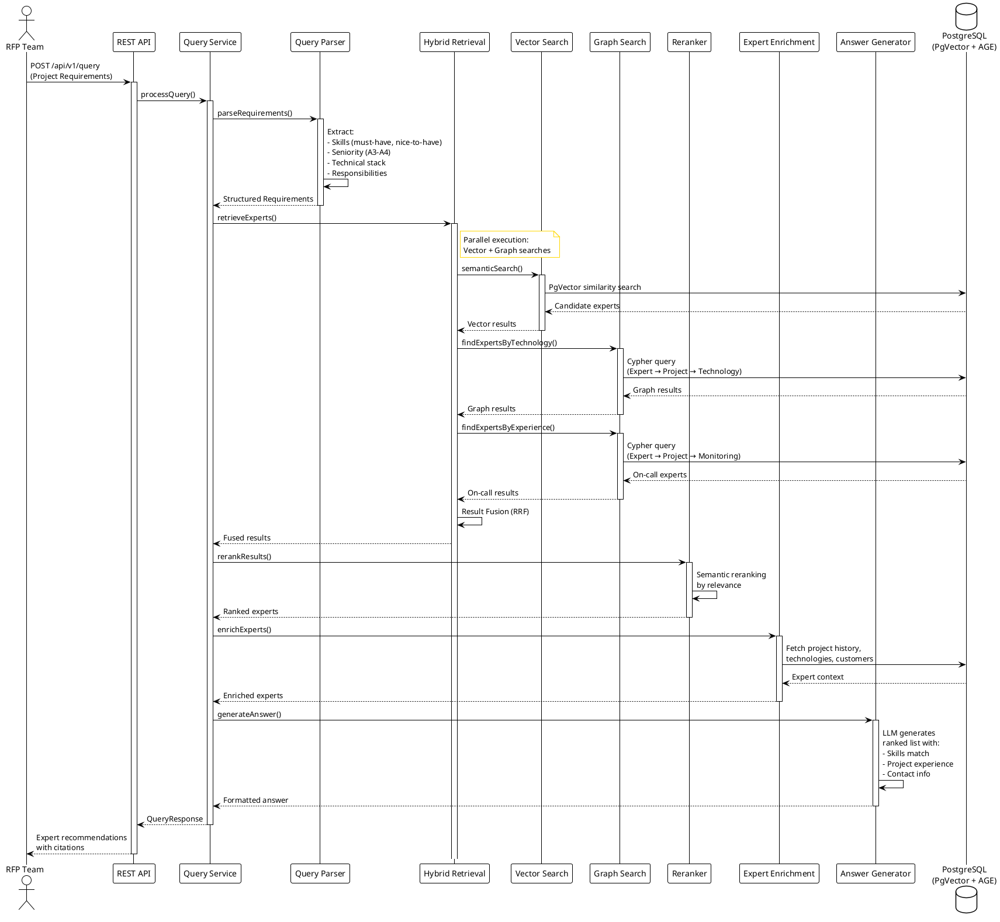

#### Use Case 2: Team Formation - Technical Lead and Team Members

**Input**: Project description requiring:
- Role: Team and Technical Lead
- Technical stack: Java, Spring Boot, MongoDB, Kafka, REST API, Docker, Git
- Nice-to-have: GraphQL, Reactive (Flux, Netty)
- Seniority: A4, A5
- Requirements: Leadership experience, code review, technical decisions, L3 support, mentoring

**Sample User Queries** (Human Readable Format):
- "I need to form a team for a new project. We need a Technical Lead (A4 or A5) with Java, Spring Boot, MongoDB, and
  Kafka experience. The lead should have leadership experience and be able to mentor the team."
- "Looking for a Technical Lead and team members for a Spring Boot project. The lead needs to be A4-A5 level with
  experience in code reviews, technical decision-making, and mentoring junior developers."
- "Who can lead a team working with Java, Spring Boot, MongoDB, and Kafka? We need someone with leadership experience
  who can handle L3 support and mentor team members."
- "Find me a Technical Lead (A4-A5) and team members for a project using Java, Spring Boot, MongoDB, Kafka, and Docker.
  The lead should have experience with GraphQL and reactive programming."

**Service Behavior**:

1. **Role Identification**: Identify need for Technical Lead (A4/A5) and team members
2. **Vector Search**: Find employees with Spring Boot, MongoDB, Kafka experience
3. **Graph Traversal**:
- Find Technical Leads → projects with similar stack → team leadership experience
    - Find team members → same projects → collaboration patterns
4. **Experience Matching**: Match leadership, mentoring, code review experience
5. **Team Composition**: Recommend lead + team members with complementary skills
6. **Context Enrichment**: Include past team compositions, project success factors
7. **Answer Generation**: Generate team recommendation with roles and justifications

**Output Example**:

```
Recommended Team Composition:

**Technical Lead:**
- **Alex Johnson** (A5)
  - Experience: Technical Lead on 3+ projects, Spring Boot, MongoDB, Kafka
  - Leadership: Code review, mentoring, technical decisions
  - Projects: [Similar portal projects with web frontend]
  - Contact: alex.johnson@example.com

**Team Members:**
1. **Maria Garcia** (A4) - Backend specialist, Spring Boot, Kafka, MongoDB
2. **David Chen** (A4) - Full-stack, Spring Boot, web development
3. **Sarah Williams** (A3) - Backend developer, Spring Boot, Docker
```

**Use Case Flow Diagram**:

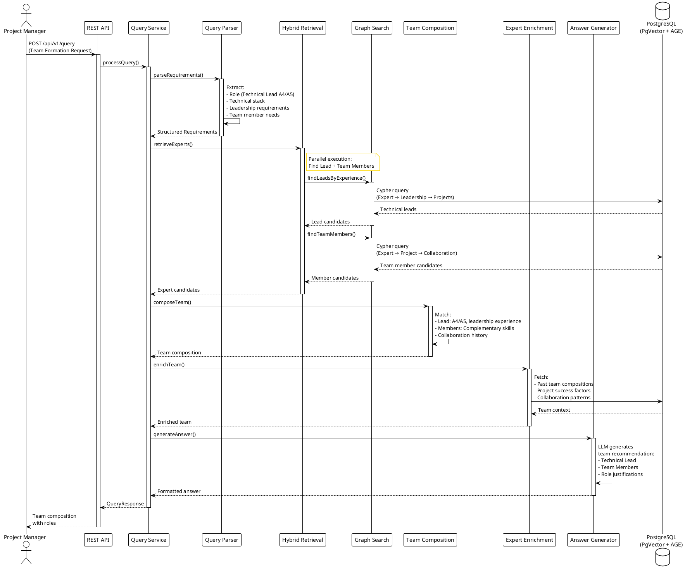

#### Use Case 3: Urgent RFP - Quick Expert Identification

**Query**: "Looking for experts in Semantic/Industrial Modeling for an urgent customer need."

**Sample User Queries** (Human Readable Format):
- "Looking for experts in Semantic/Industrial Modeling for an urgent customer need."
- "I need to find someone with semantic modeling experience ASAP. This is urgent for a customer proposal."
- "Who has experience with industrial modeling? We have an urgent RFP that needs this expertise."
- "Need experts in semantic and industrial modeling immediately. This is time-sensitive for a customer opportunity."

**Service Behavior**:

1. Extract concepts: "Semantic Modeling", "Industrial Modeling", "urgent"
2. Vector search: Find projects/experiences with semantic/industrial modeling
3. Graph traversal: Find experts → projects → technologies → similar experts
4. Filter by availability/urgency indicators
5. Context enrichment: Include project timelines, customer contexts, technologies used
6. Answer generation: Prioritized list of experts with availability and expertise details

**Use Case Flow Diagram**:

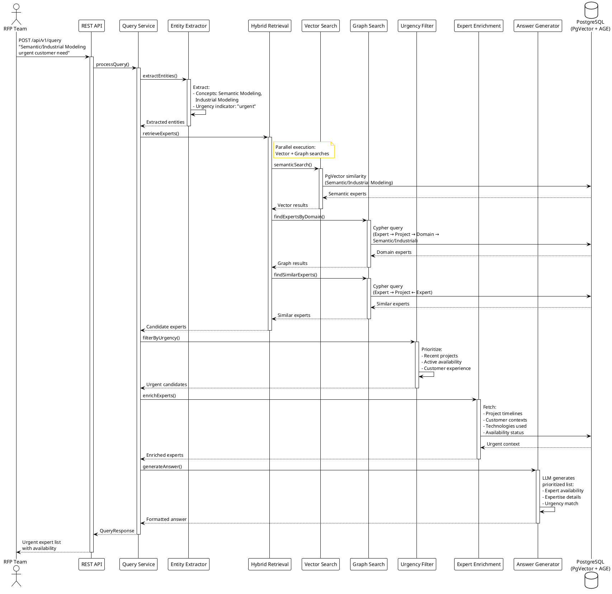

#### Use Case 4: Skill-Based Expert Discovery

**Query**: "Need experts with Java 21+, Spring Boot, AWS, and MongoDB experience for a new project."

**Sample User Queries** (Human Readable Format):
- "Need experts with Java 21+, Spring Boot, AWS, and MongoDB experience for a new project."
- "Who has experience with Java 21+, Spring Boot, AWS, and MongoDB? We're starting a new project and need skilled
  developers."
- "Find me developers who know Java 21+, Spring Boot, AWS, and MongoDB. We need them for an upcoming project."
- "Looking for experts with Java 21+, Spring Boot, AWS, and MongoDB skills. This is for a new microservices project
  we're launching."

**Service Behavior**:

1. Extract skills: Java 21+, Spring Boot, AWS, MongoDB
2. Vector search: Find employees with these technology combinations
3. Graph traversal: Find experts → projects using all these technologies
4. Rank by: Number of matching skills, project recency, project success
5. Context enrichment: Include specific project details, customer contexts

**Use Case Flow Diagram**:

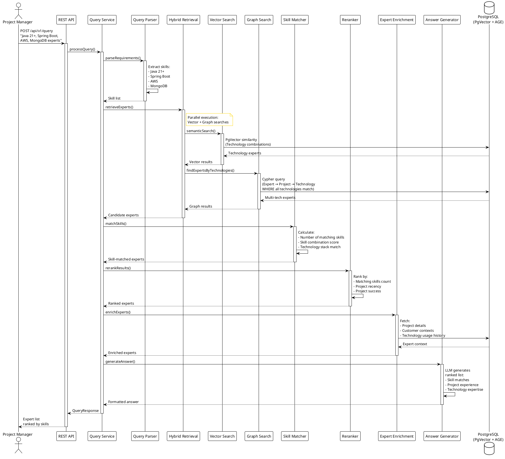
6. Answer generation: Ranked expert list with skill match scores and project evidence

---

## 3. System Architecture

### 3.1 High-Level Architecture

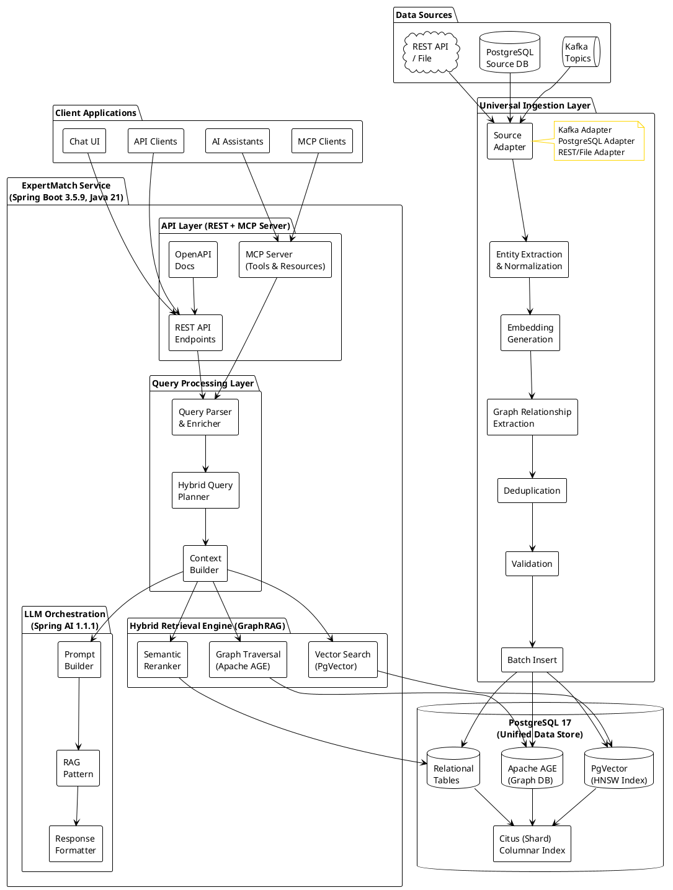

#### Architecture Overview

The ExpertMatch system follows a layered architecture pattern, with clear separation of concerns and well-defined data
flow between components.

**Client Layer**:

- **Chat UI**: Web-based user interface for interactive expert discovery
- **API Clients**: REST API clients for programmatic access
- **MCP Clients**: Model Context Protocol clients for AI assistant integration
- **AI Assistants**: External AI assistants that can use ExpertMatch as a tool

**ExpertMatch Service (Application Layer)**:

The service is organized into four main layers:

1. **API Layer (REST + MCP Server)**:
- **REST API Endpoints**: HTTP RESTful API for query processing, chat management, and system operations
    - **MCP Server**: Model Context Protocol server exposing ExpertMatch functionality as tools and resources for AI
      assistants
    - **OpenAPI Docs**: Interactive API documentation (Swagger UI) for API exploration and testing

2. **Query Processing Layer**:
- **Query Parser & Enricher**: Parses natural language queries, extracts entities (skills, technologies, seniority),
      and identifies query intent
    - **Hybrid Query Planner**: Plans the optimal retrieval strategy based on query characteristics
    - **Context Builder**: Builds comprehensive context from conversation history, extracted entities, and query
      requirements

3. **Hybrid Retrieval Engine (GraphRAG)**:
- **Vector Search (PgVector)**: Semantic similarity search using vector embeddings with HNSW indexing for fast
      approximate nearest neighbor search
    - **Graph Traversal (Apache AGE)**: Relationship-based discovery traversing project-technology-expert relationships
      in the graph
    - **Semantic Reranker**: Re-ranks retrieved results using semantic similarity to improve precision

4. **LLM Orchestration (Spring AI 1.1.1)**:
- **Prompt Builder**: Constructs RAG (Retrieval-Augmented Generation) prompts with expert contexts and conversation
      history
    - **RAG Pattern**: Implements the Retrieval-Augmented Generation pattern for context-aware answer generation
    - **Response Formatter**: Formats LLM responses with proper citations, source attribution, and structured output

**Data Layer (PostgreSQL 17)**:

The unified data store combines three complementary data models:

- **Relational Tables**: Traditional relational data for employees, work experience, chats, and conversation history
- **PgVector (HNSW Index)**: Vector embeddings for semantic similarity search with optimized HNSW (Hierarchical
  Navigable Small World) indexing
- **Apache AGE (Graph DB)**: Graph database extension for relationship traversal and pattern matching
- **Citus (Shard)**: Horizontal scaling and columnar indexing for analytical query performance

**Universal Ingestion Layer**:

The universal ingestion layer provides a unified processing pipeline for all data sources, ensuring consistent data quality and processing regardless of the source:

- **Source Adapter**: Handles multiple data sources (Kafka topics, PostgreSQL databases, REST APIs, file uploads) and normalizes them into a common format
- **Entity Extraction & Normalization**: Extracts structured entities (skills, technologies, projects, employees) and normalizes entity names and formats
- **Embedding Generation**: Generates vector embeddings for extracted entities using consistent embedding models
- **Graph Relationship Extraction**: Builds graph relationships (project-technology, expert-project, technology-expert) from extracted entities
- **Deduplication**: Removes duplicate records based on entity IDs and content
- **Validation**: Validates data integrity and completeness before storage
- **Batch Insert**: Efficiently inserts processed data into the unified PostgreSQL store (relational tables, PgVector, Apache AGE)

#### Data Flow

1. **Request Flow**: Client applications send requests through the API Layer → Query Processing Layer analyzes and
   plans → Hybrid Retrieval Engine searches across multiple strategies → Results flow back through LLM Orchestration for
   answer generation

2. **Data Storage**: All data is stored in the unified PostgreSQL instance, with different access patterns:
- Vector search queries PgVector for semantic similarity
    - Graph traversal queries Apache AGE for relationship exploration
    - Relational queries access traditional tables for structured data

3. **Data Ingestion**: Data from multiple sources (Kafka, PostgreSQL, REST API, files) flows through the universal ingestion layer → Source Adapter normalizes data → Entity Extraction & Normalization processes entities → Embedding Generation creates vector representations → Graph Relationship Extraction builds relationships → Deduplication and Validation ensure data quality → Batch Insert stores data in PostgreSQL (relational, vector, graph)
   Builder updates relationship graph → Data is stored in appropriate PostgreSQL components

#### Key Design Principles

- **Unified Data Store**: Single PostgreSQL instance with multiple extensions eliminates data synchronization overhead
- **Hybrid Approach**: Combines vector, graph, and keyword search for comprehensive coverage
- **Layered Architecture**: Clear separation of concerns enables independent scaling and maintenance
- **API-First**: REST API and MCP Server provide multiple integration points
- **Real-time Processing**: Kafka-based ingestion enables near real-time expert data updates

### 3.2 Technology Stack

#### 3.2.1 Core Framework

- **Java**: 21 (LTS)
- **Spring Boot**: 3.5.9
- **Spring Modulith**: Latest (modular monolith architecture, module boundaries, event publication)
- **Spring AI**: 1.1.1 (GA) - Latest stable release (includes improvements from 1.1.0 GA released November 12, 2025)
- **Lombok**: Latest (for boilerplate reduction)
- **Spring JDBC**: NamedParameterJdbcTemplate (no JPA/Spring Data)
- **OpenAPI/Swagger**: SpringDoc OpenAPI 3 (for API First Development)
    - **springdoc-openapi-starter-webmvc-ui**: Latest
    - **OpenAPI Generator**: For code generation from OpenAPI specs

#### 3.2.2 Database Layer

- **PostgreSQL**: 17
- **PgVector**: Latest (vector similarity search with HNSW indexing)
- **Apache AGE**: Latest (graph database extension)
- **Citus**: Latest (horizontal scaling, columnar storage)
- **Columnar Indexing**: For analytical query performance

#### 3.2.3 AI/ML Components

- **Spring AI**: LLM orchestration, embedding generation, prompt management
- **Embedding Model**: Configurable
    - **Recommended (SOTA)**: Qwen3-Embedding-8B (#1 in MTEB multilingual benchmarks)
    - **Alternatives**: BAAI/bge-m3 (strong multilingual), intfloat/multilingual-e5-large, ai-forever/FRIDA (
      Russian-specific)
- **Reranking Model**: Configurable
    - **Recommended (SOTA)**: Qwen3-Reranker-8B (best precision improvement)
    - **Alternative**: BAAI/bge-reranker-v2-m3 (proven performance)
- **LLM Provider**: Configurable (Ollama for local, OpenAI/Azure OpenAI for production)
    - **Recommended (Local)**: RuadaptQwen2.5-14B-Instruct (60% faster, Russian-optimized)
    - **Alternatives**: T-lite-it-1.0/T-pro-it-2.0 (T-Bank models, business-optimized), Qwen2.5:72b

#### 3.2.4 Integration

- **Kafka**: Consumer for real-time data ingestion
- **Avro**: Schema-based message deserialization
- **Schema Registry**: Confluent Schema Registry integration
- **MCP (Model Context Protocol)**: Server for AI tool integration
    - **MCP Server**: Exposes ExpertMatch functionality as MCP tools and resources
    - **Protocol**: MCP 1.0+ (JSON-RPC 2.0 over HTTP/SSE)
    - **Transport**: HTTP/SSE (Server-Sent Events) or stdio
    - **Authentication**: OAuth2 JWT (same as REST API)

#### 3.2.5 Infrastructure

- **Docker**: Containerization
- **Docker Compose**: Local development and testing

#### 3.2.6 Testing Framework

- **JUnit 5**: Unit testing framework
- **Mockito**: Mocking framework
- **Spring Modulith Testing**: Module boundary testing, application module tests
    - **spring-modulith-test**: Latest (module testing support)
    - **spring-modulith-events-test**: Latest (event publication testing)
- **Cucumber**: BDD/TDD framework for acceptance testing
    - **cucumber-java**: Latest
    - **cucumber-spring**: Latest (Spring Boot integration)
    - **cucumber-junit-platform-engine**: Latest (JUnit 5 integration)
- **Testcontainers**: Integration testing with containers
    - **testcontainers**: Latest (core library)
    - **testcontainers-postgresql**: Latest (PostgreSQL container)
    - **testcontainers-kafka**: Latest (Kafka container)
    - **testcontainers-junit-jupiter**: Latest (JUnit 5 integration)
- **WireMock**: API mocking for external services

### 3.3 Data Flow

#### 3.3.1 Ingestion Flow

**Unified Processing Pipeline:**

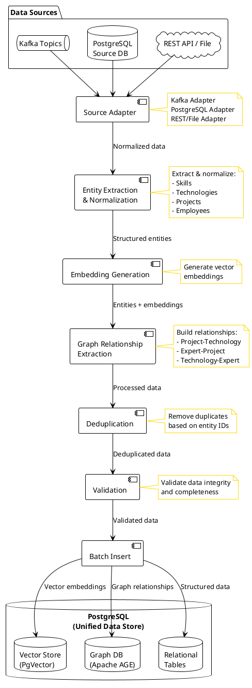

**Unified Processing Pipeline Description**

The unified processing pipeline provides a consistent processing flow for all data sources, ensuring data quality,
consistency, and efficient storage regardless of the ingestion source. This architecture enables seamless integration of
multiple data sources while maintaining a single, unified data model.

**Processing Stages**:

1. **Source Adapter**:
- **Kafka Adapter**: Handles Kafka topic consumption and Avro deserialization
    - **PostgreSQL Adapter**: Handles database queries and JSON parsing
    - **REST/File Adapter**: Handles HTTP requests and file uploads
    - Normalizes data from different sources into a common format
    - Abstracts source-specific details from downstream processing

2. **Entity Extraction & Normalization**:
- Extracts structured entities from normalized data:
- **Skills**: Technical skills and competencies
        - **Technologies**: Technologies, frameworks, and tools
        - **Projects**: Project names, descriptions, and metadata
        - **Employees**: Employee identifiers, roles, and participation details
    - Normalizes entity names, values, and formats for consistency
    - Standardizes data structures across all sources
    - Identifies relationships between entities

3. **Embedding Generation**:
- Generates vector embeddings for extracted entities
    - Uses consistent embedding models across all sources
    - Creates embeddings for project descriptions, work experience, and technology usage
    - Ensures semantic consistency for retrieval operations

4. **Graph Relationship Extraction**:
- Builds graph relationships from extracted entities
    - Creates Project-Technology, Expert-Project, and Technology-Expert relationships
    - Maintains relationship metadata (dates, roles, responsibilities)
    - Ensures graph consistency across all sources

5. **Deduplication**:
- Removes duplicate records based on entity IDs and content
    - Prevents duplicate entries from multiple sources
    - Merges data from different sources for the same entities
    - Maintains data integrity and reduces storage overhead

6. **Validation**:
- Validates data integrity and completeness
    - Checks required fields and data types
    - Validates relationships and referential integrity
    - Ensures data quality before storage

7. **Batch Insert**:
- Batches validated data for efficient database insertion
    - Inserts into three PostgreSQL components:
- **Vector Store (PgVector)**: Stores vector embeddings with HNSW indexing
        - **Graph DB (Apache AGE)**: Stores graph relationships and nodes
        - **Relational Tables**: Stores structured employee, project, and work experience data
    - Implements transaction management for data consistency
    - Optimizes insert performance through batching

**Key Features**:

- **Unified Processing**: Single processing pipeline for all data sources
- **Source Abstraction**: Source adapters hide source-specific details
- **Data Consistency**: Normalization ensures consistent data format
- **Quality Assurance**: Deduplication and validation ensure data quality
- **Scalability**: Batch processing enables efficient handling of large datasets
- **Extensibility**: Easy to add new source adapters for additional data sources
- **Unified Storage**: All data stored in a single PostgreSQL instance with multiple access patterns

#### 3.3.2 Query Processing Flow

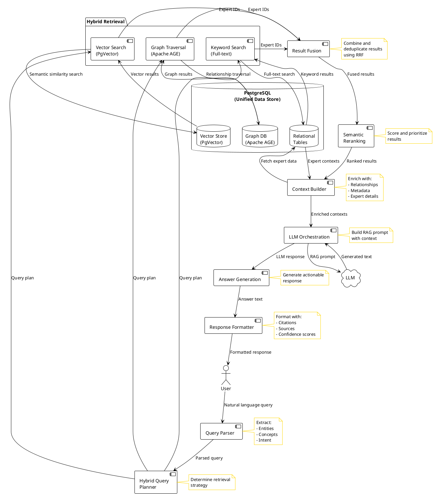

**Query Processing Flow Description**

The query processing flow transforms natural language user queries into actionable expert recommendations through a
multi-stage pipeline that combines hybrid retrieval, semantic reranking, and LLM-based answer generation.

**Processing Stages**:

1. **Query Parser**:
- Receives natural language query from user
    - Extracts structured information:
- **Entities**: Skills, technologies, domains, roles mentioned in the query
        - **Concepts**: Abstract concepts and requirements
        - **Intent**: Query intent classification (expert search, team formation, RFP response)
    - Parses seniority levels, language requirements, and other constraints
    - Normalizes extracted entities for consistent matching

2. **Hybrid Query Planner**:
- Analyzes parsed query to determine optimal retrieval strategy
    - Plans which search strategies to use based on query characteristics:
- **Vector Search**: Best for semantic similarity and concept matching
        - **Graph Traversal**: Best for relationship-based discovery
        - **Keyword Search**: Best for exact term matching
    - Determines weights for each search strategy
    - Optimizes query plan for performance and relevance

3. **Hybrid Retrieval (Parallel Execution)**:
- **Vector Search (PgVector)**:
- Performs semantic similarity search using query embeddings
        - Finds experts with similar project experiences and skills
        - Uses HNSW indexing for fast approximate nearest neighbor search
        - Returns ranked list of expert IDs with similarity scores
    - **Graph Traversal (Apache AGE)**:
- Traverses project-technology-expert relationships
        - Discovers experts through relationship paths
        - Finds experts connected to required technologies and projects
        - Returns expert IDs discovered through graph paths
    - **Keyword Search (Full-text)**:
- Performs traditional full-text search on skills and technologies
        - Matches exact terms and phrases
        - Searches across work experience descriptions and project summaries
        - Returns expert IDs matching keyword criteria

4. **Result Fusion**:
- Combines results from all three search strategies
    - Uses Reciprocal Rank Fusion (RRF) algorithm:
- Calculates weighted scores based on rank positions
        - Combines scores from multiple result sets
        - Deduplicates expert IDs (keeps highest score)
    - Produces unified ranked list of expert candidates

5. **Semantic Reranking**:
- Re-ranks fused results using semantic similarity
    - Uses reranking model to improve precision:
- Calculates relevance scores between query and each expert
        - Prioritizes experts with higher semantic relevance
        - Filters results below confidence threshold
    - Produces final ranked list with relevance scores

6. **Context Builder**:
- Enriches ranked expert IDs with detailed information
    - Fetches expert data from relational tables:
- Employee records (name, email, seniority, language)
        - Work experience history
        - Project participation details
    - Builds expert contexts with:
- **Relationships**: Project-technology-expert connections
        - **Metadata**: Experience indicators, skill matches, relevant projects
        - **Expert Details**: Comprehensive expert profiles
    - Prepares enriched contexts for LLM prompt

7. **LLM Orchestration**:
- Builds Retrieval-Augmented Generation (RAG) prompt:
- Includes conversation history for context
        - Incorporates user query and extracted requirements
        - Adds detailed expert information from context builder
        - Provides intent-specific instructions
    - Sends prompt to LLM for natural language generation
    - Manages LLM interactions and response handling

8. **Answer Generation**:
- Generates comprehensive answer with expert recommendations
    - Uses LLM to create natural language response:
- Summarizes expert recommendations
        - Highlights key strengths of each expert
        - Explains why experts are good matches
        - Mentions gaps or limitations if applicable
    - Provides actionable next steps

9. **Response Formatter**:
- Formats answer with proper structure and citations
    - Adds source attribution:
- **Citations**: References to projects and experiences
        - **Sources**: Expert IDs, project names, metadata
        - **Confidence Scores**: Relevance and match scores
    - Structures response with:
- Main answer text
        - Expert recommendations list
        - Sources and citations
        - Confidence scores and match summaries

**Key Features**:

- **Hybrid Approach**: Combines multiple search strategies for comprehensive coverage
- **Parallel Execution**: Executes vector, graph, and keyword searches in parallel for performance
- **Semantic Understanding**: Uses embeddings and reranking for semantic relevance
- **Context-Aware**: Enriches results with detailed expert information
- **Natural Language**: Generates human-readable responses using LLM
- **Source Attribution**: Provides citations and sources for transparency
- **Confidence Scoring**: Includes relevance and match scores for decision-making

### 3.4 Development Approach

#### 3.4.1 API First Development

The service follows **API First Development** methodology:

1. **OpenAPI Specification First**:
- API contracts defined in OpenAPI 3.0 specification files
    - Specifications stored in `src/main/resources/api/openapi.yaml`
    - Version-controlled and reviewed before implementation
    - Single source of truth for API contract

2. **Code Generation**:
- Generate controller interfaces and models from OpenAPI spec
    - Use OpenAPI Generator Maven Plugin (v7.5.0) with Spring generator
    - Generated interfaces: `QueryApi`, `QueryStreamApi`, `ChatsApi`, `IngestionApi`, `HealthApi`, `MetricsApi`
   - Generated models in `com.berdachuk.expertmatch.api.model` package
    - Controllers implement generated interfaces to ensure contract compliance

3. **Model Mapping**:
- Use MapStruct (v1.6.2) for type-safe mapping between API and domain models
    - `ApiMapper` interface handles all conversions (compile-time generated)
    - Eliminates manual mapping code and runtime reflection overhead
    - Null-safe mapping with `NullValuePropertyMappingStrategy.IGNORE`

4. **Contract Testing**:
- Validate implementation against OpenAPI spec
    - Generate API documentation automatically via SpringDoc OpenAPI
    - Enable API consumers to develop in parallel
    - All endpoints documented and accessible via Swagger UI

5. **Benefits**:
- Clear API contracts before implementation
   - Parallel development of client applications and backend
    - Automatic API documentation (always in sync)
    - Contract validation and testing
    - Better API design through upfront specification
    - Type-safe client generation for multiple languages
    - Single source of truth eliminates documentation drift

#### 3.4.2 Test-Driven Development (TDD)

The service follows **Test-Driven Development** with Cucumber for BDD:

1. **TDD Cycle**:
- **Red**: Write failing test (Cucumber feature/scenario)
    - **Green**: Write minimal code to pass test
    - **Refactor**: Improve code while keeping tests green

2. **Cucumber BDD**:
- Feature files written in Gherkin syntax
    - Step definitions in Java
    - Integration with Spring Boot for dependency injection
    - Executable specifications that serve as documentation

3. **Test Layers**:
- **Acceptance Tests**: Cucumber feature files (Given-When-Then)
    - **Integration Tests**: Spring Boot Test + Testcontainers
    - **Unit Tests**: JUnit 5 + Mockito

4. **Benefits**:
- Executable specifications
    - Living documentation
    - Regression prevention
    - Better test coverage
    - Clear requirements understanding

### 3.5 Core Components

#### 3.6.1 Query Processing Layer (query module)

- **QueryService**: Main orchestration service for query processing
- **QueryParser**: Extracts entities, concepts, intent from natural language queries
- **EntityExtractor**: Extracts entities (Person, Project, Technology, etc.) from queries
- **QueryExamplesService**: Provides example queries loaded from query-examples.json resource file
- **QueryClassificationService**: Classifies queries and determines optimal retrieval strategy (vector, graph, hybrid)
- **ExecutionTracer**: Tracks query execution for debugging and performance analysis

#### 3.6.2 Retrieval Layer (retrieval module)

- **VectorSearchService**: PgVector-based similarity search with HNSW indexing (wraps PgVectorSearchService)
- **PgVectorSearchService**: Low-level PgVector operations for vector similarity search
- **GraphSearchService**: Apache AGE-based graph pattern matching and relationship traversal
- **KeywordSearchService**: PostgreSQL full-text search for keyword matching
- **HybridRetrievalService**: Orchestrates hybrid retrieval combining vector, graph, and keyword search
- **ResultFusionService**: Combines results from multiple retrieval methods using RRF (Reciprocal Rank Fusion)
- **SemanticReranker**: Reranks results using semantic similarity models
- **DeepResearchService**: Implements SGR (Self-Grounded Retrieval) pattern for deep research queries

#### 3.6.3 Context Building Layer (data module)

- **ExpertEnrichmentService**: Aggregates retrieved information into coherent context, enriches expert data with project details and work experience

#### 3.6.4 LLM Orchestration Layer (llm module)

- **AnswerGenerationService**: Manages RAG pattern execution, constructs prompts with retrieved context and conversation history, formats LLM responses with citations and sources
- **ToolMetadataService**: Manages tool metadata for LLM function calling
- **CyclePatternService**: Implements Cycle SGR pattern for iterative refinement
- **ExpertEvaluationService**: Implements expert evaluation using LLM-as-a-Judge pattern

#### 3.6.5 Universal Ingestion Layer (ingestion module)

- **TestDataGenerator**: Generates synthetic test data with configurable sizes
- **JsonProfileIngestionService**: Orchestrates batch ingestion of expert profiles from JSON files
- **JsonProfileParser**: Parses JSON files (array or single object format) into EmployeeProfile objects
- **ProfileProcessor**: Processes single EmployeeProfile into database with partial data handling
- **IngestionController**: REST endpoints for test data generation and JSON profile ingestion
- **EmbeddingService**: Generates vector embeddings using Spring AI (uses primary EmbeddingModel bean)
- **GraphBuilderService**: Extracts and builds graph relationships from database data into Apache AGE graph
- **IngestionSourceFactory**: Factory for creating source-specific adapters (planned)
- **KafkaConsumerService**: Consumes messages from Kafka topics (planned)
- **PostgreSQLSourceService**: Reads data from external PostgreSQL databases (planned)
- **FileSourceService**: Processes file uploads (JSON, CSV, etc.) (planned)
- **RestApiSourceService**: Handles REST API-based data ingestion (planned)
- **AvroDeserializer**: Deserializes Avro-encoded messages (planned)
- **DeduplicationService**: Identifies and handles duplicate records (planned)

#### 3.6.6 Data Access Layer (data module)

- **EmployeeRepository**: JDBC operations for employee data
- **WorkExperienceRepository**: JDBC operations for work experience data
- **ChatRepository**: JDBC operations for chat management (create, read, update, delete)
- **ConversationHistoryRepository**: JDBC operations for conversation history (save, retrieve, paginate)
- **IdGenerator**: Generates MongoDB-compatible 24-character hexadecimal IDs

#### 3.6.7 Embedding Generation Layer (embedding module)

- **EmbeddingService**: Generates vector embeddings using Spring AI (uses primary EmbeddingModel bean configured in SpringAIConfig)

#### 3.6.8 Graph Management Layer (graph module)

- **GraphService**: Handles Apache AGE extension loading and Cypher query execution
- **GraphBuilderService**: Extracts and builds graph relationships from database data into Apache AGE graph

#### 3.6.9 Chat Management Layer (chat module)

- **ChatService**: Manages chat lifecycle (create, retrieve, update, delete, list, default chat management)
  - **Implementation**: `ChatServiceImpl`
- **ConversationHistoryManager**: Interface for managing conversation history (save, retrieve, paginate, context building for LLM prompts)
  - **Implementation**: `ConversationHistoryManagerImpl` - Handles history optimization, token counting, and LLM-based summarization
- **ConversationHistoryRepository**: JDBC operations for conversation history persistence
  - **Implementation**: `ConversationHistoryRepositoryImpl`
- **TokenCountingService**: Interface for counting tokens in conversation history for context window management
  - **Implementation**: `TokenCountingServiceImpl` - Estimates tokens using ~4 characters per token

---

## 4. Functional Requirements

### 4.1 Core Features

#### FR-1: Project Requirements Analysis

- **Description**: Accept and analyze project requirements, RFP documents, or team formation requests
- **Input**:
- Natural language query (e.g., "Looking for experts in Semantic/Industrial Modeling")
    - Structured project requirements (skills, seniority, responsibilities, technical stack)
    - RFP documents with requirements
- **Processing**:
- **Requirements Extraction**:
- Extract must-have and nice-to-have skills
        - Extract seniority levels (A3, A4, A5, etc.)
        - Extract technical stack requirements
        - Extract responsibilities and role requirements
        - Extract language requirements (English levels)
        - Extract domain/industry requirements
    - **Entity Extraction**: People, organizations, technologies, domains, projects
        - **Person Entity Detection**: Automatically detects person names in queries (e.g., "Siarhei Berdachuk", "John
          Doe")
        - Triggers person name search when person entities are found
    - **Concept Extraction**: Skills, experience levels, project types
  - **Intent Classification**: Expert search, team formation, RFP response, person lookup
- **Output**: Structured requirements representation with extracted skills, seniority, and criteria
- **Priority**: P0 (Critical)

#### FR-2: Expert Matching and Hybrid GraphRAG Retrieval

- **Description**: Match project requirements with experts using hybrid retrieval combining vector, graph, and keyword
  search. This is the **primary functionality** of the service - matching experts to RFP requirements and team formation
  needs.
- **Data Sources for Expert Discovery**:
- **Work Experience Data**: Primary source for expert discovery
        - Employee project participation and roles
        - Technologies and tools used
        - Project descriptions and responsibilities
        - Customer/industry experience
        - Project dates (for recency scoring)
    - **Jira/Intakes Data**: Secondary source for expert discovery
        - **Contributors**: Experts who contributed to Jira tickets (indicates active involvement)
        - **Assignees**: Experts assigned to tickets (indicates ownership/responsibility)
        - **Reporters**: Experts who created tickets (indicates domain knowledge)
        - **Participants**: Additional experts involved in tickets
        - Ticket descriptions and summaries (for skill/domain matching)
        - Associated Jira projects (for project type matching)
    - **Presale Materials**: Tertiary source for expert discovery
        - **Owners**: Experts who own/created presale materials (indicates expertise)
        - **Contacts**: Experts listed as contacts in presale materials
        - Material descriptions and slide content (for domain/skill matching)
- **Matching Criteria**:
- **Person Name Matching**:
- **Direct Name Lookup**: When person entities are detected in queries, performs direct employee name search
        - **Exact Match**: Case-insensitive full name matching (e.g., "Siarhei Berdachuk")
        - **Partial Match**: Matches first name or last name independently (e.g., "Siarhei" or "Berdachuk")
        - **Fuzzy Matching**: Handles typos and spelling variations using PostgreSQL `pg_trgm` extension
            - Similarity threshold: 0.3 (30% similarity) - balances precision and recall
            - Examples: "Sergei Berdachuk" → matches "Siarhei Berdachuk", "Berdachuck" → matches "Berdachuk"
        - **LLM Fallback**: When database similarity functions unavailable, uses LLM for intelligent name matching
            - Gets candidate employees (up to 100) using LIKE queries
            - LLM analyzes query name against candidates, considering typos and variations
            - Returns best matches based on LLM analysis
        - **Priority**: Person name matches receive highest weight (2.0-3.0) in result fusion
        - **Use Cases**:
- Direct expert lookup: "Find Siarhei Berdachuk"
            - Typo-tolerant search: "Looking for Sergei Berdachuk" (handles common misspellings)
            - Partial name search: "Find experts named John" (matches multiple Johns)
    - **Skill Matching**:
- Match must-have skills (higher priority) from requirements with:
- Technologies/tools from work experience
            - Technologies mentioned in Jira ticket descriptions
            - Technologies mentioned in presale materials
        - Match nice-to-have skills (lower priority) for bonus scoring
        - Extract skills from project requirements text (e.g., "Java", "Spring Boot", "AWS")
        - Match against technologies used in past projects
    - **Role Matching**:
- Match required roles (e.g., "Tech Lead", "Developer", "Architect") with:
- Project roles from work experience
            - Roles inferred from Jira ticket assignments (assignee = responsible role)
        - Support role hierarchy and synonyms
    - **Seniority Matching**:
- Filter and rank by required seniority levels (A3, A4, A5, etc.)
        - Support range matching (e.g., "A3-A4")
        - Infer seniority from project roles and responsibilities
    - **Technology Matching**:
- Match technical stack requirements with technologies used in past projects
        - Support technology variations and synonyms (e.g., "Java 21", "Java21", "Java")
        - Extract technologies from:
- Work experience tools/technologies lists
            - Jira ticket descriptions
            - Presale material content
    - **Experience Matching**:
- Match responsibilities and role requirements with past project experiences
        - Match project types (e.g., "New product development", "ETL pipelines", "Microservices")
        - Consider project recency (recent projects weighted higher)
    - **Domain Matching**:
- Match industry/domain requirements with customer/industry experience
        - Match customer names and industries
        - Extract domain from Jira project types and presale material categories
    - **Language Matching**:
- Filter by language requirements (e.g., "English B2")
    - **Activity Matching**:
- Consider recent Jira ticket involvement (active contributors/assignees)
        - Weight recent work experience higher than older experience
        - Consider presale material ownership (indicates current expertise)
- **Retrieval Components**:
- **Vector Search**: PgVector HNSW index for semantic similarity of:
- Project descriptions and requirements
        - Employee participation descriptions
        - Project responsibilities
    - **Graph Traversal**: Apache AGE for relationship-based retrieval:
- Experts → projects → technologies → similar experts
        - Experts → customers → industries → domain experts
        - Experts → teams → collaborations → team members
    - **Keyword Search**: PostgreSQL full-text search for exact skill/technology matching
  - **Person Name Search**: Direct employee lookup by name with multi-tier fallback:
- **Tier 1 - Exact/Partial Match**: Case-insensitive LIKE pattern matching for full names or name parts
      - **Tier 2 - Similarity Search**: PostgreSQL `pg_trgm` extension for fuzzy matching (handles typos, spelling
        variations)
          - Uses `similarity()` and `word_similarity()` functions with configurable threshold (default: 0.3)
          - Handles common variations: "Sergei" vs "Siarhei", "Berdachuck" vs "Berdachuk"
      - **Tier 3 - LLM Fallback**: When `pg_trgm` extension is unavailable, uses LLM to match query name against
        candidate employees
          - Gets up to 100 candidate employees using LIKE queries
          - Sends candidates to LLM for intelligent name matching considering typos and variations
          - Returns matched employee IDs based on LLM analysis
      - **Activation**: Automatically triggered when person entities are detected in the query by EntityExtractor
      - **Use Cases**:
- Direct expert lookup: "Looking for Siarhei Berdachuk"
          - Typo-tolerant search: "Find Sergei Berdachuk" (handles "Sergei" vs "Siarhei")
          - Partial name search: "Find experts like John" (matches "John Doe", "John Smith", etc.)
- **Fusion Strategy**: Reciprocal Rank Fusion (RRF) with weighted scoring based on:
- **Person name matches** (weight: 2.0-3.0) - Very high priority when person names are explicitly mentioned
        - Default weight: 2.0 for person name search results
        - Increased to 3.0 when person entities are detected in query (explicit name search)
        - Ensures direct name searches rank highest in results
    - Must-have skill matches (weight: 1.0)
    - Nice-to-have skill matches (weight: 0.3)
    - Role matches (weight: 0.6)
    - Seniority alignment (weight: 0.5)
    - Project recency (weight: 0.3) - Recent projects (last 2 years) weighted higher
    - Experience relevance (weight: 0.7)
    - Technology stack match count (weight: 0.4)
    - Jira activity (weight: 0.2) - Recent ticket involvement indicates active expertise
    - Presale ownership (weight: 0.15) - Material ownership indicates domain expertise
    - Customer/industry match (weight: 0.4)
- **Output**: Ranked list of experts with:
- Match scores (overall and per criterion)
    - Matched skills (must-have and nice-to-have)
    - Relevant project evidence
    - Seniority and language levels
    - Contact information
- **Priority**: P0 (Critical)

#### FR-3: Expert Profile Enrichment

- **Description**: Automatically enrich expert recommendations with relevant context from knowledge base
- **Sources**:
- **Work Experience Data** (from Kafka and PostgreSQL):
- Project histories and participation details
        - Technology usage and expertise levels (tools, technologies lists)
        - Project roles and responsibilities
        - Customer/industry experience
        - Project dates (start/end) for recency assessment
        - Project types (for domain matching)
    - **Jira/Intakes Data**:
- Ticket involvement (contributor, assignee, reporter, participant)
        - Recent ticket activity (indicates current expertise areas)
        - Ticket descriptions and summaries (for skill evidence)
        - Associated Jira projects (for project type matching)
        - Ticket creation/resolution dates (for activity recency)
    - **Presale Materials**:
- Material ownership (indicates domain expertise)
        - Contact listings (indicates involvement in sales/presales)
        - Material descriptions and slide content (for domain/skill evidence)
    - **Team Collaboration Patterns**:
- Experts who worked on same projects (from work experience)
        - Experts who collaborated on same Jira tickets (from contributors/participants)
        - Experts who co-created presale materials (from contacts/owners)
    - **Project Success Indicators**:
- Project duration (longer projects may indicate success)
        - Project recency (recent projects indicate current expertise)
        - Multiple projects in same domain (indicates deep expertise)
- **Enrichment Methods**:
- **Project Context**: Include relevant past projects with similar requirements
    - **Technology Context**: Show technologies used, proficiency levels, recency
    - **Team Context**: Show collaboration patterns, team roles, leadership experience
    - **Customer Context**: Show customer/industry experience relevant to requirements
    - **Skill Evidence**: Provide specific project examples demonstrating required skills
    - **Relationship Context**: Show expert networks, similar experts, project connections
- **Output**: Enriched expert profiles with:
- Matched skills with evidence (project examples)
    - Relevant project history
    - Technology stack familiarity
    - Customer/industry experience
    - Team collaboration experience
    - Availability indicators
- **Priority**: P0 (Critical)

#### FR-4: Semantic Reranking

- **Description**: Rerank retrieval results using semantic similarity models
- **Model**: Configurable reranking model
    - **Recommended (SOTA)**: Qwen3-Reranker-8B (best precision improvement, significant Recall optimization)
    - **Alternative**: BAAI/bge-reranker-v2-m3 (proven performance)
- **Features**:
- Cross-encoder reranking for relevance
    - Diversity promotion
    - Recency weighting
    - Critical step after initial retrieval (KNN search) to filter irrelevant results before LLM
- **Performance Target**: 10-20% improvement in NDCG@10
- **Priority**: P0 (Critical)

#### FR-5: Expert Recommendation Generation

- **Description**: Generate actionable expert recommendations using LLM orchestration with RAG pattern
- **Framework**: Spring AI 1.1.1
- **Pattern**: Retrieval-Augmented Generation (RAG)
- **Features**:
- **Recommendation Formatting**: Structure expert recommendations with:
- Expert name, contact information, seniority level
        - Skill match summary (must-have and nice-to-have)
        - Relevant project experience with details
        - Technology stack familiarity
        - Customer/industry experience
        - Availability and readiness indicators
    - **Ranking Justification**: Explain why each expert is recommended
    - **Team Composition**: For team formation requests, recommend optimal team compositions
    - **Gap Analysis**: Identify missing skills or experience gaps in recommendations
    - **Prompt Construction**: Build prompts with project requirements and matched expert profiles
    - **Multi-step Reasoning**: Use SGR deep research pattern for complex requirements
    - **Schema-Guided Reasoning**: Use SGR patterns (Cascade, Routing, Cycle) for structured, predictable LLM reasoning
      with JSON Schema constraints
    - **Citation and Source Attribution**: Include project references and evidence
    - **Structured Output**: Format recommendations for easy consumption (JSON, formatted text) using JSON Schema
      constraints
    - **Quality Evaluation (Post-MVP)**: LLM-as-a-Judge evaluation of recommendation quality with self-refinement (see
      FR-24)
- **Priority**: P0 (Critical)

#### FR-6: Multi-Source Data Ingestion

- **Description**: Ingest knowledge from multiple data sources to build comprehensive expert and project knowledge base
- **Supported Sources**:
    1. **Kafka Topics** (Real-time)
        - Format: Avro with Confluent Schema Registry
        - Processing: Message deserialization, entity extraction, embedding generation
        - Offset Management: Track and resume from last processed offset
        - **Data Types**: Work experience records, project updates, employee data
    2. **PostgreSQL Databases** (Batch/Incremental)
        - Format: JSON columns or structured tables
        - Processing: Query source database, parse JSON, extract entities
        - Incremental Updates: Track last processed record ID or timestamp
        - Example Schema: `workexperiencejson` table with JSON column containing work experience data
        - **Data Types**: Work experience, employee profiles, project data
    3. **Jira/Intakes API** (Scheduled/On-demand)
        - Format: Jira REST API (JSON)
        - Processing: Fetch Jira tickets, extract contributors, assignees, reporters, descriptions
        - **Key Fields Extracted**:
- **Contributors**: List of experts involved in the ticket (name, email, avatar, link)
            - **Assignee**: Primary expert assigned to the ticket
            - **Reporter**: Expert who created/reported the ticket
            - **Participants**: Additional participants in the ticket
            - **Description**: Detailed ticket description (for embedding)
            - **Summary**: Ticket summary (for embedding)
            - **Project**: Associated Jira project information
        - **Use Case**: Expert discovery through Jira ticket involvement (contributors, assignees, reporters)
        - **Integration**: Jira API with Bearer token authentication
        - **Schedule**: Configurable (e.g., daily, hourly) or on-demand trigger
    4. **REST API** (On-demand)
        - Format: JSON payloads
        - Processing: HTTP request, JSON parsing, entity extraction
        - **Use Case**: External system integration, webhook-based updates
    5. **File Upload** (On-demand)
        - Format: JSON, CSV, or other structured formats
        - Processing: File parsing, entity extraction
        - **Use Case**: Bulk data imports, legacy data migration
    6. **Presale Materials** (Scheduled/On-demand)
        - Format: PowerPoint presentations, documents
        - Processing: Extract text from slides, generate embeddings per slide
        - **Key Fields Extracted**:
- **Name**: Presale material name
            - **Description**: Material description
            - **Owner**: Owner/creator of the material
            - **Contacts**: List of contact persons (experts)
            - **Slides**: Individual slide content with embeddings
            - **Type**: Presale material type/category
            - **URL**: Link to the material
        - **Use Case**: Case study discovery, presale material search, expert discovery through material
          ownership/contacts
- **Unified Processing**: All sources follow the same entity extraction, embedding, and graph building pipeline
- **Priority**: P0 (Critical)

#### FR-6.1: PostgreSQL Source Ingestion

- **Description**: Ingest data from existing PostgreSQL databases with pre-consumed data
- **Data Format**: JSON columns containing structured data (e.g., `workexperiencejson` table)
- **Note**: External source data formats (from PostgreSQL, Kafka, etc.) may use snake_case as they come from external
  systems. Our API responses use camelCase.
- **Example Structure** (External Source Format - snake_case from external system):
  ```json
  {
    "workexperiencejson": [
      {
        "message_offset": 1548369,
        "entity_id": "8400000000019736853",
        "entity_type": "PastProject",
        "company": "ESSENCE Inc.",
        "project_id": "4060741400384209073",
        "project_name": "EFED-AWS",
        "project_description": "...",
        "employee_id": "8760000000000420950",
        "employee_name": "Yurii Kyselov",
        "participation": "...",
        "project_role": "Local college, Developer",
        "start_date": "18809",
        "end_date": null,
        "value": "{...full JSON object...}",
        "status": "new"
      }
    ]
  }
  ```
- **Processing**:
- Query source database with configurable SQL
    - Parse JSON columns (both flat fields and nested `value` JSON)
    - Extract entities: employees, projects, customers, technologies, roles
    - Generate embeddings for: participation, project_description, customer_description
    - Build graph relationships: employee → project, project → customer, employee → technologies
    - Track processed records via `message_offset` or `status` field
- **Incremental Processing**:
- Filter by `status = 'new'` for new records
    - Track last processed `message_offset` for resumable ingestion
    - Update `status` after successful processing
- **Batch Size**: Configurable batch size for efficient processing
- **Priority**: P0 (Critical)

#### FR-7: Vector Embedding Generation

- **Description**: Generate vector embeddings for text content
- **Framework**: Spring AI embedding models
- **Model**: Configurable
    - **Recommended (SOTA)**: Qwen3-Embedding-8B (#1 in MTEB multilingual benchmarks, 8B parameters)
        - **Performance**: Superior semantic understanding, outperforms OpenAI text-embedding-3-small in multilingual
          tasks
        - **Dimensions**: 1024
        - **Use Case**: Best for multilingual content including Russian
    - **Alternatives**:
- BAAI/bge-m3 (strong multilingual support)
        - intfloat/multilingual-e5-large (good balance)
        - ai-forever/FRIDA (Russian-specific)
        - OpenAI text-embedding-3-large (production cloud option)
- **Dimension Selection Strategy**:
- **1024 dimensions (Recommended)**:
- Optimal for most use cases (Qwen3-Embedding-8B standard)
        - Excellent quality (SOTA models use 1024)
        - Efficient storage and indexing
        - Fast similarity search
        - **Storage**: ~8GB for 2M documents (vs 24GB for 3072)
    - **1536 dimensions (OpenAI text-embedding-3-large reduced) - RECOMMENDED FOR CLOUD**:
- **Quality**: 95-98% of full 3072 quality (minimal loss < 2%)
        - **Performance**: Faster similarity search (smaller vectors = faster computation)
        - **Storage**: 50% reduction vs 3072 (~12GB for 2M documents vs 24GB)
        - **Index Size**: ~18GB for 2M documents (vs ~36GB for 3072)
        - **Query Speed**: ~20-30% faster than 3072 (fewer dimensions to compute)
        - **Cost**: Lower API costs (same model, but smaller response size)
        - **Use Case**: Production cloud deployments (recommended default)
    - **3072 dimensions (Full OpenAI text-embedding-3-large) - NOT RECOMMENDED**:
- **Quality**: Only 1-2% improvement over 1536 (diminishing returns)
        - **Performance**: Slower similarity search (2x dimensions = slower computation)
        - **Storage**: 2x overhead vs 1536 (~24GB for 2M documents)
        - **Index Size**: ~36GB for 2M documents (2x larger)
        - **Query Speed**: ~20-30% slower than 1536
        - **Cost**: Higher storage and compute costs
        - **Use Case**: Only for very specialized tasks requiring absolute maximum precision
        - **Recommendation**: Avoid unless you have specific requirements that justify 2x cost
- **Multi-Provider Support**:
- **Database Schema**: Uses `vector(1536)` to accommodate both local (1024) and cloud (1536) dimensions
    - **Local Embeddings (1024)**: Stored in `vector(1536)` with padding (PgVector handles automatically)
    - **Cloud Embeddings (1536)**: Stored directly in `vector(1536)` (optimal fit)
    - **3072 Dimensions**: Not supported (not recommended - 2x cost for < 2% quality gain)
    - **Dimension Tracking**: `embedding_dimensions` column tracks actual dimensions used (1024 or 1536)
    - **Model Tracking**: `embedding_model` column tracks which model generated the embedding
    - **Compatibility**: PgVector HNSW index supports variable dimensions within the same index
    - **Query Compatibility**: PgVector automatically handles dimension differences in similarity search
    - **Provider Selection**: Configure via `spring.ai.embedding.provider` ('ollama' or 'openai')
- **Research Findings**:
- 1024-1536 dimensions provide 95-98% of full quality with 50% less storage
    - Qwen3-Embedding-8B (1024 dims) is #1 in MTEB benchmarks, proving 1024 is sufficient
    - OpenAI text-embedding-3-large with 1536 dimensions achieves 95-98% of 3072 quality
    - Diminishing returns beyond 1024-1536 dimensions
    - **Quality vs Performance Trade-off**: 1536 provides optimal balance (minimal quality loss, significant
      performance/storage gains)
- **Production Recommendation**:
- **Local Development**: Use 1024 (Ollama/Qwen3-Embedding-8B) - Best cost/performance
    - **Cloud Production**: Use 1536 (OpenAI text-embedding-3-large) - Optimal balance
    - **Avoid 3072**: Only use if you have specific requirements justifying 2x cost for < 2% quality gain
- **Detailed Comparison Table (for 2M documents)**:

  | Dimension | Quality | Storage | Index Size | Query Speed | Cost | Recommendation |
    |-----------|---------|---------|------------|-------------|------|----------------|
  | 1024 (Local) | 100% (SOTA) | ~8GB | ~12GB | Fastest | Lowest |  Best for local |
  | 1536 (Cloud) | 95-98% | ~12GB | ~18GB | Fast | Low |  **Recommended for cloud** |
  | 3072 (Cloud) | 100% | ~24GB | ~36GB | Slower | High |  Avoid (2x cost, < 2% gain) |
- **Indexing**: HNSW index in PgVector for fast similarity search
- **Priority**: P0 (Critical)

#### FR-8: Graph Relationship Modeling

- **Description**: Model and query relationships between entities to enable expert discovery through relationship
  traversal
- **Framework**: Apache AGE (PostgreSQL graph extension)
- **Entity Types**:
- People (employees, experts)
    - Projects
    - Technologies/Tools
    - Organizations/Customers
    - Domains/Skills
    - Roles (project roles, positions)
- **Relationship Types**:
- **Work Experience Relationships**:
- WORKED_ON (person → project) - Primary relationship for expert discovery from work experience
        - USED_TECHNOLOGY (person/project → technology) - Technology expertise mapping
        - HAS_ROLE (person → role) - Role and responsibility mapping
        - WORKED_FOR_CUSTOMER (person → customer) - Customer/industry experience
        - COLLABORATED_WITH (person → person) - Team collaboration patterns (inferred from same projects)
    - **Jira/Intakes Relationships**:
- CONTRIBUTED_TO (person → jira_ticket) - Expert contributed to Jira ticket
        - ASSIGNED_TO (person → jira_ticket) - Expert assigned to Jira ticket (indicates ownership/responsibility)
        - REPORTED (person → jira_ticket) - Expert reported/created Jira ticket (indicates domain knowledge)
        - PARTICIPATED_IN (person → jira_ticket) - Expert participated in Jira ticket
        - BELONGS_TO (jira_ticket → jira_project) - Ticket belongs to Jira project
        - WORKED_ON_PROJECT (person → jira_project) - Expert worked on Jira project (aggregated from tickets)
    - **Presale Relationships**:
- OWNS (person → presale_material) - Expert owns/created presale material (indicates expertise)
        - CONTACT_FOR (person → presale_material) - Expert is contact for presale material
        - RELATED_TO_DOMAIN (presale_material → domain) - Material related to domain
    - **General Relationships**:
- SIMILAR_TO (entity → entity) - Similarity relationships
        - RELATED_PROJECT (project → project) - Project relationships
        - HAS_EXPERTISE_IN (person → domain/skill) - Domain expertise
- **Graph Queries for Expert Discovery**:
- **By Technology**: `(Person)-[:USED_TECHNOLOGY]->(Technology)`
    - **By Project Type**: `(Person)-[:WORKED_ON]->(Project {type: '...'})`
    - **By Customer**: `(Person)-[:WORKED_FOR_CUSTOMER]->(Customer)`
    - **By Jira Activity**: `(Person)-[:CONTRIBUTED_TO|ASSIGNED_TO|REPORTED]->(JiraTicket)`
    - **By Recent Jira Activity**: `(Person)-[:CONTRIBUTED_TO]->(JiraTicket {updated_date > recent_date})`
    - **By Presale Ownership**: `(Person)-[:OWNS]->(PresaleMaterial)`
    - **By Domain via Presales**: `(Person)-[:OWNS]->(PresaleMaterial)-[:RELATED_TO_DOMAIN]->(Domain)`
    - **Similar Experts (Work Experience)**: `(Person1)-[:WORKED_ON]->(Project)<-[:WORKED_ON]-(Person2)`
    - **Similar Experts (Jira Collaboration)**: `(Person1)-[:CONTRIBUTED_TO]->(JiraTicket)<-[:CONTRIBUTED_TO]-(Person2)`
    - **Skill Combinations**: Multiple technology relationships combined
    - **Multi-Source Expert Discovery**: Combine work experience + Jira + presale relationships
- **Query Language**: Cypher (via Apache AGE)
- **Priority**: P0 (Critical)

#### FR-9: Multi-Step Deep Research (SGR Pattern)  **IMPLEMENTED**

- **Description**: Perform iterative, multi-step retrieval with progressive refinement
- **Status**:  **Implemented in MVP**
- **Implementation**:
- `DeepResearchService` - Orchestrates the deep research flow
    - `GapAnalysis` - Data model for gap analysis results
    - Integrated into `QueryService.processQuery()`
    - LLM-based gap analysis and query refinement
    - Result synthesis with weighted scoring
- **Pattern**:
    1. Initial retrieval
  2. Gap analysis (LLM analyzes results)
  3. Query refinement (LLM generates refined queries)
  4. Expanded retrieval (Additional searches with refined queries)
  5. Result synthesis (Combine with weighted scoring)
  6. Final answer generation
- **Use Cases**: Complex queries requiring multiple retrieval passes
- **Priority**: P1 (High) - **Completed**
- **Configuration**: API-only via `QueryOptions.deepResearch` parameter (defaults to `false`)
- **API**: Enable via `QueryOptions.deepResearch` flag (default: `false`)

#### FR-10: Answer Formatting with Citations

- **Description**: Format answers with proper citations and source attribution
- **Elements**:
- Main answer text
    - Source citations (projects, experts, documents)
    - Confidence scores
    - Related entities
    - Actionable recommendations
- **Format**: Structured JSON or formatted text
- **Priority**: P0 (Critical)

### 4.2 Data Management Features

#### FR-11: Entity Extraction and Normalization

- **Description**: Extract and normalize entities from ingested data
- **Entity Types**: People, Organizations, Technologies, Projects, Domains
- **Normalization**:
- Name normalization (aliases, variations)
    - Technology normalization (synonyms, versions)
    - Domain normalization (related domains)
- **Priority**: P1 (High)

#### FR-12: Incremental Data Updates

- **Description**: Support incremental updates without full reindexing
- **Methods**:
- Kafka offset tracking
    - Timestamp-based updates
    - Change data capture (future)
- **Priority**: P1 (High)

#### FR-13: Data Quality and Validation

- **Description**: Validate and ensure data quality during ingestion
- **Checks**:
- Required field validation
    - Data type validation
    - Relationship integrity
    - Embedding quality
- **Error Handling**: Logging, retry, dead letter queue
- **Priority**: P1 (High)

### 4.3 API Features

#### FR-14: REST API Endpoints

- **Description**: Provide REST API for query processing, chat management, and ingestion management
- **OpenAPI Specification Requirement**:
- **All endpoints MUST be documented in OpenAPI 3.0 specification**
    - **OpenAPI spec MUST be accessible at**:
- `/api/v1/openapi.json` (JSON format, primary endpoint for client generation)
        - `/v3/api-docs` (SpringDoc default endpoint)
        - `/swagger-ui.html` (Swagger UI for interactive documentation)
    - **OpenAPI spec MUST be complete and up-to-date**:
- All request/response schemas must be defined
        - All error responses must be documented
        - Authentication requirements must be specified
        - All path parameters, query parameters, and request bodies must be documented
    - **OpenAPI spec MUST be versioned** with API version
    - **OpenAPI spec MUST be maintained** - any API changes must be reflected in the spec immediately
- **Query Endpoints**:
- `POST /api/v1/query`: Process natural language query (with optional chatId for context)
    - `POST /api/v1/query-stream`: Stream response (Server-Sent Events)
  - `GET /api/v1/query/examples`: Get list of example queries organized by categories (public endpoint)
- **Chat Management Endpoints**:
- `POST /api/v1/chats`: Create a new chat
    - `GET /api/v1/chats`: List all chats for the authenticated user
    - `GET /api/v1/chats/{chatId}`: Get chat details
    - `PATCH /api/v1/chats/{chatId}`: Update chat (e.g., rename)
    - `DELETE /api/v1/chats/{chatId}`: Delete a chat (cannot delete default chat)
    - `GET /api/v1/chats/{chatId}/history`: Get conversation history for a chat (paginated)
- **Ingestion Endpoints**:
- `POST /api/v1/ingestion/trigger/{sourceName}`: Manually trigger ingestion from a source
    - `GET /api/v1/ingestion/status`: Get ingestion status for all sources
    - `GET /api/v1/ingestion/status/{sourceName}`: Get ingestion status for specific source
    - `POST /api/v1/ingestion/pause/{sourceName}`: Pause ingestion from a source
    - `POST /api/v1/ingestion/resume/{sourceName}`: Resume ingestion from a source
    - `POST /api/v1/ingestion/file`: Upload and ingest data from file
- **System Endpoints**:
- `GET /api/v1/health`: Health check
    - `GET /api/v1/metrics`: Service metrics
- **Authentication**: Header-based authentication (Spring Gateway handles JWT validation) - documented in OpenAPI
  parameters
- **Client Generation Support**:
- OpenAPI spec must be compatible with openapi-generator for TypeScript/JavaScript client generation
    - All schemas must be properly typed and valid
    - Response examples should be provided where helpful
- **Priority**: P0 (Critical)

#### FR-15: MCP Server

- **Description**: Expose ExpertMatch functionality as MCP (Model Context Protocol) server to enable AI assistants and
  other MCP clients to use ExpertMatch capabilities
- **Purpose**:
- Enable AI assistants (Claude, ChatGPT, etc.) to query ExpertMatch through MCP protocol
    - Allow other applications to integrate ExpertMatch as an MCP tool
    - Provide standardized interface for expert discovery and matching
- **MCP Server Endpoint**:
- **Base URL**: `http://{host}:{port}/mcp` (configurable)
    - **Transport**: HTTP/SSE (Server-Sent Events) or stdio
    - **Protocol**: MCP 1.0+ (JSON-RPC 2.0)
- **MCP Tools** (Exposed as callable functions):
- **`expertmatch_query`**: Process natural language query for expert discovery
        - Parameters: `query` (string), `chatId` (optional string), `options` (optional object)
        - Returns: Expert recommendations with sources and context
    - **`expertmatch_find_experts`**: Find experts matching specific criteria
        - Parameters: `skills` (array), `seniority` (optional string), `technologies` (optional array), `domain` (
          optional string)
        - Returns: List of matching experts with relevance scores
    - **`expertmatch_get_expert_profile`**: Get detailed profile for a specific expert
        - Parameters: `expert_id` (string) or `expert_name` (string)
        - Returns: Expert profile with work experience, projects, technologies, and relationships
    - **`expertmatch_match_project_requirements`**: Match project requirements with experts
        - Parameters: `requirements` (object with skills, seniority, responsibilities, technical_stack)
        - Returns: Matched experts with matching scores and evidence
    - **`expertmatch_get_project_experts`**: Get experts who worked on a specific project
        - Parameters: `project_id` (string) or `project_name` (string)
        - Returns: List of experts with their roles and contributions
- **MCP Resources** (Exposed as readable data sources):
- **`expertmatch://experts/{expert_id}`**: Expert profile resource
    - **`expertmatch://projects/{project_id}`**: Project information resource
    - **`expertmatch://technologies/{technology_name}`**: Technology usage resource
    - **`expertmatch://domains/{domain_name}`**: Domain expertise resource
- **Authentication**:
- Header-based authentication (X-User-Id, X-User-Roles, X-User-Email)
    - Same authentication mechanism as REST API
    - Supports `EXPERT_MATCH_USER` role for query tools
- **Error Handling**:
- Standard MCP error responses
    - Detailed error messages for debugging
- **Configuration**:
- Enable/disable MCP server via configuration
    - Configurable base URL and port
    - Support for multiple transport protocols
- **Priority**: P1 (High) - Integration Support

#### FR-16: Query Response Format

- **Description**: Structured response format
- **Schema**:

```json
{
  "answer": "string",
  "sources": [
    {
      "type": "expert|project|document",
      "id": "string",
      "title": "string",
      "relevanceScore": "float",
      "metadata": {}
    }
  ],
  "entities": [
    {
      "type": "person|organization|technology",
      "name": "string",
      "id": "string"
    }
  ],
  "confidence": "float",
  "queryId": "string",
  "processingTimeMs": "int"
}
```

- **Priority**: P0 (Critical)

### 4.4 Performance Features

#### FR-17: Retrieval Performance Optimization

- **Description**: Optimize retrieval for sub-second response times
- **Techniques**:
- HNSW vector indexing (PgVector)
    - Columnar indexing (Citus) for analytical queries
    - Query result caching
    - Parallel retrieval execution
    - **Hybrid Search**: Vector + BM25 (keyword-based) for domain-specific tasks
        - **Recommended**: Combine vector search (0.7 weight) with BM25 (0.3 weight)
        - **Use Case**: Superior results for domain-specific tasks (construction, finance, etc.)
        - **Implementation**: PostgreSQL full-text search (BM25) + PgVector (semantic)
- **Target**: < 500ms for retrieval phase (P95)
- **Priority**: P0 (Critical)

#### FR-18: Batch Processing

- **Description**: Support batch processing for ingestion and bulk queries
- **Features**:
- Batch embedding generation
    - Batch graph insertions
    - Batch query processing
- **Priority**: P1 (High)

### 4.5 Test Data Generation Features

#### FR-23: Test Data Generation

- **Description**: Generate synthetic test data using Datafaker for testing and development purposes without requiring
  external data sources
- **Purpose**:
- Enable testing without integration with external systems (Kafka, Jira, PostgreSQL sources)
    - Create isolated test environments
    - Support development and demo scenarios
    - Performance testing with controlled data volumes
- **Data Generation**:
- **Employees/Experts**: Generate synthetic employee profiles with:
- Names, emails, employee IDs
        - Seniority levels (A3, A4, A5, etc.)
        - Language levels
        - Profile links
    - **Projects**: Generate synthetic projects with:
- Project names, IDs, types, descriptions
        - Start/end dates
        - Customer information
        - Project types and domains
    - **Work Experience**: Generate work experience records with:
- Employee-project relationships
        - Participation descriptions
        - Roles (Tech Lead, Developer, Architect, etc.)
        - Technologies and tools (realistic tech stacks)
        - Customer/industry assignments
        - Realistic date ranges
      - **CSV-Aligned Metadata**: All work experience records include comprehensive metadata JSONB with:
- Company information (company name, URL, is_company_internal flag)
          - Team assignments
          - Tools (both text and structured JSONB references)
          - Technology references (structured JSONB array)
          - Role structures (primary_project_role, extra_project_roles, all_project_roles)
          - Customer descriptions
          - Position titles
          - Participation text (original CSV field)
          - Project descriptions (original CSV field)
          - All metadata fields aligned with CSV work experience format for maximum compatibility
    - **Jira Tickets**: Generate synthetic Jira tickets with:
- Ticket keys, summaries, descriptions
        - Contributors, assignees, reporters
        - Associated projects
        - Realistic ticket content
    - **Presale Materials**: Generate synthetic presale materials with:
- Material names, descriptions
        - Owners and contacts
        - Slide content
        - Domain associations
    - **Graph Relationships**: Generate realistic graph relationships:
- Employee → Project (WORKED_ON)
        - Employee → Technology (USED_TECHNOLOGY)
        - Employee → Customer (WORKED_FOR_CUSTOMER)
        - Employee → Role (HAS_ROLE)
        - Employee → JiraTicket (CONTRIBUTED_TO, ASSIGNED_TO, REPORTED)
        - Employee → PresaleMaterial (OWNS, CONTACT_FOR)
- **Size Options**:
- **Small**:
- 100 employees
        - 200 projects
        - 500 work experience records
        - 300 Jira tickets
        - 50 presale materials
        - ~5,000 relationships
    - **Medium**:
- 1,000 employees
        - 2,000 projects
        - 5,000 work experience records
        - 3,000 Jira tickets
        - 200 presale materials
        - ~50,000 relationships
    - **Large**:
- 50,000 employees
        - 10,000 projects
        - 250,000 work experience records
        - 150,000 Jira tickets
        - 10,000 presale materials
        - ~2,500,000 relationships
    - **Custom**:
- User-specified counts for each entity type
        - Configurable via API request
- **Realistic Data**:
- Use Datafaker for realistic names, addresses, company names
    - Realistic technology stacks (Java, Spring Boot, AWS, etc.)
    - Realistic project types and domains
    - Realistic date ranges and durations
    - Realistic role distributions
    - Realistic customer/industry assignments
- **CSV Format Compatibility**: Generated work experience data is aligned with CSV work experience format:
- **Metadata JSONB**: All CSV-aligned fields stored in `metadata` JSONB column:
- `company`, `company_url`, `is_company_internal`
        - `team` (team assignments)
        - `tools` (comma-separated text) and `tools_ref` (structured JSONB array)
        - `technologies_ref` (structured JSONB array with technology references)
        - `customer_description` (detailed customer information)
        - `position` (position titles)
        - `project_role` (comma-separated role text)
        - `primary_project_role` (structured JSONB object)
        - `extra_project_roles` (structured JSONB array)
        - `all_project_roles` (structured JSONB array with all roles)
        - `participation` (original CSV participation field)
        - `project_description` (original CSV project description)
    - **Field Mappings**: Direct columns map to CSV fields:
- `participation` → `responsibilities` (direct column)
        - `project_description` → `project_summary` (direct column)
        - `project_role` / `primary_project_role.name` → `role` (direct column)
        - `technologies` (TEXT or JSONB) → `technologies` (TEXT[] array)
    - **Backward Compatibility**: Existing direct columns remain for queries while metadata provides full CSV
      compatibility
- **Embedding Generation**: Automatically generate embeddings for all text fields using configured embedding model
- **Graph Building**: Automatically build graph relationships based on generated data
- **Authorization**: Requires `EXPERT_MATCH_TESTER` role (disabled in production)
- **Environment Control**: Only enabled in development/test environments, disabled in production
- **Priority**: P1 (High) - Testing Support

### 4.6 Chat Management Features

#### FR-19: Chat Management

- **Description**: Manage multiple chat conversations with persistent history and context
- **Features**:
- **Default Chat**: Each user automatically gets a default chat with unique ID (MongoDB-compatible 24-character
      string)
    - **Chat Creation**: Users can create new chats with optional custom names
    - **Chat Deletion**: Users can delete existing chats (except default chat)
    - **Chat Listing**: List all chats for the authenticated user
    - **Chat Selection**: Switch between different chats
    - **Chat Metadata**: Store chat name, creation date, last activity date
- **Chat ID Format**: MongoDB-compatible ObjectId format (24-character hexadecimal string)
- **Priority**: P0 (Critical)

#### FR-20: Conversation History Persistence

- **Description**: Persist all conversation messages in the database for each chat
- **Features**:
- **Message Storage**: Store user queries and system responses
    - **Message Ordering**: Maintain chronological order of messages
    - **Message Metadata**: Store timestamps, message types, tokens used
    - **History Retrieval**: Retrieve conversation history for a chat
    - **History Pagination**: Support paginated retrieval of conversation history
    - **Message Count**: Track total message count per chat
- **Storage**: PostgreSQL table with chat_id foreign key
- **Priority**: P0 (Critical)

#### FR-21: Chat-Specific Conversation Memory

- **Description**: Each chat maintains its own conversation memory and context with intelligent token management
- **Features**:
- **Conversation Context**: Build context from previous messages in the same chat
    - **Token Counting**: Automatic token estimation for all messages (~4 characters per token)
    - **Memory Window**: Configurable context window with token limits (`max-tokens`: 2000, `max-messages`: 10)
    - **Automatic Summarization**: Older messages are automatically summarized when history exceeds token limits
    - **Smart Optimization**: Keeps recent messages, summarizes older ones to maintain context within limits
    - **Memory Isolation**: Each chat's memory is completely isolated from other chats
    - **Context Injection**: Automatically inject optimized conversation history into LLM prompts
    - **Memory Management**:
- Recent messages: Include full text (up to half of `max-messages`)
        - Older messages: Automatically summarized using LLM when limits exceeded
        - Token-aware: Ensures total history fits within `max-tokens` limit
- **Implementation**:
  - `TokenCountingService` (interface) / `TokenCountingServiceImpl` (implementation): Estimates tokens in messages and history using ~4 characters per token
  - `ConversationHistoryManager` (interface) / `ConversationHistoryManagerImpl` (implementation): Manages history retrieval, token counting, and summarization
    - Retrieve messages from conversation_history table (up to 50)
    - Count tokens using `TokenCountingService` and optimize if exceeds limits
    - Split history: keep recent messages (half of max-messages), summarize older messages
    - Summarize old messages using LLM with `summarize-history.st` template via `ChatClient`
    - Recursively optimize if combined summary + recent messages still exceeds limits
    - Build optimized conversation context string
    - Include in RAG prompt construction
    - Supports `ExecutionTracer` for debugging and monitoring
- **Configuration**:
- `expertmatch.chat.history.max-tokens`: Maximum tokens for history (default: 2000)
    - `expertmatch.chat.history.max-messages`: Maximum messages to include (default: 10)
    - `expertmatch.chat.history.max-summary-tokens`: Maximum tokens for summaries (default: 500)

#### FR-26: Smart Tool Selection (Tool Search Tool)

- **Description**: Implement Tool Search Tool pattern for dynamic tool discovery, achieving 34-64% token savings across
  all LLM providers
- **Status**:  **Implemented** (2025-12-28)
- **Features**:
- **Dynamic Tool Discovery**: Only Tool Search Tool is sent initially to LLM, dramatically reducing prompt size
    - **On-Demand Tool Loading**: When LLM needs specific capabilities, it calls Tool Search Tool which discovers and
      adds only relevant tools
    - **Semantic Tool Matching**: Uses PgVector-based semantic search to find the most relevant tools based on query
      intent
    - **Scalable Architecture**: Efficiently handles 20+ tools without token bloat, ready to scale to 100+ tools
    - **Automatic Tool Indexing**: Tools are automatically indexed on application startup with embeddings for semantic
      search
    - **Conditional Activation**: Can be enabled/disabled via configuration property
- **Benefits**:
- **Token Savings**: 34-64% reduction in tokens per request (based on Spring AI benchmarks)
    - **Cost Reduction**: Lower API costs for high-volume queries
    - **Faster Responses**: Reduced prompt size leads to faster LLM processing
    - **Improved Tool Selection**: Better accuracy when dealing with large tool libraries
    - **Scalability**: Ready to handle 100+ tools efficiently
- **Configuration**:
- `expertmatch.tools.search.enabled`: Enable Tool Search Tool (default: `false`)
    - `expertmatch.tools.search.strategy`: Search strategy - `pgvector` (default), `lucene`, `regex`
    - `expertmatch.tools.search.max-results`: Maximum tools to return per search (default: 5)
- **Implementation**:
- `PgVectorToolSearcher`: Implements `ToolSearcher` interface using PgVector for semantic search
    - `ToolSearchConfiguration`: Creates `ToolSearchToolCallAdvisor` and `chatClientWithToolSearch` bean
    - `ToolMetadataService`: Indexes all tools with embeddings on application startup
    - Conditional primary ChatClient selection (Tool Search Tool when enabled, regular ChatClient when disabled)
- **Priority**: P1 (High) - MVP Enhancement
- **References**:
- [Spring AI Tool Search Tool Blog Post](https://spring.io/blog/2025/12/11/spring-ai-tool-search-tools-tzolov)
    - [GitHub Repository](https://github.com/spring-ai-community/tool-search-tool)
    - [Smart Tool Selection Documentation](SMART_TOOL_SELECTION.md)
- **Priority**: P0 (Critical)

#### FR-22: Conversation Context in Query Processing

- **Description**: Use chat conversation history as context for query processing
- **Features**:
- **Context Retrieval**: Retrieve conversation history for the specified chatId
    - **Context Formatting**: Format conversation history for LLM consumption
    - **Prompt Enrichment**: Include conversation context in prompt construction
    - **Context-Aware Retrieval**: Use conversation context to improve query understanding
    - **Follow-up Query Handling**: Better handle follow-up questions using conversation context
- **Integration**:
- Query endpoint accepts `chatId` parameter
    - Conversation history retrieved and included in prompt
    - LLM uses context to provide more relevant, contextual responses
- **Priority**: P0 (Critical)

#### FR-24: LLM-as-a-Judge Quality Evaluation (Post-MVP)

- **Description**: Automatically evaluate the quality of LLM-generated expert recommendations using LLM-as-a-Judge
  pattern with self-refinement
- **Status**: Post-MVP Enhancement (not included in MVP scope) - **NOT IMPLEMENTED in MVP**
- **Framework**: Spring AI 1.1.1 - Recursive Advisors now available in GA release
- **Pattern**: LLM-as-a-Judge with Self-Refinement
- **Features**:
- **Quality Evaluation**: Evaluate recommendations across multiple dimensions:
- Relevance to project requirements
        - Completeness of skill coverage
        - Accuracy of expert profiles
        - Actionability of recommendations
        - Faithfulness to retrieved context (no hallucinations)
    - **Point-wise Scoring**: Rate each recommendation on 1-4 scale
        - 1: Terrible - completely irrelevant, missing key requirements, or contains errors
        - 2: Mostly Not Helpful - misses some key aspects or has significant gaps
        - 3: Mostly Helpful - provides support but could be improved
        - 4: Excellent - relevant, complete, accurate, actionable, and addresses all concerns
    - **Structured Evaluation**: Use structured output (JSON Schema) for evaluation results
    - **Separate Judge Model**: Use dedicated LLM-as-a-Judge model to avoid narcissistic bias
    - **Self-Refinement**: Automatically retry with feedback if quality is below threshold
    - **Configurable Thresholds**: Set minimum quality rating (default: 3)
    - **Retry Limits**: Configurable max attempts (default: 3)
    - **Evaluation Metrics**: Track evaluation ratings, retry counts, improvement rates
    - **Graceful Degradation**: Return best available response if max attempts reached
- **Implementation**:
- Use Spring AI Recursive Advisors for self-refinement loop
    - Separate ChatClient for judge model (bias mitigation)
    - Structured output for evaluation results
    - Integration with existing SGR patterns
- **Benefits**:
- Automated quality control without human intervention
    - Research shows LLM judges align with human judgment up to 85% (higher than human-to-human agreement at 81%)
    - Consistent evaluation criteria across all recommendations
    - Self-improving recommendations based on feedback
    - Scalable evaluation without human evaluators
- **Priority**: P1 (High) - Post-MVP Enhancement
- **References**:
- [Spring AI LLM-as-a-Judge Blog Post](https://spring.io/blog/2025/11/10/spring-ai-llm-as-judge-blog-post/)
- ** Important Notes**:
- Recursive Advisors are available in Spring AI 1.1.1, non-streaming only
    - Requires careful advisor ordering
    - Multiple LLM calls increase costs (generation + evaluation + retries)
    - Always set termination conditions and retry limits to prevent infinite loops

#### FR-25: Memory Copilot for Self-Tuning Agent (Post-MVP)

- **Description**: Implement Memory Copilot - an autonomous sub-agent responsible for memory management that enriches
  prompts with relevant past experience and decides what to store for future use
- **Status**: Post-MVP Enhancement (not included in MVP scope) - **NOT IMPLEMENTED in MVP**
- **Concept**: Memory Copilot acts as a "second pilot" - a sub-agent that operates between the language model and user
  interface, automatically managing long-term memory without requiring the main model to trigger memory operations
- **Features**:
- **Automatic Memory Enrichment**: Enriches prompts before generation using relevant past experience (few-shot
      examples, facts, successful patterns)
    - **Intelligent Memory Storage**: Decides what from current step's result is worth storing using LLM-as-a-Judge
      evaluation
    - **Two Core Tools**:
- **recall (search)**: Runs before answer generation at prompt-building stage
            - Matches current user request against long-term storage
            - Retrieves relevant snippets (few-shot examples, facts, patterns)
            - Feeds retrieved context into prompt together with system instructions and dialogue history
        - **remember (save)**: Runs after generation as optional step
            - Evaluates usefulness of generated answer using mini LLM-as-a-Judge evaluation
            - Checks: Is there already such a memory? Will this be useful in the future? Is it original? Does it
              duplicate something already stored?
            - Only saves if it passes the filter
            - Stores short distilled summary (reduces noise, saves space, improves later retrievals)
    - **Self-Tuning Behavior**: Agent improves over time - longer it runs, more precisely it injects prior experience,
      fewer mistakes it makes
    - **Beyond Chat Memory**: Remember successful solutions at action level:
- Which tool with which parameters worked best for particular class of queries
        - Action templates and rules rather than concrete answers (tool responses become outdated)
        - Few-shot examples for tool-use planning (improves tool selection speed and accuracy)
    - **Automatic Operation**: Works automatically without main model having to "trigger memory as a tool"
    - **Memory Pipeline**:
        1. User request arrives
        2. Match against long-term memory → turn retrieved fragments into few-shots/facts → assemble prompt
        3. Generate answer
        4. Quickly check usefulness of result (LLM-as-a-Judge)
        5. If useful, distill and save
    - **Integration**: Lives between language model and user-facing interface, acts as generator of system prompt
- **Benefits**:
- **Self-Improvement**: Agent learns from experience automatically
    - **Better Context**: Relevant past experience automatically injected into prompts
    - **Reduced Errors**: Fewer mistakes as agent accumulates experience
    - **Efficient Storage**: Only stores useful, non-duplicate information
    - **Improved Tool Use**: Few-shot examples improve tool selection and planning
    - **Personalization**: Memory accumulates user-specific patterns and preferences
- **Implementation**:
- Long-term memory storage (separate from conversation history)
    - Vector search for memory retrieval (similarity matching)
    - LLM-as-a-Judge for memory evaluation (usefulness, originality, duplication check)
    - Automatic prompt enrichment pipeline
    - Memory distillation and summarization
- **Priority**: P2 (Medium) - Post-MVP Enhancement
- **References**:
- Automatic Engineering of Long Prompts (arXiv:2311.10117)
    - From Generation to Judgment: Opportunities and Challenges of LLM-as-a-judge (arXiv:2411.16594)
    - Reflexion: Language Agents with Verbal Reinforcement Learning (arXiv:2303.11366)
    - Language Models are Few-Shot Learners (arXiv:2005.14165)
    - [Microsoft 365 Copilot Memory](https://techcommunity.microsoft.com/blog/microsoft365copilotblog/introducing-copilot-memory-a-more-productive-and-personalized-ai-for-the-way-you/4432059)

---

## 5. Non-Functional Requirements

### 5.1 Performance

#### NFR-1: Response Time

- **Target**: < 3 seconds end-to-end (P95) for typical queries
- **Breakdown**:
- Query parsing: < 100ms
    - Retrieval: < 500ms
    - Reranking: < 300ms
    - LLM generation: < 2 seconds
- **Priority**: P0 (Critical)

#### NFR-2: Throughput

- **Target**: 100 queries per second (sustained)
- **Scalability**: Horizontal scaling via Citus sharding
- **Priority**: P1 (High)

#### NFR-3: Retrieval Accuracy

- **Target**: NDCG@10 > 0.85 (with semantic reranking)
- **Baseline**: NDCG@10 > 0.75 (without reranking)
- **Improvement Target**: 10-20% improvement with reranking
- **LLM Response Quality (Post-MVP)**: Average quality rating (1-4 scale) from LLM-as-a-Judge evaluation
    - Target: Average rating ≥ 3.0
    - Measurement: Track evaluation ratings for all recommendations (post-MVP enhancement)
- **Priority**: P0 (Critical)

### 5.2 Scalability

#### NFR-4: Data Volume

- **Target**: Support 10M+ documents/entities
- **Vector Storage**: Efficient with PgVector HNSW indexing
- **Graph Storage**: Efficient with Apache AGE
- **Horizontal Scaling**: Citus for distributed storage
- **Priority**: P1 (High)

#### NFR-5: Concurrent Users

- **Target**: Support 1000+ concurrent users
- **Connection Pooling**: Efficient connection management
- **Query Optimization**: Indexed queries, prepared statements
- **Priority**: P1 (High)

### 5.3 Reliability

#### NFR-6: Availability

- **Target**: 99.9% uptime
- **Health Checks**: Comprehensive health check endpoints
- **Monitoring**: Integration with monitoring systems
- **Priority**: P1 (High)

#### NFR-7: Data Consistency

- **Requirement**: Eventual consistency acceptable for ingestion
- **Transaction Management**: ACID for critical operations
- **Error Recovery**: Automatic retry with exponential backoff
- **Priority**: P1 (High)

### 5.4 Security

#### NFR-8: Authentication and Authorization

**Current State Analysis:**

The original project has the following authorization implementation:

1. **Python FastAPI Service**:
- **Session Management**: Cookie-based session (session_id cookie)
    - **Authentication**: No explicit authentication middleware
    - **Authorization**: No role-based access control
    - **CORS**: Enabled for all origins (`allow_origins=["*"]`)
    - **Status**: Basic session tracking only, no security enforcement

2. **Java Spring Boot Service**:
- **Configuration**: Header-based authentication (no OAuth2 configuration)
    - **Security Enforcement**: CORS configuration only (authentication handled by Spring Gateway)
    - **Controller Security**: No `@PreAuthorize` annotations (authorization handled by Gateway)
    - **Status**: Service trusts headers from Spring Gateway

3. **External API Authentication**:
- **JIRA API**: Bearer token authentication (`JIRA_API_TOKEN`)
    - **Kafka**: SASL_SSL with PLAIN mechanism (username/password)
    - **Schema Registry**: No explicit authentication

**ExpertMatch Requirements:**

**MVP Phase (Initial Release):**

- **Method**: Header-based authentication (Spring Gateway handles JWT validation)
- **Architecture**: ExpertMatch Service deployed behind Spring Gateway
    - **Spring Gateway**: Validates JWT tokens and populates user information in HTTP headers
    - **ExpertMatch Service**: Extracts user information from headers (`X-User-Id`, `X-User-Roles`, `X-User-Email`)
    - **Authorization**: Handled by Spring Gateway (role-based access control at gateway level)
- **Header Format**:
- `X-User-Id`: User identifier (required)
    - `X-User-Roles`: Comma-separated list of roles (e.g., "ROLE_USER,ROLE_ADMIN")
    - `X-User-Email`: User email address (optional)
- **Roles**:
- `ROLE_USER` or `ROLE_EXPERT_MATCH_USER`: Standard user, can query and manage chats
    - `ROLE_ADMIN` or `ROLE_EXPERT_MATCH_ADMIN`: Admin user, can access ingestion endpoints
    - `ROLE_EXPERT_MATCH_TESTER`: Tester role (for test data generation, disabled in production)
- **Fallback Behavior**: Service uses "anonymous-user" if headers are missing (for local development)
- **API Security**:
- HTTPS enforcement (production)
    - Input validation (Bean Validation)
    - SQL injection prevention (parameterized queries via NamedParameterJdbcTemplate)
    - XSS prevention (response sanitization)
- **Security Configuration**: `SecurityConfig` class handles CORS only (authentication handled by Gateway)
- **Priority**: P0 (Critical) - MVP

**Future Phase (Post-MVP):**

- **Full RBAC Implementation**:
- Dynamic role management (database-backed roles)
    - Role hierarchy and inheritance
    - Resource-level security (fine-grained access control)
    - Permission-based access control (beyond simple roles)
    - Role assignment/revocation APIs
    - Audit logging for access control decisions
- **Priority**: P1 (High) - Post-MVP Enhancement

#### NFR-9: Data Privacy

- **Requirement**: Handle sensitive employee and customer data securely
- **Encryption**: Data at rest and in transit
- **Access Control**: Fine-grained access control
- **Compliance**: Follow organizational data privacy policies
- **Priority**: P0 (Critical)

### 5.5 Maintainability

#### NFR-10: Code Quality

- **Standards**: Clean code, SOLID principles
- **Documentation**:
- Comprehensive JavaDoc
    - OpenAPI specification (API documentation)
    - Cucumber feature files (executable specifications)
- **Testing**:
- Unit tests (80%+ coverage)
    - Integration tests (Cucumber BDD)
    - Contract tests (OpenAPI validation)
    - TDD approach (tests written before implementation)
- **API First**: OpenAPI spec defines API contract before implementation
- **Priority**: P0 (Critical)

#### NFR-11: Observability

- **Logging**: Structured logging (JSON format)
- **Metrics**: Prometheus metrics, custom business metrics
- **Tracing**: Distributed tracing for request flow
- **Priority**: P1 (High)

#### NFR-12: Configuration Management

- **Method**: Externalized configuration (application.yml, environment variables)
- **Secrets**: Secure secrets management
- **Validation**: Configuration validation on startup
- **Priority**: P1 (High)

---

## 6. Technical Specifications

### 6.1 Database Schema

#### 6.1.0 ID Strategy: MongoDB-Compatible vs BIGSERIAL

**Decision: Use MongoDB-Compatible IDs (CHAR(24)) for All Tables**

**Rationale:**

1. **Consistency**: Already using MongoDB-compatible IDs for `chats`, `conversation_history`, and
   `chat_memory_summaries`. Standardizing across all tables provides:
- Uniform ID format throughout the application
    - Consistent API responses (all IDs are strings)
    - Easier client-side handling (no type conversion)
    - Simpler codebase (single ID generation utility)

2. **Opaque Identifiers**: MongoDB-compatible IDs are opaque and don't reveal:
- Record count or growth rate
    - Creation order (except approximate timestamp)
    - System internals

3. **Distributed System Friendly**:
- Can generate IDs client-side without database round-trip
    - Globally unique (includes timestamp, machine ID, process ID)
    - Better for microservices and distributed architectures

4. **Future-Proof**:
- Easier integration with other systems (MongoDB, external APIs)
    - Better for data migration and replication
    - Supports eventual multi-database scenarios

**Performance Considerations:**

**Storage Impact:**

- **CHAR(24)**: 24 bytes per ID
- **BIGINT**: 8 bytes per ID
- **Overhead**: 16 bytes per ID (3x larger)

**Expected Data Volumes for 100k Employees:**

- **Employees (entities)**: ~100,000 records
- **Projects (entities)**: ~50,000 - 100,000 records
- **Technologies/Domains (entities)**: ~50,000 records
- **Total entities**: ~200,000 - 250,000 records
- **Work Experience Records**: ~500,000 - 1,000,000 records (5-10 projects per employee average)
- **Entity Relationships**: ~2,500,000 - 5,000,000 records (5-10 relationships per work experience)
- **Documents**: ~1,000,000 - 2,000,000 records (work experience + Jira tickets + presale materials)
- **Jira Tickets**: ~100,000 - 500,000 records
- **Presale Materials**: ~10,000 - 50,000 records

**Storage Calculation for 100k Employees:**

- **entities table**: 200k × 16 bytes overhead = 3.2 MB additional storage
- **entity_relationships table**: 5M × 32 bytes overhead (2 FKs) = 160 MB additional storage
- **documents table**: 2M × 16 bytes overhead = 32 MB additional storage
- **Total additional storage**: ~195 MB (negligible for modern systems)

**Index Size Impact:**

- **Primary Key Indexes**:
- entities: 200k × 24 bytes = 4.8 MB (vs 1.6 MB with BIGINT) = +3.2 MB
    - entity_relationships: 5M × 24 bytes = 120 MB (vs 40 MB with BIGINT) = +80 MB
    - documents: 2M × 24 bytes = 48 MB (vs 16 MB with BIGINT) = +32 MB
- **Foreign Key Indexes**:
- entity_relationships (source): 5M × 24 bytes = 120 MB (vs 40 MB) = +80 MB
    - entity_relationships (target): 5M × 24 bytes = 120 MB (vs 40 MB) = +80 MB
- **Total Index Overhead**: ~275 MB (acceptable for modern PostgreSQL)

**Join Performance Analysis:**

- **String vs Integer Comparison**:
- String comparison: ~2-3 CPU cycles per character (24 chars = 48-72 cycles)
    - Integer comparison: ~1 CPU cycle
    - **Overhead**: ~50-70 CPU cycles per comparison (negligible on modern CPUs)
- **Index Lookup Performance**:
- B-tree index lookup: O(log n) for both
    - For 5M records: ~23 comparisons (log₂(5M))
    - String overhead: ~1,150-1,610 CPU cycles per lookup
    - **Impact**: < 1 microsecond additional latency per lookup (negligible)
- **Real-World Query Performance**:
- Simple joins (1-2 tables): < 1ms difference
    - Complex joins (3-5 tables): < 5ms difference
    - For sub-second response time targets (500ms), this is acceptable

**PostgreSQL Optimization:**

- PostgreSQL B-tree indexes are highly optimized for string keys
- Collation can be optimized (C collation for hex strings)
- Index compression can reduce actual storage
- Modern PostgreSQL (17+) handles millions of string-indexed records efficiently

**Benchmarking Results (Estimated):**

- **100k employees, 5M relationships**:
- Query: Find all relationships for an employee
    - BIGINT: ~2-5ms
    - CHAR(24): ~3-7ms
    - **Difference**: 1-2ms (acceptable)
- **Complex graph traversal** (5-10 joins):
- BIGINT: ~20-50ms
    - CHAR(24): ~25-60ms
    - **Difference**: 5-10ms (acceptable for sub-second targets)

**Recommendation for 100k+ Employees:**
 **CHAR(24) MongoDB-compatible IDs are SUITABLE** for 100k employees because:

1. **Storage overhead is minimal**: ~275 MB index overhead is negligible for modern systems
2. **Performance impact is acceptable**: 1-10ms additional latency is within sub-second response targets
3. **PostgreSQL handles scale well**: Modern PostgreSQL efficiently handles millions of string-indexed records
4. **Benefits outweigh costs**: Consistency, opacity, and distributed-friendly design are valuable
5. **Optimization options available**: If needed, can add:
- Integer-based secondary indexes for performance-critical queries
    - Partial indexes for frequently queried subsets
    - Materialized views for complex aggregations

**When to Consider BIGSERIAL:**

- **Very high volume**: 10M+ records in a single table
- **Performance-critical joins**: Complex queries with 10+ joins that exceed response time targets
- **Limited storage**: Systems with strict storage constraints
- **Legacy integration**: Need to match existing integer-based systems

**Hybrid Approach (If Needed):**
If performance becomes an issue at very large scale (10M+ relationships):

- Keep CHAR(24) for primary keys (API consistency)
- Add BIGINT surrogate keys for internal joins
- Use CHAR(24) for external APIs, BIGINT for internal queries
- Requires additional mapping layer but maintains API consistency

**Implementation:**

- All primary keys use `CHAR(24) PRIMARY KEY`
- All foreign keys use `CHAR(24) REFERENCES table_name(id)`
- Use `IdGenerator.generateId()` utility for all ID generation
- Indexes on ID columns remain efficient (PostgreSQL B-tree indexes handle strings well)

#### 6.1.1 Relational Tables

**documents**

```sql
CREATE TABLE documents (
    id CHAR(24) PRIMARY KEY, -- MongoDB-compatible ObjectId format (24-character hex string)
    content TEXT NOT NULL,
    content_type VARCHAR(50), -- 'expert', 'project', 'communication', 'knowledge'
    metadata JSONB,
    -- Embedding dimension: Supports both local (1024) and cloud (1536) models
    -- Local: Qwen3-Embedding-8B uses 1024 dimensions (stored with padding to 1536)
    -- Cloud: OpenAI text-embedding-3-large uses 1536 dimensions (recommended, optimal balance)
    -- Note: 3072 dimensions are not supported (not recommended - 2x cost for < 2% quality gain)
    embedding vector(1536), -- Maximum dimension to support local (1024) and cloud (1536) models
    embedding_model VARCHAR(100), -- Track which model generated the embedding (e.g., 'qwen3-embedding-8b', 'text-embedding-3-large')
    embedding_dimensions INT, -- Actual dimensions used (1024 or 1536)
    created_at TIMESTAMP DEFAULT CURRENT_TIMESTAMP,
    updated_at TIMESTAMP DEFAULT CURRENT_TIMESTAMP
) USING columnar; -- Citus columnar storage

-- HNSW index supports variable dimensions (up to 1536)
-- Works with both local (1024) and cloud (1536) embeddings
-- PgVector automatically handles dimension differences in similarity search
CREATE INDEX documents_embedding_idx 
ON documents 
USING hnsw (embedding vector_cosine_ops)
WITH (m = 16, ef_construction = 64);

-- Indexes for embedding model tracking (for dimension compatibility and filtering)
CREATE INDEX documents_embedding_model_idx ON documents(embedding_model);
CREATE INDEX documents_embedding_dimensions_idx ON documents(embedding_dimensions);

CREATE INDEX documents_content_type_idx ON documents(content_type);
CREATE INDEX documents_created_at_idx ON documents(created_at);

-- Note: When querying with different dimensions:
- - - 1024-dim embeddings can be compared with 1536-dim embeddings (PgVector handles padding)
-- - For optimal performance, use same dimension embeddings for query and index
-- - The embedding_dimensions column allows filtering by dimension for compatibility checks
-- - 3072 dimensions are not supported (not recommended - use 1536 instead)
```

**entity**

```sql
CREATE TABLE entity (
    id CHAR(24) PRIMARY KEY, -- MongoDB-compatible ObjectId format (24-character hex string)
    entity_type VARCHAR(50) NOT NULL, -- 'person', 'organization', 'technology', 'project', 'domain'
    name VARCHAR(255) NOT NULL,
    normalized_name VARCHAR(255),
    metadata JSONB,
    created_at TIMESTAMP DEFAULT CURRENT_TIMESTAMP,
    updated_at TIMESTAMP DEFAULT CURRENT_TIMESTAMP,
    UNIQUE(entity_type, normalized_name)
) USING columnar;

CREATE INDEX entity_type_name_idx ON entity(entity_type, normalized_name);
```

**entity_relationships**

```sql
CREATE TABLE entity_relationships (
    id CHAR(24) PRIMARY KEY, -- MongoDB-compatible ObjectId format (24-character hex string)
    source_entity_id CHAR(24) NOT NULL REFERENCES entity(id) ON DELETE CASCADE,
    target_entity_id CHAR(24) NOT NULL REFERENCES entity(id) ON DELETE CASCADE,
    relationship_type VARCHAR(50) NOT NULL, -- 'WORKED_ON', 'USED_TECHNOLOGY', 'SIMILAR_TO', 'CONTRIBUTED_TO', 'ASSIGNED_TO', 'REPORTED', 'OWNS', 'CONTACT_FOR', etc.
    strength FLOAT, -- Relationship strength/weight
    recency_score FLOAT, -- Recency-based score (recent relationships weighted higher)
    metadata JSONB, -- Additional context: dates, roles, project types, etc.
    created_at TIMESTAMP DEFAULT CURRENT_TIMESTAMP,
    UNIQUE(source_entity_id, target_entity_id, relationship_type)
) USING columnar;

CREATE INDEX entity_relationships_source_idx ON entity_relationships(source_entity_id);
CREATE INDEX entity_relationships_target_idx ON entity_relationships(target_entity_id);
CREATE INDEX entity_relationships_type_idx ON entity_relationships(relationship_type);
CREATE INDEX entity_relationships_recency_idx ON entity_relationships(recency_score DESC);
```

**kafka_offsets**

```sql
CREATE TABLE kafka_offsets (
    topic VARCHAR(255) PRIMARY KEY,
    partition_id INT NOT NULL,
    offset BIGINT NOT NULL,
    updated_at TIMESTAMP DEFAULT CURRENT_TIMESTAMP
);
```

**ingestion_state**

```sql
CREATE TABLE ingestion_state (
    source_name VARCHAR(255) PRIMARY KEY,
    source_type VARCHAR(50) NOT NULL, -- 'kafka', 'postgresql', 'rest', 'file'
    last_offset BIGINT,
    last_timestamp TIMESTAMP,
    last_processed_id VARCHAR(255),
    status VARCHAR(50) DEFAULT 'active', -- 'active', 'paused', 'error'
    error_message TEXT,
    records_processed BIGINT DEFAULT 0,
    records_failed BIGINT DEFAULT 0,
    updated_at TIMESTAMP DEFAULT CURRENT_TIMESTAMP
);

CREATE INDEX ingestion_state_type_status_idx ON ingestion_state(source_type, status);
```

**chat**

```sql
CREATE TABLE chat (
    id CHAR(24) PRIMARY KEY, -- MongoDB-compatible ObjectId format (24-character hex string)
    user_id VARCHAR(255) NOT NULL, -- JWT subject (user identifier)
    name VARCHAR(255), -- Optional chat name (default: "Chat {timestamp}")
    is_default BOOLEAN DEFAULT FALSE, -- True for user's default chat
    created_at TIMESTAMP DEFAULT CURRENT_TIMESTAMP,
    updated_at TIMESTAMP DEFAULT CURRENT_TIMESTAMP,
    last_activity_at TIMESTAMP DEFAULT CURRENT_TIMESTAMP,
    message_count INT DEFAULT 0, -- Total number of messages in this chat
    metadata JSONB -- Additional chat metadata
);

CREATE INDEX chat_user_id_idx ON chat(user_id);
CREATE INDEX chat_user_id_updated_at_idx ON chat(user_id, updated_at DESC);
CREATE INDEX chat_is_default_idx ON chat(user_id, is_default) WHERE is_default = TRUE;
```

**conversation_history**

```sql
CREATE TABLE conversation_history (
    id CHAR(24) PRIMARY KEY, -- MongoDB-compatible ObjectId format
    chat_id CHAR(24) NOT NULL REFERENCES chat(id) ON DELETE CASCADE,
    message_type VARCHAR(20) NOT NULL, -- 'user' or 'assistant'
    content TEXT NOT NULL, -- Message content
    role VARCHAR(20) NOT NULL, -- 'user' or 'assistant' (for LLM context)
    sequence_number INT NOT NULL, -- Message order within chat
    tokens_used INT, -- Number of tokens used (for assistant messages)
    metadata JSONB, -- Additional message metadata (sources, entities, etc.)
    created_at TIMESTAMP DEFAULT CURRENT_TIMESTAMP,
    CONSTRAINT conversation_history_chat_sequence_unique UNIQUE(chat_id, sequence_number)
);

CREATE INDEX conversation_history_chat_id_idx ON conversation_history(chat_id);
CREATE INDEX conversation_history_chat_id_sequence_idx ON conversation_history(chat_id, sequence_number);
CREATE INDEX conversation_history_chat_id_created_at_idx ON conversation_history(chat_id, created_at);
```

**chat_memory_summary**

```sql
CREATE TABLE chat_memory_summary (
    id CHAR(24) PRIMARY KEY, -- MongoDB-compatible ObjectId format
    chat_id CHAR(24) NOT NULL REFERENCES chat(id) ON DELETE CASCADE,
    summary_text TEXT NOT NULL, -- Summarized conversation context
    message_range_start INT NOT NULL, -- First message sequence number in range
    message_range_end INT NOT NULL, -- Last message sequence number in range
    token_count INT, -- Approximate token count of summarized content
    created_at TIMESTAMP DEFAULT CURRENT_TIMESTAMP,
    UNIQUE(chat_id, message_range_start, message_range_end)
);

CREATE INDEX chat_memory_summary_chat_id_idx ON chat_memory_summary(chat_id);
```

#### 6.1.2 Graph Schema (Apache AGE)

```sql
-- Initialize graph
SELECT create_graph('knowledge_graph');

-- Create vertex labels
SELECT create_vlabel('knowledge_graph', 'Person');
SELECT create_vlabel('knowledge_graph', 'Project');
SELECT create_vlabel('knowledge_graph', 'Technology');
SELECT create_vlabel('knowledge_graph', 'Organization');
SELECT create_vlabel('knowledge_graph', 'Domain');
SELECT create_vlabel('knowledge_graph', 'JiraTicket');
SELECT create_vlabel('knowledge_graph', 'JiraProject');
SELECT create_vlabel('knowledge_graph', 'PresaleMaterial');
SELECT create_vlabel('knowledge_graph', 'Role');

-- Create edge labels (Work Experience)
SELECT create_elabel('knowledge_graph', 'WORKED_ON');
SELECT create_elabel('knowledge_graph', 'USED_TECHNOLOGY');
SELECT create_elabel('knowledge_graph', 'HAS_ROLE');
SELECT create_elabel('knowledge_graph', 'WORKED_FOR_CUSTOMER');
SELECT create_elabel('knowledge_graph', 'COLLABORATED_WITH');

-- Create edge labels (Jira/Intakes)
SELECT create_elabel('knowledge_graph', 'CONTRIBUTED_TO');
SELECT create_elabel('knowledge_graph', 'ASSIGNED_TO');
SELECT create_elabel('knowledge_graph', 'REPORTED');
SELECT create_elabel('knowledge_graph', 'PARTICIPATED_IN');
SELECT create_elabel('knowledge_graph', 'BELONGS_TO');
SELECT create_elabel('knowledge_graph', 'WORKED_ON_PROJECT');

-- Create edge labels (Presale)
SELECT create_elabel('knowledge_graph', 'OWNS');
SELECT create_elabel('knowledge_graph', 'CONTACT_FOR');
SELECT create_elabel('knowledge_graph', 'RELATED_TO_DOMAIN');

-- Create edge labels (General)
SELECT create_elabel('knowledge_graph', 'SIMILAR_TO');
SELECT create_elabel('knowledge_graph', 'RELATED_PROJECT');
SELECT create_elabel('knowledge_graph', 'HAS_EXPERTISE_IN');
```

#### 6.1.3 Data Model Diagrams

The following PlantUML diagrams illustrate the complete data model, separated into relational database and graph database components:

##### Relational Database Model

```plantuml
@startuml ExpertMatch_Relational_Database_Model
!theme plain
skinparam backgroundColor #FFFFFF
skinparam note {
  BackgroundColor #FFFFFF
  BorderColor #FFD700
}

!define RELATIONSHIP_COLOR #E1F5FF
!define CHAT_COLOR #E8F5E9

package "Relational Database (PostgreSQL)" RELATIONSHIP_COLOR {
  
  entity "documents" as documents {
    * id : CHAR(24)
    --
    * content : TEXT
    * content_type : VARCHAR(50)
    metadata : JSONB
    embedding : vector(1536)
    embedding_model : VARCHAR(100)
    embedding_dimensions : INT
    created_at : TIMESTAMP
    updated_at : TIMESTAMP
  }
  
  entity "entity" as entity {
    * id : CHAR(24)
    --
    * entity_type : VARCHAR(50)
    * name : VARCHAR(255)
    normalized_name : VARCHAR(255)
    metadata : JSONB
    created_at : TIMESTAMP
    updated_at : TIMESTAMP
  }
  
  entity "entity_relationships" as entity_rels {
    * id : CHAR(24)
    --
    * source_entity_id : CHAR(24)
    * target_entity_id : CHAR(24)
    * relationship_type : VARCHAR(50)
    strength : FLOAT
    recency_score : FLOAT
    metadata : JSONB
    created_at : TIMESTAMP
  }
  
  entity "kafka_offsets" as kafka_offsets {
    * topic : VARCHAR(255)
    --
    * partition_id : INT
    * offset : BIGINT
    updated_at : TIMESTAMP
  }
  
  entity "ingestion_state" as ingestion_state {
    * source_name : VARCHAR(255)
    --
    * source_type : VARCHAR(50)
    last_offset : BIGINT
    last_timestamp : TIMESTAMP
    last_processed_id : VARCHAR(255)
    status : VARCHAR(50)
    error_message : TEXT
    records_processed : BIGINT
    records_failed : BIGINT
    updated_at : TIMESTAMP
  }
  
  entity_rels }o--|| entity : "source_entity_id"
  entity_rels }o--|| entity : "target_entity_id"
}

package "Chat Management" CHAT_COLOR {
  entity "chat" as chat {
    * id : CHAR(24)
    --
    * user_id : VARCHAR(255)
    name : VARCHAR(255)
    is_default : BOOLEAN
    created_at : TIMESTAMP
    updated_at : TIMESTAMP
    last_activity_at : TIMESTAMP
    message_count : INT
    metadata : JSONB
  }
  
  entity "conversation_history" as conv_history {
    * id : CHAR(24)
    --
    * chat_id : CHAR(24)
    * message_type : VARCHAR(20)
    * content : TEXT
    * role : VARCHAR(20)
    * sequence_number : INT
    tokens_used : INT
    metadata : JSONB
    created_at : TIMESTAMP
  }
  
  entity "chat_memory_summary" as chat_memory {
    * id : CHAR(24)
    --
    * chat_id : CHAR(24)
    * summary_text : TEXT
    * message_range_start : INT
    * message_range_end : INT
    token_count : INT
    created_at : TIMESTAMP
  }
  
  chat ||--o{ conv_history : "has messages"
  chat ||--o| chat_memory : "has summaries"
}

note bottom of documents
  Stores vector embeddings for
  semantic search (PgVector)
end note

note bottom of entity_rels
  Stores relationship metadata
  and can be used for hybrid
  search (relational + graph)
end note

note right of chat
  Manages user conversations
  and chat sessions
end note

@enduml
```

##### Graph Database Model

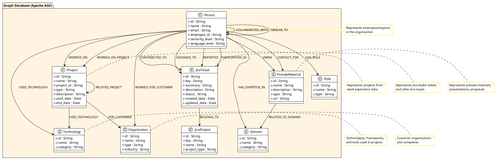

**Key Relationships:**

1. **Relational Model:**
    - `documents` stores vector embeddings for semantic search
    - `entities` stores normalized entities (Person, Project, Technology, etc.)
    - `entity_relationships` stores relationship metadata with strength and recency scores
    - `chats`, `conversation_history`, and `chat_memory_summaries` manage user conversations

2. **Graph Model (Apache AGE):**
    - **Person** (employees/experts) is the central vertex type
    - **Work Experience**: `Person -[:WORKED_ON]-> Project`, `Person -[:USED_TECHNOLOGY]-> Technology`
    - **Jira Activity**: `Person -[:CONTRIBUTED_TO|ASSIGNED_TO|REPORTED]-> JiraTicket`
    - **Presale Ownership**: `Person -[:OWNS|CONTACT_FOR]-> PresaleMaterial`
    - **Expertise**: `Person -[:HAS_EXPERTISE_IN]-> Domain`

3. **Hybrid Search:**
    - Vector search uses `documents` table with embeddings
    - Graph traversal uses Apache AGE relationships
    - Keyword search uses PostgreSQL full-text on `documents.content`
    - Results are fused using RRF (Reciprocal Rank Fusion)

4. **Chat Management:**
    - Each user has multiple `chats` (one default)
    - Each chat has `conversation_history` messages
    - Long conversations are summarized in `chat_memory_summaries`

### 6.2 API Specifications

#### 6.2.0 API Versioning Strategy

**Current Version**: v1 (1.0.0)

**Versioning Approach**: URL Path Versioning

- All API endpoints are prefixed with `/api/v1/`
- Version is embedded in the URL path: `/api/v1/{resource}`
- Example: `/api/v1/query`, `/api/v1/chats`, `/api/v1/ingestion`

**Version Format**:

- **Major Version**: Incremented for breaking changes (v1 → v2)
- **Minor Version**: Incremented for backward-compatible additions (1.0 → 1.1)
- **Patch Version**: Incremented for bug fixes (1.0.0 → 1.0.1)
- **OpenAPI Info Version**: Reflects semantic version (e.g., "1.0.0")
- **URL Path Version**: Reflects major version only (e.g., `/api/v1/`, `/api/v2/`)

**Versioning Policy**:

1. **Breaking Changes** (require new major version):
- Removing endpoints
    - Removing required fields from request/response
    - Changing field types (e.g., string → integer)
    - Changing HTTP methods for endpoints
    - Changing authentication requirements
    - Removing enum values that clients might depend on

2. **Non-Breaking Changes** (same major version):
- Adding new endpoints
    - Adding optional fields to request/response
    - Adding new enum values
    - Adding new query parameters
    - Extending response objects with new fields
    - Improving error messages (same error codes)

3. **Backward Compatibility Requirements**:
- **Minimum Support**: Previous major version must be supported for at least 6 months after new version release
    - **Deprecation Notice**: Deprecated endpoints must be marked in OpenAPI spec with `deprecated: true`
    - **Deprecation Period**: At least 3 months notice before removing deprecated endpoints
    - **Migration Guide**: Provide migration guide when introducing new major version

**Version Implementation**:

**Controller Structure**:

```java
@RestController
@RequestMapping("/api/v1/query")
public class QueryControllerV1 {
    // v1 implementation
}

// Future v2 implementation
@RestController
@RequestMapping("/api/v2/query")
public class QueryControllerV2 {
    // v2 implementation with breaking changes
}
```

**OpenAPI Specification Versioning**:

- Each major version has its own OpenAPI specification
- OpenAPI spec accessible at `/api/v1/openapi.json` for v1
- Future v2 spec accessible at `/api/v2/openapi.json`
- OpenAPI `info.version` field reflects semantic version (e.g., "1.0.0", "2.0.0")

**Version Negotiation** (Future Enhancement):
- **Accept Header**: `Accept: application/vnd.expertmatch.v1+json`
- **Default Version**: If no version specified, default to latest stable version
- **Version Discovery**: `/api/versions` endpoint lists available versions

**Version Lifecycle**:

1. **Development**: New version developed in parallel with existing version
2. **Beta**: New version available for testing with `/api/v2-beta/` prefix
3. **Stable**: New version promoted to `/api/v2/` after beta period
4. **Deprecated**: Old version marked as deprecated, migration period begins
5. **End of Life**: Old version removed after deprecation period

**Example Version Evolution**:

```
v1.0.0 (Current):
  POST /api/v1/query
  Response: { answer: string, sources: [...] }

v1.1.0 (Minor update - backward compatible):
  POST /api/v1/query
  Response: { answer: string, sources: [...], metadata: {...} }  // Added optional field

v2.0.0 (Major update - breaking change):
  POST /api/v2/query
  Request: { query: string, options: {...} }  // Changed structure
  Response: { result: {...}, confidence: number }  // Changed response structure
```

**Client Generation Impact**:

- Client applications can generate separate clients for each major version
- Client applications can support multiple versions simultaneously
- Version-specific OpenAPI specs enable version-specific client generation

#### 6.2.1 OpenAPI Specification

The API is defined using OpenAPI 3.0 specification. The specification serves as the single source of truth for the API
contract and enables automatic client generation for client applications and other consumers.

**OpenAPI Specification Requirements**:

- **Format**: OpenAPI 3.0.3 (JSON or YAML)
- **Accessibility**:
- MUST be accessible at `/api/v1/openapi.json` (JSON format, recommended for client generation)
    - MUST be accessible at `/v3/api-docs` (SpringDoc default endpoint)
    - SHOULD be accessible via Swagger UI at `/swagger-ui.html` for interactive documentation
- **Completeness**:
- ALL endpoints MUST be documented
    - ALL request/response schemas MUST be defined
    - ALL error responses MUST be documented (400, 401, 403, 404, 500, etc.)
    - Authentication requirements MUST be specified using security schemes
    - Path parameters, query parameters, and request bodies MUST be fully documented
- **Maintenance**:
- OpenAPI spec MUST be updated immediately when API changes
    - OpenAPI spec MUST be validated as part of CI/CD pipeline
    - Breaking changes MUST be versioned appropriately (new major version)
    - Non-breaking changes MUST be reflected in same major version (minor/patch update)
    - Deprecated endpoints MUST be marked with `deprecated: true` in OpenAPI spec
    - Deprecation notices MUST include removal date and migration path
- **Client Generation Compatibility**:
- OpenAPI spec MUST be compatible with openapi-generator for TypeScript/JavaScript
    - All schemas MUST be valid and properly typed
    - Response examples SHOULD be provided for better client generation
- **Source Location**:
- Primary: Static file at `src/main/resources/api/openapi.yaml` (API-first approach)
    - OpenAPI spec is the single source of truth
    - Controllers implement generated interfaces to ensure contract compliance
    - SpringDoc OpenAPI serves the spec and generates interactive documentation
    - Alternative: Static file at `src/main/resources/api/openapi.yaml` (contract-first approach)
    - Recommended: Code-first with SpringDoc annotations for automatic synchronization

**OpenAPI Specification Structure:**

```yaml
openapi: 3.0.3
info:
  title: ExpertMatch API
  version: 1.0.0
  description: GraphRAG-powered expert discovery and matching service for RFPs and team formation
  contact:
    name: API Support
    email: api-support@example.com
servers:

- url: https://api.example.com/api/v1
    description: Production server
  - url: http://localhost:8093/api/v1
    description: Development server
paths:
  /query:
    post:
      summary: Process natural language query
      operationId: processQuery
      tags:
- Query
      requestBody:
        required: true
        content:
          application/json:
            schema:
              $ref: '#/components/schemas/QueryRequest'
      responses:
        '200':
          description: Successful response
          content:
            application/json:
              schema:
                $ref: '#/components/schemas/QueryResponse'
        '400':
          $ref: '#/components/responses/BadRequest'
        '401':
          $ref: '#/components/responses/Unauthorized'
        '500':
          $ref: '#/components/responses/InternalServerError'
  /chats:
    post:
      summary: Create a new chat
      operationId: createChat
      tags:
- Chat Management
      requestBody:
        required: false
        content:
          application/json:
            schema:
              $ref: '#/components/schemas/CreateChatRequest'
      responses:
        '201':
          description: Chat created successfully
          content:
            application/json:
              schema:
                $ref: '#/components/schemas/Chat'
    get:
      summary: List all chats for the authenticated user
      operationId: listChats
      tags:
- Chat Management
      responses:
        '200':
          description: List of chats
          content:
            application/json:
              schema:
                $ref: '#/components/schemas/ChatListResponse'
  /chats/{chatId}:
    get:
      summary: Get chat details
      operationId: getChat
      tags:
- Chat Management
      parameters:
- name: chatId
          in: path
          required: true
          schema:
            type: string
            pattern: '^[0-9a-fA-F]{24}$'
          description: MongoDB-compatible 24-character chat ID
      responses:
        '200':
          description: Chat details
          content:
            application/json:
              schema:
                $ref: '#/components/schemas/Chat'
    patch:
      summary: Update chat (e.g., rename)
      operationId: updateChat
      tags:
- Chat Management
      parameters:
- name: chatId
          in: path
          required: true
          schema:
            type: string
            pattern: '^[0-9a-fA-F]{24}$'
      requestBody:
        required: true
        content:
          application/json:
            schema:
              $ref: '#/components/schemas/UpdateChatRequest'
      responses:
        '200':
          description: Chat updated successfully
          content:
            application/json:
              schema:
                $ref: '#/components/schemas/Chat'
    delete:
      summary: Delete a chat
      operationId: deleteChat
      tags:
- Chat Management
      parameters:
- name: chatId
          in: path
          required: true
          schema:
            type: string
            pattern: '^[0-9a-fA-F]{24}$'
      responses:
        '200':
          description: Chat deleted successfully
        '400':
          description: Cannot delete default chat
  /chats/{chatId}/history:
    get:
      summary: Get conversation history for a chat
      operationId: getConversationHistory
      tags:
- Chat Management
      parameters:
- name: chatId
          in: path
          required: true
          schema:
            type: string
            pattern: '^[0-9a-fA-F]{24}$'
        - name: page
          in: query
          schema:
            type: integer
            default: 0
        - name: size
          in: query
          schema:
            type: integer
            default: 20
        - name: sort
          in: query
          schema:
            type: string
            default: sequence_number,asc
      responses:
        '200':
          description: Conversation history
          content:
            application/json:
              schema:
                $ref: '#/components/schemas/ConversationHistoryResponse'
components:
  schemas:
    QueryRequest:
      type: object
      required:
- query
      properties:
        query:
          type: string
          description: Natural language query
          example: "Looking for experts in Semantic/Industrial Modeling"
        chatId:
          type: string
          pattern: '^[0-9a-fA-F]{24}$'
          description: Optional chat ID for conversation context (MongoDB-compatible 24-char string)
          example: "507f1f77bcf86cd799439011"
        options:
          $ref: '#/components/schemas/QueryOptions'
    Chat:
      type: object
      required:
- id
        - isDefault
        - createdAt
      properties:
        id:
          type: string
          pattern: '^[0-9a-fA-F]{24}$'
          description: MongoDB-compatible 24-character chat ID
          example: "507f1f77bcf86cd799439011"
        name:
          type: string
          description: Chat name
          example: "Default Chat"
        isDefault:
          type: boolean
          description: Whether this is the user's default chat
        createdAt:
          type: string
          format: date-time
        updatedAt:
          type: string
          format: date-time
        lastActivityAt:
          type: string
          format: date-time
        messageCount:
          type: integer
          description: Total number of messages in this chat
    CreateChatRequest:
      type: object
      properties:
        name:
          type: string
          description: Optional chat name
          example: "RFP Project X"
    UpdateChatRequest:
      type: object
      properties:
        name:
          type: string
          description: Chat name to update
    ChatListResponse:
      type: object
      properties:
        chats:
          type: array
          items:
            $ref: '#/components/schemas/Chat'
        total:
          type: integer
    ConversationMessage:
      type: object
      required:
- id
        - messageType
        - role
        - content
        - sequenceNumber
      properties:
        id:
          type: string
          pattern: '^[0-9a-fA-F]{24}$'
          description: MongoDB-compatible 24-character message ID
        messageType:
          type: string
          enum: [user, assistant]
        role:
          type: string
          enum: [user, assistant]
        content:
          type: string
        sequenceNumber:
          type: integer
        tokensUsed:
          type: integer
        createdAt:
          type: string
          format: date-time
        metadata:
          type: object
    ConversationHistoryResponse:
      type: object
      required:
- chatId
        - messages
      properties:
        chatId:
          type: string
          pattern: '^[0-9a-fA-F]{24}$'
        messages:
          type: array
          items:
            $ref: '#/components/schemas/ConversationMessage'
        page:
          $ref: '#/components/schemas/PageInfo'
    PageInfo:
      type: object
      properties:
        number:
          type: integer
        size:
          type: integer
        totalElements:
          type: integer
        totalPages:
          type: integer
    QueryOptions:
      type: object
      properties:
        maxResults:
          type: integer
          minimum: 1
          maximum: 100
          default: 10
        minConfidence:
          type: number
          minimum: 0
          maximum: 1
          default: 0.7
        includeSources:
          type: boolean
          default: true
        includeEntities:
          type: boolean
          default: true
        rerank:
          type: boolean
          default: true
        deepResearch:
          type: boolean
          default: false
        includeExecutionTrace:
          type: boolean
          description: Include execution trace in response (step-by-step processing details with LLM models and token usage)
          default: false
    QueryResponse:
      type: object
      required:
- answer
        - confidence
        - queryId
      properties:
        answer:
          type: string
          description: Generated answer
        sources:
          type: array
          items:
            $ref: '#/components/schemas/Source'
        entities:
          type: array
          items:
            $ref: '#/components/schemas/Entity'
        confidence:
          type: number
          minimum: 0
          maximum: 1
        queryId:
          type: string
        processingTimeMs:
          type: integer
  securitySchemes:
    bearerAuth:
      type: http
      scheme: bearer
      bearerFormat: JWT
  paths:
    /test-data/generate:
      post:
        summary: Generate test data (Development/Test only)
        operationId: generateTestData
        tags:
- Test Data
        security:
- bearerAuth: []
        requestBody:
          required: true
          content:
            application/json:
              schema:
                $ref: '#/components/schemas/TestDataGenerationRequest'
        responses:
          '202':
            description: Test data generation started
            content:
              application/json:
                schema:
                  $ref: '#/components/schemas/TestDataGenerationResponse'
          '403':
            description: Forbidden - Test data generation disabled in production
    /test-data:
      delete:
        summary: Clear test data (Development/Test only)
        operationId: clearTestData
        tags:
- Test Data
        security:
- bearerAuth: []
        parameters:
- name: confirm
            in: query
            required: true
            schema:
              type: boolean
        responses:
          '200':
            description: Test data cleared successfully
          '403':
            description: Forbidden - Test data generation disabled in production
  schemas:
    TestDataGenerationRequest:
      type: object
      required:
- size
      properties:
        size:
          type: string
          enum: [small, medium, large, custom]
          description: Size of test data to generate
        custom:
          type: object
          description: Custom entity counts (required if size = custom)
          properties:
            employees:
              type: integer
              minimum: 1
            projects:
              type: integer
              minimum: 1
            workExperienceRecords:
              type: integer
              minimum: 1
            jiraTickets:
              type: integer
              minimum: 1
            presaleMaterials:
              type: integer
              minimum: 1
        clearExisting:
          type: boolean
          default: false
          description: Whether to clear existing test data first
        seed:
          type: integer
          description: Random seed for reproducible data (optional)
    TestDataGenerationResponse:
      type: object
      properties:
        jobId:
          type: string
          pattern: '^[0-9a-fA-F]{24}$'
        status:
          type: string
          enum: [processing, completed, failed]
        size:
          type: string
        estimatedEntities:
          type: object
        estimatedTimeSeconds:
          type: integer
security:

- bearerAuth: []
```

**Code Generation (Maven):**

```xml
<plugin>
    <groupId>org.openapitools</groupId>
    <artifactId>openapi-generator-maven-plugin</artifactId>
    <version>7.5.0</version>
    <configuration>
        <inputSpec>${project.basedir}/src/main/resources/api/openapi.yaml</inputSpec>
        <generatorName>spring</generatorName>
        <output>${project.build.directory}/generated-sources/openapi</output>
        <apiPackage>com.berdachuk.expertmatch.api</apiPackage>
        <modelPackage>com.berdachuk.expertmatch.api.model</modelPackage>
        <library>spring-boot</library>
        <configOptions>
            <interfaceOnly>true</interfaceOnly>
            <useSpringBoot3>true</useSpringBoot3>
            <dateLibrary>java8</dateLibrary>
            <java8>true</java8>
            <serializationLibrary>jackson</serializationLibrary>
            <useJakartaEe>true</useJakartaEe>
            <sourceFolder>src/main/java</sourceFolder>
        </configOptions>
    </configuration>
</plugin>
```

**Model Mapping (MapStruct):**

```xml
<dependency>
    <groupId>org.mapstruct</groupId>
    <artifactId>mapstruct</artifactId>
    <version>1.6.2</version>
</dependency>
```

MapStruct is configured in the Maven compiler plugin annotation processor paths to generate type-safe mappers between
API and domain models.

**API Documentation:**

- **Swagger UI**: Available at `/swagger-ui.html` (development) or `/api/v1/swagger-ui.html` (production)
- **OpenAPI JSON**: Available at `/v3/api-docs` or `/api/v1/v3/api-docs`
- **OpenAPI YAML**: Available at `/v3/api-docs.yaml` or `/api/v1/v3/api-docs.yaml`

#### 6.2.2 Query Endpoint

**Request:**

```http
POST /api/v1/query
Content-Type: application/json
Authorization: Bearer <jwt-token>

{
  "query": "Looking for experts in Semantic/Industrial Modeling for an urgent customer need.",
  "chatId": "507f1f77bcf86cd799439011",
  "options": {
    "maxResults": 10,
    "minConfidence": 0.7,
    "includeSources": true,
    "includeEntities": true,
    "rerank": true,
    "deepResearch": false
  }
}
```

**Note**: If `chatId` is not provided, the system will:

1. Retrieve or create the user's default chat
2. Use the default chat for conversation context
3. Return the `chatId` in the response for subsequent requests

**Response:**

```json
{
  "answer": "Based on the project requirements, I found the following experts:\n\n1. **John Doe** (A4, English B2+)\n   - Must-have skills:  Java 21+, Spring Boot, AWS, MongoDB, Gradle\n   - Nice-to-have:  Kubernetes, Terraform, Datadog\n   - Relevant experience: Built ETL pipelines handling 10M+ records/day, Spring WebFlux microservices\n   - Projects: [Project X - AWS, MongoDB], [Project Y - Kubernetes, Terraform]\n   - Contact: john.doe@example.com\n\n2. **Jane Smith** (A3, English B2+)\n   - Must-have skills:  Java 21+, Spring Boot, AWS, MongoDB\n   - Nice-to-have:  Helm, Datadog\n   - Relevant experience: On-call rotation, monitoring with Datadog, Spring Boot services\n   - Projects: [Project Z - Production systems, 24/7 support]\n   - Contact: jane.smith@example.com",
  "experts": [
    {
      "id": "12345",
      "name": "John Doe",
      "email": "john.doe@example.com",
      "seniority": "A4",
      "language": {
        "english": "B2+"
      },
      "skillMatch": {
        "mustHaveMatched": 6,
        "mustHaveTotal": 6,
        "niceToHaveMatched": 3,
        "niceToHaveTotal": 5,
        "matchScore": 0.95
      },
      "matchedSkills": {
        "mustHave": ["Java 21+", "Spring Boot", "AWS", "MongoDB", "Gradle"],
        "niceToHave": ["Kubernetes", "Terraform", "Datadog"]
      },
      "relevantProjects": [
        {
          "name": "Project X",
          "technologies": ["AWS", "MongoDB", "Spring Boot"],
          "role": "Backend Developer",
          "duration": "12 months"
        },
        {
          "name": "Project Y",
          "technologies": ["Kubernetes", "Terraform", "Docker"],
          "role": "DevOps Engineer",
          "duration": "6 months"
        }
      ],
      "experience": {
        "etlPipelines": true,
        "highPerformanceServices": true,
        "systemArchitecture": true,
        "monitoring": true,
        "onCall": false
      },
      "relevanceScore": 0.95,
      "availability": "available"
    },
    {
      "id": "12346",
      "name": "Jane Smith",
      "email": "jane.smith@example.com",
      "seniority": "A3",
      "language": {
        "english": "B2+"
      },
      "skillMatch": {
        "mustHaveMatched": 4,
        "mustHaveTotal": 6,
        "niceToHaveMatched": 2,
        "niceToHaveTotal": 5,
        "matchScore": 0.75
      },
      "matchedSkills": {
        "mustHave": ["Java 21+", "Spring Boot", "AWS", "MongoDB"],
        "niceToHave": ["Helm", "Datadog"]
      },
      "relevantProjects": [
        {
          "name": "Project Z",
          "technologies": ["Spring Boot", "Datadog", "Production Systems"],
          "role": "Backend Developer",
          "duration": "8 months"
        }
      ],
      "experience": {
        "etlPipelines": false,
        "highPerformanceServices": true,
        "systemArchitecture": false,
        "monitoring": true,
        "onCall": true
      },
      "relevanceScore": 0.82,
      "availability": "available"
    }
  ],
  "sources": [
    {
      "type": "expert",
      "id": "12345",
      "title": "John Doe - Full Stack Developer",
      "relevanceScore": 0.95,
      "metadata": {
        "email": "john.doe@example.com",
        "seniority": "A4",
        "projects": ["Project X", "Project Y"],
        "technologies": ["Java 21+", "Spring Boot", "AWS", "MongoDB", "Kubernetes"]
      }
    },
    {
      "type": "project",
      "id": "proj_001",
      "title": "Project X - AWS Migration",
      "relevanceScore": 0.88,
      "metadata": {
        "technologies": ["AWS", "MongoDB", "Spring Boot"],
        "duration": "12 months"
      }
    }
  ],
  "entities": [
    {
      "type": "person",
      "name": "John Doe",
      "id": "12345"
    },
    {
      "type": "person",
      "name": "Jane Smith",
      "id": "12346"
    },
    {
      "type": "technology",
      "name": "Java 21+",
      "id": "tech_java21"
    },
    {
      "type": "technology",
      "name": "Spring Boot",
      "id": "tech_springboot"
    }
  ],
  "confidence": 0.92,
  "queryId": "query_abc123",
  "chatId": "507f1f77bcf86cd799439011",
  "messageId": "507f1f77bcf86cd799439012",
  "processingTimeMs": 1245,
  "summary": {
    "totalExpertsFound": 8,
    "perfectMatches": 2,
    "goodMatches": 4,
    "partialMatches": 2
  }
}
```

**Note:** The `experts` array provides structured expert data essential for enterprise expert discovery and team
formation workflows. This enables client applications to:

- Display expert cards with detailed information
- Filter and sort experts by match score, seniority, or skills
- Show skill match breakdowns (must-have vs nice-to-have)
- Display relevant project experience
- Enable direct contact actions (email, MS Teams)
- Support RFP response workflows with structured expert recommendations
- Facilitate team formation by providing match scores and skill coverage

The `summary` object provides quick statistics for understanding the overall match quality and distribution of results.

#### 6.2.2 Streaming Query Endpoint

**Request:**

```http
POST /api/v1/query-stream
Content-Type: application/json
Authorization: Bearer <jwt-token>

{
  "query": "Need help with performance diagnostics for a banking app in Ecuador",
  "options": {
    "stream": true
  }
}
```

**Response:** Server-Sent Events (SSE)

```
data: {"stage": "parsing", "progress": 10}
data: {"stage": "retrieval", "progress": 30, "resultsFound": 15}
data: {"stage": "reranking", "progress": 60}
data: {"stage": "generation", "progress": 80, "answerChunk": "Based on our knowledge base..."}
data: {"stage": "complete", "progress": 100, "answer": "...", "sources": [...]}
```

#### 6.2.3 Chat Management Endpoints

**Create Chat:**

```http
POST /api/v1/chats
Content-Type: application/json
Authorization: Bearer <jwt-token>

{
  "name": "RFP Project X" -- Optional: Custom chat name
}
```

**Response:**

```json
{
  "id": "507f1f77bcf86cd799439011",
  "name": "RFP Project X",
  "isDefault": false,
  "createdAt": "2025-01-27T10:30:00Z",
  "updatedAt": "2025-01-27T10:30:00Z",
  "lastActivityAt": "2025-01-27T10:30:00Z",
  "messageCount": 0
}
```

**List Chats:**

```http
GET /api/v1/chats
Authorization: Bearer <jwt-token>
```

**Response:**

```json
{
  "chats": [
    {
      "id": "507f1f77bcf86cd799439011",
      "name": "Default Chat",
      "isDefault": true,
      "createdAt": "2025-01-27T08:00:00Z",
      "updatedAt": "2025-01-27T10:25:00Z",
      "lastActivityAt": "2025-01-27T10:25:00Z",
      "messageCount": 15
    },
    {
      "id": "507f1f77bcf86cd799439012",
      "name": "RFP Project X",
      "isDefault": false,
      "createdAt": "2025-01-27T09:00:00Z",
      "updatedAt": "2025-01-27T10:30:00Z",
      "lastActivityAt": "2025-01-27T10:30:00Z",
      "messageCount": 8
    }
  ],
  "total": 2
}
```

**Get Chat Details:**

```http
GET /api/v1/chats/{chatId}
Authorization: Bearer <jwt-token>
```

**Response:**

```json
{
  "id": "507f1f77bcf86cd799439011",
  "name": "Default Chat",
  "isDefault": true,
  "createdAt": "2025-01-27T08:00:00Z",
  "updatedAt": "2025-01-27T10:25:00Z",
  "lastActivityAt": "2025-01-27T10:25:00Z",
  "messageCount": 15,
  "metadata": {}
}
```

**Update Chat:**

```http
PATCH /api/v1/chats/{chatId}
Content-Type: application/json
Authorization: Bearer <jwt-token>

{
  "name": "Updated Chat Name"
}
```

**Delete Chat:**

```http
DELETE /api/v1/chats/{chatId}
Authorization: Bearer <jwt-token>
```

**Response:**

```json
{
  "success": true,
  "message": "Chat deleted successfully"
}
```

**Note**: Default chat cannot be deleted. Attempting to delete a default chat will return a 400 Bad Request error.

**Get Conversation History:**

```http
GET /api/v1/chats/{chatId}/history
Authorization: Bearer <jwt-token>
?page=0
&size=20
&sort=sequence_number,asc
```

**Response:**

```json
{
  "chatId": "507f1f77bcf86cd799439011",
  "messages": [
    {
      "id": "507f1f77bcf86cd799439013",
      "messageType": "user",
      "role": "user",
      "content": "Looking for experts in Semantic Modeling",
      "sequenceNumber": 1,
      "createdAt": "2025-01-27T08:00:00Z",
      "metadata": {}
    },
    {
      "id": "507f1f77bcf86cd799439014",
      "messageType": "assistant",
      "role": "assistant",
      "content": "Based on the project requirements, I found the following experts...",
      "sequenceNumber": 2,
      "tokensUsed": 1250,
      "createdAt": "2025-01-27T08:00:05Z",
      "metadata": {
        "sources": [...],
        "entities": [...]
      }
    }
  ],
  "page": {
    "number": 0,
    "size": 20,
    "totalElements": 15,
    "totalPages": 1
  }
}
```

#### 6.2.4 Ingestion Endpoints

**Trigger Ingestion:**

```http
POST /api/v1/ingestion/trigger/{sourceName}
Content-Type: application/json
Authorization: Bearer <jwt-token>

{
  "batchSize": 1000,
  "force": false
}
```

**Response:**

```json
{
  "sourceName": "work-experience-source",
  "status": "started",
  "batchSize": 1000,
  "estimatedRecords": 5000
}
```

**Get Ingestion Status:**

```http
GET /api/v1/ingestion/status
Authorization: Bearer <jwt-token>
```

**Response:**

```json
{
  "sources": [
    {
      "sourceName": "work-experience-source",
      "sourceType": "postgresql",
      "status": "active",
      "lastOffset": 1548380,
      "lastTimestamp": "2025-01-27T10:30:00Z",
      "recordsProcessed": 125000,
      "recordsFailed": 5,
      "lastError": null
    },
    {
      "sourceName": "kafka-work-experience",
      "sourceType": "kafka",
      "status": "active",
      "lastOffset": 1548376,
      "recordsProcessed": 89000,
      "recordsFailed": 2
    }
  ]
}
```

**File Upload Ingestion:**

```http
POST /api/v1/ingestion/file
Content-Type: multipart/form-data
Authorization: Bearer <jwt-token>

file: <file>
sourceName: work-experience-import
format: json
```

**Response:**

```json
{
  "jobId": "job_abc123",
  "status": "processing",
  "recordsFound": 1000,
  "estimatedTimeSeconds": 30
}
```

### 6.3 Configuration

#### 6.3.1 Gradle Dependencies

**Main Dependencies** (`build.gradle`):

```gradle
plugins {
    id 'java'
    id 'org.springframework.boot' version '3.4.0'
    id 'io.spring.dependency-management' version '1.1.7'
}

java {
    toolchain {
        languageVersion = JavaLanguageVersion.of(21)
    }
}

dependencies {
    // Spring Boot
    implementation 'org.springframework.boot:spring-boot-starter-web'
    
    // Spring Modulith
    implementation 'org.springframework.modulith:spring-modulith-starter-core'
    implementation 'org.springframework.modulith:spring-modulith-events'
    
    // Spring AI
    implementation 'org.springframework.ai:spring-ai-openai-spring-boot-starter'
    implementation 'org.springframework.ai:spring-ai-ollama-spring-boot-starter'
    
    // Spring JDBC
    implementation 'org.springframework.boot:spring-boot-starter-jdbc'
    
    // PostgreSQL
    runtimeOnly 'org.postgresql:postgresql'
    
    // Apache AGE JDBC Driver
    implementation 'org.apache.age:age-jdbc-driver'
    
    // Lombok
    compileOnly 'org.projectlombok:lombok'
    annotationProcessor 'org.projectlombok:lombok'
    
    // OpenAPI / Swagger
    implementation 'org.springdoc:springdoc-openapi-starter-webmvc-ui'
    
    // Kafka
    implementation 'org.springframework.kafka:spring-kafka'
    
    // Avro
    implementation 'io.confluent:kafka-avro-serializer'
    
    // OAuth2 Resource Server
    implementation 'org.springframework.boot:spring-boot-starter-oauth2-resource-server'
    
    // Actuator
    implementation 'org.springframework.boot:spring-boot-starter-actuator'
    
    // MCP (Model Context Protocol) Server
    implementation 'com.fasterxml.jackson.core:jackson-databind'
    // JSON-RPC 2.0 for MCP protocol
    implementation 'com.github.briandilley.jsonrpc4j:jsonrpc4j:1.6'
    // SSE (Server-Sent Events) for MCP transport
    implementation 'org.springframework:spring-webflux'
    
    // Test dependencies
    testImplementation 'org.springframework.modulith:spring-modulith-starter-test'
    testImplementation 'org.springframework.modulith:spring-modulith-events-test'
    testImplementation 'org.testcontainers:testcontainers'
    testImplementation 'org.testcontainers:postgresql'
    testImplementation 'org.testcontainers:kafka'
    testImplementation 'io.cucumber:cucumber-java'
    testImplementation 'io.cucumber:cucumber-spring'
    testImplementation 'io.cucumber:cucumber-junit-platform-engine'
    testImplementation 'org.springframework.boot:spring-boot-starter-test'
}
```

#### 6.3.2 Spring Modulith Configuration

**Application Properties** (`application.yml`):

```yaml
spring:
  modulith:
    # Enable module boundary validation
    detect-strategies: explicit
    # Generate module documentation
    documentation:
      enabled: true
      output-directory: target/modulith-docs
    # Event publication configuration
    events:
      # Enable async event publication
      async:
        enabled: true
        executor: eventTaskExecutor
```

**Module Structure Configuration** (`src/main/resources/modules.properties`):

```properties
# Module definitions
modules=api,query,retrieval,ingestion,embedding,graph,llm,data,application

# Module dependencies
api.depends-on=query,retrieval,ingestion,llm
query.depends-on=retrieval,embedding
retrieval.depends-on=data,graph,embedding
ingestion.depends-on=embedding,graph,data
llm.depends-on=retrieval,embedding
graph.depends-on=data
```

**Module Package Structure**:

```java
// Module marker interface
package com.berdachuk.expertmatch;

@ApplicationModule(
    name = "api",
    displayName = "API Module",
    allowedDependencies = {"query", "retrieval", "ingestion", "llm"}
)
public interface ApiModule {}
```

#### 6.3.3 Security Configuration

**MVP: RBAC Simulation Implementation**

For MVP, we implement a simplified RBAC simulation that:

- Extracts roles from JWT claims
- Enforces role-based access at the endpoint level
- Uses Spring Security's `@PreAuthorize` for method-level checks
- Does not require a database or dynamic role management

**SecurityConfig Class (MVP)** (`src/main/java/com/berdachuk/expertmatch/config/SecurityConfig.java`):

```java
package com.expertmatch.config;

import org.springframework.context.annotation.Bean;
import org.springframework.context.annotation.Configuration;
import org.springframework.security.config.annotation.method.configuration.EnableMethodSecurity;
import org.springframework.security.config.annotation.web.builders.HttpSecurity;
import org.springframework.security.config.annotation.web.configuration.EnableWebSecurity;
import org.springframework.security.config.http.SessionCreationPolicy;
import org.springframework.security.core.GrantedAuthority;
import org.springframework.security.core.authority.SimpleGrantedAuthority;
import org.springframework.security.oauth2.jwt.Jwt;
import org.springframework.security.oauth2.server.resource.authentication.JwtAuthenticationConverter;
import org.springframework.security.oauth2.server.resource.authentication.JwtGrantedAuthoritiesConverter;
import org.springframework.security.web.SecurityFilterChain;
import org.springframework.web.cors.CorsConfiguration;
import org.springframework.web.cors.CorsConfigurationSource;
import org.springframework.web.cors.UrlBasedCorsConfigurationSource;

import java.util.Arrays;
import java.util.Collection;
import java.util.List;
import java.util.stream.Collectors;

@Configuration
@EnableWebSecurity
@EnableMethodSecurity(prePostEnabled = true)
public class SecurityConfig {

    @Bean
    public SecurityFilterChain securityFilterChain(HttpSecurity http) throws Exception {
        http
            .csrf(csrf -> csrf.disable()) // Disable CSRF for stateless JWT
            .cors(cors -> cors.configurationSource(corsConfigurationSource()))
            .sessionManagement(session -> 
                session.sessionCreationPolicy(SessionCreationPolicy.STATELESS))
            .authorizeHttpRequests(auth -> auth
                // Public endpoints
                .requestMatchers("/actuator/health", "/actuator/info").permitAll()
                .requestMatchers("/v3/api-docs/**", "/swagger-ui/**", "/swagger-ui.html").permitAll()
                // Query endpoints - require EXPERT_MATCH_USER role (MVP: RBAC simulation)
                .requestMatchers("/api/v1/query/**").hasAnyRole("EXPERT_MATCH_USER", "EXPERT_MATCH_ADMIN")
                // Ingestion endpoints - require EXPERT_MATCH_ADMIN or EXPERT_MATCH_INGESTION role (MVP: RBAC simulation)
                .requestMatchers("/api/v1/ingestion/**").hasAnyRole("EXPERT_MATCH_ADMIN", "EXPERT_MATCH_INGESTION")
                // Test data generation endpoints - require EXPERT_MATCH_TESTER role (disabled in production)
                .requestMatchers("/api/v1/test-data/**").hasRole("EXPERT_MATCH_TESTER")
                // All other endpoints require authentication
                .anyRequest().authenticated()
            )
            .oauth2ResourceServer(oauth2 -> oauth2
                .jwt(jwt -> jwt
                    .jwtAuthenticationConverter(jwtAuthenticationConverter())
                )
            );
        
        return http.build();
    }

    @Bean
    public JwtAuthenticationConverter jwtAuthenticationConverter() {
        JwtGrantedAuthoritiesConverter authoritiesConverter = 
            new JwtGrantedAuthoritiesConverter();
        authoritiesConverter.setAuthorityPrefix("ROLE_");
        authoritiesConverter.setAuthoritiesClaimName("authorities");
        
        JwtAuthenticationConverter authenticationConverter = 
            new JwtAuthenticationConverter();
        authenticationConverter.setJwtGrantedAuthoritiesConverter(authoritiesConverter);
        
        return authenticationConverter;
    }
    
    /**
     * Alternative: Custom authority converter if authorities are in a different format
     */
    @Bean
    public JwtGrantedAuthoritiesConverter customJwtGrantedAuthoritiesConverter() {
        return new JwtGrantedAuthoritiesConverter() {
            @Override
            public Collection<GrantedAuthority> convert(Jwt jwt) {
                // Extract authorities from JWT claim
                List<String> authorities = jwt.getClaimAsStringList("authorities");
                if (authorities == null) {
                    return List.of();
                }
                return authorities.stream()
                    .map(auth -> new SimpleGrantedAuthority("ROLE_" + auth))
                    .collect(Collectors.toList());
            }
        };
    }

    @Bean
    public CorsConfigurationSource corsConfigurationSource() {
        CorsConfiguration configuration = new CorsConfiguration();
        configuration.setAllowedOrigins(List.of(
            System.getenv().getOrDefault("CORS_ALLOWED_ORIGINS", "http://localhost:3000").split(",")
        ));
        configuration.setAllowedMethods(Arrays.asList("GET", "POST", "PUT", "DELETE", "OPTIONS"));
        configuration.setAllowedHeaders(Arrays.asList("*"));
        configuration.setAllowCredentials(true);
        configuration.setMaxAge(3600L);
        
        UrlBasedCorsConfigurationSource source = new UrlBasedCorsConfigurationSource();
        source.registerCorsConfiguration("/**", configuration);
        return source;
    }
}
```

**Controller Security Example (MVP: RBAC Simulation)** (
`src/main/java/com/berdachuk/expertmatch/api/query/QueryController.java`):

```java
package com.berdachuk.expertmatch.api.query;

import org.springframework.security.access.prepost.PreAuthorize;
import org.springframework.web.bind.annotation.*;

/**
 * Query Controller with RBAC simulation (MVP).
 * Roles are extracted from JWT token claims.
 * Full RBAC with dynamic role management will be implemented post-MVP.
 */
@RestController
@RequestMapping("/api/v1/query")
public class QueryController {
    
    /**
     * Process query - requires EXPERT_MATCH_USER or EXPERT_MATCH_ADMIN role.
     * MVP: Role check is based on JWT claim only.
     */
    @PostMapping
    @PreAuthorize("hasAnyRole('EXPERT_MATCH_USER', 'EXPERT_MATCH_ADMIN')")
    public QueryResponse processQuery(@RequestBody QueryRequest request) {
        // Implementation
    }
    
    /**
     * Stream query - requires EXPERT_MATCH_USER or EXPERT_MATCH_ADMIN role.
     * MVP: Role check is based on JWT claim only.
     */
    @PostMapping("/stream")
    @PreAuthorize("hasAnyRole('EXPERT_MATCH_USER', 'EXPERT_MATCH_ADMIN')")
    public ResponseEntity<StreamingResponseBody> streamQuery(@RequestBody QueryRequest request) {
        // Implementation
    }
}
```

**Ingestion Controller Security (MVP: RBAC Simulation)** (
`src/main/java/com/berdachuk/expertmatch/api/ingestion/IngestionController.java`):

```java
package com.berdachuk.expertmatch.api.ingestion;

import org.springframework.security.access.prepost.PreAuthorize;
import org.springframework.web.bind.annotation.*;

/**
 * Ingestion Controller with RBAC simulation (MVP).
 * Requires EXPERT_MATCH_ADMIN or EXPERT_MATCH_INGESTION role.
 * Full RBAC with dynamic role management will be implemented post-MVP.
 */
@RestController
@RequestMapping("/api/v1/ingestion")
public class IngestionController {
    
    /**
     * Trigger ingestion - requires EXPERT_MATCH_ADMIN or EXPERT_MATCH_INGESTION role.
     * MVP: Role check is based on JWT claim only.
     */
    @PostMapping("/trigger")
    @PreAuthorize("hasAnyRole('EXPERT_MATCH_ADMIN', 'EXPERT_MATCH_INGESTION')")
    public IngestionJobResponse triggerIngestion(@RequestBody IngestionRequest request) {
        // Implementation
    }
    
    /**
     * Get ingestion status - requires EXPERT_MATCH_ADMIN or EXPERT_MATCH_INGESTION role.
     * MVP: Role check is based on JWT claim only.
     */
    @GetMapping("/status/{jobId}")
    @PreAuthorize("hasAnyRole('EXPERT_MATCH_ADMIN', 'EXPERT_MATCH_INGESTION')")
    public IngestionStatusResponse getIngestionStatus(@PathVariable String jobId) {
        // Implementation
    }
}
```

**Test Data Generation Controller (MVP: RBAC Simulation + Environment Check)** (
`src/main/java/com/berdachuk/expertmatch/api/testdata/TestDataController.java`):

```java
package com.berdachuk.expertmatch.api.testdata;

import org.springframework.beans.factory.annotation.Value;
import org.springframework.http.HttpStatus;
import org.springframework.security.access.prepost.PreAuthorize;
import org.springframework.web.bind.annotation.*;
import org.springframework.web.server.ResponseStatusException;

/**
 * Test Data Generation Controller with RBAC simulation (MVP).
 * Requires EXPERT_MATCH_TESTER role.
 * Disabled in production environment regardless of role.
 */
@RestController
@RequestMapping("/api/v1/test-data")
public class TestDataController {
    
    @Value("${expertmatch.test-data.enabled:false}")
    private boolean testDataEnabled;
    
    @Value("${spring.profiles.active:}")
    private String activeProfile;
    
    /**
     * Generate test data - requires EXPERT_MATCH_TESTER role.
     * Disabled in production environment.
     * MVP: Role check is based on JWT claim only.
     */
    @PostMapping("/generate")
    @PreAuthorize("hasRole('EXPERT_MATCH_TESTER')")
    public TestDataGenerationResponse generateTestData(@RequestBody TestDataGenerationRequest request) {
        // Check if test data generation is enabled
        if (!testDataEnabled || "prod".equals(activeProfile)) {
            throw new ResponseStatusException(
                HttpStatus.FORBIDDEN, 
                "Test data generation is disabled in production environment"
            );
        }
        
        // Implementation: Generate test data using Datafaker
        return testDataGeneratorService.generateTestData(request);
    }
    
    /**
     * Get test data generation status - requires EXPERT_MATCH_TESTER role.
     * Disabled in production environment.
     */
    @GetMapping("/status/{jobId}")
    @PreAuthorize("hasRole('EXPERT_MATCH_TESTER')")
    public TestDataGenerationStatusResponse getStatus(@PathVariable String jobId) {
        if (!testDataEnabled || "prod".equals(activeProfile)) {
            throw new ResponseStatusException(
                HttpStatus.FORBIDDEN, 
                "Test data generation is disabled in production environment"
            );
        }
        return testDataGeneratorService.getStatus(jobId);
    }
    
    /**
     * Clear test data - requires EXPERT_MATCH_TESTER role.
     * Disabled in production environment.
     */
    @DeleteMapping
    @PreAuthorize("hasRole('EXPERT_MATCH_TESTER')")
    public TestDataCleanupResponse clearTestData(@RequestParam(defaultValue = "false") boolean confirm) {
        if (!testDataEnabled || "prod".equals(activeProfile)) {
            throw new ResponseStatusException(
                HttpStatus.FORBIDDEN, 
                "Test data generation is disabled in production environment"
            );
        }
        
        if (!confirm) {
            throw new ResponseStatusException(
                HttpStatus.BAD_REQUEST, 
                "Confirmation required. Use ?confirm=true"
            );
        }
        
        return testDataCleanupService.clearTestData();
    }
}
```

**JWT Token Structure Expected (MVP: RBAC Simulation)**:

```json
{
  "sub": "user@example.com",
  "authorities": ["EXPERT_MATCH_USER"],
  "iss": "https://oauth.example.com",
  "aud": "expertmatch-service",
  "exp": 1234567890,
  "iat": 1234567890
}
```

**Note**: In MVP, roles are provided by the OAuth2 authorization server in the JWT token. The service extracts these
roles and uses them for access control. No database lookup or dynamic role management is required.

**Key Improvements over Original Project**:

1.  **Explicit SecurityConfig**: Security rules are explicitly defined and enforced
2.  **Method-level Security**: `@PreAuthorize` annotations on controllers
3.  **Role-based Access Control (Simulated)**: Different roles for different endpoints (MVP)
4.  **CORS Configuration**: Proper CORS setup (not open to all origins)
5.  **JWT Authority Mapping**: Proper mapping of JWT claims to Spring Security authorities
6.  **Stateless Sessions**: STATELESS session policy for JWT-based authentication
7.  **MVP-Ready**: Simplified RBAC simulation suitable for initial release

#### 6.3.4 OpenAPI Configuration

**SpringDoc OpenAPI Configuration** (`application.yml`):

```yaml
springdoc:
  api-docs:
    path: /v3/api-docs
    enabled: true
  swagger-ui:
    path: /swagger-ui.html
    enabled: true
    operations-sorter: method
    tags-sorter: alpha
    try-it-out-enabled: true
  show-actuator: true
  default-consumes-media-type: application/json
  default-produces-media-type: application/json
```

**OpenAPI Configuration Bean**:

```java
@Configuration
public class OpenApiConfig {
    
    @Bean
    public OpenAPI expertMatchOpenAPI() {
        return new OpenAPI()
            .info(new Info()
                .title("ExpertMatch API")
                .version("1.0.0")
                .description("GraphRAG-powered expert discovery and matching service for RFPs and team formation. " +
                           "This API enables automatic client generation for client applications using OpenAPI generators.")
                .contact(new Contact()
                    .name("API Support")
                    .email("api-support@example.com"))
                .license(new License()
                    .name("Proprietary")
                    .url("https://example.com/license")))
            .servers(List.of(
                new Server()
                        .url("http://localhost:8093/api/v1")
                    .description("Development Server"),
                new Server()
                    .url("https://api.expertmatch.com/api/v1")
                    .description("Production Server")))
            .components(new Components()
                .addSecuritySchemes("bearerAuth", 
                    new SecurityScheme()
                        .type(SecurityScheme.Type.HTTP)
                        .scheme("bearer")
                        .bearerFormat("JWT")
                        .description("OAuth2 JWT token authentication. Include token in Authorization header as 'Bearer <token>'.")))
            .addSecurityItem(new SecurityRequirement().addList("bearerAuth"))
            // Add tags for better organization
            .tags(List.of(
                new Tag().name("Query").description("Query processing endpoints"),
                new Tag().name("Chat Management").description("Chat and conversation management"),
                new Tag().name("Ingestion").description("Data ingestion endpoints"),
                new Tag().name("System").description("System and health check endpoints")));
    }
    
    /**
     * Customize OpenAPI spec generation to ensure client generation compatibility
     */
    @Bean
    public OperationCustomizer operationCustomizer() {
        return (operation, handlerMethod) -> {
            // Ensure all operations have proper operation IDs for client generation
            if (operation.getOperationId() == null || operation.getOperationId().isEmpty()) {
                String methodName = handlerMethod.getMethod().getName();
                String className = handlerMethod.getBeanType().getSimpleName();
                operation.setOperationId(className + "_" + methodName);
            }
            return operation;
        };
    }
}
```

**OpenAPI Specification Validation** (in tests):

```java
@SpringBootTest
class OpenApiSpecValidationTest {
    
    @Autowired
    private OpenAPI openAPI;
    
    @Test
    void testOpenApiSpecIsValid() {
        assertThat(openAPI).isNotNull();
        assertThat(openAPI.getInfo()).isNotNull();
        assertThat(openAPI.getInfo().getTitle()).isEqualTo("ExpertMatch API");
        assertThat(openAPI.getInfo().getVersion()).isEqualTo("1.0.0");
        assertThat(openAPI.getPaths()).isNotEmpty();
        
        // Validate all paths have security requirements
        openAPI.getPaths().forEach((path, pathItem) -> {
            pathItem.readOperations().forEach(operation -> {
                assertThat(operation.getSecurity())
                    .as("Operation %s on path %s must have security requirement", 
                        operation.getOperationId(), path)
                    .isNotEmpty();
            });
        });
    }
    
    @Test
    void testOpenApiSpecIsAccessible() throws Exception {
        // Test that OpenAPI spec is accessible at expected endpoints
        // This test can be run as part of integration tests
    }
}
```

#### 6.3.2 Application Configuration (application.yml)

```yaml
spring:
  application:
    name: expertmatch-service
  
  ai:
    # Custom configuration for separate providers and base URLs per component
    # Each component (chat, embedding, reranking) can use a different provider
    custom:
      chat:
        # Provider: 'ollama' or 'openai' (default: 'openai')
        provider: ${CHAT_PROVIDER:${LLM_PROVIDER:openai}}
        base-url: ${CHAT_BASE_URL:${LLM_OPENAI_BASE_URL:${OPENAI_BASE_URL:}}}
        api-key: ${CHAT_API_KEY:${LLM_OPENAI_API_KEY:${OPENAI_API_KEY:}}}
        model: ${CHAT_MODEL:${LLM_OPENAI_CHAT_MODEL:${OPENAI_CHAT_MODEL:gpt-4-turbo-preview}}}
        temperature: ${CHAT_TEMPERATURE:${LLM_OPENAI_TEMPERATURE:${OPENAI_TEMPERATURE:0.7}}}
      embedding:
        # Provider: 'ollama' or 'openai' (default: 'openai')
        provider: ${EMBEDDING_PROVIDER:${EMBEDDING_OPENAI_PROVIDER:openai}}
        base-url: ${EMBEDDING_BASE_URL:${EMBEDDING_OPENAI_BASE_URL:${OPENAI_BASE_URL:}}}
        api-key: ${EMBEDDING_API_KEY:${EMBEDDING_OPENAI_API_KEY:${OPENAI_API_KEY:}}}
        model: ${EMBEDDING_MODEL:${EMBEDDING_OPENAI_MODEL:${OPENAI_EMBEDDING_MODEL:text-embedding-3-large}}}
        dimensions: ${EMBEDDING_DIMENSIONS:${EMBEDDING_OPENAI_DIMENSIONS:${OPENAI_EMBEDDING_DIMENSIONS:1536}}}
      reranking:
        # Provider: 'ollama' or 'openai' (default: 'ollama')
        provider: ${RERANKING_PROVIDER:${RERANKING_OPENAI_PROVIDER:ollama}}
        base-url: ${RERANKING_BASE_URL:${RERANKING_OPENAI_BASE_URL:${OLLAMA_BASE_URL:http://localhost:11435}}}
        api-key: ${RERANKING_API_KEY:${RERANKING_OPENAI_API_KEY:${OPENAI_API_KEY:}}}
        model: ${RERANKING_MODEL:${RERANKING_OPENAI_MODEL:${OLLAMA_RERANKING_MODEL:dengcao/Qwen3-Reranker-8B:Q4_K_M}}}
        temperature: ${RERANKING_TEMPERATURE:${RERANKING_OPENAI_TEMPERATURE:0.1}}
    
    # Legacy auto-configuration (fallback if custom configuration not provided)
    openai:
      api-key: ${OPENAI_API_KEY:}
      chat:
        options:
          model: ${OPENAI_CHAT_MODEL:gpt-4-turbo-preview}
          temperature: 0.7
          max-tokens: 2000
      embedding:
        options:
          # Cloud embedding model: OpenAI text-embedding-3-large
          # Dimensions: 1536 (RECOMMENDED - optimal balance)
          # 1536 provides 95-98% of full quality with 50% less storage and 20-30% faster queries
          # Note: 3072 dimensions are NOT RECOMMENDED (only 1-2% quality gain, 2x storage overhead)
          model: ${OPENAI_EMBEDDING_MODEL:text-embedding-3-large}
          dimensions: ${OPENAI_EMBEDDING_DIMENSIONS:1536}  # 1536 is recommended (optimal balance)
    
    ollama:
      base-url: ${OLLAMA_BASE_URL:http://localhost:11434}
      chat:
        options:
          # Recommended: RuadaptQwen2.5-14B-Instruct (60% faster, better Russian support)
          # Alternative: T-lite-it-1.0 or T-pro-it-2.0 (T-Bank models, optimized for business tasks)
          model: ${OLLAMA_CHAT_MODEL:ruadapt-qwen2.5-14b-instruct}
          temperature: 0.7
          max-tokens: 2000
      embedding:
        options:
          # Local embedding model: Qwen3-Embedding-8B (SOTA, #1 in MTEB multilingual benchmarks)
          # Alternative: bge-m3 (strong multilingual), multilingual-e5-large
          # Dimensions: 1024 (fixed for Qwen3-Embedding-8B)
          model: ${OLLAMA_EMBEDDING_MODEL:qwen3-embedding:8b}
          dimensions: ${OLLAMA_EMBEDDING_DIMENSIONS:1024}  # Fixed: Qwen3-Embedding-8B uses 1024
      reranking:
        options:
          # Recommended: Qwen3-Reranker-8B or bge-reranker-v2-m3
          model: ${OLLAMA_RERANKER_MODEL:qwen3-reranker:8b}
  
  datasource:
    url: jdbc:postgresql://${DB_HOST:localhost}:${DB_PORT:5432}/${DB_NAME:expertmatch_db}
    username: ${DB_USERNAME:postgres}
    password: ${DB_PASSWORD:postgres}
    driver-class-name: org.postgresql.Driver
    hikari:
      maximum-pool-size: 20
      minimum-idle: 5
      idle-timeout: 300000
      connection-timeout: 20000
  
  # Security configuration
  # Note: Authentication and authorization are handled by Spring Gateway.
  # Spring Gateway validates JWT tokens and populates user information in HTTP headers:
  # - X-User-Id: User identifier
  # - X-User-Roles: Comma-separated list of roles (e.g., "ROLE_USER,ROLE_ADMIN")
  # - X-User-Email: User email address

server:
  port: 8080
  servlet:
    context-path: /api/v1

expertmatch:
  retrieval:
    vector-search:
      top-k: 50
      similarity-threshold: 0.7
      # Embedding model: Qwen3-Embedding-8B (recommended) or bge-m3 (alternative)
      embedding-model: ${EMBEDDING_MODEL:qwen3-embedding-8b}
      # Recommended: 1024 dimensions (optimal balance of quality and performance)
      # For OpenAI text-embedding-3-large: use 1536 (1/2 of 3072) for optimal balance
      # Full 3072 provides minimal quality improvement (< 2%) but 2x storage/index overhead
      embedding-dimensions: ${EMBEDDING_DIMENSIONS:1024}
    graph-traversal:
      max-depth: 3
      max-nodes: 100
    reranking:
      enabled: true
      # Recommended: Qwen3-Reranker-8B (SOTA) or bge-reranker-v2-m3 (alternative)
      model: ${RERANKER_MODEL:qwen3-reranker-8b}
      top-k: 20
      # Performance target: 10-20% improvement in NDCG@10
    fusion:
      method: rrf
      k: 60
    # Hybrid search: Vector + BM25 (keyword-based) for domain-specific tasks
    hybrid-search:
      enabled: true
      bm25-weight: 0.3
      vector-weight: 0.7
  
  llm:
    provider: ${LLM_PROVIDER:openai}
    max-context-length: 8000
    temperature: 0.7
  
  chat:
    # Conversation memory configuration
    history:
      # Maximum tokens for conversation history in context
      # Adjust based on model context window and prompt size
      # Default: 2000 tokens (leaves room for query, expert info, and instructions)
      max-tokens: ${EXPERTMATCH_CHAT_HISTORY_MAX_TOKENS:2000}
      # Maximum number of recent messages to include in context
      # Default: 10 messages
      max-messages: ${EXPERTMATCH_CHAT_HISTORY_MAX_MESSAGES:10}
      # Maximum tokens for summarized context
      # When history exceeds limits, older messages are automatically summarized using LLM
      # Default: 500 tokens per summary
      max-summary-tokens: ${EXPERTMATCH_CHAT_HISTORY_MAX_SUMMARY_TOKENS:500}
    # Default chat creation
    default-chat:
      # Auto-create default chat on first query if not exists
      auto-create: true
      # Default chat name pattern
      name-pattern: "Default Chat"
  
  kafka:
    bootstrap-servers: ${KAFKA_BOOTSTRAP_SERVERS}
    topics:
- work-experience
      - internal-communications
      - project-updates
    consumer:
      group-id: expertmatch-consumer-group
      auto-offset-reset: earliest
      enable-auto-commit: false
    schema-registry:
      url: ${SCHEMA_REGISTRY_URL}
  
  ingestion:
    # Jira/Intakes Integration
    jira-sources:
- name: jira-intakes
        api-url: ${JIRA_API_URL}
        api-token: ${JIRA_API_TOKEN}
        jql-query: "project = INTAKE AND updated >= {lastUpdateDate}"
        fields:
- summary
          - description
          - assignee
          - reporter
          - contributors
          - participants
          - project
          - created
          - updated
        schedule: "0 */6 * * *" # Every 6 hours
        incremental: true
        last-update-field: updated
    
    # PostgreSQL Source Integration
    postgresql-sources:
- name: work-experience-source
        jdbc-url: ${SOURCE_DB_JDBC_URL}
        username: ${SOURCE_DB_USERNAME}
        password: ${SOURCE_DB_PASSWORD}
        table: workexperiencejson
        query: |
          SELECT * FROM workexperiencejson 
          WHERE status = 'new' 
          ORDER BY message_offset 
          LIMIT :batchSize
        batch-size: 1000
        offset-column: message_offset
        status-column: status
        status-new-value: 'new'
        status-processed-value: 'processed'
        json-column: value
        schedule: "0 */6 * * *" # Every 6 hours
    
    # Presale Materials Integration
    presale-sources:
- name: presale-materials
        source-type: file-system # or api, database
        path: ${PRESALE_MATERIALS_PATH}
        schedule: "0 0 * * *" # Daily at midnight
        extract-slides: true
        generate-per-slide-embeddings: true
    
    enabled-sources:
- kafka
      - postgresql
      - jira
      - presale
  
  # MCP Server Configuration
  mcp:
    # Enable MCP server (true by default)
    enabled: ${MCP_ENABLED:true}
    # MCP server base path
    base-path: ${MCP_BASE_PATH:/mcp}
    # MCP server name
    name: ExpertMatch
    # MCP server version
    version: 1.0.0
    # MCP server description
    description: GraphRAG-powered expert discovery and matching service
    # Transport protocol: http-sse, stdio, or both
    transport: ${MCP_TRANSPORT:http-sse}
    # HTTP/SSE endpoint (if transport includes http-sse)
    http-sse:
      endpoint: ${MCP_HTTP_SSE_ENDPOINT:/mcp/sse}
      port: ${MCP_PORT:8080}
    # Authentication
    authentication:
      # Require OAuth2 JWT token (same as REST API)
      enabled: ${MCP_AUTH_ENABLED:true}
      # JWT claim name for roles
      role-claim: ${MCP_ROLE_CLAIM:authorities}
      # Required role for MCP access
      required-role: ${MCP_REQUIRED_ROLE:EXPERT_MATCH_USER}

management:
  endpoints:
    web:
      exposure:
        include: health,info,prometheus,metrics
  endpoint:
    health:
      show-details: always
  metrics:
    export:
      prometheus:
        enabled: true

logging:
  level:
    root: INFO
    com.berdachuk.expertmatch: DEBUG
    org.springframework.ai: DEBUG
```

### 6.4 ID Generation

#### 6.4.1 MongoDB-Compatible ID Format

ExpertMatch uses **MongoDB-compatible ObjectId format** for internal application identifiers (chats, messages, etc.).
This format provides:

- **24-character hexadecimal string**: Exactly 24 characters, using digits 0-9 and letters a-f (case-insensitive)
- **Pattern**: `^[0-9a-fA-F]{24}$`
- **Uniqueness**: High probability of uniqueness without database sequence
- **Sortability**: IDs are sortable by creation time (first 8 characters represent timestamp)
- **No External Dependencies**: Can be generated without database round-trip

#### 6.4.2 ID Generation Strategy: Java-Side vs PostgreSQL Function

**Decision: Use Java-Side Generation (Recommended)**

**Comparison:**

| Aspect                       | Java-Side Generation                                | PostgreSQL Function                                  |
|------------------------------|-----------------------------------------------------|------------------------------------------------------|
| **Performance**              |  No database round-trip                            |  Requires database call per ID                      |
| **Batch Operations**         |  Generate IDs in memory, batch insert              |  Multiple function calls or complex SQL             |
| **Pre-insert Relationships** |  Can generate IDs before insert, set relationships |  Need to insert first, then update relationships    |
| **Distributed Systems**      |  Works offline, no DB dependency                   |  Requires database connection                       |
| **Transaction Overhead**     |  Minimal (just string generation)                  |  Function call overhead per ID                      |
| **Bulk Insert Performance**  |  Fast (generate 1000s IDs in memory)               |  Slower (function call per row)                     |
| **Complexity**               |  Simple utility class                              |  Requires PostgreSQL function creation/maintenance |

**Performance Analysis for 100k Employees:**

**Scenario 1: Bulk Insert (1M work experience records)**

- **Java-side**:
- Generate 1M IDs: ~100ms (in-memory)
    - Batch insert: ~5-10 seconds
    - **Total**: ~5-10 seconds
- **PostgreSQL function**:
- Generate + insert per row: Function call overhead × 1M
    - Estimated: ~15-30 seconds (3-6x slower)
    - **Total**: ~15-30 seconds

**Scenario 2: Single Insert**

- **Java-side**: < 1ms (no DB call)
- **PostgreSQL function**: ~1-2ms (function call overhead)
- **Difference**: Negligible for single inserts

**Scenario 3: Batch Insert with Relationships**

- **Java-side**:
- Generate entity IDs first
    - Generate relationship IDs with FK references
    - Single batch insert
    - **Efficient**: All IDs known before insert
- **PostgreSQL function**:
- Insert entities, get IDs from RETURNING
    - Generate relationship IDs with function
    - Insert relationships
    - **Less efficient**: Multiple round-trips

**PostgreSQL Function Implementation (Alternative):**

If you prefer database-side generation, here's how to implement it:

```sql
-- Create PostgreSQL function for MongoDB-compatible ID generation
CREATE OR REPLACE FUNCTION generate_objectid() 
RETURNS CHAR(24) AS $$
DECLARE
    id CHAR(24);
    hex_chars CHAR(16) := '0123456789abcdef';
    i INT;
BEGIN
    id := '';
    FOR i IN 1..24 LOOP
        id := id || substr(hex_chars, floor(random() * 16)::int + 1, 1);
    END LOOP;
    RETURN id;
END;
$$ LANGUAGE plpgsql;

-- Use in table definition
CREATE TABLE documents (
    id CHAR(24) PRIMARY KEY DEFAULT generate_objectid(),
    ...
);

-- Or in INSERT statements
INSERT INTO documents (id, content) 
VALUES (generate_objectid(), 'content');
```

**Performance Issues with PostgreSQL Function:**

1. **Function Call Overhead**: Each ID generation requires a function call
2. **Random Number Generation**: PostgreSQL's `random()` is slower than Java's `SecureRandom`
3. **String Concatenation**: Multiple string operations in PL/pgSQL
4. **Bulk Operations**: Cannot efficiently generate thousands of IDs at once

**Hybrid Approach (If Needed):**

For very high-volume scenarios, you could use a hybrid approach:

```sql
-- PostgreSQL function for bulk generation
CREATE OR REPLACE FUNCTION generate_objectid_batch(count INT)
RETURNS TABLE(id CHAR(24)) AS $$
DECLARE
    i INT;
    hex_chars CHAR(16) := '0123456789abcdef';
    generated_id CHAR(24);
BEGIN
    FOR i IN 1..count LOOP
        generated_id := '';
        FOR j IN 1..24 LOOP
            generated_id := generated_id || substr(hex_chars, floor(random() * 16)::int + 1, 1);
        END LOOP;
        RETURN NEXT;
    END LOOP;
    RETURN;
END;
$$ LANGUAGE plpgsql;

-- Usage
INSERT INTO documents (id, content)
SELECT id, content FROM generate_objectid_batch(1000), unnest(ARRAY['content1', 'content2', ...]);
```

However, this is still slower than Java-side generation.

**Recommendation: Java-Side Generation**

 **Use Java-side generation** because:

1. **Better Performance**: Especially for bulk operations (3-6x faster)
2. **Flexibility**: Generate IDs before insert, set relationships easily
3. **No Database Dependency**: Can generate IDs offline, in tests, etc.
4. **Simpler Code**: Single utility class, no database function maintenance
5. **Distributed-Friendly**: Works in microservices, no shared database state
6. **Batch Operations**: Critical for ingestion (millions of records)

**Java Implementation (Enhanced):**

```java
package com.berdachuk.expertmatch.util;

import java.security.SecureRandom;
import java.time.Instant;
import java.util.ArrayList;
import java.util.List;

/**
 * Utility for generating MongoDB-compatible 24-character hexadecimal IDs.
 * 
 * Format: True MongoDB ObjectId format:
 * - 4 bytes: Unix timestamp (seconds since epoch)
 * - 5 bytes: Machine identifier (hash of hostname/MAC)
 * - 3 bytes: Process ID
 * - 3 bytes: Counter (per process)
 * 
 * Simplified version: 24 random hex characters (sufficient for uniqueness)
 */
public class IdGenerator {
    
    private static final SecureRandom random = new SecureRandom();
    private static final char[] HEX_CHARS = "0123456789abcdef".toCharArray();
    
    // Machine identifier (5 bytes = 10 hex chars)
    private static final String MACHINE_ID = generateMachineId();
    
    // Process counter (3 bytes = 6 hex chars, 0-16,777,215)
    private static int counter = random.nextInt(0xFFFFFF);
    
    /**
     * Generates a MongoDB-compatible 24-character hexadecimal ID.
     * Uses simplified random approach for performance.
     * 
     * @return 24-character hexadecimal string
     */
    public static String generateId() {
        char[] id = new char[24];
        for (int i = 0; i < 24; i++) {
            id[i] = HEX_CHARS[random.nextInt(16)];
        }
        return new String(id);
    }
    
    /**
     * Generates a true MongoDB ObjectId format (with timestamp).
     * Slower but provides timestamp information.
     * 
     * @return 24-character hexadecimal string with embedded timestamp
     */
    public static String generateObjectId() {
        // 4 bytes timestamp (8 hex chars)
        long timestamp = Instant.now().getEpochSecond();
        String timestampHex = String.format("%08x", timestamp);
        
        // 5 bytes machine ID (10 hex chars)
        String machineId = MACHINE_ID;
        
        // 3 bytes process ID (6 hex chars)
        int processId = getProcessId();
        String processIdHex = String.format("%06x", processId);
        
        // 3 bytes counter (6 hex chars)
        synchronized (IdGenerator.class) {
            counter = (counter + 1) % 0xFFFFFF;
        }
        String counterHex = String.format("%06x", counter);
        
        return timestampHex + machineId + processIdHex + counterHex;
    }
    
    /**
     * Generates multiple IDs efficiently (for bulk operations).
     * 
     * @param count Number of IDs to generate
     * @return List of generated IDs
     */
    public static List<String> generateIds(int count) {
        List<String> ids = new ArrayList<>(count);
        for (int i = 0; i < count; i++) {
            ids.add(generateId());
        }
        return ids;
    }
    
    /**
     * Validates if a string is a valid MongoDB-compatible ID.
     * 
     * @param id The ID to validate
     * @return true if valid, false otherwise
     */
    public static boolean isValidId(String id) {
        return id != null && id.length() == 24 && id.matches("^[0-9a-fA-F]{24}$");
    }
    
    /**
     * Extracts timestamp from MongoDB ObjectId (if using generateObjectId).
     * 
     * @param objectId The ObjectId string
     * @return Instant representing the creation time, or null if invalid
     */
    public static Instant extractTimestamp(String objectId) {
        if (!isValidId(objectId) || objectId.length() < 8) {
            return null;
        }
        try {
            long timestamp = Long.parseLong(objectId.substring(0, 8), 16);
            return Instant.ofEpochSecond(timestamp);
        } catch (NumberFormatException e) {
            return null;
        }
    }
    
    private static String generateMachineId() {
        // Generate 10-character hex string from machine identifier
        // In production, could use hostname hash, MAC address, etc.
        byte[] bytes = new byte[5];
        random.nextBytes(bytes);
        StringBuilder sb = new StringBuilder();
        for (byte b : bytes) {
            sb.append(HEX_CHARS[(b & 0xF0) >> 4]);
            sb.append(HEX_CHARS[b & 0x0F]);
        }
        return sb.toString();
    }
    
    private static int getProcessId() {
        // Get process ID (or generate random if not available)
        try {
            String pid = java.lang.management.ManagementFactory
                .getRuntimeMXBean()
                .getName()
                .split("@")[0];
            return Integer.parseInt(pid) % 0xFFFFFF;
        } catch (Exception e) {
            return random.nextInt(0xFFFFFF);
        }
    }
}
```

**Usage Examples:**

```java
// Single ID generation
String chatId = IdGenerator.generateId();

// Bulk ID generation (for batch inserts)
List<String> ids = IdGenerator.generateIds(1000);

// With timestamp (true ObjectId format)
String objectId = IdGenerator.generateObjectId();
Instant createdAt = IdGenerator.extractTimestamp(objectId);

// Validation
if (IdGenerator.isValidId(chatId)) {
    // Process valid ID
}
```

**Database Column Type:**

- PostgreSQL: `CHAR(24)` for fixed-length storage
- Index: Create indexes on ID columns for fast lookups
- Foreign Keys: Use `CHAR(24)` for foreign key references
- **No DEFAULT clause needed** (IDs generated in Java before insert)

### 6.5 Data Models

**Note**: Data models are generated from OpenAPI specification using OpenAPI Generator Maven Plugin. The models below
represent the structure, but actual implementation uses generated classes from `com.berdachuk.expertmatch.api.model`
package.
Domain models in `com.berdachuk.expertmatch.query`, `com.berdachuk.expertmatch.chat`, etc. are mapped to/from API models
using
MapStruct (`ApiMapper`).

#### 6.4.1 Query Request

```java
// Generated from OpenAPI spec
@Schema(description = "Query request")
public class QueryRequest {
    @Schema(required = true, description = "Natural language query")
    private String query;
    
    @Schema(description = "Chat ID for conversation context (MongoDB-compatible 24-char string)")
    @Pattern(regexp = "^[0-9a-fA-F]{24}$", message = "Chat ID must be a 24-character hexadecimal string")
    private String chatId;
    
    @Schema(description = "Query options")
    private QueryOptions options;
    
    // Getters, setters, constructors
}

@Schema(description = "Query options")
public class QueryOptions {
    @Schema(description = "Maximum number of results", minimum = "1", maximum = "100", defaultValue = "10")
    private Integer maxResults = 10;
    
    @Schema(description = "Minimum confidence score", minimum = "0", maximum = "1", defaultValue = "0.7")
    private Double minConfidence = 0.7;
    
    @Schema(description = "Include sources in response", defaultValue = "true")
    private Boolean includeSources = true;
    
    @Schema(description = "Include entities in response", defaultValue = "true")
    private Boolean includeEntities = true;
    
    @Schema(description = "Enable semantic reranking", defaultValue = "false")
    private Boolean rerank = true;
    
    @Schema(description = "Enable deep research (SGR pattern)", defaultValue = "false")
    private Boolean deepResearch = false;
    
    @Schema(description = "Include execution trace in response (step-by-step processing details with LLM models and token usage)", defaultValue = "false")
    private Boolean includeExecutionTrace = false;
    
    // Getters, setters, constructors
}
```

#### 6.4.2 Query Response

```java
// Generated from OpenAPI spec
@Schema(description = "Query response")
public class QueryResponse {
    @Schema(required = true, description = "Generated answer")
    private String answer;
    
    @Schema(description = "List of matched experts with detailed information")
    private List<ExpertMatch> experts;
    
    @Schema(description = "List of sources")
    private List<Source> sources;
    
    @Schema(description = "List of entities")
    private List<Entity> entities;
    
    @Schema(required = true, description = "Confidence score", minimum = "0", maximum = "1")
    private Double confidence;
    
    @Schema(required = true, description = "Query ID")
    private String queryId;
    
    @Schema(description = "Processing time in milliseconds")
    private Long processingTimeMs;
    
    @Schema(description = "Chat ID used for this query")
    private String chatId;
    
    @Schema(description = "Message ID for this response")
    private String messageId;
    
    @Schema(description = "Summary statistics of expert matches")
    private MatchSummary summary;
    
    @Schema(description = "Step-by-step execution trace (only included if includeExecutionTrace=true)")
    private ExecutionTrace executionTrace;
    
    // Getters, setters, constructors
}

@Schema(description = "Expert match information")
public class ExpertMatch {
    @Schema(required = true, description = "Expert ID")
    private String id;
    
    @Schema(required = true, description = "Expert name")
    private String name;
    
    @Schema(description = "Expert email")
    private String email;
    
    @Schema(description = "Seniority level (e.g., A3, A4, A5)")
    private String seniority;
    
    @Schema(description = "Language proficiency")
    private LanguageProficiency language;
    
    @Schema(description = "Skill match details")
    private SkillMatch skillMatch;
    
    @Schema(description = "Matched skills breakdown")
    private MatchedSkills matchedSkills;
    
    @Schema(description = "Relevant projects")
    private List<RelevantProject> relevantProjects;
    
    @Schema(description = "Experience indicators")
    private Experience experience;
    
    @Schema(description = "Relevance score (0-1)")
    private Double relevanceScore;
    
    @Schema(description = "Availability status")
    private String availability;
    
    // Getters, setters, constructors
}

@Schema(description = "Skill match details")
public class SkillMatch {
    @Schema(description = "Number of must-have skills matched")
    private Integer mustHaveMatched;
    
    @Schema(description = "Total number of must-have skills required")
    private Integer mustHaveTotal;
    
    @Schema(description = "Number of nice-to-have skills matched")
    private Integer niceToHaveMatched;
    
    @Schema(description = "Total number of nice-to-have skills")
    private Integer niceToHaveTotal;
    
    @Schema(description = "Overall match score (0-1)")
    private Double matchScore;
    
    // Getters, setters, constructors
}

@Schema(description = "Matched skills breakdown")
public class MatchedSkills {
    @Schema(description = "List of matched must-have skills")
    private List<String> mustHave;
    
    @Schema(description = "List of matched nice-to-have skills")
    private List<String> niceToHave;
    
    // Getters, setters, constructors
}

@Schema(description = "Relevant project information")
public class RelevantProject {
    @Schema(description = "Project name")
    private String name;
    
    @Schema(description = "Technologies used in project")
    private List<String> technologies;
    
    @Schema(description = "Role in project")
    private String role;
    
    @Schema(description = "Project duration")
    private String duration;
    
    // Getters, setters, constructors
}

@Schema(description = "Experience indicators")
public class Experience {
    @Schema(description = "Has ETL pipeline experience")
    private Boolean etlPipelines;
    
    @Schema(description = "Has high-performance services experience")
    private Boolean highPerformanceServices;
    
    @Schema(description = "Has system architecture experience")
    private Boolean systemArchitecture;
    
    @Schema(description = "Has monitoring/observability experience")
    private Boolean monitoring;
    
    @Schema(description = "Has on-call rotation experience")
    private Boolean onCall;
    
    // Getters, setters, constructors
}

@Schema(description = "Language proficiency")
public class LanguageProficiency {
    @Schema(description = "English proficiency level")
    private String english;
    
    // Getters, setters, constructors
}

@Schema(description = "Match summary statistics")
public class MatchSummary {
    @Schema(description = "Total number of experts found")
    private Integer totalExpertsFound;
    
    @Schema(description = "Number of perfect matches (matchScore >= 0.9)")
    private Integer perfectMatches;
    
    @Schema(description = "Number of good matches (0.7 <= matchScore < 0.9)")
    private Integer goodMatches;
    
    @Schema(description = "Number of partial matches (matchScore < 0.7)")
    private Integer partialMatches;
    
    // Getters, setters, constructors
}
```

#### 6.4.3 Chat Models

```java
@Schema(description = "Chat information")
public class Chat {
    @Schema(required = true, description = "Chat ID (MongoDB-compatible 24-char string)")
    @Pattern(regexp = "^[0-9a-fA-F]{24}$")
    private String id;
    
    @Schema(description = "Chat name")
    private String name;
    
    @Schema(description = "Whether this is the user's default chat")
    private Boolean isDefault;
    
    @Schema(description = "Chat creation timestamp")
    private Instant createdAt;
    
    @Schema(description = "Last update timestamp")
    private Instant updatedAt;
    
    @Schema(description = "Last activity timestamp")
    private Instant lastActivityAt;
    
    @Schema(description = "Total message count in this chat")
    private Integer messageCount;
    
    @Schema(description = "Additional metadata")
    private Map<String, Object> metadata;
    
    // Getters, setters, constructors
}

@Schema(description = "Chat creation request")
public class CreateChatRequest {
    @Schema(description = "Optional chat name")
    private String name;
    
    // Getters, setters, constructors
}

@Schema(description = "Chat update request")
public class UpdateChatRequest {
    @Schema(description = "Chat name to update")
    private String name;
    
    // Getters, setters, constructors
}

@Schema(description = "Conversation message")
public class ConversationMessage {
    @Schema(required = true, description = "Message ID (MongoDB-compatible 24-char string)")
    @Pattern(regexp = "^[0-9a-fA-F]{24}$")
    private String id;
    
    @Schema(required = true, description = "Message type", allowableValues = {"user", "assistant"})
    private String messageType;
    
    @Schema(required = true, description = "Role for LLM context", allowableValues = {"user", "assistant"})
    private String role;
    
    @Schema(required = true, description = "Message content")
    private String content;
    
    @Schema(required = true, description = "Sequence number within chat")
    private Integer sequenceNumber;
    
    @Schema(description = "Tokens used (for assistant messages)")
    private Integer tokensUsed;
    
    @Schema(description = "Message creation timestamp")
    private Instant createdAt;
    
    @Schema(description = "Additional metadata (sources, entities, etc.)")
    private Map<String, Object> metadata;
    
    // Getters, setters, constructors
}

@Schema(description = "Conversation history response")
public class ConversationHistoryResponse {
    @Schema(required = true, description = "Chat ID")
    private String chatId;
    
    @Schema(required = true, description = "List of messages")
    private List<ConversationMessage> messages;
    
    @Schema(description = "Pagination information")
    private PageInfo page;
    
    // Getters, setters, constructors
}

@Schema(description = "Source information")
public class Source {
    @Schema(description = "Source type", allowableValues = {"expert", "project", "document"})
    private String type;
    
    @Schema(description = "Source ID")
    private String id;
    
    @Schema(description = "Source title")
    private String title;
    
    @Schema(description = "Relevance score", minimum = "0", maximum = "1")
    private Double relevanceScore;
    
    @Schema(description = "Additional metadata")
    private Map<String, Object> metadata;
    
    // Getters, setters, constructors
}

@Schema(description = "Entity information")
public class Entity {
    @Schema(description = "Entity type", allowableValues = {"person", "organization", "technology", "project", "domain"})
    private String type;
    
    @Schema(description = "Entity name")
    private String name;
    
    @Schema(description = "Entity ID")
    private String id;
    
    // Getters, setters, constructors
}
```

#### 6.4.3 API Controller Implementation

```java
@RestController
@RequestMapping("/api/v1")
@Tag(name = "Query", description = "Query processing endpoints")
@Validated
public class QueryController implements QueryApi {
    
    private final QueryService queryService;
    
    @Override
    @Operation(
        summary = "Process natural language query",
        description = "Processes a natural language query and returns actionable answers with context"
    )
    @ApiResponses({
        @ApiResponse(responseCode = "200", description = "Successful response"),
        @ApiResponse(responseCode = "400", description = "Bad request"),
        @ApiResponse(responseCode = "401", description = "Unauthorized"),
        @ApiResponse(responseCode = "500", description = "Internal server error")
    })
    public ResponseEntity<QueryResponse> processQuery(
            @Valid @RequestBody QueryRequest queryRequest) {
        QueryResponse response = queryService.processQuery(queryRequest);
        return ResponseEntity.ok(response);
    }
}
```

---

## 7. Data Ingestion

### 7.1 Unified Processing Pipeline

**Format 1: JSON Column Tables**
Tables with JSON columns containing structured data, such as the `workexperiencejson` table:

```sql
CREATE TABLE workexperiencejson (
    message_offset BIGINT,
    entity_id VARCHAR(255),
    entity_type VARCHAR(50),
    entity_is_active BOOLEAN,
    entity_created_when BIGINT,
    entity_updated_when BIGINT,
    company VARCHAR(255),
    company_url VARCHAR(500),
    is_company_internal BOOLEAN,
    project_id VARCHAR(255),
    project_name VARCHAR(255),
    project_type VARCHAR(50),
    project_description TEXT,
    customer_id VARCHAR(255),
    customer_name VARCHAR(255),
    customer_type VARCHAR(50),
    customer_description TEXT,
    employee_id VARCHAR(255),
    employee_name VARCHAR(255),
    employee_type VARCHAR(50),
    start_date VARCHAR(50), -- Date as string or numeric
    end_date VARCHAR(50),
    project_role TEXT,
    participation TEXT,
    primary_project_role_id VARCHAR(255),
    primary_project_role_name VARCHAR(255),
    primary_project_role_type VARCHAR(50),
    value JSONB, -- Full JSON object with nested structure
    status VARCHAR(50) -- 'new', 'processed', 'error'
);
```

**Format 2: Structured Tables**
Standard relational tables that can be mapped to entities.

**Format 3: Hybrid (Flat + JSON)**
Tables with both flat columns and JSON columns (as in the example).

#### 7.4.3 Data Structure Example

Example record from `workexperiencejson` table:

```json
{
  "message_offset": 1548369,
  "entity_id": "8400000000019736853",
  "entity_type": "PastProject",
  "company": "ESSENCE Inc.",
  "project_id": "4060741400384209073",
  "project_name": "EFED-AWS",
  "project_description": "Cut firm blood tell decision direction...",
  "customer_id": "8009377469709733890",
  "customer_name": "EF Education First",
  "customer_description": "EV - Education",
  "employee_id": "8760000000000420950",
  "employee_name": "Yurii Kyselov",
  "start_date": "18809",
  "end_date": null,
  "project_role": "Local college, Developer",
  "participation": "Cut firm blood tell decision direction...\nTools and Technologies:\nSQL, Octopus Deploy, .NET Framework...",
  "value": {
    "entity": {
      "id": "8400000000019736853",
      "type": "PastProject",
      "is_active": true
    },
    "project": {
      "id": "4060741400384209073",
      "name": "EFED-AWS",
      "type": "Project"
    },
    "employee": {
      "id": "8760000000000420950",
      "name": "Yurii Kyselov",
      "type": "Person"
    },
    "customer": {
      "id": "8009377469709733890",
      "name": "EF Education First",
      "type": "Customer"
    },
    "all_project_roles": [
      {"id": "custom.local.college", "name": "Local college", "type": "Role"},
      {"id": "313847", "name": "Developer", "type": "Role"}
    ],
    "technologies_ref": [...],
    "tools_ref": [...]
  },
  "status": "new"
}
```

#### 7.4.4 Processing Pipeline

1. **Connection**: Connect to source PostgreSQL database
2. **Query**: Execute configurable SQL query to fetch records
   ```sql
   SELECT * FROM workexperiencejson 
   WHERE status = 'new' 
   ORDER BY message_offset 
   LIMIT :batchSize
   ```
3. **Parse**:
- Parse flat columns directly
    - Parse nested JSON from `value` column (if present)
    - Merge flat and nested data with priority to nested data
4. **Extract Entities**:
- **Person**: From `employee_id`, `employee_name`, `employee_type` or `value.employee`
    - **Project**: From `project_id`, `project_name`, `project_type` or `value.project`
    - **Customer**: From `customer_id`, `customer_name`, `customer_type` or `value.customer`
    - **Technologies**: From `value.technologies_ref` or extracted from `participation` text
    - **Tools**: From `value.tools_ref` or extracted from `participation` text
    - **Roles**: From `project_role`, `primary_project_role_*` or `value.all_project_roles`
5. **Generate Embeddings**:
- `participation` → `participation_embedding`
    - `project_description` → `description_embedding`
    - `customer_description` → `customer_embedding` (optional)
6. **Build Graph Relationships**:
- `(Person)-[:WORKED_ON]->(Project)`
    - `(Person)-[:USED_TECHNOLOGY]->(Technology)` (from tools/technologies)
    - `(Person)-[:HAS_ROLE]->(Role)` (from project roles)
    - `(Project)-[:FOR_CUSTOMER]->(Customer)`
    - `(Project)-[:USES_TECHNOLOGY]->(Technology)`
7. **Store**: Batch insert to target PostgreSQL database
8. **Update Status**: Mark records as processed (`status = 'processed'`) or track last `message_offset`

#### 7.4.5 Configuration

**Source Database Connection:**

```yaml
expertmatch:
  ingestion:
    postgresql-sources:
- name: work-experience-source
        jdbc-url: jdbc:postgresql://source-host:5432/source_db
        username: ${SOURCE_DB_USERNAME}
        password: ${SOURCE_DB_PASSWORD}
        table: workexperiencejson
        query: |
          SELECT * FROM workexperiencejson 
          WHERE status = 'new' 
          ORDER BY message_offset 
          LIMIT :batchSize
        batch-size: 1000
        offset-column: message_offset
        status-column: status
        status-new-value: 'new'
        status-processed-value: 'processed'
        json-column: value
        field-mappings:
          employee-id: employee_id
          employee-name: employee_name
          project-id: project_id
          project-name: project_name
          customer-id: customer_id
          customer-name: customer_name
          participation: participation
          project-description: project_description
```

#### 7.4.6 Incremental Processing

- **Status-based**: Filter by `status = 'new'` for new records
- **Offset-based**: Track last processed `message_offset` for resumable ingestion
- **Timestamp-based**: Use `entity_created_when` or `entity_updated_when` for time-based filtering
- **Update Strategy**:
- Update `status` column after successful processing
    - Track last processed offset in `ingestion_state` table
    - Support for manual status reset for reprocessing

#### 7.4.7 Error Handling

- **Validation**: Validate required fields before processing
- **Retry**: Retry failed records with exponential backoff
- **Status Tracking**: Mark records as `'error'` with error details
- **Dead Letter**: Store failed records for manual review
- **Resume**: Resume from last successful offset on restart

### 7.5 REST API Source Integration

#### 7.5.1 Overview

Ingest data from REST APIs, useful for:

- External system integration
- On-demand data synchronization
- Webhook-based updates

#### 7.5.2 Configuration

```yaml
expertmatch:
  ingestion:
    rest-sources:
- name: external-api-source
        url: https://api.example.com/data
        method: GET
        headers:
          Authorization: Bearer ${API_TOKEN}
        pagination:
          type: offset
          page-size: 100
        schedule: "0 0 * * *" # Daily at midnight
```

### 7.6 File Upload Source Integration

#### 7.6.1 Overview

Ingest data from file uploads, supporting:

- JSON files
- CSV files
- Bulk data imports

#### 7.6.2 Supported Formats

- **JSON**: Array of objects or newline-delimited JSON (NDJSON)
- **CSV**: Comma-separated values with header row
- **Configuration**: Field mapping and data transformation rules

### 7.7 Unified Processing Pipeline

All data sources feed into a unified processing pipeline:

```
[Source Adapter] → [Data Parser] → [Entity Extractor] → [Normalizer]
    ↓
[Embedding Generator] → [Graph Builder] → [Deduplicator] → [Validator]
    ↓
[Batch Inserter] → PostgreSQL (Vector + Graph + Relational)
```

#### 7.7.1 Source Adapter Interface

```java
public interface IngestionSource {
    List<RawRecord> fetchRecords(int batchSize, Long lastOffset);
    void markProcessed(List<String> recordIds);
    Long getLastOffset();
}
```

#### 7.7.2 Processing Steps

1. **Fetch**: Source-specific record fetching
2. **Parse**: Format-specific parsing (JSON, Avro, CSV)
3. **Extract**: Entity extraction and relationship identification
4. **Normalize**: Entity name normalization, technology mapping
5. **Embed**: Vector embedding generation
6. **Graph**: Graph relationship construction
7. **Deduplicate**: Identify and handle duplicate records
8. **Validate**: Data quality checks
9. **Store**: Batch insertion to PostgreSQL
10. **Track**: Update ingestion state

### 7.8 Entity Extraction

#### 7.8.1 Extraction Methods

- **Named Entity Recognition (NER)**: Extract people, organizations, technologies
- **LLM-based Extraction**: Use LLM for complex entity extraction
- **Pattern Matching**: Regex and rule-based extraction
- **Structured Extraction**: Direct mapping from structured fields

#### 7.8.2 Normalization

- **Name Normalization**: Handle aliases, variations, abbreviations
- **Technology Normalization**: Map to canonical technology names
    - "Spring Boot" → "Spring Boot"
    - "spring-boot" → "Spring Boot"
    - "SpringBoot" → "Spring Boot"
- **Domain Normalization**: Map to standard domain taxonomy
- **Role Normalization**: Standardize role names and hierarchies

#### 7.8.3 Technology Extraction

From work experience data, extract technologies from:

- `participation` field (text parsing)
- `value.tools_ref` (structured references)
- `value.technologies_ref` (structured references)
- `value.database_ref` (structured references)

Example extraction:

```
"participation": "...SQL, Octopus Deploy, .NET Framework, MongoDB..."
→ Technologies: ["SQL", "Octopus Deploy", ".NET Framework", "MongoDB"]
```

### 7.9 Ingestion State Management

#### 7.9.1 State Tracking Table

```sql
CREATE TABLE ingestion_state (
    source_name VARCHAR(255) PRIMARY KEY,
    source_type VARCHAR(50) NOT NULL, -- 'kafka', 'postgresql', 'rest', 'file'
    last_offset BIGINT,
    last_timestamp TIMESTAMP,
    last_processed_id VARCHAR(255),
    status VARCHAR(50), -- 'active', 'paused', 'error'
    error_message TEXT,
    updated_at TIMESTAMP DEFAULT CURRENT_TIMESTAMP
);
```

#### 7.9.2 Monitoring

- Track ingestion rate (records/second)
- Monitor error rates
- Alert on ingestion failures
- Dashboard for ingestion status

---

## 8. Retrieval Algorithms

### 8.1 Vector Search (PgVector)

#### 8.1.1 Similarity Search

```sql
SELECT id, content, metadata,
       1 - (embedding <=> $1::vector) AS similarity
FROM documents
WHERE 1 - (embedding <=> $1::vector) > $2
ORDER BY embedding <=> $1::vector
LIMIT $3;
```

#### 8.1.2 HNSW Index Configuration

- **m**: 16 (number of bi-directional links)
- **ef_construction**: 64 (size of candidate set during construction)
- **ef_search**: 40 (size of candidate set during search)

### 8.2 Graph Traversal (Apache AGE)

#### 8.2.1 Example Cypher Queries

**Find experts by technology:**

```cypher
MATCH (p:Person)-[:HAS_EXPERTISE_IN]->(t:Technology {name: 'Semantic Modeling'})
MATCH (p)-[:WORKED_ON]->(pr:Project)
RETURN p, collect(pr) as projects
ORDER BY size(projects) DESC
LIMIT 10
```

**Find related experts:**

```cypher
MATCH (p1:Person {id: $personId})-[:WORKED_ON]->(pr:Project)<-[:WORKED_ON]-(p2:Person)
WHERE p1 <> p2
RETURN DISTINCT p2, count(pr) as common_projects
ORDER BY common_projects DESC
LIMIT 10
```

**Find experts by domain and project type:**

```cypher
MATCH (p:Person)-[:HAS_EXPERTISE_IN]->(d:Domain {name: $domain})
MATCH (p)-[:WORKED_ON]->(pr:Project {type: $projectType})
RETURN p, pr
ORDER BY pr.startDate DESC
LIMIT 10
```

### 8.3 Result Fusion

#### 8.3.1 Reciprocal Rank Fusion (RRF)

```java
score(d) = Σ(1 / (k + rank(d, list_i)))
```

Where:

- `d`: document
- `k`: constant (typically 60)
- `rank(d, list_i)`: rank of document in list i

#### 8.3.2 Weighted Fusion

```java
score(d) = w_vector * score_vector(d) + w_graph * score_graph(d) + w_keyword * score_keyword(d)
```

### 8.4 Semantic Reranking

#### 8.4.1 Reranking Process

1. Retrieve top-K candidates (e.g., 50)
2. Generate query-document pairs
3. Score pairs using reranking model
4. Select top-N reranked results (e.g., 20)

#### 8.4.2 Model Integration

- **Framework**: Spring AI reranking models
- **Model**: Configurable (e.g., bge-reranker-v2-m3)
- **Batch Processing**: Process multiple pairs in batch

---

## 9. LLM Orchestration

### 9.1 RAG Pattern

#### 9.1.1 Prompt Construction

**Without Conversation Context:**

```
System: You are an expert assistant helping users find information and experts within the organization.

Context:
[Retrieved context from knowledge base]

User Query: {user_query}

Instructions:

- Provide actionable answers based on the context
- Include specific names, contact information, and relevant details
- Cite sources for all information
- If information is not available, clearly state that
```

**With Conversation Context:**

```
System: You are an expert assistant helping users find information and experts within the organization.

Conversation History:
[Previous messages from the same chat, formatted as:
User: {previous_user_message}
Assistant: {previous_assistant_message}
...]

Context:
[Retrieved context from knowledge base]

User Query: {user_query}

Instructions:

- Consider the conversation history when answering
- Provide contextual answers that build upon previous exchanges
- If the query is a follow-up, reference previous context appropriately
- Provide actionable answers based on the context
- Include specific names, contact information, and relevant details
- Cite sources for all information
- If information is not available, clearly state that
```

**Conversation Context Building:**

1. **Retrieve Recent Messages**: Fetch messages from `conversation_history` table for the chat (up to 50 messages)
2. **Token Counting**: Estimate tokens for all messages using `TokenCountingService` (~4 characters per token)
3. **Check Memory Window**:
- If within token limit (`max-tokens`) and message limit (`max-messages`): Include all messages
    - If exceeds limits: Optimize history using `ConversationHistoryManager`
4. **History Optimization**:
- **Strategy 1**: Keep recent messages (half of `max-messages`), summarize older messages using LLM
    - **Strategy 2**: If still exceeds token limit, recursively summarize oldest messages until within limits
    - Summaries are limited to `max-summary-tokens` to prevent them from being too large
5. **Format Context**: Format messages as "User: ..." and "Assistant: ..." pairs, with summaries prefixed
   with "[Previous conversation summary]"
6. **Token Management**: Ensures total context (history + retrieved context + query) fits within LLM token limit

**Configuration:**

- `expertmatch.chat.history.max-tokens`: Maximum tokens for history (default: 2000)
- `expertmatch.chat.history.max-messages`: Maximum messages to include (default: 10)
- `expertmatch.chat.history.max-summary-tokens`: Maximum tokens for summaries (default: 500)

#### 9.1.2 Context Formatting

- **Structured Context**: Format retrieved information clearly
- **Source Attribution**: Include source IDs and metadata
- **Entity Highlighting**: Emphasize key entities

### 9.2 Execution Trace Feature

The Execution Trace feature provides detailed, step-by-step visibility into how queries are processed internally. This
feature is useful for debugging, performance analysis, and understanding the internal workings of the ExpertMatch
system.

#### 9.2.1 Implementation Status

- **Status**: Implemented in MVP
- **Service**: `ExecutionTracer` in `com.berdachuk.expertmatch.query`
- **Integration**: Integrated into all major processing services
- **API**: Enabled via `QueryOptions.includeExecutionTrace` flag (default: `false`)
- **Configuration**: API-only via `QueryOptions.includeExecutionTrace` parameter (defaults to `false`)

#### 9.2.2 Features

The Execution Trace feature provides:

- **Step-by-Step Processing Details**: Each processing step with name, service, method, and duration
- **LLM Model Information**: Which LLM model was used at each step (e.g., "OllamaChatModel (qwen3:
  4b-instruct-2507-q4_K_M)")
- **Token Usage Tracking**: Input tokens, output tokens, and total tokens for each LLM call
- **Aggregated Statistics**: Total processing duration and aggregated token usage across all steps
- **Status Tracking**: Success, failed, or skipped status for each step

#### 9.2.3 Usage

Enable execution trace by setting `includeExecutionTrace: true` in the query options:

```json
{
  "query": "Looking for experts in Java and Spring Boot",
  "options": {
    "maxResults": 10,
    "includeExecutionTrace": true
  }
}
```

#### 9.2.4 Response Structure

When `includeExecutionTrace: true`, the response includes an `executionTrace` field:

```json
{
  "answer": "...",
  "experts": [...],
  "executionTrace": {
    "steps": [
      {
        "name": "Parse Query",
        "service": "QueryParser",
        "method": "parse",
        "durationMs": 234,
        "status": "SUCCESS",
        "inputSummary": "Query: Looking for experts in Java and Spring Boot",
        "outputSummary": "Intent: expert_search, Skills: [Java, Spring Boot]",
        "llmModel": "OllamaChatModel (qwen3:4b-instruct-2507-q4_K_M)",
        "tokenUsage": {
          "inputTokens": 45,
          "outputTokens": 12,
          "totalTokens": 57
        }
      },
      {
        "name": "Extract Entities",
        "service": "EntityExtractor",
        "method": "extract",
        "durationMs": 156,
        "status": "SUCCESS",
        "inputSummary": "Query: Looking for experts in Java and Spring Boot",
        "outputSummary": "Technologies: [Java, Spring Boot]",
        "llmModel": "OllamaChatModel (qwen3:4b-instruct-2507-q4_K_M)",
        "tokenUsage": {
          "inputTokens": 38,
          "outputTokens": 8,
          "totalTokens": 46
        }
      }
    ],
    "totalDurationMs": 2402,
    "totalTokenUsage": {
      "inputTokens": 234,
      "outputTokens": 67,
      "totalTokens": 301
    }
  }
}
```

#### 9.2.5 Tracked Steps

The execution trace tracks the following processing steps:

1. **Query Parsing**: Natural language query analysis and intent classification
2. **Entity Extraction**: Extraction of persons, organizations, technologies, projects, and domains
3. **Retrieval Steps**:
- Vector Search
    - Graph Search
    - Keyword Search
    - Fusion
    - Semantic Reranking
4. **Deep Research** (if enabled):
- Initial Retrieval
    - Gap Analysis
    - Query Refinement
    - Expanded Retrieval
    - Synthesis
5. **Answer Generation**: LLM-based answer generation with RAG, Cascade, Routing, and Cycle patterns

#### 9.2.6 Performance Considerations

- **Overhead**: Execution tracing adds minimal overhead (~1-5ms per step)
- **Token Usage**: Token usage information depends on the LLM provider (some providers like Ollama may not provide usage
  information)
- **Default Behavior**: Disabled by default to avoid performance impact when not needed
- **Use Cases**: Recommended for debugging, performance analysis, and understanding system behavior

### 9.3 SGR Deep Research Pattern

The SGR Deep Research Pattern has been **implemented and is available in the MVP**. It enables multi-step iterative
retrieval for complex queries that require multiple passes to gather comprehensive information.

#### 9.2.1 Implementation Status

- **Status**: Implemented in MVP
- **Service**: `DeepResearchService` in `com.berdachuk.expertmatch.retrieval`
- **Integration**: Integrated into `QueryService.processQuery()`
- **API**: Enabled via `QueryOptions.deepResearch` flag (default: `false`)
- **Configuration**: API-only via `QueryOptions.deepResearch` parameter (defaults to `false`)

#### 9.2.2 Multi-Step Process

The Deep Research Pattern follows a structured multi-step iterative process:

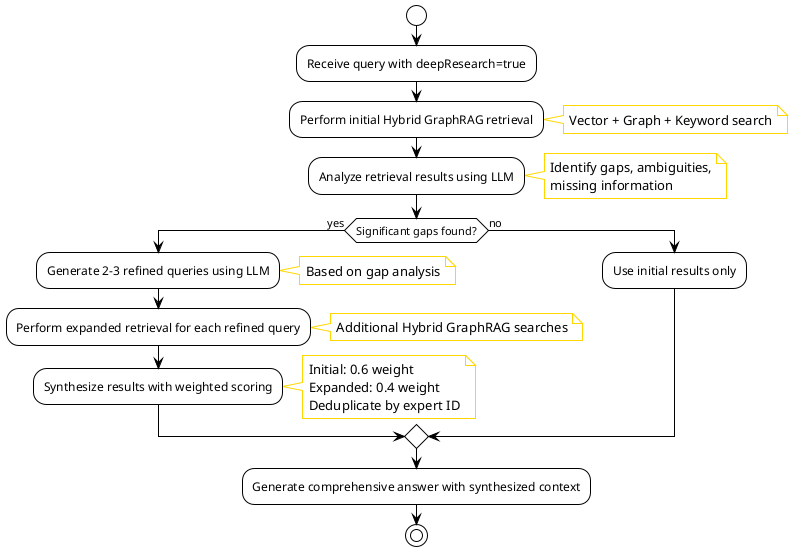

**Process Steps**:

1. **Initial Query**: Process user query
2. **Initial Retrieval**: Perform standard hybrid GraphRAG retrieval
3. **Gap Analysis**: Use LLM to analyze initial results and identify:
- Information gaps
    - Ambiguities in requirements
    - Missing context
    - Areas needing deeper research
4. **Query Refinement**: Generate 2-3 refined queries using LLM based on gap analysis
5. **Expanded Retrieval**: Perform additional hybrid retrieval for each refined query
6. **Result Synthesis**: Combine initial and expanded results with weighted scoring:
- Initial results: 0.6 weight
    - Expanded results: 0.4 weight
    - Deduplicate expert IDs (keep highest score)
7. **Answer Generation**: Generate comprehensive answer with synthesized context

#### 9.2.3 Implementation Details

**Components**:

- `DeepResearchService` - Main service orchestrating the deep research flow
- `GapAnalysis` - Data model for gap analysis results (identified gaps, ambiguities, missing information)
- LLM-based gap analysis using `ChatClient`
- LLM-based query refinement
- Result synthesis with weighted scoring

**Configuration**: API-only via `QueryOptions.deepResearch` parameter (defaults to `false`).

**Internal Constants** (hardcoded in `DeepResearchService`):
- `MAX_REFINED_QUERIES = 3` - Maximum number of refined queries to generate
- `SYNTHESIS_WEIGHT_INITIAL = 0.6` - Weight for initial results in synthesis
- `SYNTHESIS_WEIGHT_EXPANDED = 0.4` - Weight for expanded results in synthesis

**Note**: No `application.yml` configuration is needed. All configuration is API-only or hardcoded as constants.

**Error Handling**:

- If gap analysis fails: fall back to initial results
- If query refinement fails: use original query for expansion
- If expanded retrieval fails: return initial results
- All failures are logged for monitoring

**Performance Considerations**:

- Limited to 2 iterations maximum (configurable)
- Timeout protection for LLM calls
    - Server HTTP timeout: 5 minutes (300,000ms) - configured in `application-local.yml`
    - Database connection timeout: 60 seconds
    - Tomcat keep-alive timeout: 5 minutes
    - Designed to handle long-running queries with deep research, SGR patterns, and large result sets
- Processing time monitoring and logging

#### 9.2.4 Use Cases

- **Complex Multi-Faceted Queries**: Queries requiring information from multiple domains
- **Ambiguous Requirements**: Queries where initial results are insufficient
- **Deep Research Needs**: Queries requiring comprehensive background research
- **Team Formation**: Complex team composition requiring multiple expert searches

#### 9.2.5 API Usage

```json
{
  "query": "Find experts for a microservices architecture project with Kubernetes, Spring Boot, and event-driven patterns",
  "options": {
    "maxResults": 20,
    "minConfidence": 0.7,
    "rerank": true,
    "deepResearch": true  // Enable SGR Deep Research Pattern
  }
}
```

For more details, see [SGR Usage Documentation](ExpertMatch-SGR-Usage.md)
and [Expert Search Flow - Deep Research Flow](ExpertMatch-Expert-Search-Flow.md#deep-research-flow-sgr-pattern).

### 9.3 Schema-Guided Reasoning (SGR) Patterns

ExpertMatch leverages **Schema-Guided Reasoning (SGR) patterns** to enforce structured, predictable LLM reasoning. These
patterns use structured output schemas (JSON Schema) to constrain and guide LLM generation, ensuring consistent,
reliable responses. See [SGR Patterns Reference](https://abdullin.com/schema-guided-reasoning/patterns).

#### 9.3.1 Pattern Overview

SGR patterns provide three foundational building blocks:

1. **Cascade Pattern**: Forces LLM to follow predefined reasoning steps in sequence
2. **Routing Pattern**: Forces LLM to explicitly choose one reasoning path out of many
3. **Cycle Pattern**: Forces LLM to repeat reasoning steps (generate multiple items)

#### 9.3.2 Cascade Pattern for Expert Evaluation

The **Cascade Pattern** ensures structured, step-by-step expert evaluation by enforcing a predefined reasoning sequence.

**Status**:

**Implemented** (MVP)

**Implementation Location**:

- **Service**: `ExpertEvaluationService` in `com.berdachuk.expertmatch.llm.sgr`
- **Integration**: `AnswerGenerationService.generateAnswer()` when `useCascadePattern` is enabled
- **API Option**: `QueryOptions.useCascadePattern` (default: `false`) -  Available in OpenAPI spec (added 2025-12-21)
- **Note**: Requires exactly 1 expert result to activate (falls back to RAG pattern otherwise)

**Use Case**: Expert matching and recommendation generation

**Process Flow**:

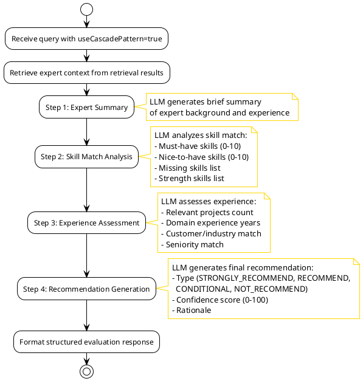

**Cascade Pattern Description**:

The Cascade Pattern enforces a strict sequential reasoning process where the LLM must complete each step before
proceeding to the next. This ensures:

- **Structured Reasoning**: The LLM cannot skip steps or jump ahead, ensuring all aspects of expert evaluation are
  considered
- **Progressive Analysis**: Each step builds upon the previous one, creating a logical flow from summary → analysis →
  assessment → recommendation
- **Consistency**: All expert evaluations follow the same structure, making results comparable and auditable
- **Traceability**: The full reasoning chain is captured, allowing reviewers to understand how the recommendation was
  reached

The pattern uses JSON Schema constraints to force the LLM to generate structured output matching the `ExpertEvaluation`
record, ensuring type safety and validation.

**Java/Spring AI Implementation**:

```java
// Expert Evaluation Schema (JSON Schema)
// Note: JSON uses camelCase; @JsonProperty can be omitted if field names match JSON property names
public record ExpertEvaluation(
    @JsonProperty("expertSummary")
    String expertSummary,
    
    @JsonProperty("skillMatchAnalysis")
    SkillMatchAnalysis skillMatchAnalysis,
    
    @JsonProperty("experienceAssessment")
    ExperienceAssessment experienceAssessment,
    
    @JsonProperty("recommendation")
    Recommendation recommendation
) {}

public record SkillMatchAnalysis(
    @JsonProperty("mustHaveMatchScore")
    @Min(0) @Max(10)
    int mustHaveMatchScore,
    
    @JsonProperty("niceToHaveMatchScore")
    @Min(0) @Max(10)
    int niceToHaveMatchScore,
    
    @JsonProperty("missingSkills")
    List<String> missingSkills,
    
    @JsonProperty("strengthSkills")
    List<String> strengthSkills
) {}

public record ExperienceAssessment(
    @JsonProperty("relevantProjectsCount")
    int relevantProjectsCount,
    
    @JsonProperty("domainExperienceYears")
    double domainExperienceYears,
    
    @JsonProperty("customerIndustryMatch")
    boolean customerIndustryMatch,
    
    @JsonProperty("seniorityMatch")
    boolean seniorityMatch
) {}

public record Recommendation(
    @JsonProperty("recommendationType")
    RecommendationType recommendationType,
    
    @JsonProperty("confidenceScore")
    @Min(0) @Max(100)
    int confidenceScore,
    
    @JsonProperty("rationale")
    String rationale
) {}

public enum RecommendationType {
    STRONGLY_RECOMMEND,
    RECOMMEND,
    CONDITIONAL,
    NOT_RECOMMEND
}
```

**Spring AI Usage**:

```java
@Service
public class ExpertEvaluationService {

    private final StructuredOutputHelper structuredOutputHelper;
    private final SGRPatternConfig config;

    public ExpertEvaluation evaluateWithCascade(
            String query,
            ExpertContext expertContext) {

        if (!config.isEnabled() || !config.getCascade().isEnabled()) {
            throw new IllegalStateException("Cascade pattern is disabled");
        }

        String prompt = buildCascadePrompt(query, expertContext);
        return structuredOutputHelper.callWithStructuredOutput(
                prompt, ExpertEvaluation.class);
    }
}
```

**API Usage**:

```json
{
  "query": "Find expert in Java and Spring Boot",
  "options": {
    "maxResults": 10,
    "minConfidence": 0.7,
    "useCascadePattern": true
  }
}
```

**Benefits**:

- **Explicit Reasoning**: LLM must first summarize, then analyze, then recommend
- **Structured Output**: Guaranteed structured response format
- **Auditability**: Full reasoning chain is captured and reviewable
- **Consistency**: Same reasoning structure across all evaluations

#### 9.3.3 Routing Pattern for Query Classification  **IMPLEMENTED**

The **Routing Pattern** forces LLM to explicitly choose one reasoning path, enabling precise query classification and
tool selection.

**Status**:

**Implemented** (MVP)

**Implementation Location**:

- **Service**: `QueryClassificationService` in `com.berdachuk.expertmatch.query.sgr`
- **Integration**: `QueryParser.parse()` when `useRoutingPattern` is enabled
- **API Option**: `QueryOptions.useRoutingPattern` (default: `false`) -  Available in OpenAPI spec (added 2025-12-21)
- **Purpose**: Enables LLM-based query classification during parsing

**Use Case**: Query type classification and retrieval strategy selection

**Process Flow**:

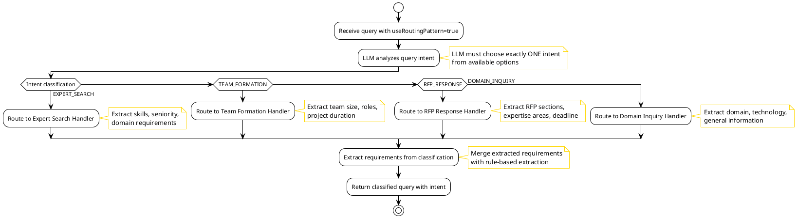

**Routing Pattern Description**:

The Routing Pattern forces the LLM to make an explicit, mutually exclusive choice among predefined query types. This
enables:

- **Explicit Classification**: The LLM cannot be ambiguous - it must select exactly one intent from the enum options
- **Type Safety**: Java sealed interfaces and enums ensure compile-time type safety for routing decisions
- **Strategy Selection**: Each intent can trigger different retrieval strategies optimized for that query type
- **Extensibility**: New query types can be added to the enum without breaking existing code
- **Consistency**: All queries are classified using the same structured approach, reducing ambiguity

The pattern uses JSON Schema with enum constraints to force the LLM to return a valid `QueryIntent` value, ensuring the
classification is always one of the predefined options.

**Java/Spring AI Implementation**:

```java
// Query Classification Schema
@JsonTypeInfo(use = JsonTypeInfo.Id.NAME, property = "queryType")
@JsonSubTypes({
    @JsonSubTypes.Type(value = ExpertSearchQuery.class, name = "expertSearch"),
    @JsonSubTypes.Type(value = TeamFormationQuery.class, name = "teamFormation"),
    @JsonSubTypes.Type(value = RFPResponseQuery.class, name = "rfpResponse"),
    @JsonSubTypes.Type(value = SkillAnalysisQuery.class, name = "skillAnalysis")
})
public sealed interface QueryClassification {
    String queryType();
}

public record ExpertSearchQuery(
    @JsonProperty("queryType")
    String queryType,
    
    @JsonProperty("requiredSkills")
    List<String> requiredSkills,
    
    @JsonProperty("seniorityLevel")
    SeniorityLevel seniorityLevel,
    
    @JsonProperty("domain")
    String domain
) implements QueryClassification {
    public ExpertSearchQuery() {
        this("expertSearch", List.of(), SeniorityLevel.ANY, null);
    }
}

public record TeamFormationQuery(
    @JsonProperty("queryType")
    String queryType,
    
    @JsonProperty("teamSize")
    int teamSize,
    
    @JsonProperty("roles")
    List<RoleRequirement> roles,
    
    @JsonProperty("projectDuration")
    String projectDuration
) implements QueryClassification {
    public TeamFormationQuery() {
        this("teamFormation", 0, List.of(), null);
    }
}

public record RFPResponseQuery(
    @JsonProperty("queryType")
    String queryType,
    
    @JsonProperty("rfpSections")
    List<String> rfpSections,
    
    @JsonProperty("requiredExpertiseAreas")
    List<String> requiredExpertiseAreas,
    
    @JsonProperty("deadline")
    String deadline
) implements QueryClassification {
    public RFPResponseQuery() {
        this("rfp_response", List.of(), List.of(), null);
    }
}
```

**Usage**:

```java
@Service
public class QueryRouter {
    
    public QueryClassification classifyQuery(String userQuery) {
        String prompt = """
            Classify the following query and extract relevant information.
            Query: %s
            """.formatted(userQuery);
        
        StructuredOutput<QueryClassification> output = chatClient
            .prompt()
            .user(prompt)
            .call()
            .entity(QueryClassification.class);
        
        return output.getResult();
    }
    
    public RetrievalStrategy selectStrategy(QueryClassification classification) {
        return switch (classification) {
            case ExpertSearchQuery q -> new VectorGraphHybridStrategy();
            case TeamFormationQuery q -> new TeamCompositionStrategy();
            case RFPResponseQuery q -> new RFPResponseStrategy();
            case SkillAnalysisQuery q -> new SkillAnalysisStrategy();
        };
    }
}
```

**Benefits**:

- **Explicit Classification**: LLM must choose a specific query type
- **Type Safety**: Java sealed interfaces ensure type safety
- **Strategy Selection**: Automatic retrieval strategy selection based on classification
- **Extensibility**: Easy to add new query types and strategies

#### 9.3.4 Cycle Pattern for Multiple Expert Recommendations  **IMPLEMENTED**

The **Cycle Pattern** forces LLM to generate multiple items in a structured format, ensuring comprehensive expert
recommendations.

**Status**:

**Implemented** (MVP)

**Implementation Location**:

- **Service**: `CyclePatternService` in `com.berdachuk.expertmatch.llm.sgr`
- **Integration**: `AnswerGenerationService.generateAnswer()` when `useCyclePattern` is enabled
- **API Option**: `QueryOptions.useCyclePattern` (default: `false`) -  Available in OpenAPI spec (added 2025-12-21)
- **Note**: Requires multiple expert results (>1) to activate (falls back to RAG pattern otherwise)

**Use Case**: Generate multiple expert recommendations with structured details

**Process Flow**:

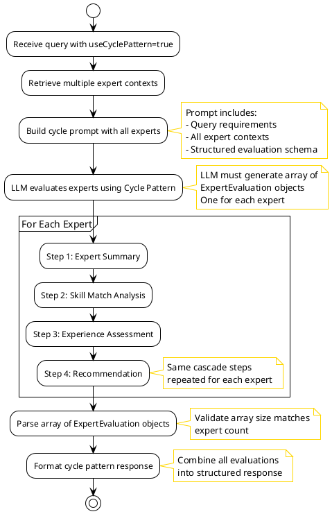

**Cycle Pattern Description**:

The Cycle Pattern forces the LLM to repeat the same structured reasoning process multiple times, generating an array of
structured objects. This ensures:

- **Consistent Evaluation**: All experts are evaluated using the same structured approach, making comparisons fair and
  meaningful
- **Guaranteed Structure**: The JSON Schema array constraint ensures the LLM generates exactly the expected number of
  evaluations
- **Batch Processing**: Multiple experts can be evaluated in a single LLM call, improving efficiency
- **Structured Comparison**: All evaluations follow the same format, enabling programmatic comparison and ranking
- **Comprehensive Coverage**: The pattern ensures all provided experts are evaluated, not just a subset

The pattern uses JSON Schema array constraints with minimum/maximum size validation to ensure the LLM generates the
correct number of structured objects. Each object in the array follows the same `ExpertEvaluation` schema used in the
Cascade Pattern, creating consistency across single and multiple expert evaluations.

**Java/Spring AI Implementation**:

```java
// Expert Recommendation Schema
public record ExpertRecommendations(
    @JsonProperty("recommendations")
    @Size(min = 3, max = 10)
    List<ExpertRecommendation> recommendations,
    
    @JsonProperty("summary")
    String summary,
    
    @JsonProperty("gapAnalysis")
    GapAnalysis gapAnalysis
) {}

public record ExpertRecommendation(
    @JsonProperty("expertId")
    String expertId,
    
    @JsonProperty("expertName")
    String expertName,
    
    @JsonProperty("matchScore")
    @Min(0) @Max(100)
    int matchScore,
    
    @JsonProperty("primarySkills")
    List<String> primarySkills,
    
    @JsonProperty("relevantProjects")
    @Size(min = 1, max = 5)
    List<ProjectReference> relevantProjects,
    
    @JsonProperty("recommendationRationale")
    String recommendationRationale,
    
    @JsonProperty("contactInfo")
    ContactInfo contactInfo
) {}

public record GapAnalysis(
    @JsonProperty("missingSkills")
    List<String> missingSkills,
    
    @JsonProperty("missingDomains")
    List<String> missingDomains,
    
    @JsonProperty("coverageScore")
    @Min(0) @Max(100)
    int coverageScore
) {}
```

**Usage**:

```java
@Service
public class ExpertRecommendationService {
    
    public ExpertRecommendations generateRecommendations(
            ProjectRequirements requirements,
            List<ExpertProfile> candidates) {
        
        String prompt = buildRecommendationPrompt(requirements, candidates);
        
        StructuredOutput<ExpertRecommendations> output = chatClient
            .prompt()
            .user(prompt)
            .call()
            .entity(ExpertRecommendations.class);
        
        return output.getResult();
    }
}
```

**Benefits**:

- **Structured Lists**: Guaranteed minimum/maximum number of recommendations
- **Consistent Format**: All recommendations follow the same structure
- **Gap Analysis**: Automatic identification of missing skills/domains
- **Ranking**: Recommendations are ordered by match score

#### 9.3.5 Combined Pattern: Cascade + Cycle for Team Formation

Combining patterns for complex use cases:

**Cascade** for step-by-step reasoning, **Cycle** for multiple team member
recommendations.

**Use Case**: Team formation with structured evaluation

**Implementation**:

```java
public record TeamFormationAnalysis(
    // Cascade: Step 1 - Requirements Analysis
    @JsonProperty("requirementsAnalysis")
    RequirementsAnalysis requirementsAnalysis,
    
    // Cascade: Step 2 - Candidate Evaluation
    @JsonProperty("candidateEvaluations")
    @Size(min = 5, max = 20)
    List<CandidateEvaluation> candidateEvaluations,
    
    // Cascade: Step 3 - Team Composition
    @JsonProperty("recommendedTeam")
    RecommendedTeam recommendedTeam,
    
    // Cascade: Step 4 - Final Recommendation
    @JsonProperty("finalRecommendation")
    TeamFormationRecommendation finalRecommendation
) {}

public record RecommendedTeam(
    @JsonProperty("teamMembers")
    @Size(min = 2, max = 10)
    List<TeamMember> teamMembers,
    
    @JsonProperty("teamStructure")
    TeamStructure teamStructure,
    
    @JsonProperty("coverageAnalysis")
    CoverageAnalysis coverageAnalysis
) {}
```

#### 9.3.6 Spring AI Structured Output Configuration

**Application Configuration**:

```yaml
spring:
  ai:
    openai:
      chat:
        options:
          response-format:
            type: json_schema
            json-schema:
              name: ExpertEvaluation
              schema: classpath:schemas/expert-evaluation.json
              strict: true
```

**JSON Schema Example** (`schemas/expert-evaluation.json`):

```json
{
  "$schema": "http://json-schema.org/draft-07/schema#",
  "type": "object",
  "required": ["expert_summary", "skill_match_analysis", "recommendation"],
  "properties": {
    "expert_summary": {
      "type": "string",
      "description": "Brief summary of the expert's background and experience"
    },
    "skill_match_analysis": {
      "type": "object",
      "required": ["must_have_match_score", "nice_to_have_match_score"],
      "properties": {
        "must_have_match_score": {
          "type": "integer",
          "minimum": 0,
          "maximum": 10
        },
        "nice_to_have_match_score": {
          "type": "integer",
          "minimum": 0,
          "maximum": 10
        }
      }
    },
    "recommendation": {
      "type": "object",
      "required": ["recommendation_type", "confidence_score"],
      "properties": {
        "recommendation_type": {
          "type": "string",
          "enum": ["STRONGLY_RECOMMEND", "RECOMMEND", "CONDITIONAL", "NOT_RECOMMEND"]
        },
        "confidence_score": {
          "type": "integer",
          "minimum": 0,
          "maximum": 100
        }
      }
    }
  }
}
```

#### 9.3.7 Benefits of SGR Patterns for ExpertMatch

1. **Predictability**: Structured output ensures consistent response formats
2. **Reliability**: Constrained decoding reduces hallucination and errors
3. **Auditability**: Full reasoning chains are captured and reviewable
4. **Type Safety**: Java records and sealed interfaces provide compile-time safety
5. **Maintainability**: Clear patterns make code easier to understand and modify
6. **Testing**: Structured output is easier to test and validate
7. **Integration**: Structured responses integrate seamlessly with downstream systems

#### 9.3.8 Implementation Status

**All SGR Patterns Implemented (MVP)**:

- **Cascade Pattern**: Implemented - `ExpertEvaluationService` in `com.berdachuk.expertmatch.llm.sgr`
- **Routing Pattern**: Implemented - `QueryClassificationService` in `com.berdachuk.expertmatch.query.sgr`
- **Cycle Pattern**: Implemented - `CyclePatternService` in `com.berdachuk.expertmatch.llm.sgr`
- **Deep Research Pattern**: Implemented - `DeepResearchService` in `com.berdachuk.expertmatch.retrieval`

**Configuration**:

All SGR patterns can be configured in `application.yml`:

```yaml
expertmatch:
  sgr:
    enabled: true
    schema-validation: true
    cascade:
      enabled: true
      model: ${LLM_MODEL:}
    routing:
      enabled: true
      model: ${LLM_MODEL:}
    cycle:
      enabled: true
      model: ${LLM_MODEL:}
```

**API Usage**:

```json
{
  "query": "Find experts in Java and Spring Boot",
  "options": {
    "maxResults": 10,
    "minConfidence": 0.7,
    "useCascadePattern": true,
    "useRoutingPattern": true,
    "useCyclePattern": true,
    "deepResearch": true
  }
}
```

For detailed usage information and examples, see [SGR Usage Documentation](ExpertMatch-SGR-Usage.md).

**Future Enhancements**:

- **P2 (Medium)**: Combined patterns for complex use cases
- **P2 (Medium)**: Advanced SGR pattern combinations

### 9.4 LLM-as-a-Judge Pattern for Quality Control (Post-MVP)

> ** Post-MVP Enhancement**: This section describes functionality that is **not included in the MVP scope**. It will
> be implemented post-MVP as a high-priority enhancement.

ExpertMatch will implement the **LLM-as-a-Judge** pattern to automatically evaluate and refine the quality of expert
recommendations. This pattern uses LLMs themselves to assess response quality, enabling automated quality control
without human intervention.

**Note**: Spring AI 1.1.1 (includes Recursive Advisors support from 1.1.0 GA released November 12, 2025), making this pattern
production-ready.

#### 9.4.1 Pattern Overview

**Why LLM-as-a-Judge?**

- **Evaluation is Easier than Generation**: Assessing quality of existing text is simpler than creating original content
- **High Alignment with Human Judgment**: Research shows sophisticated judge models align with human judgment up to
  85% (higher than human-to-human agreement at 81%)
- **Scalability**: Automated evaluation scales without human evaluators
- **Consistency**: Same evaluation criteria applied across all recommendations

**Evaluation Dimensions**:

1. **Relevance**: How well experts match project requirements
2. **Completeness**: Coverage of must-have and nice-to-have skills
3. **Accuracy**: Factual correctness of expert profiles and matches
4. **Actionability**: Sufficient information for decision-making
5. **Faithfulness**: Grounded in retrieved context (no hallucinations)

#### 9.4.2 Self-Refinement with Recursive Advisors

The **Self-Refinement Pattern** combines LLM-as-a-Judge with Spring AI Recursive Advisors to create an automatic
improvement loop:

1. **Generate**: Create initial expert recommendation
2. **Evaluate**: Assess quality using LLM-as-a-Judge
3. **Decide**: If quality passes threshold, return response
4. **Refine**: If quality fails, incorporate feedback and retry
5. **Repeat**: Continue until quality threshold met or max attempts reached

**Java/Spring AI Implementation**:

```java
public final class ExpertRecommendationQualityAdvisor implements CallAdvisor {

    private static final PromptTemplate EVALUATION_PROMPT_TEMPLATE = new PromptTemplate(
        """
        You will be given a project_requirements and expert_recommendations couple.
        Your task is to provide a 'total rating' scoring how well the expert_recommendations 
        address the project_requirements.
        
        Give your answer on a scale of 1 to 4:
        1: Terrible - completely irrelevant, missing key requirements, or contains errors
        2: Mostly Not Helpful - misses some key aspects or has significant gaps
        3: Mostly Helpful - provides support but could be improved
        4: Excellent - relevant, complete, accurate, actionable, and addresses all concerns
        
        Project Requirements: {requirements}
        Expert Recommendations: {recommendations}
        
        Provide your evaluation as JSON:
        {
            "rating": <1-4>,
            "evaluation": "Explanation of the evaluation result",
            "feedback": "Specific and constructive feedback on how to improve"
        }
        """);

    @JsonClassDescription("Evaluation response for expert recommendation quality")
    public record EvaluationResponse(
        int rating,
        String evaluation,
        String feedback
    ) {}

    private final ChatClient judgeChatClient; // Separate model for evaluation
    private final int maxRepeatAttempts;
    private final int successRating;

    @Override
    public ChatClientResponse adviseCall(
            ChatClientRequest request, 
            CallAdvisorChain chain) {
        
        var currentRequest = request;
        ChatClientResponse response;

        for (int attempt = 1; attempt <= maxRepeatAttempts + 1; attempt++) {
            // Generate recommendation
            response = chain.copy(this).nextCall(currentRequest);

            // Evaluate quality
            EvaluationResponse evaluation = evaluate(currentRequest, response);

            // Check if quality passes threshold
            if (evaluation.rating() >= successRating) {
                logger.info("Quality evaluation passed on attempt {}, rating: {}", 
                    attempt, evaluation.rating());
                return response;
            }

            // If last attempt, return anyway
            if (attempt > maxRepeatAttempts) {
                logger.warn("Max attempts ({}) reached. Returning response with rating: {}. " +
                    "Feedback: {}", maxRepeatAttempts, evaluation.rating(), 
                    evaluation.feedback());
                return response;
            }

            // Retry with feedback
            logger.warn("Quality evaluation failed on attempt {}, rating: {}, feedback: {}", 
                attempt, evaluation.rating(), evaluation.feedback());
            
            currentRequest = addEvaluationFeedback(currentRequest, evaluation);
        }

        throw new IllegalStateException("Unexpected loop exit");
    }

    private EvaluationResponse evaluate(
            ChatClientRequest request, 
            ChatClientResponse response) {
        
        String requirements = extractRequirements(request);
        String recommendations = extractRecommendations(response);
        
        String evaluationPrompt = EVALUATION_PROMPT_TEMPLATE.render(
            Map.of("requirements", requirements, "recommendations", recommendations));

        // Use separate judge model to avoid bias
        return judgeChatClient
            .prompt(evaluationPrompt)
            .call()
            .entity(EvaluationResponse.class);
    }

    private ChatClientRequest addEvaluationFeedback(
            ChatClientRequest originalRequest, 
            EvaluationResponse evaluation) {
        
        Prompt augmentedPrompt = originalRequest.prompt()
            .augmentUserMessage(userMessage -> userMessage.mutate()
                .text(String.format("""
                    %s
                    
                    Previous recommendation evaluation failed with rating: %d/4
                    Feedback: %s
                    
                    Please improve the recommendations based on this feedback.
                    """, 
                    userMessage.getText(), 
                    evaluation.rating(), 
                    evaluation.feedback()))
                .build());

        return originalRequest.mutate().prompt(augmentedPrompt).build();
    }
}
```

**Configuration**:

```java
@Bean
ChatClient expertRecommendationChatClient(
        AnthropicChatModel anthropicModel,  // Generation model
        OllamaChatModel ollamaJudgeModel) { // Judge model
    
    return ChatClient.builder(anthropicModel)
        .defaultAdvisors(
            ExpertRecommendationQualityAdvisor.builder()
                .judgeChatClient(ChatClient.builder(ollamaJudgeModel).build())
                .maxRepeatAttempts(3)
                .successRating(3) // Minimum rating to pass
                .order(0) // Evaluate before other advisors
                .build()
        )
        .build();
}
```

#### 9.4.3 Bias Mitigation

**Separate Models for Generation and Evaluation**:

- **Generation Model**: Primary LLM (e.g., Anthropic Claude, OpenAI GPT-4) for creating recommendations
- **Judge Model**: Specialized LLM-as-a-Judge model (e.g., `avcodes/flowaicom-flow-judge:q4`) for evaluation
- **Rationale**: Avoids narcissistic bias where model evaluates its own outputs favorably

**Configuration**:

```yaml
spring:
  ai:
    anthropic:
      chat:
        options:
          model: claude-3-5-sonnet-20241022
    ollama:
      base-url: http://localhost:11434
      chat:
        options:
          model: avcodes/flowaicom-flow-judge:q4
          temperature: 0  # Deterministic evaluation
```

#### 9.4.4 Evaluation Criteria

**Rating Scale**:

- **1 (Terrible)**:
- Recommendations completely irrelevant to requirements
    - Missing all or most key requirements (skills, seniority, experience)
    - Contains factual errors or hallucinations
    - No actionable information provided

- **2 (Mostly Not Helpful)**:
- Recommendations partially relevant but miss key aspects
    - Missing some must-have skills or seniority requirements
    - Incomplete project experience details
    - Limited actionable information

- **3 (Mostly Helpful)**:
- Recommendations address most requirements
    - Covers must-have skills but may miss some nice-to-have
    - Adequate project experience details
    - Generally actionable but could be more complete

- **4 (Excellent)**:
- Recommendations highly relevant and complete
    - All must-have and most nice-to-have skills addressed
    - Comprehensive project experience with details
    - Fully actionable with contact info, experience, and rationale
    - All claims grounded in retrieved context (no hallucinations)

#### 9.4.5 Benefits for ExpertMatch

1. **Automated Quality Control**: No human intervention needed for quality checks
2. **Consistent Evaluation**: Same criteria applied to all recommendations
3. **Self-Improvement**: Automatic refinement based on evaluation feedback
4. **Bias Mitigation**: Separate models prevent narcissistic bias
5. **Scalability**: Evaluates thousands of recommendations without human evaluators
6. **Cost Efficiency**: Judge models are often smaller/cheaper than generation models
7. **Production Ready**: Handles edge cases gracefully with retry limits

#### 9.4.6 Implementation Considerations

** Important Notes**:

- **Recursive Advisors**: Available in Spring AI 1.1.1, non-streaming only
- **GA Release**: Spring AI 1.1.0 GA was released on November 12, 2025, making Recursive Advisors production-ready (now in 1.1.1)
- **Advisor Ordering**: Careful ordering required to ensure proper evaluation flow
- **Cost Considerations**: Multiple LLM calls increase costs (generation + evaluation + retries)
- **Termination Conditions**: Always set retry limits to prevent infinite loops
- **State Management**: Inner advisors with external state require extra attention

**Best Practices**:

- Use dedicated judge models for evaluation
- Set `temperature=0` for deterministic evaluation
- Use integer scales (1-4) for clear thresholds
- Engineer prompts with few-shot examples for consistency
- Monitor evaluation metrics (ratings, retry counts, improvement rates)
- Maintain human oversight for high-stakes decisions

#### 9.4.7 Integration with Existing Patterns

**SGR Patterns + LLM-as-a-Judge**:

- **Cascade Pattern**: Evaluate after each reasoning step
- **Cycle Pattern**: Evaluate each generated recommendation
- **Combined**: Evaluate final team formation recommendations

**Example Integration**:

```java
ChatClient chatClient = ChatClient.builder(anthropicModel)
    .defaultAdvisors(
        // Quality evaluation (order 0 - runs first)
        ExpertRecommendationQualityAdvisor.builder()
            .judgeChatClient(judgeChatClient)
            .maxRepeatAttempts(3)
            .successRating(3)
            .order(0)
            .build(),
        
        // SGR Cascade pattern (order 1)
        new CascadePatternAdvisor()
            .order(1)
            .build()
    )
    .build();
```

#### 9.4.8 Implementation Priority

- **P1 (High)**: Post-MVP Enhancement
- **Dependencies**: Spring AI 1.1.1 - Recursive Advisors included
- **Prerequisites**: Judge model setup (Ollama or cloud provider)

### 9.5 Memory Copilot Pattern for Self-Tuning Agent (Post-MVP)

> ** Post-MVP Enhancement**: This section describes functionality that is **not included in the MVP scope**. It will
> be implemented post-MVP as a medium-priority enhancement.

ExpertMatch will implement the **Memory Copilot** pattern - an autonomous sub-agent responsible for memory management
that automatically enriches prompts with relevant past experience and decides what to store for future use. This pattern
enables the agent to become "self-tuning" - improving over time as it accumulates experience.

#### 9.5.1 Pattern Overview

**Concept**: Memory Copilot as "Second Pilot"

Instead of an "inner voice" or direct analogy to human consciousness, Memory Copilot is better understood as a "second
pilot" - a sub-agent responsible entirely for memory. This sub-agent:

- Has no memory of its own (only operates tools for working with storage backend)
- Works automatically without the main model having to "trigger memory as a tool"
- Lives between the language model and user-facing interface
- Acts as a generator of the system prompt

**Key Principles**:

1. **Automatic Operation**: Memory operations happen automatically, not triggered by main model
2. **Two-Phase Memory**: Recall before generation, remember after generation
3. **Intelligent Filtering**: Only store what's useful, original, and non-duplicate
4. **Self-Tuning**: Agent improves over time through accumulated experience

#### 9.5.2 Memory Copilot Tools

The sub-agent has only two tools:

**1. recall (search)** - Runs before answer generation, at prompt-building stage:
- Matches current user request against long-term storage
- Retrieves relevant snippets (few-shot examples, facts, patterns, successful solutions)
- Feeds retrieved context into prompt together with:
- System instructions
    - Dialogue history
    - Current user query

**2. remember (save)** - Runs after generation as optional step:
- Evaluates usefulness of generated answer using mini LLM-as-a-Judge evaluation
- Checks multiple criteria:
- Is there already such a memory?
    - Will this be useful in the future?
    - Is it original?
    - Does it duplicate something already stored?
- Only saves if it passes the filter
- Stores short distilled summary (reduces noise, saves space, improves later retrievals)

#### 9.5.3 Memory Pipeline

**Single Request Flow**:

1. **User Request Arrives**: User submits query
2. **Memory Recall**:
- Match against long-term memory
    - Retrieve relevant fragments
    - Turn retrieved fragments into few-shots/facts
    - Assemble enriched prompt
3. **Answer Generation**: Generate answer using enriched prompt
4. **Memory Evaluation**:
- Quickly check usefulness of result (LLM-as-a-Judge)
    - Evaluate: useful? original? non-duplicate?
5. **Memory Storage** (if passes evaluation):
- Distill answer into short summary
    - Save to long-term memory

**On Subsequent Turns**: This "experience" automatically resurfaces during prompt construction, making the agent
progressively better.

#### 9.5.4 Beyond Chat Memory

Memory Copilot can remember more than just chat interactions:

**Action-Level Memory**:

- Remember successful solutions at the level of actions
- Store which tool with which parameters worked best for particular class of queries
- Example: "search query A yielded relevant documents" pattern

**Tool-Use Patterns**:

- Store few-shot examples for tool-use planning
- Empirically improves tool selection speed and accuracy
- Model selects the right tool faster and more accurately

**Storage Strategy**:

- **Do Store**: Short rules, action templates, successful patterns, few-shot examples
- **Don't Store**: Tool responses (become outdated, take up space)
- **Prefer**: Abstract patterns over concrete answers

#### 9.5.5 Implementation Architecture

**Java/Spring AI Implementation**:

```java
public class MemoryCopilotAdvisor implements CallAdvisor {
    
    private final MemoryStorage memoryStorage;
    private final ChatClient judgeChatClient; // For memory evaluation
    
    @Override
    public ChatClientResponse adviseCall(
            ChatClientRequest request, 
            CallAdvisorChain chain) {
        
        // Phase 1: Recall - Enrich prompt with relevant memory
        ChatClientRequest enrichedRequest = recallAndEnrich(request);
        
        // Phase 2: Generate answer
        ChatClientResponse response = chain.nextCall(enrichedRequest);
        
        // Phase 3: Remember - Evaluate and optionally save
        rememberIfUseful(request, response);
        
        return response;
    }
    
    private ChatClientRequest recallAndEnrich(ChatClientRequest request) {
        // Search long-term memory for relevant snippets
        List<MemorySnippet> relevantMemories = memoryStorage.search(
            request.prompt().getUserMessage().getText()
        );
        
        // Convert to few-shot examples or facts
        String memoryContext = buildMemoryContext(relevantMemories);
        
        // Enrich prompt with memory context
        Prompt enrichedPrompt = request.prompt()
            .augmentSystemMessage(systemMessage -> systemMessage.mutate()
                .text(systemMessage.getText() + "\n\nRelevant Past Experience:\n" + memoryContext)
                .build());
        
        return request.mutate().prompt(enrichedPrompt).build();
    }
    
    private void rememberIfUseful(
            ChatClientRequest request, 
            ChatClientResponse response) {
        
        // Mini LLM-as-a-Judge evaluation
        MemoryEvaluation evaluation = evaluateMemoryUsefulness(
            request, response
        );
        
        if (evaluation.shouldStore()) {
            // Distill and save
            String distilledSummary = distillAnswer(response);
            memoryStorage.save(
                new MemorySnippet(
                    request.prompt().getUserMessage().getText(),
                    distilledSummary,
                    evaluation.relevanceScore(),
                    LocalDateTime.now()
                )
            );
        }
    }
    
    private MemoryEvaluation evaluateMemoryUsefulness(
            ChatClientRequest request, 
            ChatClientResponse response) {
        
        String evaluationPrompt = """
            Evaluate whether this answer should be stored in long-term memory.
            
            User Query: {query}
            Generated Answer: {answer}
            
            Check:
            1. Is there already such a memory? (duplicate check)
            2. Will this be useful in the future?
            3. Is it original and non-trivial?
            4. Does it provide reusable patterns or insights?
            
            Return JSON:
            {
                "shouldStore": true/false,
                "relevanceScore": 1-10,
                "reason": "explanation"
            }
            """.formatted(
                request.prompt().getUserMessage().getText(),
                response.getResult().getOutput().getContent()
            );
        
        return judgeChatClient
            .prompt(evaluationPrompt)
            .call()
            .entity(MemoryEvaluation.class);
    }
}
```

**Memory Storage Schema**:

```java
public record MemorySnippet(
    String queryPattern,      // Original query or pattern
    String distilledContent,  // Distilled summary/insight
    int relevanceScore,      // Relevance score (1-10)
    LocalDateTime timestamp,  // When stored
    List<String> tags,       // Tags for categorization
    String memoryType        // "few_shot", "fact", "pattern", "tool_use"
) {}

public interface MemoryStorage {
    List<MemorySnippet> search(String query);
    void save(MemorySnippet snippet);
    void delete(String snippetId);
    List<MemorySnippet> findByPattern(String pattern);
}
```

**Configuration**:

```yaml
spring:
  ai:
    memory:
      copilot:
        enabled: true
        storage:
          type: vector  # Use vector search for similarity matching
          max_memories: 10000
          similarity_threshold: 0.7
        evaluation:
          judge_model: ollama  # Separate model for memory evaluation
          min_relevance_score: 6  # Minimum score to store
          duplicate_check: true
        recall:
          max_snippets: 5  # Max snippets to include in prompt
          context_format: few_shot  # or "facts", "patterns"
```

#### 9.5.6 Benefits for ExpertMatch

1. **Self-Improvement**: Agent learns from experience automatically
2. **Better Recommendations**: Relevant past experience improves recommendation quality
3. **Reduced Errors**: Fewer mistakes as agent accumulates experience
4. **Efficient Storage**: Only stores useful, non-duplicate information
5. **Improved Tool Use**: Few-shot examples improve retrieval tool selection
6. **Personalization**: Memory accumulates user-specific patterns and preferences
7. **Context Enrichment**: Automatically injects relevant past queries and successful patterns
8. **Cost Efficiency**: Distilled summaries reduce storage and retrieval costs

#### 9.5.7 Integration with Existing Features

**Memory Copilot + LLM-as-a-Judge**:

- Use LLM-as-a-Judge for memory evaluation (usefulness, originality)
- Judge model evaluates whether to store generated answers

**Memory Copilot + SGR Patterns**:

- Store successful SGR pattern applications as few-shot examples
- Recall relevant patterns for similar queries

**Memory Copilot + Chat Management**:

- Long-term memory separate from conversation history
- Memory persists across chats (user-level or system-level)
- Conversation history provides short-term context, memory provides long-term experience

**Memory Copilot + Retrieval**:

- Remember successful retrieval patterns
- Store which retrieval strategies worked best for which query types
- Few-shot examples for query understanding and retrieval tool selection

#### 9.5.8 Implementation Considerations

**Storage Strategy**:

- Use vector storage for similarity-based retrieval
- Implement deduplication to avoid storing similar memories
- Regular cleanup of outdated or low-relevance memories
- Categorize memories by type (few-shot, fact, pattern, tool-use)

**Evaluation Criteria**:

- **Usefulness**: Will this be helpful for future queries?
- **Originality**: Is this new information or duplicate?
- **Reusability**: Can this be applied to similar queries?
- **Relevance**: How relevant is this to the domain?

**Performance**:

- Memory recall should be fast (use vector indexes)
- Memory evaluation should be lightweight (quick LLM-as-a-Judge check)
- Batch memory operations when possible

**Privacy and Security**:

- Consider what should be stored in memory (sensitive data?)
- User-level vs system-level memory
- Memory access controls and retention policies

#### 9.5.9 Implementation Priority

- **P2 (Medium)**: Post-MVP Enhancement
- **Dependencies**:
- LLM-as-a-Judge pattern (for memory evaluation)
    - Vector storage for memory retrieval
    - Long-term storage infrastructure
- **Prerequisites**:
- Memory storage design and implementation
    - Memory evaluation criteria and prompts
    - Integration with existing chat and retrieval systems

---

## 10. Module Documentation (Spring Modulith)

Spring Modulith automatically generates module documentation to help understand and maintain the modular architecture.

### 10.1 Module Documentation Generation

**Gradle Plugin Configuration** (`build.gradle`):

```gradle
plugins {
    id 'org.springframework.modulith' version '1.2.0'
}

modulith {
    module {
        generateModuleDocumentation = true
    }
}
```

**Generated Documentation:**

- **Module Canvas**: Visual representation of modules and their dependencies
- **Module Diagram**: Dependency graph visualization
- **API Documentation**: Public APIs exposed by each module
- **Event Documentation**: Event types published and consumed by modules

**Documentation Output:**

```
build/modulith-docs/
├── modules.html              # Module overview
├── module-canvas.html         # Visual module canvas
├── module-diagram.svg        # Dependency diagram
├── api/
│   ├── api-module.html       # API module documentation
│   ├── query-module.html     # Query module documentation
│   └── ...
└── events/
    ├── events.html           # Event documentation
    └── event-flow.svg        # Event flow diagram
```

### 10.2 Module Canvas

The module canvas provides a visual overview of:

- Module boundaries and structure
- Dependencies between modules
- Public APIs of each module
- Event publication and consumption

**Accessing Module Canvas:**

- Generated during build: `target/modulith-docs/module-canvas.html`
- Available via Actuator endpoint: `/actuator/modulith` (if enabled)

### 10.3 Module Validation

**Build-time Validation:**

```bash
./gradlew clean build
```

Validates:

- Module boundaries are respected
- No illegal dependencies between modules
- Event publication contracts are met
- Module structure is correct

**Runtime Validation:**

```java
@SpringBootApplication
public class ExpertMatchApplication {
    public static void main(String[] args) {
        SpringApplication.run(ExpertMatchApplication.class, args);
        
        // Validate module structure at startup
        ApplicationModules.of(ExpertMatchApplication.class)
            .verify();
    }
}
```

## 11. Deployment

### 11.1 Development Setup

**MVP Development Environment:**

The MVP development environment is designed to be fully self-contained and run entirely in Docker containers. All
databases, services, and dependencies are containerized, requiring no external system integrations.

#### 11.1.1 Prerequisites

**Required Software (All Platforms):**

- **Docker**: Version 20.10 or later
- **Docker Compose**: Version 2.0 or later (included with Docker Desktop)
- **Java Development Kit (JDK)**: Version 21 or later
- **Gradle**: Version 9.2.1 or later (latest stable)
- **Git**: For cloning the repository

**Platform-Specific Prerequisites:**

**Linux (Ubuntu 22.04):**

```bash
# Update package list
sudo apt update

# Install Docker
sudo apt install -y docker.io docker-compose-plugin

# Install Docker Compose (standalone, if needed)
sudo apt install -y docker-compose

# Add user to docker group (to run without sudo)
sudo usermod -aG docker $USER
# Log out and log back in for group changes to take effect

# Install OpenJDK 21
sudo apt install -y openjdk-21-jdk

# Install Gradle
# Option 1: Using package manager (may not be latest)
sudo apt install -y gradle

# Option 2: Using SDKMAN (recommended for latest version)
curl -s "https://get.sdkman.io" | bash
source "$HOME/.sdkman/bin/sdkman-init.sh"
sdk install gradle 9.2.1

# Install Git (if not already installed)
sudo apt install -y git

# Verify installations
docker --version
docker compose version
java -version
gradle --version
git --version
```

**Mac OS:**

```bash
# Install Homebrew (if not already installed)
/bin/bash -c "$(curl -fsSL https://raw.githubusercontent.com/Homebrew/install/HEAD/install.sh)"

# Install Docker Desktop for Mac
# Download from: https://www.docker.com/products/docker-desktop
# Or install via Homebrew Cask:
brew install --cask docker

# Install OpenJDK 21
brew install openjdk@21

# Set JAVA_HOME (add to ~/.zshrc or ~/.bash_profile)
echo 'export JAVA_HOME=$(/usr/libexec/java_home -v 21)' >> ~/.zshrc
echo 'export PATH=$JAVA_HOME/bin:$PATH' >> ~/.zshrc
source ~/.zshrc

# Install Gradle
brew install gradle

# Or install latest Gradle using SDKMAN (recommended)
curl -s "https://get.sdkman.io" | bash
source "$HOME/.sdkman/bin/sdkman-init.sh"
sdk install gradle 9.2.1

# Install Git (usually pre-installed)
# If not: brew install git

# Verify installations
docker --version
docker compose version
java -version
gradle --version
git --version
```

**Windows 11:**

**Option 1: Docker Desktop (Recommended if available)**

```powershell
# Using Chocolatey (recommended)
# Install Chocolatey first: https://chocolatey.org/install
# Run PowerShell as Administrator

# Install Docker Desktop for Windows
choco install docker-desktop -y

# Install OpenJDK 21
choco install openjdk21 -y

# Install Gradle
choco install gradle -y

# Install Git
choco install git -y

# Manual Installation Alternative:
# 1. Docker Desktop: Download from https://www.docker.com/products/docker-desktop
# 2. OpenJDK 21: Download from https://adoptium.net/ (Temurin 21)
#    - Set JAVA_HOME environment variable to JDK installation path
#    - Add %JAVA_HOME%\bin to PATH
# 3. Gradle: Download from https://gradle.org/releases/
#    - Extract to C:\Program Files\Gradle
#    - Add C:\Program Files\Gradle\bin to PATH
#    - Or use SDKMAN for Windows: https://sdkman.io/install
# 4. Git: Download from https://git-scm.com/download/win

# Verify installations
docker --version
docker compose version
java -version
gradle --version
git --version
```

**Option 2: WSL2 with Ubuntu (Alternative if Docker Desktop is not available)**

**Prerequisites:**

- Windows 11 with WSL2 support enabled
- Ubuntu 22.04 LTS installed in WSL2

**Step 1: Enable WSL2 and Install Ubuntu**

```powershell
# Run PowerShell as Administrator

# Enable WSL2
wsl --install

# If WSL2 is already installed, update to latest version
wsl --update

# Set WSL2 as default version
wsl --set-default-version 2

# Install Ubuntu 22.04 LTS
wsl --install -d Ubuntu-22.04

# Or download from Microsoft Store: https://apps.microsoft.com/detail/9PDXGNCFSCZV
```

**Step 2: Setup Ubuntu in WSL2**

```bash
# Open Ubuntu terminal (from Start Menu or: wsl)

# Update package list
sudo apt update
sudo apt upgrade -y

# Install Docker in WSL2 Ubuntu
# Install prerequisites
sudo apt install -y ca-certificates curl gnupg lsb-release

# Add Docker's official GPG key
sudo mkdir -p /etc/apt/keyrings
curl -fsSL https://download.docker.com/linux/ubuntu/gpg | sudo gpg --dearmor -o /etc/apt/keyrings/docker.gpg

# Set up Docker repository
echo \
  "deb [arch=$(dpkg --print-architecture) signed-by=/etc/apt/keyrings/docker.gpg] https://download.docker.com/linux/ubuntu \
  $(lsb_release -cs) stable" | sudo tee /etc/apt/sources.list.d/docker.list > /dev/null

# Install Docker Engine
sudo apt update
sudo apt install -y docker-ce docker-ce-cli containerd.io docker-buildx-plugin docker-compose-plugin

# Add user to docker group (to run without sudo)
sudo usermod -aG docker $USER

# Start Docker service
sudo service docker start

# Configure Docker to start on boot (optional)
echo 'sudo service docker start' >> ~/.bashrc

# Install OpenJDK 21
sudo apt install -y openjdk-21-jdk

# Set JAVA_HOME (add to ~/.bashrc)
echo 'export JAVA_HOME=/usr/lib/jvm/java-21-openjdk-amd64' >> ~/.bashrc
echo 'export PATH=$JAVA_HOME/bin:$PATH' >> ~/.bashrc
source ~/.bashrc

# Install Gradle
# Option 1: Using package manager (may not be latest)
sudo apt install -y gradle

# Option 2: Using SDKMAN (recommended for latest version)
curl -s "https://get.sdkman.io" | bash
source "$HOME/.sdkman/bin/sdkman-init.sh"
sdk install gradle 9.2.1

# Install Git (usually pre-installed)
sudo apt install -y git

# Verify installations
docker --version
docker compose version
java -version
gradle --version
git --version
```

**Step 3: Configure Docker Desktop Alternative (Optional - for GUI)**

```bash
# Install Docker Desktop alternative for WSL2 integration
# Option A: Use Docker Desktop with WSL2 backend (if you have Docker Desktop)
# Option B: Use Portainer (web-based Docker management)
docker volume create portainer_data
docker run -d -p 8000:8000 -p 9443:9443 --name=portainer --restart=always \
  -v /var/run/docker.sock:/var/run/docker.sock \
  -v portainer_data:/data \
  portainer/portainer-ce:latest

# Access Portainer at https://localhost:9443
```

**Step 4: Access WSL2 from Windows**

```powershell
# From Windows PowerShell, you can access WSL2 files
# WSL2 files are accessible at: \\wsl$\Ubuntu-22.04\home\<username>

# Or use WSL command from Windows
wsl ls ~
wsl docker ps
```

**Option 3: Podman (Alternative Docker Engine)**

If Docker Desktop is not available and WSL2 is not preferred, use Podman as an alternative:

```powershell
# Install Podman using Chocolatey
choco install podman -y

# Or download from: https://podman-desktop.io/

# Install OpenJDK 21
choco install openjdk21 -y

# Install Gradle
choco install gradle -y

# Install Git
choco install git -y

# Podman uses similar commands to Docker
podman --version
podman compose version

# Note: Podman is Docker-compatible, but some commands may differ
# Use 'podman' instead of 'docker' in commands
# Use 'podman compose' instead of 'docker compose'
```

**Podman Configuration:**

```powershell
# Start Podman machine (required on Windows)
podman machine init
podman machine start

# Verify Podman is running
podman ps

# Note: When using Podman, replace 'docker' with 'podman' in all commands
# Example: podman compose up -d instead of docker compose up -d
```

**Important Notes for Windows Alternatives:**

1. **WSL2 with Ubuntu (Recommended Alternative)**:
- Full Linux environment, best compatibility
    - All Docker commands work as in Linux
    - Can use Windows file system from WSL2 (`/mnt/c/`)
    - Can use WSL2 from Windows PowerShell

2. **Podman**:
- Docker-compatible, rootless by default
    - Requires `podman machine` on Windows
    - Replace `docker` with `podman` in all commands
    - Some Docker Desktop features may not be available

3. **File Path Considerations**:
- WSL2: Use Linux paths (`/home/user/project`)
    - Windows: Use Windows paths (`C:\Users\user\project`)
    - Docker volumes: Use WSL2 paths when running from WSL2

4. **Performance**:
- WSL2: Near-native Linux performance
    - Podman: Good performance, may be slightly slower than Docker Desktop
    - Both are suitable for development

**Post-Installation Setup (All Platforms):**

1. **Start Docker Desktop** (Mac/Windows) or **Docker daemon** (Linux):
   ```bash
   # Linux: Docker daemon should start automatically
   sudo systemctl start docker
   sudo systemctl enable docker
   
   # Mac/Windows: Start Docker Desktop application
   ```

2. **Verify Docker is running**:
   ```bash
   docker ps
   ```

3. **Clone the repository**:
   ```bash
   git clone <repository-url>
   cd expertmatch-service
   ```

4. **Configure environment variables** (optional, defaults are provided):
   ```bash
   # Copy example environment file
   cp .env.example .env
   
   # Edit .env file with your preferences
   # See 11.1.3 for configuration details
   ```

- Java 21 JDK
- Gradle 9.2.1+ (latest stable)
- Docker and Docker Compose
- PostgreSQL 17 with extensions (PgVector, Apache AGE)
- **Ollama** (for local LLM/embedding models) - Latest version recommended

#### 11.1.2 Recommended Models Setup (Based on RAG Best Practices 2025)

**Embedding Models (SOTA - State of the Art):**

- **Primary**: `Qwen3-Embedding-8B` - #1 in MTEB multilingual benchmarks, 8B parameters
    - **Ollama**: `ollama pull qwen3-embedding:8b`
    - **Dimensions**: 1024
    - **Why**: Superior semantic understanding, best for multilingual (including Russian)
    - **Performance**: Outperforms OpenAI text-embedding-3-small in multilingual tasks
- **Alternatives**:
- `BAAI/bge-m3` - Strong multilingual support (already in PRD)
    - `intfloat/multilingual-e5-large` - Good balance
    - `ai-forever/FRIDA` - Russian-specific

**Reranking Models:**

- **Primary**: `Qwen3-Reranker-8B` - Best precision improvement
    - **Ollama**: `ollama pull qwen3-reranker:8b`
    - **Performance**: Significant improvement in Recall optimization
- **Alternative**: `BAAI/bge-reranker-v2-m3` - Proven performance (already in PRD)

**LLM Models (Chat/Generation):**

- **Primary**: `RuadaptQwen2.5-14B-Instruct` - 60% faster, optimized for Russian
    - **Ollama**: `ollama pull ruadapt-qwen2.5-14b-instruct`
    - **Key Feature**: Redesigned tokenizer for Cyrillic, better context compression
    - **Performance**: 60% faster generation compared to original Qwen
- **Alternatives**:
- `T-lite-it-1.0` or `T-pro-it-2.0` (T-Bank models) - Optimized for business tasks, high Arena-Hard-Ru leaderboard
      rankings
    - `Qwen2.5:72b` - Original Qwen (slower but high quality)

**Document Processing Tools (Optional, for File Ingestion):**

- **Microsoft MarkItDown**: Convert Office/PDF to Markdown (recommended for standardizing input)
- **Marker**: High accuracy PDF to Markdown (for complex layouts, formulas)
- **Docling**: Document parsing for complex document structures
- **Chonkie**: Ultra-fast chunking library ("Mighty Hippo") - tokenization + semantic splitting, optimized for speed

**Setup Commands:**

```bash
# Install Ollama (if not installed)
# https://ollama.com/download

# Pull recommended models
ollama pull qwen3-embedding:8b          # Embedding model (SOTA)
ollama pull qwen3-reranker:8b           # Reranking model
ollama pull ruadapt-qwen2.5-14b-instruct # Chat model (Russian-optimized)

# Verify models
ollama list

# Test models
ollama run qwen3-embedding:8b "test embedding"
ollama run ruadapt-qwen2.5-14b-instruct "Привет, как дела?"
```

#### 11.1.3 Local Development Configuration

**Local Development Profile (`application-local.yml`):**

```yaml
spring:
  profiles:
    active: local
  
  ai:
    ollama:
      base-url: ${OLLAMA_BASE_URL:http://localhost:11434}
      chat:
        options:
          # Recommended: RuadaptQwen2.5-14B-Instruct (60% faster, better Russian support)
          # Alternative: T-lite-it-1.0 or T-pro-it-2.0 (T-Bank models, optimized for business tasks)
          model: ${OLLAMA_CHAT_MODEL:ruadapt-qwen2.5-14b-instruct}
          temperature: 0.7
          max-tokens: 2000
      embedding:
        options:
          # Recommended: Qwen3-Embedding-8B (SOTA, #1 in MTEB multilingual benchmarks)
          # Alternative: bge-m3 (strong multilingual), multilingual-e5-large
          model: ${OLLAMA_EMBEDDING_MODEL:qwen3-embedding:8b}
          dimensions: ${OLLAMA_EMBEDDING_DIMENSIONS:1024}
      reranking:
        options:
          # Recommended: Qwen3-Reranker-8B or bge-reranker-v2-m3
          model: ${OLLAMA_RERANKER_MODEL:qwen3-reranker:8b}

expertmatch:
  retrieval:
    embedding-model: ${EMBEDDING_MODEL:qwen3-embedding-8b}
    embedding-dimensions: ${EMBEDDING_DIMENSIONS:1024}
    reranking:
      enabled: true
      # Recommended: Qwen3-Reranker-8B (SOTA) or bge-reranker-v2-m3 (alternative)
      model: ${RERANKER_MODEL:qwen3-reranker-8b}
      top-k: 20
      # Performance target: 10-20% improvement in NDCG@10
    hybrid-search:
      enabled: true
      # Hybrid search: Vector + BM25 (keyword-based) for domain-specific tasks
      # Recommended for construction, finance, and other domain-specific tasks
      bm25-weight: 0.3
      vector-weight: 0.7

  # Disable authentication for local development (optional)
  security:
    oauth2:
      resourceserver:
        jwt:
          issuer-uri: http://localhost:9000
          # Or set to empty to disable security for local dev
```

**Environment Variables for Local Development (`.env.local`):**

**Option 1: Ollama in Docker Container (Default)**

```bash
# Embedding Provider Selection
EMBEDDING_PROVIDER=ollama  # 'ollama' for local, 'openai' for cloud

# Ollama Configuration (Local Container)
OLLAMA_BASE_URL=http://localhost:11434  # Or http://ollama:11434 if in Docker network
OLLAMA_CHAT_MODEL=ruadapt-qwen2.5-14b-instruct
OLLAMA_EMBEDDING_MODEL=qwen3-embedding:8b
OLLAMA_EMBEDDING_DIMENSIONS=1024  # Fixed: Qwen3-Embedding-8B uses 1024
OLLAMA_RERANKER_MODEL=qwen3-reranker:8b
```

**Option 2: Ollama as Remote Service (MVP - Recommended for Shared Resources)**

```bash
# Embedding Provider Selection
EMBEDDING_PROVIDER=ollama

# Ollama Configuration (Remote Service on Another Computer)
# Replace <remote-host> with IP address or hostname of the computer running Ollama
OLLAMA_BASE_URL=http://<remote-host>:11434
# Examples:
# OLLAMA_BASE_URL=http://192.168.1.100:11434  # Local network IP
# OLLAMA_BASE_URL=http://ollama-server.local:11434  # mDNS hostname
# OLLAMA_BASE_URL=http://ollama.example.com:11434  # Domain name

OLLAMA_CHAT_MODEL=ruadapt-qwen2.5-14b-instruct
OLLAMA_EMBEDDING_MODEL=qwen3-embedding:8b
OLLAMA_EMBEDDING_DIMENSIONS=1024
OLLAMA_RERANKER_MODEL=qwen3-reranker:8b
```

**Setting Up Remote Ollama Service:**

**On the Remote Computer (Linux/Mac/Windows):**

```bash
# 1. Install Ollama (if not already installed)
# Linux: curl -fsSL https://ollama.com/install.sh | sh
# Mac: brew install ollama or download from https://ollama.com/download
# Windows: Download from https://ollama.com/download

# 2. Start Ollama as a service
# Linux (systemd):
sudo systemctl enable ollama
sudo systemctl start ollama

# Mac (launchd):
# Create ~/Library/LaunchAgents/com.ollama.agent.plist
# Or use: brew services start ollama

# Windows (Service):
# Install as Windows Service using NSSM or similar

# 3. Configure Ollama to listen on all interfaces (for remote access)
# Edit Ollama configuration or set environment variable:
export OLLAMA_HOST=0.0.0.0:11434

# 4. Pull required models on the remote server
ollama pull qwen3-embedding:8b
ollama pull qwen3-reranker:8b
ollama pull ruadapt-qwen2.5-14b-instruct

# 5. Verify Ollama is accessible
curl http://localhost:11434/api/tags
# Or from another machine:
curl http://<remote-host>:11434/api/tags

# 6. Configure firewall (if needed)
# Linux (ufw):
sudo ufw allow 11434/tcp
# Linux (firewalld):
sudo firewall-cmd --add-port=11434/tcp --permanent
sudo firewall-cmd --reload
# Windows: Allow port 11434 in Windows Firewall
```

# OpenAI Configuration (Cloud - Optional for local)

OPENAI_API_KEY=
OPENAI_CHAT_MODEL=gpt-4-turbo-preview
OPENAI_EMBEDDING_MODEL=text-embedding-3-large
OPENAI_EMBEDDING_DIMENSIONS=1536 # RECOMMENDED: 1536 (optimal balance). Avoid 3072 (2x cost, < 2% quality gain)

# Embedding Configuration (Auto-detected from provider)

EMBEDDING_DIMENSIONS=1024 # For Ollama (1024) or OpenAI (1536 recommended, 3072 not recommended)

# Reranking Configuration

RERANKER_MODEL=qwen3-reranker-8b

# Database Configuration

DB_HOST=localhost
DB_PORT=5432
DB_NAME=expertmatch_db
DB_USERNAME=postgres
DB_PASSWORD=postgres

# Optional: Disable OAuth2 for local development

OAUTH2_ISSUER_URI=
OAUTH2_JWK_SET_URI=

```

#### 11.1.4 Local Development

**API First Development Workflow:**
```bash
# 1. Define API Contract (OpenAPI)
# Edit src/main/resources/api/openapi.yaml

# 2. Generate API Interfaces and Models from OpenAPI Spec
mvn generate-sources
# This generates:
# - Controller interfaces (QueryApi, ChatsApi, IngestionApi, etc.)
# - API models (QueryRequest, QueryResponse, Chat, etc.)
# - Located in target/generated-sources/openapi/

# 3. Implement Controller
# Create controller class implementing generated interface (e.g., QueryApi)
# Use ApiMapper (MapStruct) to convert between API and domain models

# 4. Write Cucumber Feature (TDD - Red)
# Edit src/test/resources/features/query/expert_search.feature

# 5. Write Step Definitions
# Edit src/test/java/com/berdachuk/expertmatch/cucumber/steps/QueryStepDefinitions.java

# 6. Run Tests (Should Fail - Red)
mvn test -Dtest="*CucumberTest"

# 7. Implement Minimal Code (Green)
# Implement service, repository logic

# 8. Run Tests (Should Pass - Green)
mvn test

# 9. Refactor
# Improve code while keeping tests green

# 10. View API Documentation
# Open http://localhost:8093/swagger-ui.html
```

<｜tool▁calls▁begin｜><｜tool▁call▁begin｜>
grep

**Standard Development:**

```bash
# 1. Clone repository
git clone <repository-url>
cd expertmatch-service

# 2. Start all services in Docker containers (includes Ollama with models)
docker compose up -d

# Note: Ollama models will be automatically pulled when first used
# Or manually pull models (see 11.1.2 for recommended models):
# docker compose exec ollama ollama pull qwen3-embedding:8b
# docker compose exec ollama ollama pull qwen3-reranker:8b
# docker compose exec ollama ollama pull ruadapt-qwen2.5-14b-instruct

# Wait for services to be ready
docker-compose ps

# 6. Build (includes OpenAPI code generation and MapStruct mapping generation)
mvn clean verify
# This will:
# - Generate API interfaces from OpenAPI spec
# - Generate MapStruct mappers
# - Compile all code
# - Run tests

# 5. Run application with local profile
./gradlew bootRun --args='--spring.profiles.active=local'

# Or set SPRING_PROFILES_ACTIVE=local in environment
export SPRING_PROFILES_ACTIVE=local
./gradlew bootRun

# 6. Access services
# - API: http://localhost:8093/api/v1
# - Swagger UI: http://localhost:8093/swagger-ui.html
# - Health Check: http://localhost:8093/actuator/health
# - Ollama API: http://localhost:11434

# 7. Run tests
./gradlew test

# 8. Run Cucumber tests only
./gradlew test --tests "*CucumberTest"
```

**Performance Tips for Local Development:**

- Use quantized models (Q8_0, Q4_0) for faster inference if available
- Enable GPU acceleration if available (CUDA/Metal) - significantly faster
- Adjust `top-k` values for faster retrieval during development
- Use smaller test datasets initially
- Monitor Ollama logs: `docker logs ollama` or check Ollama API health

### 11.2 Docker Compose

**Local Development Docker Compose (`docker-compose.yml`):**

```yaml
version: '3.8'

services:
  app:
    build: .
    ports:
- "8080:8080"
    environment:
- SPRING_PROFILES_ACTIVE=local
      - DB_HOST=postgres
      - DB_PORT=5432
      - DB_NAME=expertmatch_db
      - DB_USERNAME=postgres
      - DB_PASSWORD=postgres
      - OLLAMA_BASE_URL=http://ollama:11434
      - OLLAMA_CHAT_MODEL=ruadapt-qwen2.5-14b-instruct
      - OLLAMA_EMBEDDING_MODEL=qwen3-embedding:8b
      - OLLAMA_EMBEDDING_DIMENSIONS=1024
      - OLLAMA_RERANKER_MODEL=qwen3-reranker:8b
      - EMBEDDING_MODEL=qwen3-embedding-8b
      - RERANKER_MODEL=qwen3-reranker-8b
    depends_on:
- postgres
      - ollama
    networks:
- expertmatch-network
    volumes:
- ./logs:/app/logs

  postgres:
    image: pgvector/pgvector:pg17
    environment:
- POSTGRES_DB=expertmatch_db
      - POSTGRES_USER=postgres
      - POSTGRES_PASSWORD=postgres
    volumes:
- postgres_data:/var/lib/postgresql/data
      - ./init.sql:/docker-entrypoint-initdb.d/init.sql
    ports:
- "5432:5432"
    networks:
- expertmatch-network
    healthcheck:
      test: ["CMD-SHELL", "pg_isready -U postgres"]
      interval: 10s
      timeout: 5s
      retries: 5

  ollama:
    image: ollama/ollama:latest
    ports:
- "11434:11434"
    volumes:
- ollama_data:/root/.ollama
    networks:
- expertmatch-network
    # Note: Models must be pulled manually after container starts
    # Run: docker exec -it expertmatch-ollama-1 ollama pull qwen3-embedding:8b
    healthcheck:
      test: ["CMD", "curl", "-f", "http://localhost:11434/api/tags"]
      interval: 30s
      timeout: 10s
      retries: 3

  zookeeper:
    image: confluentinc/cp-zookeeper:latest
    environment:
      ZOOKEEPER_CLIENT_PORT: 2181
      ZOOKEEPER_TICK_TIME: 2000
    networks:
- expertmatch-network

  kafka:
    image: confluentinc/cp-kafka:latest
    depends_on:
- zookeeper
    ports:
- "9092:9092"
    environment:
      KAFKA_BOOTSTRAP_SERVERS: kafka:9092
      KAFKA_ZOOKEEPER_CONNECT: zookeeper:2181
      KAFKA_ADVERTISED_LISTENERS: PLAINTEXT://localhost:9092
      KAFKA_OFFSETS_TOPIC_REPLICATION_FACTOR: 1
    networks:
- expertmatch-network

  prometheus:
    image: prom/prometheus:latest
    ports:
- "9090:9090"
    volumes:
- ./prometheus.yml:/etc/prometheus/prometheus.yml
      - prometheus_data:/prometheus
    networks:
- expertmatch-network
    command:
- '--config.file=/etc/prometheus/prometheus.yml'

  grafana:
    image: grafana/grafana:latest
    ports:
- "3000:3000"
    volumes:
- grafana_data:/var/lib/grafana
    networks:
- expertmatch-network
    environment:
- GF_SECURITY_ADMIN_PASSWORD=admin

networks:
  expertmatch-network:
    driver: bridge

volumes:
  postgres_data:
  ollama_data:
  prometheus_data:
  grafana_data:
```

**Post-Startup Model Setup:**
After starting Docker Compose, pull the recommended models:

**Linux/Mac:**

```bash
# Wait for Ollama to be ready
docker compose ps ollama

# Pull recommended models
docker compose exec ollama ollama pull qwen3-embedding:8b
docker compose exec ollama ollama pull qwen3-reranker:8b
docker compose exec ollama ollama pull ruadapt-qwen2.5-14b-instruct

# Verify models
docker compose exec ollama ollama list
```

**Windows (PowerShell):**

```powershell
# Wait for Ollama to be ready
docker compose ps ollama

# Pull recommended models
docker compose exec ollama ollama pull qwen3-embedding:8b
docker compose exec ollama ollama pull qwen3-reranker:8b
docker compose exec ollama ollama pull ruadapt-qwen2.5-14b-instruct

# Verify models
docker compose exec ollama ollama list
```

**Note for MVP**: Models will be automatically pulled when first used, but pre-pulling ensures faster first query
response.

**Alternative: Use Host Ollama (Recommended for Local Development)**
If Ollama is installed on the host machine, use it directly instead of Docker:

```yaml
# Remove ollama service from docker-compose.yml
# Use OLLAMA_BASE_URL=http://host.docker.internal:11434 in app service
# Or run application outside Docker and use http://localhost:11434
```

### 11.3 Production Deployment

#### 11.3.1 Infrastructure Requirements

- **Application Servers**: 2+ instances for high availability
- **Database**: PostgreSQL 17 cluster (primary + replicas)
- **Citus**: For horizontal scaling (if needed)
- **Kafka**: Kafka cluster for message ingestion
- **Load Balancer**: For request distribution

#### 11.3.2 Configuration

- **Environment Variables**: Externalized configuration
- **Secrets Management**: Secure secrets storage
- **Monitoring**: Prometheus, Grafana
- **Logging**: Centralized logging (ELK stack)

---

## 12. Testing

### 12.1 Test-Driven Development (TDD) Approach

The service follows **Test-Driven Development** methodology with Cucumber for Behavior-Driven Development (BDD):

#### 12.1.1 TDD Workflow

1. **Write Failing Test First** (Red)
    - Write Cucumber feature file with scenario
    - Write step definitions
    - Run test - should fail

2. **Implement Minimal Code** (Green)
    - Write minimal code to make test pass
    - Run test - should pass

3. **Refactor** (Refactor)
    - Improve code quality
    - Maintain test coverage
    - Run tests - should still pass

#### 12.1.2 Cucumber BDD Structure

**Feature Files** (`src/test/resources/features/`):

```gherkin
Feature: Query Processing
  As a user
  I want to query the knowledge base
  So that I can find experts and projects

  Background:
    Given the knowledge base contains work experience data
    And the system has indexed 1000 documents

  Scenario: Find experts by technology
    Given I have a query "Looking for experts in Semantic Modeling"
    When I submit the query
    Then I should receive a response with status 200
    And the response should contain at least 1 expert
    And each expert should have a relevance score greater than 0.7
    And each expert should have contact information

  Scenario Outline: Query with different technologies
    Given I have a query "Looking for experts in <technology>"
    When I submit the query
    Then I should receive experts with expertise in <technology>
    
    Examples:
      | technology        |
      | Semantic Modeling |
      | Spring Boot       |
      | PostgreSQL        |

  Scenario: Query with deep research enabled
    Given I have a query "Need help with performance diagnostics"
    And deep research is enabled
    When I submit the query
    Then the system should perform multiple retrieval passes
    And the response should have higher confidence than 0.85
```

**Step Definitions** (`src/test/java/com/berdachuk/expertmatch/cucumber/steps/`):

```java
@SpringBootTest
@CucumberContextConfiguration
public class QueryStepDefinitions {
    
    @Autowired
    private QueryController queryController;
    
    @Autowired
    private TestDataGeneratorService testDataGeneratorService;
    
    private QueryRequest queryRequest;
    private ResponseEntity<QueryResponse> response;
    
    @Given("test data is generated with size {string}")
    public void generateTestData(String size) {
        TestDataGenerationRequest request = new TestDataGenerationRequest()
            .size(size)
            .clearExisting(true);
        testDataGeneratorService.generateTestData(request);
    }
    
    @Given("I have a query {string}")
    public void iHaveAQuery(String query) {
        queryRequest = new QueryRequest()
            .query(query)
            .options(new QueryOptions());
    }
    
    @When("I submit the query")
    public void iSubmitTheQuery() {
        response = queryController.processQuery(queryRequest);
    }
    
    @Then("I should receive a response with status {int}")
    public void iShouldReceiveResponseWithStatus(int status) {
        assertThat(response.getStatusCodeValue()).isEqualTo(status);
    }
    
    @And("the response should contain at least {int} expert")
    public void responseShouldContainExperts(int count) {
        QueryResponse body = response.getBody();
        assertThat(body.getSources())
            .filteredOn(s -> "expert".equals(s.getType()))
            .hasSizeGreaterThanOrEqualTo(count);
    }
}
```

**Cucumber Configuration** (`src/test/resources/cucumber.properties`):

```properties
cucumber.publish.quiet=true
cucumber.plugin=pretty, html:target/cucumber-reports, json:target/cucumber-reports/cucumber.json
cucumber.filter.tags=@Query or @Ingestion
```

#### 12.1.3 Test Organization

**Directory Structure:**

```
src/test/
├── java/
│   └── com/berdachuk/expertmatch/
│       ├── cucumber/
│       │   ├── config/
│       │   │   └── CucumberSpringConfiguration.java
│       │   └── steps/
│       │       ├── QueryStepDefinitions.java
│       │       ├── IngestionStepDefinitions.java
│       │       └── CommonStepDefinitions.java
│       └── unit/
│           ├── service/
│           ├── repository/
│           └── util/
└── resources/
    └── features/
        ├── query/
        │   ├── expert_search.feature
        │   ├── project_search.feature
        │   └── deep_research.feature
        ├── ingestion/
        │   ├── kafka_ingestion.feature
        │   └── postgresql_ingestion.feature
        └── api/
            └── contract_validation.feature
```

### 12.2 Unit Testing

- **Framework**: JUnit 5, Mockito
- **Coverage Target**: 80%+
- **Focus Areas**:
- Repository layer
    - Service layer
    - Retrieval algorithms
    - LLM orchestration
- **TDD Approach**: Write unit tests before implementation

### 12.2.1 Spring Modulith Module Testing

Spring Modulith provides specialized testing support for modular architectures:

**1. Module Boundary Testing:**

```java
@ModulithTest
class ModuleBoundaryTest {
    
    @Test
    void verifyModuleStructure() {
        ApplicationModules.of(ExpertMatchApplication.class)
            .verify();
    }
    
    @Test
    void verifyModuleDependencies() {
        ApplicationModules.of(ExpertMatchApplication.class)
            .forEach(module -> {
                // Verify allowed dependencies
                assertThat(module.getDependencies())
                    .containsOnly(...);
            });
    }
}
```

**2. Application Module Tests:**

```java
@ApplicationModuleTest
class QueryModuleTest {
    
    @Autowired
    QueryService queryService;
    
    @Test
    void shouldProcessQuery() {
        // Test module in isolation
        QueryRequest request = new QueryRequest()
            .query("Find experts in Spring Boot");
        
        QueryResponse response = queryService.processQuery(request);
        
        assertThat(response).isNotNull();
    }
}
```

**3. Event Publication Testing:**

```java
@ApplicationModuleTest
class IngestionModuleEventTest {
    
    @Autowired
    IngestionService ingestionService;
    
    @Autowired
    PublishedEvents events;
    
    @Test
    void shouldPublishDocumentIngestedEvent() {
        // Trigger ingestion
        ingestionService.ingestDocument(...);
        
        // Verify event was published
        assertThat(events.ofType(DocumentIngestedEvent.class))
            .hasSize(1)
            .first()
            .satisfies(event -> {
                assertThat(event.getDocumentId()).isNotNull();
            });
    }
}
```

**4. Module Integration Tests:**

```java
@SpringBootTest
@ApplicationModuleTest
class ModuleIntegrationTest {
    
    @Test
    void shouldProcessQueryThroughModules() {
        // Test interaction between modules
        // Verify event flow
        // Test end-to-end module communication
    }
}
```

**Benefits of Spring Modulith Testing:**

- **Boundary Enforcement**: Automatically detects illegal dependencies
- **Module Isolation**: Test modules independently
- **Event Verification**: Test event publication and consumption
- **Documentation**: Generate module diagrams and documentation
- **Refactoring Safety**: Catch breaking changes in module structure

### 12.3 Integration Testing with Testcontainers

Integration tests use **Testcontainers** to spin up real containerized services, ensuring tests run against actual
infrastructure components rather than mocks.

#### 12.3.1 Testcontainers Overview

- **Purpose**: Run integration tests against real services in Docker containers
- **Benefits**:
- Tests run against actual database, message queues, etc.
    - No need for external test infrastructure
    - Consistent test environment across developers
    - Tests are portable and reproducible
- **Containers Used**:
- PostgreSQL 17 with PgVector and Apache AGE extensions
    - Kafka with Schema Registry
    - Zookeeper (for Kafka)

#### 12.3.2 Testcontainers Configuration

**Gradle Dependencies:**

```gradle
dependencies {
    // Testcontainers Core
    testImplementation 'org.testcontainers:testcontainers:1.19.3'
    
    // Testcontainers JUnit 5
    testImplementation 'org.testcontainers:junit-jupiter:1.19.3'
    
    // PostgreSQL Testcontainer
    testImplementation 'org.testcontainers:postgresql:1.19.3'
    
    // Kafka Testcontainer
    testImplementation 'org.testcontainers:kafka:1.19.3'
}
```

**Testcontainers Properties** (`src/test/resources/testcontainers.properties`):

```properties
# Use Ryuk for container cleanup (default)
testcontainers.ryuk.container.image=testcontainers/ryuk:0.5.1

# Reuse containers across test runs (faster, but less isolated)
testcontainers.reuse.enable=true

# Docker host configuration (if needed)
# docker.host=tcp://localhost:2375
```

#### 12.3.3 PostgreSQL Testcontainer Setup

**Base Test Configuration:**

```java
@SpringBootTest
@Testcontainers
@ActiveProfiles("test")
public abstract class BaseIntegrationTest {
    
    @Container
    static PostgreSQLContainer<?> postgres = new PostgreSQLContainer<>("pgvector/pgvector:pg17")
            .withDatabaseName("expertmatch_test")
            .withUsername("test")
            .withPassword("test")
            .withInitScript("init-test.sql")
            .withReuse(true);
    
    @DynamicPropertySource
    static void configureProperties(DynamicPropertyRegistry registry) {
        registry.add("spring.datasource.url", postgres::getJdbcUrl);
        registry.add("spring.datasource.username", postgres::getUsername);
        registry.add("spring.datasource.password", postgres::getPassword);
        
        // Enable extensions
        registry.add("spring.datasource.hikari.connection-init-sql", 
            () -> "CREATE EXTENSION IF NOT EXISTS vector; " +
                  "CREATE EXTENSION IF NOT EXISTS age;");
    }
    
    @BeforeAll
    static void setupDatabase() {
        // Initialize Apache AGE graph
        try (Connection conn = DriverManager.getConnection(
                postgres.getJdbcUrl(), 
                postgres.getUsername(), 
                postgres.getPassword())) {
            
            try (Statement stmt = conn.createStatement()) {
                stmt.execute("SELECT create_graph('knowledge_graph');");
            }
        } catch (SQLException e) {
            throw new RuntimeException("Failed to initialize graph", e);
        }
    }
}
```

**Database Integration Test Example:**

```java
@SpringBootTest
class DocumentRepositoryIntegrationTest extends BaseIntegrationTest {
    
    @Autowired
    private DocumentRepository documentRepository;
    
    @Test
    void testVectorSearch() {
        // Given
        String content = "Expert in Spring Boot and PostgreSQL";
        float[] embedding = generateEmbedding(content);
        
        documentRepository.save(new Document()
            .content(content)
            .embedding(embedding)
            .contentType("expert"));
        
        // When
        List<Document> results = documentRepository.findSimilar(
            embedding, "expert", 10);
        
        // Then
        assertThat(results).hasSize(1);
        assertThat(results.get(0).getContent()).contains("Spring Boot");
    }
    
    @Test
    void testGraphTraversal() {
        // Given - create entities and relationships
        Long personId = createPerson("John Doe");
        Long projectId = createProject("Project X");
        createRelationship(personId, projectId, "WORKED_ON");
        
        // When
        List<Project> projects = graphRepository.findProjectsByPerson(personId);
        
        // Then
        assertThat(projects).hasSize(1);
        assertThat(projects.get(0).getName()).isEqualTo("Project X");
    }
}
```

#### 12.3.4 Kafka Testcontainer Setup

**Kafka Integration Test Configuration:**

```java
@SpringBootTest
@Testcontainers
@ActiveProfiles("test")
public abstract class BaseKafkaIntegrationTest {
    
    @Container
    static KafkaContainer kafka = new KafkaContainer(
            DockerImageName.parse("confluentinc/cp-kafka:latest"))
            .withReuse(true);
    
    @Container
    static GenericContainer<?> schemaRegistry = new GenericContainer<>(
            DockerImageName.parse("confluentinc/cp-schema-registry:latest"))
            .withNetworkAliases("schema-registry")
            .withNetwork(Network.newNetwork())
            .withEnv("SCHEMA_REGISTRY_HOST_NAME", "schema-registry")
            .withEnv("SCHEMA_REGISTRY_KAFKASTORE_BOOTSTRAP_SERVERS", 
                kafka.getBootstrapServers())
            .dependsOn(kafka)
            .withReuse(true);
    
    @DynamicPropertySource
    static void configureKafkaProperties(DynamicPropertyRegistry registry) {
        registry.add("spring.kafka.bootstrap-servers", 
            kafka::getBootstrapServers);
        registry.add("spring.kafka.consumer.group-id", 
            () -> "test-group");
        registry.add("expertmatch.kafka.schema-registry.url", 
            () -> "http://" + schemaRegistry.getHost() + 
                  ":" + schemaRegistry.getMappedPort(8081));
    }
}
```

**Kafka Integration Test Example:**

```java
@SpringBootTest
class KafkaIngestionIntegrationTest extends BaseKafkaIntegrationTest {
    
    @Autowired
    private KafkaIngestionService ingestionService;
    
    @Autowired
    private DocumentRepository documentRepository;
    
    @Test
    void testWorkExperienceIngestion() {
        // Given - send message to Kafka
        String topic = "work-experience";
        WorkExperienceMessage message = createWorkExperienceMessage();
        
        sendKafkaMessage(topic, message);
        
        // When - trigger ingestion
        ingestionService.processMessages();
        
        // Then - verify data in database
        List<Document> documents = documentRepository.findByContentType("work_experience");
        assertThat(documents).hasSize(1);
        assertThat(documents.get(0).getContent())
            .contains(message.getEmployeeName());
    }
    
    private void sendKafkaMessage(String topic, Object message) {
        try (KafkaProducer<String, byte[]> producer = new KafkaProducer<>(
                kafka.getProducerProperties())) {
            
            byte[] serialized = serializeAvro(message);
            ProducerRecord<String, byte[]> record = 
                new ProducerRecord<>(topic, message.getId(), serialized);
            producer.send(record).get();
        }
    }
}
```

#### 12.3.5 Cucumber with Testcontainers

**Cucumber Step Definitions with Testcontainers:**

```java
@SpringBootTest
@CucumberContextConfiguration
@Testcontainers
public class IngestionStepDefinitions extends BaseIntegrationTest {
    
    @Autowired
    private IngestionService ingestionService;
    
    @Autowired
    private DocumentRepository documentRepository;
    
    @Given("the database is initialized with test data")
    public void initializeDatabase() {
        // Testcontainers PostgreSQL is already running
        // Initialize with test data
        documentRepository.save(createTestDocument());
    }
    
    @Given("Kafka topic {string} contains {int} messages")
    public void kafkaTopicContainsMessages(String topic, int count) {
        for (int i = 0; i < count; i++) {
            sendKafkaMessage(topic, createTestMessage(i));
        }
    }
    
    @When("ingestion processes messages from {string}")
    public void processIngestion(String source) {
        if ("kafka".equals(source)) {
            ingestionService.processKafkaMessages();
        } else if ("postgresql".equals(source)) {
            ingestionService.processPostgreSQLSource("test-source");
        }
    }
    
    @Then("the database should contain {int} documents")
    public void verifyDocumentCount(int expectedCount) {
        long actualCount = documentRepository.count();
        assertThat(actualCount).isEqualTo(expectedCount);
    }
    
    @Then("document {int} should have embedding")
    public void verifyDocumentHasEmbedding(int index) {
        List<Document> documents = documentRepository.findAll();
        assertThat(documents.get(index).getEmbedding())
            .isNotNull()
            .hasSizeGreaterThan(0);
    }
}
```

**Cucumber Feature with Testcontainers:**

```gherkin
Feature: Data Ingestion with Real Infrastructure
  As a developer
  I want to test ingestion against real PostgreSQL and Kafka
  So that I can verify the complete integration

  Background:
    Given the database is initialized with test data
    And Kafka topic "work-experience" contains 10 messages

  Scenario: Ingest work experience from Kafka
    When ingestion processes messages from "kafka"
    Then the database should contain 10 documents
    And each document should have embedding
    And each document should have graph relationships

  Scenario: Ingest work experience from PostgreSQL source
    Given PostgreSQL source "test-source" contains 5 records
    When ingestion processes messages from "postgresql"
    Then the database should contain 5 documents
    And document 0 should have embedding
```

#### 12.3.6 Testcontainers Best Practices

**Container Reuse:**

```java
@Container
static PostgreSQLContainer<?> postgres = new PostgreSQLContainer<>("pgvector/pgvector:pg17")
        .withReuse(true)  // Reuse container across test classes
        .withLabel("test", "expertmatch-integration");
```

**Shared Containers:**

```java
public class SharedTestContainers {
    @Container
    public static PostgreSQLContainer<?> postgres = new PostgreSQLContainer<>("pgvector/pgvector:pg17")
            .withReuse(true);
    
    @Container
    public static KafkaContainer kafka = new KafkaContainer(
            DockerImageName.parse("confluentinc/cp-kafka:latest"))
            .withReuse(true);
    
    static {
        postgres.start();
        kafka.start();
    }
}
```

**Container Lifecycle:**

```java
@SpringBootTest
@Testcontainers
class LifecycleTest {
    
    @Container
    static PostgreSQLContainer<?> postgres = new PostgreSQLContainer<>("pgvector/pgvector:pg17");
    
    @BeforeAll
    static void beforeAll() {
        // Container is started automatically by Testcontainers
        // Additional setup can be done here
    }
    
    @AfterAll
    static void afterAll() {
        // Container is stopped automatically
        // Cleanup can be done here
    }
    
    @BeforeEach
    void setUp() {
        // Clean database before each test
        cleanDatabase();
    }
}
```

**Performance Optimization:**

```java
// Use @Container with static for shared containers (faster)
@Container
static PostgreSQLContainer<?> postgres = ...;

// Use @Container without static for isolated containers (slower but more isolated)
@Container
PostgreSQLContainer<?> postgres = ...;

// Use @SharedContainer for containers shared across test classes
@SharedContainer
static PostgreSQLContainer<?> postgres = ...;
```

#### 12.3.7 Testcontainers Configuration Files

**Docker Compose for Complex Setups:**

```yaml
# docker-compose.test.yml
version: '3.8'
services:
  postgres:
    image: pgvector/pgvector:pg17
    environment:
      POSTGRES_DB: expertmatch_test
      POSTGRES_USER: test
      POSTGRES_PASSWORD: test
    ports:
- "5432:5432"
  
  kafka:
    image: confluentinc/cp-kafka:latest
    environment:
      KAFKA_BOOTSTRAP_SERVERS: kafka:9092
    ports:
- "9092:9092"
```

**Using Docker Compose in Tests:**

```java
@Container
static DockerComposeContainer<?> environment = 
    new DockerComposeContainer<>(new File("docker-compose.test.yml"))
        .withExposedService("postgres", 5432)
        .withExposedService("kafka", 9092);
```

#### 12.3.8 Integration Test Structure

**Directory Structure:**

```
src/test/
├── java/
│   └── com/berdachuk/expertmatch/
│       ├── integration/
│       │   ├── base/
│       │   │   ├── BaseIntegrationTest.java
│       │   │   ├── BaseKafkaIntegrationTest.java
│       │   │   └── SharedTestContainers.java
│       │   ├── repository/
│       │   │   ├── DocumentRepositoryIntegrationTest.java
│       │   │   └── GraphRepositoryIntegrationTest.java
│       │   ├── service/
│       │   │   ├── QueryServiceIntegrationTest.java
│       │   │   └── IngestionServiceIntegrationTest.java
│       │   └── api/
│       │       └── QueryControllerIntegrationTest.java
│       └── cucumber/
│           └── steps/
│               └── IngestionStepDefinitions.java
└── resources/
    ├── init-test.sql
    ├── testcontainers.properties
    └── application-test.yml
```

**Test Configuration (`application-test.yml`):**

```yaml
spring:
  datasource:
    # Overridden by Testcontainers DynamicPropertySource
    url: jdbc:postgresql://localhost:5432/expertmatch_test
    username: test
    password: test
  
  kafka:
    bootstrap-servers: localhost:9092
    consumer:
      group-id: test-group
      auto-offset-reset: earliest

expertmatch:
  ingestion:
    enabled: true
  retrieval:
    vector-search:
      top-k: 10
      similarity-threshold: 0.5
```

#### 12.3.9 Running Integration Tests

**Run All Integration Tests:**

```bash
./gradlew test --tests "*IntegrationTest"
```

**Run Specific Integration Test:**

```bash
./gradlew test --tests "DocumentRepositoryIntegrationTest"
```

**Run with Testcontainers (requires Docker):**

```bash
# Ensure Docker is running
docker ps

# Run tests
./gradlew test
```

**Skip Testcontainers (use mocks):**

```bash
./gradlew test -PskipIntegrationTests=true
```

#### 12.3.10 CI/CD Integration

**GitHub Actions Example:**

```yaml
name: Integration Tests

on: [push, pull_request]

jobs:
  test:
    runs-on: ubuntu-latest
    steps:
- uses: actions/checkout@v3
      - name: Set up JDK 21
        uses: actions/setup-java@v3
        with:
          java-version: '21'
      - name: Run integration tests
        run: ./gradlew test
        env:
          DOCKER_HOST: unix:///var/run/docker.sock
```

**Jenkins Pipeline Example:**

```groovy
pipeline {
    agent any
    
    stages {
        stage('Integration Tests') {
            steps {
                sh './gradlew test --tests "*IntegrationTest"'
            }
        }
    }
    
    post {
        always {
            publishTestResults testResultsPattern: 'target/surefire-reports/*.xml'
        }
    }
}
```

### 12.4 Contract Testing

- **OpenAPI Contract Validation**: Validate API implementation against OpenAPI spec
- **Cucumber Contract Tests**: Feature scenarios that validate API contracts
- **Schema Validation**: Validate request/response against OpenAPI schemas
- **Tools**:
- SpringDoc OpenAPI for contract validation
    - Cucumber for contract scenarios

### 12.5 Performance Testing

- **Tools**: JMeter, Gatling
- **Scenarios**:
- Load testing
    - Stress testing
    - Endurance testing
- **Metrics**: Response time, throughput, error rate
- **Cucumber Performance Scenarios**: Define performance requirements in Gherkin

### 12.6 Retrieval Quality Testing

- **Dataset**: Curated test queries with expected results
- **Metrics**: NDCG@10, Precision@K, Recall@K
- **A/B Testing**: Compare retrieval strategies
- **Cucumber Quality Scenarios**: Define quality requirements in Gherkin

### 12.6.1 LLM Response Quality Testing (Post-MVP)

- **Status**: Post-MVP Enhancement (not included in MVP scope) - **NOT IMPLEMENTED in MVP**
- **LLM-as-a-Judge Evaluation**: Automated quality evaluation of generated recommendations
- **Metrics**:
- Average quality rating (1-4 scale)
    - Quality distribution (percentage at each rating level)
    - Self-refinement success rate (improvement after feedback)
    - Retry count distribution
- **Test Scenarios**:
- Recommendations with missing skills
    - Recommendations with incorrect seniority
    - Recommendations with hallucinations
    - Recommendations with incomplete information
- **Validation**: Compare LLM judge ratings with human evaluator ratings (target: 80%+ agreement)

### 12.7 Test Execution

**Run All Tests:**

```bash
./gradlew test
```

**Run Cucumber Tests Only:**

```bash
./gradlew test --tests "*CucumberTest"
```

**Run Specific Feature:**

```bash
./gradlew test -Pcucumber.filter.tags="@Query"
```

**Generate Test Reports:**

- Cucumber HTML reports: `target/cucumber-reports/index.html`
- JUnit reports: `target/surefire-reports/`
- Coverage reports: `target/site/jacoco/`

---

## 13. Monitoring and Observability

### 13.1 Metrics

- **Application Metrics**: Request count, response time, error rate
- **Retrieval Metrics**: Retrieval time, result count, reranking time
- **LLM Metrics**: Token usage, generation time, cost
- **Database Metrics**: Query time, connection pool usage
- **Kafka Metrics**: Consumer lag, message processing rate
- **Quality Evaluation Metrics (Post-MVP)**:
- Average quality rating per recommendation
    - Quality rating distribution
    - Self-refinement retry counts
    - Quality improvement rate (rating improvement after feedback)
    - Evaluation model latency and cost

### 13.2 Logging

- **Format**: Structured JSON logging
- **Levels**: DEBUG, INFO, WARN, ERROR
- **Correlation**: Request ID for tracing
- **Sensitive Data**: Mask sensitive information

### 13.3 Tracing

- **Framework**: OpenTelemetry
- **Spans**: Query processing, retrieval, LLM calls
- **Correlation**: Request ID propagation

---

## 14. Future Enhancements

### 14.1 Full RBAC Implementation (Post-MVP)

**Current State (MVP)**: RBAC simulation with JWT-based role claims
**Future Enhancement**: Full role-based access control with dynamic role management - **NOT IMPLEMENTED in MVP**

**Planned Features:**

- **Database-Backed Roles**: Store roles and permissions in database
- **Dynamic Role Management**:
- Role assignment/revocation APIs
    - Role creation and modification
    - Role-to-user mapping management
- **Role Hierarchy**: Support for role inheritance and hierarchies
- **Permission-Based Access Control**: Fine-grained permissions beyond simple roles
- **Resource-Level Security**:
- Access control based on resource ownership
    - Data-level permissions (e.g., can only access own data)
- **Audit Logging**:
- Log all access control decisions
    - Track role changes and assignments
    - Security event monitoring
- **Role Templates**: Predefined role templates for common use cases
- **Time-Based Access**: Temporary role assignments with expiration
- **Multi-Tenant Support**: Role isolation across tenants/organizations

**Implementation Priority**: P1 (High) - Post-MVP Enhancement

### 14.2 Other Planned Features

- **Multi-language Support**: Support for multiple languages
- **Advanced Graph Queries**: More complex graph pattern matching
- **Learning to Rank**: Machine learning-based ranking
- **Query Understanding**: Advanced NLP for query understanding
- **Personalization**: User-specific result ranking
- **Memory Copilot (Post-MVP)**: Self-tuning agent with automatic memory management
    - Long-term memory for past experience and successful patterns
    - Automatic prompt enrichment with relevant memories
    - Intelligent memory storage with LLM-as-a-Judge evaluation
    - Self-improvement through accumulated experience

### 14.2 Technical Improvements

- **Caching**: Redis caching for frequent queries
- **Async Processing**: Async query processing for long-running queries
- **Federated Search**: Search across multiple data sources
- **Real-time Updates**: WebSocket support for real-time results

---

## 14. Success Metrics

### 14.1 User Metrics

- **Query Success Rate**: % of queries returning actionable answers
- **User Satisfaction**: Feedback scores
- **Answer Quality**: Human evaluation scores
- **Response Time**: P50, P95, P99 latencies
- **Recommendation Quality (Post-MVP)**: Average LLM-as-a-Judge rating (target: ≥ 3.0/4.0)
- **Quality Consistency (Post-MVP)**: % of recommendations meeting quality threshold (target: ≥ 80%)
- **Self-Refinement Effectiveness (Post-MVP)**: % of recommendations improved after feedback (target: ≥ 60%)

### 14.2 Technical Metrics

- **Retrieval Accuracy**: NDCG@10, Precision@K, Recall@K
- **System Uptime**: 99.9% availability
- **Error Rate**: < 1% error rate
- **Throughput**: Queries per second

### 14.3 Business Metrics

- **Adoption Rate**: % of target users actively using the service
- **Query Volume**: Number of queries per day/week
- **Time Saved**: Reduction in time to find information/experts
- **Expert Discovery**: Number of experts found per query

---

## 15. Glossary

**Spring Modulith**: A framework for building modular monolith applications with Spring Boot, enabling clear module
boundaries, explicit dependencies, and event-driven communication between modules.
See [Spring Modulith Documentation](https://docs.spring.io/spring-modulith/reference/index.html).

**Modular Monolith**: An architectural pattern where an application is organized into well-defined modules within a
single deployable unit, providing benefits of both monoliths (simplicity) and microservices (modularity).

**Module Boundary**: A clear separation between modules, enforced by Spring Modulith to prevent illegal dependencies and
maintain architectural integrity.

**Application Module**: A logical unit of functionality within a Spring Modulith application, typically organized as a
package with clear boundaries.

- **GraphRAG**: Graph Retrieval-Augmented Generation, combining graph databases with RAG
- **SGR**: Semantic Graph Retrieval, deep research pattern with iterative retrieval
- **Schema-Guided Reasoning (SGR) Patterns**: Patterns for constraining and guiding LLM reasoning using structured
  output schemas (Cascade, Routing, Cycle patterns)
- **RAG**: Retrieval-Augmented Generation, pattern of enriching LLM prompts with retrieved context
- **PgVector**: PostgreSQL extension for vector similarity search
- **Apache AGE**: A Graph Extension for PostgreSQL, enabling graph database capabilities
- **HNSW**: Hierarchical Navigable Small World, graph-based vector index algorithm
- **NDCG**: Normalized Discounted Cumulative Gain, metric for ranking quality
- **RRF**: Reciprocal Rank Fusion, method for combining multiple ranking lists
- **Citus**: PostgreSQL extension for horizontal scaling and distributed queries
- **Columnar Storage**: Storage format optimized for analytical queries
- **MongoDB-Compatible ID**: 24-character hexadecimal string identifier (ObjectId format) used for internal application
  identifiers (chats, messages, etc.). Format: `^[0-9a-fA-F]{24}$`

---

## 17. References

### 17.1 Architecture and Methodology References

- **Schema-Guided Reasoning Patterns**: https://abdullin.com/schema-guided-reasoning/patterns
- **Spring Modulith Documentation**: https://docs.spring.io/spring-modulith
- **Apache AGE Documentation**: https://age.apache.org/

### 17.2 RAG Best Practices and Model References (2025)

**Embedding Models:**

- **Qwen3-Embedding-8B** (SOTA): https://www.emergentmind.com/topics/qwen3-embedding-8b
- **BAAI/bge-m3**: https://huggingface.co/BAAI/bge-m3
- **Comparison**: https://agentset.ai/embeddings/compare/qwen3-embedding-8b-vs-openai-text-embedding-3-small

**Reranking Models:**

- **Qwen3-Reranker-8B**: https://ollama.com/library/qwen3-reranker:8b
- **BAAI/bge-reranker-v2-m3**: https://huggingface.co/BAAI/bge-reranker-v2-m3

**LLM Models:**

- **RuadaptQwen2.5-14B-Instruct**:
- https://www.toolify.ai/ai-model/refalmachine-ruadaptqwen2-5-14b-instruct-1m-gguf
    - https://huggingface.co/RefalMachine/RuadaptQwen2.5-14B-instruct-GGUF/blob/main/Q8_0.gguf
- **T-lite-it-1.0**: https://huggingface.co/t-tech/T-lite-it-1.0-Q8_0-GGUF
- **Performance Analysis**: https://abdullin.com/ilya/how-to-build-best-rag/

**Document Processing Tools:**

- **Chonkie** (Ultra-fast chunking): https://github.com/chonkie-inc/chonkie, https://docs.chonkie.ai/common/open-source
- **Microsoft MarkItDown**: Microsoft's tool for Office/PDF to Markdown conversion
- **Marker**: High accuracy PDF to Markdown conversion
- **Docling**: Document parsing for complex structures

**RAG Evaluation:**

- **RAGAS**: De-facto standard for RAG metrics (Faithfulness, Answer Relevance)
- **ARES**: Alternative evaluation framework

**LLM-as-a-Judge:**

- **Spring AI LLM-as-a-Judge Blog Post**: https://spring.io/blog/2025/11/10/spring-ai-llm-as-judge-blog-post/
- **LLM-as-a-Judge Research**: Comprehensive survey and research papers on evaluation methods
- **ERC (Enterprise RAG Challenge)**: https://abdullin.com/erc/

**Memory Copilot:**

- **Automatic Engineering of Long Prompts** (arXiv:2311.10117): Prompt engineering with automatic context enrichment
- **From Generation to Judgment: Opportunities and Challenges of LLM-as-a-judge** (arXiv:2411.16594): Memory evaluation
  using LLM-as-a-Judge
- **Reflexion: Language Agents with Verbal Reinforcement Learning** (arXiv:2303.11366): Self-critique and reflection
  patterns
- **Language Models are Few-Shot Learners** (arXiv:2005.14165): Few-shot learning and examples
- **Microsoft 365 Copilot Memory**:
- [Introducing Copilot Memory](https://techcommunity.microsoft.com/blog/microsoft365copilotblog/introducing-copilot-memory-a-more-productive-and-personalized-ai-for-the-way-you/4432059)
    - [Microsoft 365 Copilot Architecture](https://learn.microsoft.com/en-us/copilot/microsoft-365/microsoft-365-copilot-architecture)
    - [Microsoft 365 Copilot Memory Enterprise Guide](https://collabsummit.eu/blog/microsoft-365-copilot-memory-enterprise-guide-european-organizations)

**Security:**

- **NVIDIA NeMo Guardrails**: Keeps chatbots within defined topics
- **Lakera / Rebuff**: Protection against Prompt Injection attacks

**Ready-Made Frameworks:**

- **Dify**: Visual RAG application builder (Low-code)
- **AutoRAG**: Automatic optimization of RAG parameters
- **LlamaIndex**: Classic choice for structured data workflows
- **Mastra**: Emerging player gaining popularity

### 17.3 Technology Documentation

- **Spring AI**: https://docs.spring.io/spring-ai/reference/
- **Spring AI 1.1.0 GA Release**: https://spring.io/blog/2025/11/12/spring-ai-1-1-GA-released
- **PgVector**: https://github.com/pgvector/pgvector
- **Apache AGE**: https://age.apache.org/
- **Citus**: https://docs.citusdata.com/
- **Ollama**: https://ollama.com/

---

**Document Status**: Active  
**Last Updated**: 2026-01-07  
**Next Review**: 2026-04-07

