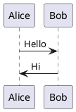

# MkDocs Setup Guide

This guide explains how to set up and use MkDocs for the ExpertMatch documentation site with PlantUML diagram rendering.

## Prerequisites

- Python 3.8 or higher
- pip (Python package manager)
- Java (optional, only if using local PlantUML rendering)

## Installation

### 1. Install Dependencies

```bash
# Navigate to project root
cd ~/projects-ai/expert-match-root/expert-match

# Install MkDocs and dependencies
pip install -r requirements-docs.txt
```

### 2. Verify Installation

```bash
mkdocs --version
```

## Running the Documentation Site

### Development Server (Live Reload)

```bash
# Start the development server (accessible remotely)
mkdocs serve --dev-addr 0.0.0.0:8103

# The site will be available at:
# Locally: http://127.0.0.1:8103 or http://localhost:8103
# Remotely: http://192.168.0.73:8103 (example remote server)
```

The development server automatically reloads when you make changes to the documentation files.

### Build Static Site

```bash
# Build the static site
mkdocs build

# The site will be generated in the 'site/' directory
```

### Serve Built Site

```bash
# Serve the built site (for testing production build)
mkdocs serve --dev-addr 0.0.0.0:8103 --dirtyreload
```

## PlantUML Diagram Rendering

The MkDocs site is configured to render PlantUML diagrams using the `mkdocs-plantuml-plugin`. Diagrams are rendered
automatically from code blocks marked with `plantuml` or `uml` language identifiers.

### Using PlantUML in Markdown

PlantUML diagrams are rendered from code blocks:

````markdown

````

Or using the `uml` identifier:

````markdown
```uml
@startuml
Alice -> Bob: Hello
Bob -> Alice: Hi
@enduml
```
````

### PlantUML Configuration

The plugin is configured in `mkdocs.yml`:

```yaml
plugins:

  - plantuml:
      server: https://www.plantuml.com/plantuml
      output_format: svg
      cachedir: .plantuml-cache
      format: svg
      theme: default
```

### PlantUML Rendering Options

#### Option 1: Online Server (Default)

The default configuration uses the public PlantUML server at `https://www.plantuml.com/plantuml`. This requires an
internet connection but doesn't require local Java installation.

**Pros:**

- No local setup required
- Always uses the latest PlantUML version
- No Java installation needed

**Cons:**

- Requires internet connection
- Diagrams are sent to external server
- May have rate limits

#### Option 2: Local PlantUML (Alternative)

For offline rendering or enhanced privacy, you can use a local PlantUML server:

1. Install Java (required for PlantUML):
   ```bash
   # Ubuntu/Debian
   sudo apt-get install default-jre
   
   # macOS
   brew install openjdk
   ```

2. Install PlantUML Python package:
   ```bash
   pip install plantuml
   ```

3. Update `mkdocs.yml` to use local rendering:
   ```yaml
   plugins:

     - plantuml:
         render: local
         output_format: svg
         cachedir: .plantuml-cache
   ```

**Pros:**

- Works offline
- No external server dependency
- Better privacy

**Cons:**

- Requires Java installation
- Requires local PlantUML setup

### PlantUML Cache

The plugin caches rendered diagrams in `.plantuml-cache/` directory to improve build performance. This directory is
automatically created and is included in `.gitignore`.

## Project Structure

```
expert-match/
├── docs/                    # Documentation source files
│   ├── index.md            # Homepage
│   ├── ExpertMatch.md      # Main documentation
│   └── ...                 # Other documentation files
├── mkdocs.yml              # MkDocs configuration
├── requirements-docs.txt  # Python dependencies
└── site/                   # Generated site (gitignored)
```

## Customization

### Theme Configuration

The site uses Material for MkDocs theme. Customize it in `mkdocs.yml`:

```yaml
theme:
  name: material
  palette:

    - scheme: default
      primary: indigo
      accent: indigo
```

### Navigation

Navigation is configured in `mkdocs.yml` under the `nav` section. Update it to reflect your documentation structure.

### Extensions

Additional Markdown extensions are configured in `mkdocs.yml`. The current setup includes:

- Code highlighting
- Admonitions (notes, warnings, etc.)
- Tables
- Task lists
- Tabbed content
- PlantUML support

## Troubleshooting

### PlantUML Diagrams Not Rendering

1. **Check internet connection** (if using online server)
2. **Verify PlantUML syntax** - ensure code blocks use `plantuml` or `uml` language identifier
3. **Check cache** - try clearing `.plantuml-cache/` directory
4. **Check plugin configuration** - verify `mkdocs.yml` has the plantuml plugin configured

### Build Errors

1. **Missing dependencies**: Run `pip install -r requirements-docs.txt`
2. **Python version**: Ensure Python 3.8+ is installed
3. **File encoding**: Ensure all Markdown files use UTF-8 encoding

### Performance Issues

1. **Clear cache**: Delete `.plantuml-cache/` directory
2. **Use local PlantUML**: For faster rendering, consider local PlantUML setup
3. **Optimize diagrams**: Large diagrams may take longer to render

## Deployment

### GitHub Pages

1. Build the site:
   ```bash
   mkdocs build
   ```

2. Deploy to GitHub Pages:
   ```bash
   mkdocs gh-deploy
   ```

### Other Hosting

1. Build the site:
   ```bash
   mkdocs build
   ```

2. Upload the `site/` directory to your web server

## Additional Resources

- [MkDocs Documentation](https://www.mkdocs.org/)
- [Material for MkDocs](https://squidfunk.github.io/mkdocs-material/)
- [PlantUML Documentation](https://plantuml.com/)
- [mkdocs-plantuml-plugin](https://github.com/christo-ph/mkdocs-plantuml-plugin)

---

*Last updated: 2025-12-21*

