# PlantUML Usage Guide

This guide explains how to use PlantUML diagrams in the ExpertMatch documentation.

## Basic Usage

PlantUML diagrams are embedded in Markdown files using code blocks with the `plantuml` or `uml` language identifier:

````markdown
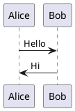
````

## Diagram Types

### Sequence Diagrams

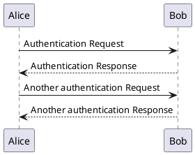

### Activity Diagrams

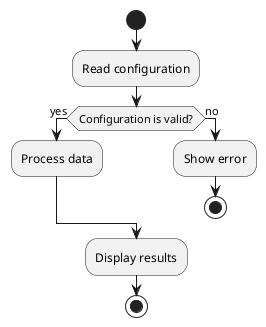

### Component Diagrams

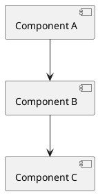

### Class Diagrams

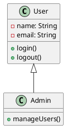

## Best Practices

### 1. Use Descriptive Diagram Names

Always include a diagram name in `@startuml`:

```plantuml
@startuml ExpertMatch_Flow
...
@enduml
```

### 2. Use Themes

Apply consistent themes across diagrams:

```plantuml
@startuml
!theme plain
skinparam backgroundColor #FFFFFF
...
@enduml
```

### 3. Keep Diagrams Focused

Each diagram should focus on a single concept or flow. Break complex diagrams into multiple smaller ones.

### 4. Use Notes for Context

Add notes to explain complex parts. **All notes must use yellow borders only with no background fill**:

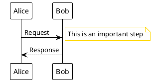

**Note Styling Rule**: Always include the note styling parameters at the beginning of each diagram:
- `BackgroundColor #FFFFFF` (white/transparent background)
- `BorderColor #FFD700` (yellow/gold border)

This ensures consistent visual appearance across all diagrams.

## Common Patterns in ExpertMatch Documentation

### Service Interaction Flow

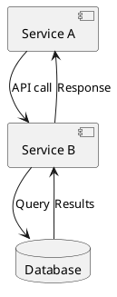

### Data Flow

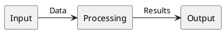

### Decision Flow

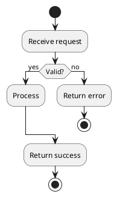

## Rendering

Diagrams are automatically rendered when you:

1. **Build the site**: `mkdocs build`
2. **Serve the site**: `mkdocs serve --dev-addr 0.0.0.0:8103`

The `mkdocs-plantuml-plugin` automatically:

- Detects PlantUML code blocks
- Renders them to SVG format
- Caches rendered diagrams for faster builds

## Troubleshooting

### Diagram Not Rendering

1. **Check syntax**: Ensure proper `@startuml` and `@enduml` tags
2. **Check language identifier**: Use `plantuml` or `uml`
3. **Check internet connection**: If using online server
4. **Clear cache**: Delete `.plantuml-cache/` directory

### Syntax Errors

- Use [PlantUML Online Editor](http://www.plantuml.com/plantuml/uml/) to test syntax
- Check [PlantUML Documentation](https://plantuml.com/) for reference

### Performance

- Large diagrams may take longer to render
- Consider breaking complex diagrams into smaller ones
- Use caching (enabled by default)

## Resources

- [PlantUML Documentation](https://plantuml.com/)
- [PlantUML Language Reference](https://plantuml.com/guide)
- [PlantUML Examples](https://real-world-plantuml.com/)
- [MkDocs PlantUML Plugin](https://github.com/christo-ph/mkdocs-plantuml-plugin)

---

## Note Styling Standard

**All PlantUML diagrams in ExpertMatch documentation must use yellow borders for notes with no background fill.**

This standard has been applied to all existing diagrams. When creating new diagrams, always include:

```plantuml
skinparam note {
  BackgroundColor #FFFFFF
  BorderColor #FFD700
}
```

This ensures visual consistency across all documentation.

---

*Last updated: 2025-12-21*

