# ExpertMatch Query Processing Flow: Detailed Analysis

## Table of Contents

1. [Overview](#overview)
2. [API Request Analysis](#api-request-analysis)
3. [Step-by-Step Processing Flow](#step-by-step-processing-flow)
4. [Alternative Flow: Deep Research Mode](#alternative-flow-deep-research-mode-deepresearch-true)
5. [Component Architecture](#component-architecture)
6. [Data Flow Diagrams](#data-flow-diagrams)
7. [Performance Characteristics](#performance-characteristics)
8. [Error Handling](#error-handling)
9. [References](#references)

---

## Overview

This document provides a detailed, step-by-step analysis of the ExpertMatch query processing flow when calling the API
endpoint.

**Note**: When Tool Search Tool is enabled (`expertmatch.tools.search.enabled=true`), the system uses dynamic tool
discovery
with 34-64% token savings. The `ChatClient` used throughout the flow will be `chatClientWithToolSearch` which implements
Tool Search Tool pattern. See [Smart Tool Selection](SMART_TOOL_SELECTION.md) for details.

```bash
curl -X 'POST' \
  'http://localhost:8093/api/v1/query' \
  -H 'accept: application/json' \
  -H 'Content-Type: application/json' \
  -H 'X-User-Id: user-123' \
  -H 'X-User-Roles: ROLE_USER' \
  -H 'X-User-Email: user@example.com' \
  -d '{
  "query": "Looking for experts in Java, Spring Boot, and AWS",
  "options": {
    "maxResults": 10,
    "minConfidence": 0.7,
    "includeSources": true,
    "includeEntities": true,
    "rerank": true,
    "deepResearch": false,
    "useCascadePattern": false,
    "useRoutingPattern": false,
    "useCyclePattern": false,
    "includeExecutionTrace": false
  }
}'
```

**Note**: The user authentication headers (`X-User-Id`, `X-User-Roles`, `X-User-Email`) are now documented in the
OpenAPI specification and will appear in Swagger UI. See the [OpenAPI Documentation](#openapi-documentation) section for
details.

The ExpertMatch system uses a **Hybrid GraphRAG architecture** combining vector similarity, graph traversal, keyword
search, and LLM-based answer generation to deliver precise expert recommendations.

---

## API Request Analysis

### Request Structure

```json
{
  "query": "Looking for experts in Java, Spring Boot, and AWS",
  "options": {
    "maxResults": 10,
    "minConfidence": 0.7,
    "includeSources": true,
    "includeEntities": true,
    "rerank": true,
    "deepResearch": false
  }
}
```

### Request Parameters

| Parameter               | Value                                               | Description                                                                               |
|-------------------------|-----------------------------------------------------|-------------------------------------------------------------------------------------------|
| `query`                 | "Looking for experts in Java, Spring Boot, and AWS" | Natural language query describing expert requirements                                     |
| `maxResults`            | 10                                                  | Maximum number of expert results to return                                                |
| `minConfidence`         | 0.7                                                 | Minimum confidence score threshold for results                                            |
| `includeSources`        | true                                                | Include source citations in response                                                      |
| `includeEntities`       | true                                                | Include extracted entities in response                                                    |
| `rerank`                | true                                                | Enable semantic reranking for better precision                                            |
| `deepResearch`          | false                                               | Disable deep research SGR pattern                                                         |
| `includeExecutionTrace` | false                                               | Include execution trace (step-by-step processing details with LLM models and token usage) |

---

## Step-by-Step Processing Flow

### Phase 1: Request Reception and Validation

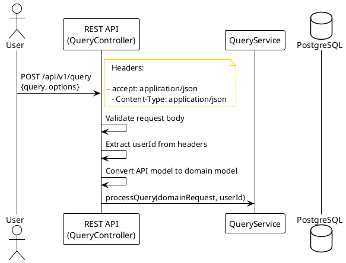

* **Step 1.1**: User sends HTTP POST request to `/api/v1/query` endpoint
* **Step 1.2**: `QueryController` validates the request body using Jakarta Validation
* **Step 1.3**: Extract `userId` from HTTP headers (populated by Spring Gateway)
* **Step 1.4**: Convert `QueryRequest` API model to domain model using `ApiMapper`
* **Step 1.5**: Since no `chatId` is provided, create or retrieve default chat for user
* **Step 1.6**: Delegate processing to `QueryService.processQuery()`

---

### Phase 2: Conversation Management

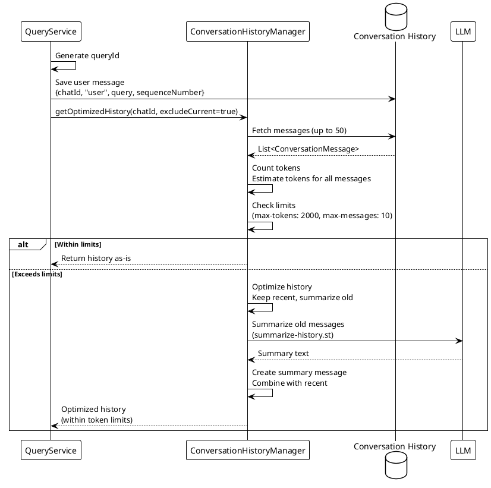

* **Step 2.1**: Generate unique `queryId` using `IdGenerator.generateId()`
* **Step 2.2**: Save user message to conversation history:
- `chatId`: Default chat ID
    - `role`: "user"
    - `content`: "Looking for experts in Java, Spring Boot, and AWS"
    - `sequenceNumber`: Next available sequence number
  - `tokensUsed`: null (user messages don't consume tokens)

* **Step 2.3**: Load and optimize conversation history using `ConversationHistoryManager`:
- **Token Counting**: Estimates tokens for all messages using `TokenCountingService` (~4 characters per token)
    - **History Optimization**:
- If within limits (`max-tokens`: 2000, `max-messages`: 10): Returns history as-is
        - If exceeds limits: Automatically summarizes older messages using LLM
        - Keeps recent messages (half of `max-messages`), summarizes older ones to fit within token budget
    - **Summarization**: Uses `summarize-history.st` prompt template to condense old messages
    - **Recursive Optimization**: If still exceeds limits after summarization, further optimizes
    - **Result**: Optimized history within token limits, ready for LLM context
* **Step 2.4**: Exclude current query and reverse to chronological order

---

### Phase 3: Query Analysis and Entity Extraction

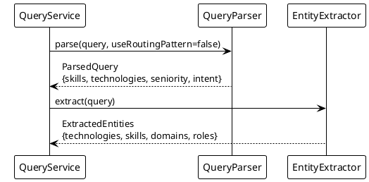

* **Step 3.1**: `QueryParser.parse()` analyzes the natural language query using LLM-based skill extraction with Spring
  AI PromptTemplate:
- **Extracted Skills**: Java, Spring Boot, AWS (via LLM with PromptTemplate and fallback to rule-based)
    - **Technologies**: Java, Spring Boot, AWS
    - **Seniority**: Not specified (defaults to any level)
    - **Intent**: `expert_search` (default for expert discovery queries)

* **Step 3.2**: `EntityExtractor.extract()` performs additional entity extraction:
- **Technologies**: Java, Spring Boot, AWS
    - **Skills**: Java programming, Spring Boot development, AWS cloud
    - **Domains**: Software development, cloud computing
    - **Roles**: Java developer, Spring Boot developer, AWS architect

* **Step 3.3**: **LLM-Based Skill Extraction with PromptTemplate**
    - The `QueryParser` now uses Spring AI's `PromptTemplate` with resource-based prompts
    - Prompts are stored in `src/main/resources/prompts/skill-extraction.st`
    - Uses `@Value("classpath:/prompts/skill-extraction.st")` for resource injection
    - Falls back to hardcoded prompt if resource is unavailable
    - Falls back to rule-based extraction if LLM fails completely
    - Provides more accurate and comprehensive skill identification
    - Automatically adapts to new technologies without code changes
    - Follows Spring AI best practices for prompt management

---

### Phase 4: Hybrid GraphRAG Retrieval

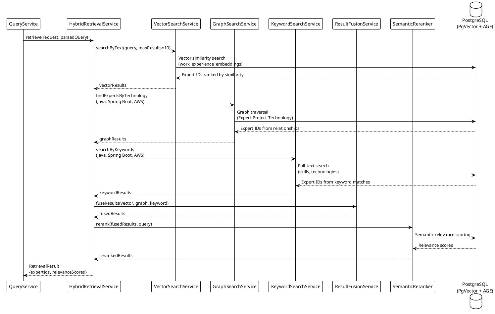

* **Step 4.1**: `HybridRetrievalService.retrieve()` orchestrates three parallel search strategies:

**a. Vector Search (PgVector)**:

- Generate query embedding using embedding model
- Execute similarity search:
  `SELECT employee_id FROM work_experience_embeddings WHERE embedding <-> $query_vector < 0.7 ORDER BY embedding <-> $query_vector LIMIT 10`
- Return expert IDs ranked by semantic similarity

**b. Graph Traversal (Apache AGE)**:

- Execute Cypher query:
  `MATCH (e:Expert)-[:PARTICIPATED_IN]->(p:Project)-[:USES]->(t:Technology) WHERE t.name IN ['Java', 'Spring Boot', 'AWS'] RETURN DISTINCT e.id`
- Find experts connected to all three technologies via project relationships
- Return expert IDs from graph relationships

**c. Keyword Search (Full-text)**:

- Execute full-text search on skills and technologies
- Match exact terms: "Java", "Spring Boot", "AWS"
- Return expert IDs with exact matches

* **Step 4.2**: `ResultFusionService.fuseResults()` combines results:
- Apply Reciprocal Rank Fusion (RRF) algorithm
- Use default weights: vector=1.0, graph=0.8, keyword=0.6
- Deduplicate expert IDs, keeping highest scores

* **Step 4.3**: `SemanticReranker.rerank()` (enabled by `rerank=true`):
- Use LLM to calculate semantic relevance scores
- Re-score results based on query context
- Return final ranked list with relevance scores

---

## Alternative Flow: Deep Research Mode (`deepResearch: true`)

When `deepResearch` is enabled, the system uses a more sophisticated **Schema-Guided Reasoning (SGR) pattern** with
iterative retrieval and gap analysis.

### Deep Research Flow Overview

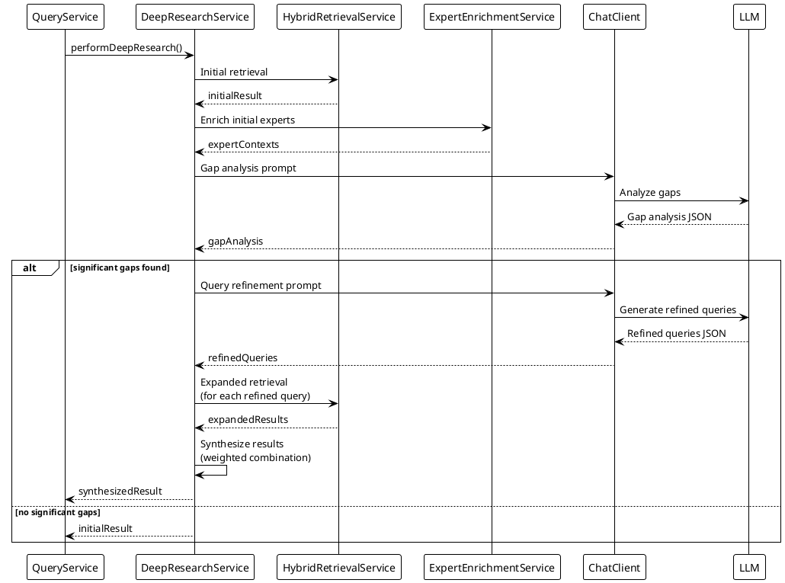

### Deep Research Step-by-Step Process

* **Step DR.1**: `DeepResearchService.performDeepResearch()` is called instead of standard retrieval

* **Step DR.2**: **Initial Retrieval** (same as standard flow)

- Perform standard hybrid retrieval (vector + graph + keyword)
- Return initial expert IDs and relevance scores

* **Step DR.3**: **Expert Enrichment for Gap Analysis**

- Enrich initial experts with detailed data
- Build expert contexts for LLM analysis

* **Step DR.4**: **Gap Analysis** (LLM-based)

- Build gap analysis prompt with:
- Original query
    - Initial results summary
    - Expert summaries (top 5 experts)
- Send to LLM for analysis
- Parse JSON response containing:
- `identifiedGaps`: Missing information areas
    - `ambiguities`: Unclear requirements
    - `missingInformation`: Specific missing details
    - `needsExpansion`: Boolean decision
    - `reasoning`: Explanation

* **Step DR.5**: **Conditional Expansion**

- If `needsExpansion = false`: Return initial results
- If `needsExpansion = true`: Proceed to query refinement

* **Step DR.6**: **Query Refinement** (LLM-based)

- Build query refinement prompt with:
- Original query
    - Identified gaps and ambiguities
- Send to LLM for refined query generation
- Parse JSON response containing array of 2-3 refined queries

* **Step DR.7**: **Expanded Retrieval**

- For each refined query:
- Create new `QueryRequest` with refined query text
    - Parse refined query
    - Perform standard hybrid retrieval
    - Collect expanded results

* **Step DR.8**: **Result Synthesis**

- Combine initial and expanded results using weighted scoring:
- Initial results: 60% weight (`SYNTHESIS_WEIGHT_INITIAL = 0.6`)
    - Expanded results: 40% weight (`SYNTHESIS_WEIGHT_EXPANDED = 0.4`)
- For duplicate experts: Use weighted average of scores
- Sort by combined score and limit to `maxResults`
- Return synthesized `RetrievalResult`

* **Step DR.9**: Continue with standard flow

- After deep research returns results, processing continues with:
- Expert enrichment (Phase 5)
    - Answer generation (Phase 6)
    - Response finalization (Phase 7)

---

### Deep Research Flow Diagram

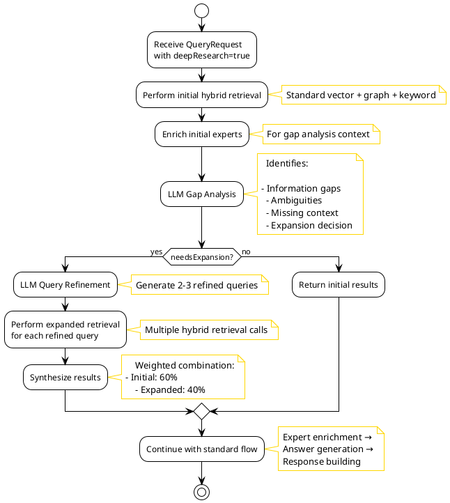

---

### Deep Research Example

**Original Query**: "Looking for experts in Java, Spring Boot, and AWS"

**Gap Analysis Response**:

```json
{
  "identifiedGaps": [
    "No mention of specific AWS services needed",
    "Unclear if Spring Boot experience should include microservices",
    "No indication of project scale or complexity"
  ],
  "ambiguities": [
    "Is AWS certification required?",
    "What level of Spring Boot experience is needed?"
  ],
  "missingInformation": [
    "Team size requirements",
    "Project duration expectations"
  ],
  "needsExpansion": true,
  "reasoning": "Query lacks specificity about AWS services and Spring Boot architecture patterns"
}
```

**Refined Queries**:

```json
[
  "Find Java experts with Spring Boot microservices experience and AWS Lambda, EC2, and RDS",
  "Looking for Spring Boot developers with AWS cloud architecture experience for enterprise applications",
  "Experts needed for Java-based microservices on AWS with Spring Boot and Docker"
]
```

**Synthesis Process**:

1. Initial retrieval finds 8 experts with basic Java/Spring Boot/AWS skills
2. Expanded retrievals find additional 12 experts with specific AWS services and microservices experience
3. Weighted combination produces final list of 10 experts with comprehensive skills
4. Final result includes experts with both broad and specialized expertise

---

### Deep Research Performance Impact

| Metric           | Standard Flow                    | Deep Research Flow                                      | Impact           |
|------------------|----------------------------------|---------------------------------------------------------|------------------|
| Processing Time  | 2-6 seconds                      | 8-15 seconds                                            | +5-10 seconds    |
| LLM Calls        | 1 (answer generation)            | 3 (gap analysis + query refinement + answer generation) | +2 LLM calls     |
| Database Queries | 3 (vector+graph+keyword)         | 3 + 3*N (N=number of refined queries)                   | +6-9 queries     |
| Result Quality   | Good for straightforward queries | Excellent for complex/ambiguous queries                 | Higher precision |
| Expert Coverage  | Basic skill matching             | Comprehensive skill + context matching                  | Broader coverage |

---

### When to Use Deep Research

**Recommended for**:

- Complex queries with multiple requirements
- Ambiguous or vague requirements
- High-stakes expert searches (critical projects)
- Queries that return few or no results initially
- Team formation for large projects

**Not recommended for**:

- Simple, specific queries
- Time-sensitive requests
- Well-defined, straightforward requirements
- Testing or development scenarios

---

### Phase 5: Expert Enrichment

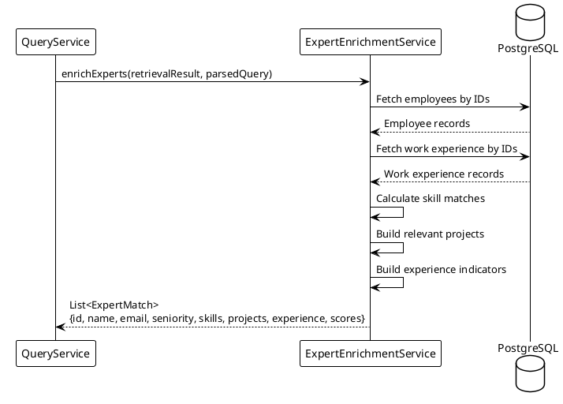

* **Step 5.1**: `ExpertEnrichmentService.enrichExperts()` fetches detailed data:
- Fetch employee records from `employee` table
- Fetch work experience from `work_experience` table

* **Step 5.2**: For each expert, calculate skill matches:
- **Must-have skills**: Java, Spring Boot, AWS
- **Nice-to-have skills**: Any additional matching skills
- **Match score**: (matched skills) / (total required skills)

* **Step 5.3**: Build relevant projects:
- Filter projects containing Java, Spring Boot, or AWS
- Sort by recency (most recent first)
- Limit to top 5 projects
- Calculate project duration

* **Step 5.4**: Build experience indicators:
- ETL, high-performance, architecture, monitoring, etc.

* **Step 5.5**: Create `ExpertMatch` objects with:
- Expert ID, name, email, seniority
- Matched skills and match scores
- Relevant projects with details
- Experience indicators
- Relevance scores from retrieval

---

### Phase 6: Answer Generation

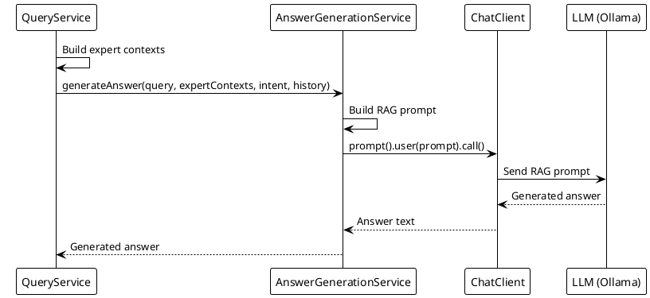

* **Step 6.1**: Build expert contexts for LLM prompt:
- Extract skills, projects, and metadata for each expert
- Create structured `ExpertContext` objects

* **Step 6.2**: `AnswerGenerationService.generateAnswer()` builds RAG prompt:

**RAG Prompt Structure**:

```text
[System Context]
"You are an expert matching assistant helping to find the right experts..."

[Conversation History]
"Previous messages: ..."

[User Query]
"Looking for experts in Java, Spring Boot, and AWS"

[Expert Information]
"Expert 1: John Doe (A4)
- Skills: Java, Spring Boot, AWS, Microservices
- Projects: Banking System (Java, Spring Boot, AWS), Payment Gateway (Java, AWS)
- Match Score: 0.95
- Relevance Score: 0.88"

"Expert 2: Jane Smith (A3)
- Skills: Java, Spring Boot, AWS Lambda, Docker
- Projects: Cloud Migration (Java, Spring Boot, AWS), API Gateway (Spring Boot, AWS)
- Match Score: 0.90
- Relevance Score: 0.85"

[Instructions]
"Based on the expert_search intent, rank and explain the matches..."
```

* **Step 6.3**: Send prompt to LLM (Ollama) via Spring AI `ChatClient`
    - **Tool Search Tool** (if enabled): When `expertmatch.tools.search.enabled=true`, the system uses
      `chatClientWithToolSearch` which implements dynamic tool discovery
    - Only Tool Search Tool is sent initially, reducing prompt size by 34-64%
    - When LLM needs capabilities, it calls Tool Search Tool which discovers and adds only relevant tools
    - This significantly reduces token usage and API costs for high-volume queries
* **Step 6.4**: Receive generated answer with expert recommendations
* **Step 6.5**: Return formatted answer text

---

### Phase 7: Response Finalization

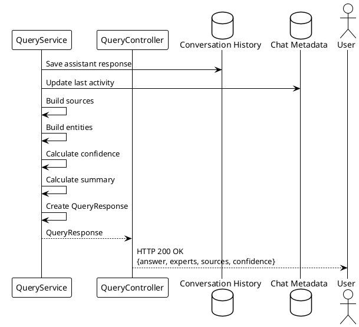

* **Step 7.1**: Save assistant response to conversation history:
- `role`: "assistant"
- `content`: Generated answer text
- `sequenceNumber`: Next available number
- `tokensUsed`: Estimated token count

* **Step 7.2**: Update chat metadata:
- `lastActivity`: Current timestamp
- `messageCount`: Incremented count

* **Step 7.3**: Build response components:
- **Sources**: Expert and project citations with metadata
- **Entities**: Extracted technologies, skills, domains
- **Confidence**: Average relevance score (0.0-1.0)
- **Summary**: Match statistics (perfect, good, partial)

* **Step 7.4**: Create `QueryResponse` object:

```json
{
  "answer": "I found 10 experts matching your requirements for Java, Spring Boot, and AWS...",
  "experts": [
    {
      "id": "expert1",
      "name": "John Doe",
      "email": "john.doe@company.com",
      "seniority": "A4",
      "matchedSkills": {
        "mustHave": ["Java", "Spring Boot", "AWS"],
        "niceToHave": ["Microservices"]
      },
      "relevantProjects": [
        {
          "name": "Banking System",
          "technologies": ["Java", "Spring Boot", "AWS"],
          "role": "Tech Lead",
          "duration": "2 years"
        }
      ],
      "skillMatch": {
        "matchScore": 0.95
      },
      "relevanceScore": 0.88
    }
  ],
  "sources": [
    {
      "type": "expert",
      "id": "expert1",
      "name": "John Doe",
      "relevanceScore": 0.88,
      "metadata": {
        "expertId": "expert1",
        "seniority": "A4",
        "matchScore": 0.95
      }
    }
  ],
  "entities": [
    {
      "type": "technology",
      "name": "Java",
      "id": "tech-java"
    },
    {
      "type": "technology",
      "name": "Spring Boot",
      "id": "tech-springboot"
    },
    {
      "type": "technology",
      "name": "AWS",
      "id": "tech-aws"
    }
  ],
  "confidence": 0.87,
  "queryId": "query-abc123",
  "chatId": "chat-def456",
  "assistantMessageId": "msg-ghi789",
  "processingTime": 2450,
  "summary": {
    "total": 10,
    "perfectMatches": 4,
    "goodMatches": 5,
    "partialMatches": 1
  }
}
```

* **Step 7.5**: Return HTTP 200 OK response with `QueryResponse` JSON

---

## Component Architecture

```plantuml
@startuml Component_Architecture
!theme plain
skinparam backgroundColor #FFFFFF
skinparam note {
  BackgroundColor #FFFFFF
  BorderColor #FFD700
}

package "Query Processing Layer" {
  [QueryController] as Controller
  [QueryService] as Service
  [QueryParser] as Parser
  [EntityExtractor] as Extractor
}

package "Retrieval Layer" {
  [HybridRetrievalService] as Retrieval
  [VectorSearchService] as Vector
  [GraphSearchService] as Graph
  [KeywordSearchService] as Keyword
  [ResultFusionService] as Fusion
  [SemanticReranker] as Reranker
}

package "Enrichment Layer" {
  [ExpertEnrichmentService] as Enrichment
  [EmployeeRepository] as EmpRepo
  [WorkExperienceRepository] as WorkExpRepo
}

package "Answer Generation Layer" {
  [AnswerGenerationService] as AnswerGen
  [ChatClient] as ChatClient
}

package "Data Storage" {
  database "PostgreSQL" {
    [Relational Tables] as Relational
    [PgVector] as VectorDB
    [Apache AGE] as GraphDB
  }
  [Conversation History] as History
}

package "External Services" {
  [LLM (Ollama)] as LLM
}

User -> Controller: HTTP Request
Controller -> Service: processQuery()
Service -> Parser: parse()
Service -> Extractor: extract()
Service -> Retrieval: retrieve()
Retrieval -> Vector: searchByText()
Retrieval -> Graph: findExpertsByTechnology()
Retrieval -> Keyword: searchByKeywords()
Retrieval -> Fusion: fuseResults()
Retrieval -> Reranker: rerank()
Service -> Enrichment: enrichExperts()
Enrichment -> EmpRepo: fetchEmployees()
Enrichment -> WorkExpRepo: fetchWorkExperience()
Service -> AnswerGen: generateAnswer()
AnswerGen -> ChatClient: prompt()
ChatClient -> LLM: sendPrompt()
Service -> History: saveMessage()
Service -> Controller: QueryResponse
Controller -> User: HTTP Response

@enduml
```

---

## Data Flow Diagrams

### Complete End-to-End Flow

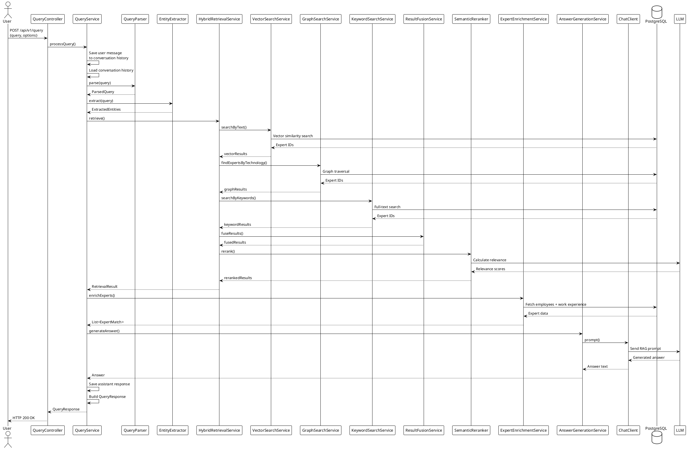

---

## Performance Characteristics

### Processing Time Breakdown

| Phase                   | Typical Duration | Description                                                             |
|-------------------------|------------------|-------------------------------------------------------------------------|
| Request Validation      | < 50ms           | Jakarta Validation and model mapping                                    |
| Conversation Management | 50-100ms         | Database operations for chat history                                    |
| Query Analysis          | 50-150ms         | NLP parsing and entity extraction (including PromptTemplate processing) |
| Vector Search           | 100-300ms        | PgVector similarity search                                              |
| Graph Traversal         | 50-200ms         | Apache AGE Cypher queries                                               |
| Keyword Search          | 20-100ms         | Full-text search                                                        |
| Result Fusion           | 20-50ms          | RRF algorithm execution                                                 |
| Semantic Reranking      | 200-500ms        | LLM-based relevance scoring                                             |
| Expert Enrichment       | 100-300ms        | Database queries and skill matching                                     |
| Answer Generation       | 1-5 seconds      | LLM prompt processing and response generation                           |
| Response Building       | 50-100ms         | JSON serialization and metadata updates                                 |
| **Total**               | **2-6 seconds**  | **Complete query processing**                                           |

### Database Operations

| Operation                | Database Component | Typical Duration |
|--------------------------|--------------------|------------------|
| Vector similarity search | PgVector           | 100-300ms        |
| Graph traversal queries  | Apache AGE         | 50-200ms         |
| Full-text keyword search | PostgreSQL         | 20-100ms         |
| Employee data fetch      | Relational tables  | 30-100ms         |
| Work experience fetch    | Relational tables  | 50-150ms         |
| Conversation history     | Relational tables  | 20-80ms          |

### Memory Usage

| Component                | Memory Usage |
|--------------------------|--------------|
| Query processing context | 10-50MB      |
| LLM prompt context       | 50-200MB     |
| Database connection pool | 50-100MB     |
| Embedding cache          | 100-500MB    |

---

## Error Handling

### Validation Errors

| Error Condition                     | HTTP Status     | Error Type          |
|-------------------------------------|-----------------|---------------------|
| Empty query                         | 400 Bad Request | ValidationException |
| Invalid chatId format               | 400 Bad Request | ValidationException |
| Query too long (>5000 chars)        | 400 Bad Request | ValidationException |
| Invalid maxResults (not 1-100)      | 400 Bad Request | ValidationException |
| Invalid minConfidence (not 0.0-1.0) | 400 Bad Request | ValidationException |

### Resource Errors

| Error Condition             | HTTP Status             | Error Type                              |
|-----------------------------|-------------------------|-----------------------------------------|
| Chat not found              | 404 Not Found           | ResourceNotFoundException               |
| Database connection failure | 503 Service Unavailable | RetrievalException                      |
| LLM service unavailable     | 503 Service Unavailable | ExpertMatchException                    |
| No experts found            | 200 OK                  | Normal response with empty experts list |

### Processing Errors

| Error Condition                                                                                                                                                                                                                       | HTTP Status               | Error Type           |
|---------------------------------------------------------------------------------------------------------------------------------------------------------------------------------------------------------------------------------------|---------------------------|----------------------|
| Query parsing failure                                                                                                                                                                                                                 | 500 Internal Server Error | ExpertMatchException |
| Retrieval failure                                                                                                                                                                                                                     | 500 Internal Server Error | RetrievalException   |
| Answer generation failure                                                                                                                                                                                                             | 500 Internal Server Error | ExpertMatchException |
| Timeout during processing                                                                                                                                                                                                             | 504 Gateway Timeout       | ExpertMatchException |
| **Note**: Default timeout is 5 minutes (300,000ms). Configured in `application-local.yml` as `server.connection-timeout`. For very long-running queries, consider increasing this value or breaking queries into smaller sub-queries. |

---

## References

### Related Documentation

- [ExpertMatch Architecture Overview](ExpertMatch.md)
- [Expert Search Flow](ExpertMatch-Expert-Search-Flow.md)
- [Smart Tool Selection](SMART_TOOL_SELECTION.md) - Tool Search Tool pattern, 34-64% token savings, dynamic tool
  discovery
- [Conversation History Management](CONVERSATION_HISTORY_MANAGEMENT.md) - Token counting and summarization
- [API Endpoints Reference](API_ENDPOINTS.md)
- [Swagger UI Testing Guide](SWAGGER_UI_TESTING_GUIDE.md)
- [PlantUML Usage Guide](PLANTUML_USAGE.md)

### Source Code References

- `QueryController.java` - REST API endpoint handler
- `QueryService.java` - Main orchestration service
- `QueryRequest.java` - API request model
- `QueryParser.java` - Query parsing with PromptTemplate integration
- `HybridRetrievalService.java` - Hybrid retrieval orchestration
- `DeepResearchService.java` - Deep research SGR pattern implementation
- `ExpertEnrichmentService.java` - Expert data enrichment
- `AnswerGenerationService.java` - LLM answer generation
- `skill-extraction.st` - PromptTemplate resource for skill extraction

### Tools and Technologies

- **Database**: PostgreSQL 17 with PgVector and Apache AGE extensions
- **Framework**: Spring Boot 3.x with Spring AI integration
- **LLM**: Ollama with various models (Llama3, Mistral, etc.)
- **Embeddings**: Sentence Transformers for semantic search
- **API**: OpenAPI 3.0 specification with SpringDoc

---

---

## OpenAPI Documentation

The ExpertMatch API is fully documented in the OpenAPI specification, including:

- **User authentication headers** (`X-User-Id`, `X-User-Roles`, `X-User-Email`) documented as parameters for all
  endpoints
- Request/response schemas
- Request/response examples with all available options
- Validation rules
- Error response schemas

### Accessing OpenAPI Documentation

- **Swagger UI**: http://localhost:8093/swagger-ui.html
- **OpenAPI Spec**: http://localhost:8093/api/v1/openapi.json

In Swagger UI, you can:

- See all required and optional headers in the Parameters section for each endpoint
- Test endpoints directly with header values
- View example values for headers
- Generate client code with proper header handling

All endpoints that require user identification now have the user headers documented in the Parameters section, making it
easy to see which headers are required or optional.

---

*Document generated: 2025-12-28*
*Based on ExpertMatch v1.0 architecture*
*Last updated: 2025-12-21 - Added timeout configuration documentation*
