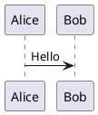

# Quick Start: MkDocs with PlantUML

## Installation

```bash
cd ~/projects-ai/expert-match-root/expert-match
pip install -r requirements-docs.txt
```

## Run Documentation Site

```bash
# Start development server (with live reload, accessible remotely)
mkdocs serve --dev-addr 0.0.0.0:8103

# Or build static site
mkdocs build
```

The site will be available at:

- Locally: `http://127.0.0.1:8103` or `http://localhost:8103`
- Remotely: `http://192.168.0.73:8103` (example remote server)

## PlantUML Rendering

PlantUML diagrams in markdown files are automatically rendered. Use code blocks like this:

````markdown

````

## Documentation

- [MkDocs Setup Guide](MKDOCS_SETUP.md) - Complete setup instructions
- [PlantUML Usage Guide](PLANTUML_USAGE.md) - PlantUML syntax and examples

