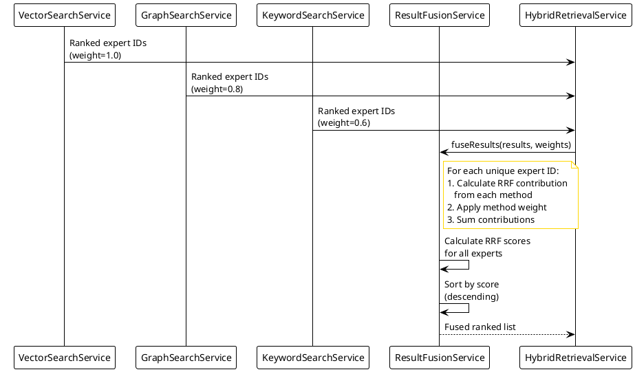
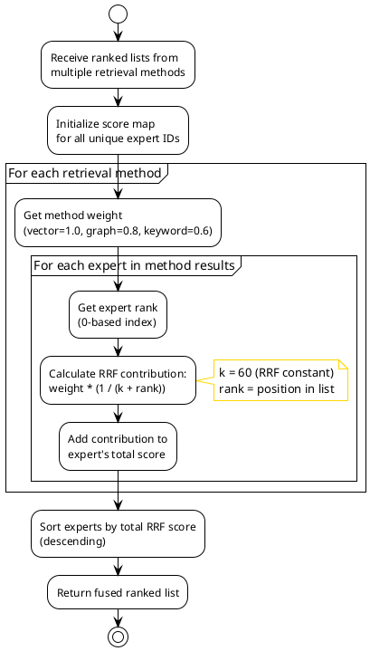
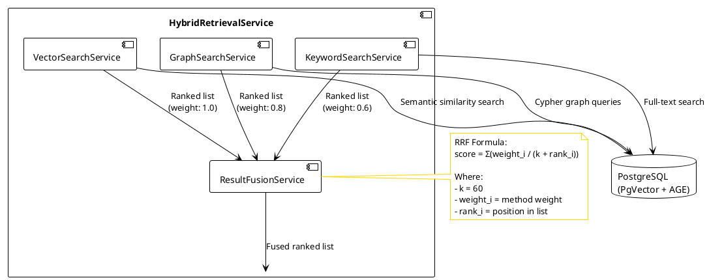
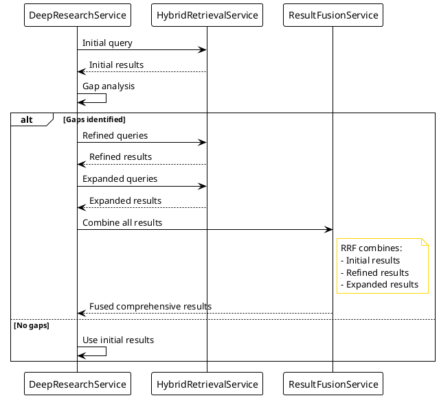

# Reciprocal Rank Fusion (RRF) Algorithm

## Overview

Reciprocal Rank Fusion (RRF) is a ranking algorithm used in ExpertMatch to combine results from multiple retrieval
methods (vector search, graph traversal, and keyword search) into a single, unified ranked list. RRF is particularly
effective for combining heterogeneous ranking lists where different methods may have different scoring scales.

## Algorithm Description

### Basic RRF Formula

The RRF score for a document (expert) `d` is calculated as:

```
RRF_score(d) = Σ(1 / (k + rank(d, list_i)))
```

Where:

- `d`: Document (expert) being scored
- `k`: RRF constant (typically 60)
- `rank(d, list_i)`: Rank of document `d` in ranking list `i` (0-based index)
- `list_i`: One of the input ranking lists (vector, graph, keyword, etc.)

### Weighted RRF Formula

ExpertMatch extends the basic RRF formula with method-specific weights:

```
RRF_score(d) = Σ(weight_i * (1 / (k + rank(d, list_i))))
```

Where:

- `weight_i`: Weight for method `i` (default: vector=1.0, graph=0.8, keyword=0.6)

## Implementation in ExpertMatch

### Configuration

**RRF Constant (`k`)**: `60`

This value is defined in `ResultFusionService`:

```java
private static final int RRF_K = 60;
```

**Default Weights**:

- **Vector Search**: `1.0` (highest weight - semantic similarity is primary)
- **Graph Traversal**: `0.8` (high weight - relationship-based discovery)
- **Keyword Search**: `0.6` (lower weight - exact matching)

### Process Flow

1. **Multiple Retrieval Methods**: Each method (vector, graph, keyword) returns a ranked list of expert IDs
2. **RRF Score Calculation**: For each unique expert ID across all lists:
    - Calculate RRF contribution from each method where the expert appears
    - Apply method-specific weight
    - Sum all contributions
3. **Deduplication**: Automatically handles experts that appear in multiple lists
4. **Final Ranking**: Sort experts by total RRF score (descending)

### RRF Fusion Process Diagram



### RRF Calculation Flow Diagram



### Example Calculation

Given three ranking lists:

**Vector Search Results** (weight=1.0):

1. Expert A (rank 0)
2. Expert B (rank 1)
3. Expert C (rank 2)

**Graph Search Results** (weight=0.8):

1. Expert B (rank 0)
2. Expert D (rank 1)
3. Expert A (rank 2)

**Keyword Search Results** (weight=0.6):

1. Expert C (rank 0)
2. Expert A (rank 1)
3. Expert E (rank 2)

**RRF Score Calculation** (k=60):

- **Expert A**:
    - Vector: `1.0 * (1 / (60 + 0)) = 0.01667`
    - Graph: `0.8 * (1 / (60 + 2)) = 0.01290`
    - Keyword: `0.6 * (1 / (60 + 1)) = 0.00984`
    - **Total: 0.03941**

- **Expert B**:
    - Vector: `1.0 * (1 / (60 + 1)) = 0.01639`
    - Graph: `0.8 * (1 / (60 + 0)) = 0.01333`
    - **Total: 0.02972**

- **Expert C**:
    - Vector: `1.0 * (1 / (60 + 2)) = 0.01613`
    - Keyword: `0.6 * (1 / (60 + 0)) = 0.01000`
    - **Total: 0.02613**

- **Expert D**:
    - Graph: `0.8 * (1 / (60 + 1)) = 0.01311`
    - **Total: 0.01311**

- **Expert E**:
    - Keyword: `0.6 * (1 / (60 + 2)) = 0.00968`
    - **Total: 0.00968`

**Final Ranking**:

1. Expert A (0.03941)
2. Expert B (0.02972)
3. Expert C (0.02613)
4. Expert D (0.01311)
5. Expert E (0.00968)

## Advantages of RRF

1. **Scale Independence**: Works with ranking lists that have different scoring scales
2. **Automatic Deduplication**: Experts appearing in multiple lists are automatically combined
3. **Rank-Based**: Focuses on relative positions rather than absolute scores
4. **Robust**: Performs well even when some retrieval methods return poor results
5. **No Tuning Required**: The constant `k=60` works well across different domains

## Use Cases in ExpertMatch

### Standard Hybrid Retrieval

RRF combines results from:

- **Vector Search**: Semantic similarity based on project experiences
- **Graph Traversal**: Relationship-based discovery (expert → project → technology)
- **Keyword Search**: Exact technology and skill name matching
- **Person Name Search**: Direct name matching

### RRF Integration in Hybrid Retrieval



### Deep Research Pattern

In the Deep Research SGR pattern, RRF is used to combine:

- Initial retrieval results
- Refined query results
- Expanded query results

This ensures comprehensive coverage while maintaining relevance.

### RRF in Deep Research Flow



## Code Reference

**Service**: `com.berdachuk.expertmatch.retrieval.ResultFusionService`

**Key Methods**:

- `fuseResults(Map<String, List<String>> results, Map<String, Double> weights)`: Fuses results with custom weights
- `fuseResults(Map<String, List<String>> results)`: Fuses results with default weights

**Usage Example**:

```java
Map<String, List<String>> results = Map.of(
    "vector", vectorResults,
    "graph", graphResults,
    "keyword", keywordResults
);

Map<String, Double> weights = Map.of(
    "vector", 1.0,
    "graph", 0.8,
    "keyword", 0.6
);

List<String> fusedResults = fusionService.fuseResults(results, weights);
```

## Weight Tuning

Weights can be adjusted based on query characteristics:

- **Technology-Heavy Queries**: Increase graph weight (technology relationships)
- **Semantic Queries**: Increase vector weight (semantic similarity)
- **Specific Skill Queries**: Increase keyword weight (exact matching)

The `HybridRetrievalService` dynamically adjusts weights based on query analysis.

## References

- **Original Paper**: Cormack, G. V., Clarke, C. L., & Buettcher, S. (2009). Reciprocal rank fusion outperforms
  condorcet and individual rank learning methods. In *Proceedings of the 32nd international ACM SIGIR conference on
  Research and development in information retrieval* (pp. 758-759).

- **RRF Constant**: The value `k=60` is a standard choice that has been empirically validated across multiple
  information retrieval tasks.

## Related Documentation

- [Expert Search Flow](ExpertMatch-Expert-Search-Flow.md) - Complete flow including RRF fusion
- [Hybrid Retrieval Architecture](ExpertMatch.md#hybrid-retrieval) - Overview of retrieval methods
- [Result Fusion Service](../src/main/java/com/berdachuk/expertmatch/retrieval/ResultFusionService.java) -
  Implementation code

